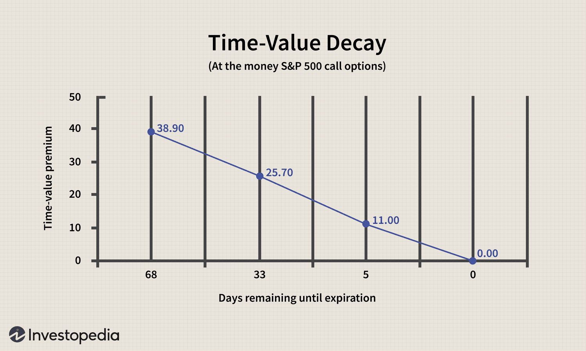

Options trading is an essential facet of financial markets, enabling investors to manage risk, increase income, and take speculative positions on asset price movements. It involves derivative contracts known as options, which give traders the right, without obligation, to buy or sell an underlying asset at a specified price, known as the strike price, before a set expiration date. One of the fundamental components influencing these options is their time value.

Time value refers to the portion of an option's premium that is attributable to the duration remaining until the option's expiration. This aspect plays a critical role in options pricing, impacting buyers and sellers differently. As expiration nears, the time value diminishes, introducing a concept known as time decay or theta decay. For option sellers, this decay can translate into increased profitability as the remnants of time value vaporize, especially if other conditions are favorable. Conversely, option buyers might experience an erosion of potential profits since the time value component of the premium decreases over time, necessitating meticulous timing and strategy.



In parallel, algorithmic trading, or algo-trading, stands as a sophisticated method in the trading arena, optimizing trade executions while eliminating emotional influences. By leveraging computer algorithms programmed to follow prespecified criteria, trading becomes more efficient and consistent. Algo-trading's speed and precision are particularly advantageous when executing complex options strategies, where split-second decisions can significantly impact outcomes.

This article addresses the intersection of time value in options trading and algorithmic strategies. It explores how these two realms, each with its inherent benefits and risks, can be integrated to create sophisticated approaches that enhance trading performance. By systematically analyzing the synergy between time decay dynamics and algorithmic tactics, we aim to highlight the potential for traders to maximize returns and mitigate risks, unveiling the full spectrum of opportunities these tools offer.

## Table of Contents

## Understanding Options and Time Value

Options are derivatives allowing traders to buy or sell an underlying asset at a specified price, known as the strike price, before a particular expiration date. This right, however, is not obligatory, providing flexibility that can be leveraged for hedging, income generation, or speculative purposes. Options can either be call options, giving the holder the right to purchase the asset, or put options, granting the right to sell.

The premium of an option is divided into two main components: intrinsic value and time value. Intrinsic value is the difference between the underlying asset’s current price and the option’s strike price when that difference is favorable to the holder. If a call option has a strike price of $50 and the underlying stock is trading at $55, the intrinsic value would be $5. On the other hand, time value represents the additional amount that traders are willing to pay over the intrinsic value, reflecting the potential for the option to gain in value before expiration.

Time value is influenced by several factors, including the time remaining until expiration, [volatility](/wiki/volatility-trading-strategies) of the underlying asset, interest rates, and dividends. Among these, the remaining time to expiration is paramount, as the time value decreases with the passage of time—a process known as time decay or theta decay. This decay accelerates as the option approaches expiration, notably eroding the option’s value from the viewpoint of a buyer. Mathematically, theta ($\Theta$) represents the rate of decline in an option's value for one day passed. If, for example, $\Theta = -0.05$, it indicates the option's price will decrease by $0.05 per day, assuming other variables remain constant.

Understanding time decay is essential for strategizing in options trading. For option sellers, time decay is advantageous as it potentially turns time value into profits as the option approaches expiration with no intrinsic value. Conversely, option buyers need to be cautious of this decay, particularly when holding out-of-the-money options that rely solely on time value to achieve profitability. Strategic positioning, informed by the understanding of time decay, can thus help traders optimize returns by identifying the best entry and [exit](/wiki/exit-strategy) points in the options market.

## Role of Time Decay in Options Trading

Time decay, commonly represented by the Greek letter theta (θ), is an essential element of options pricing. It refers to the gradual reduction of an option's extrinsic value as the expiration date approaches. The intrinsic value of an option is determined by the difference between the stock's current price and the option's strike price, but the extrinsic value primarily relates to factors including time remaining until expiration and the option's volatility. Time decay accelerates as the expiration date nears, a characteristic feature of options contracts that profoundly influences trading decisions for both buyers and sellers.

For options sellers, time decay can be advantageous. As the time to expiration decreases, the extrinsic value of the options they have sold diminishes, which can potentially lead to profits. This is because options will lose their value if the underlying asset’s price remains relatively stable and the options are not exercised before expiration. Consequently, strategies like selling covered calls or cash-secured puts are popular among traders aiming to capitalize on theta.

Conversely, options buyers must be vigilant about the adverse effects of time decay. Buyers purchase options with the expectation that the underlying asset will move significantly in their favor before expiration. However, if the anticipated price movement does not occur promptly, time decay will gradually erode the option's value, even if the intrinsic value does not decline. This is particularly crucial for buyers holding out-of-the-money options, where the entire premium might be extrinsic. These options' value can rapidly deteriorate as they approach expiration, potentially leading to a total loss of the initial investment.

This relationship between time and value in options trading can be mathematically described by:

$$
\Theta = \frac{\partial V}{\partial t}
$$

where $V$ is the option's value and $t$ is the time to expiration. This formula indicates how much an option's value is expected to decrease each day as time passes, assuming all other factors remain constant.

Time decay's impact requires traders to carefully consider their strategies, balancing the potential rewards of significant price movements against the inevitable decline in option value due to decreasing time. Employing strategies that effectively manage or benefit from theta is crucial to harnessing the full potential of options trading.

## Basics of Algorithmic Trading

Algorithmic trading, also known as algo-trading, uses computer programs to automatically execute trades according to a set of predefined instructions. These algorithms are programmed to evaluate various market data streams, such as price, timing, and [volume](/wiki/volume-trading-strategy), and to respond rapidly to changing market conditions. The goal is to enhance trading efficiency and effectiveness by eliminating human error and emotion, thereby ensuring consistent execution.

A fundamental aspect of [algorithmic trading](/wiki/algorithmic-trading) is its ability to implement complex strategies that would be challenging to execute manually. In options markets, where price dynamics can be intricate and time-sensitive, algorithmic trading provides significant advantages. It enables traders to systematically execute sophisticated strategies like delta hedging and volatility [arbitrage](/wiki/arbitrage), with a precision that is typically unattainable through human trading. By automating these processes, traders can take advantage of slight price discrepancies across various markets simultaneously.

One of the major benefits of algorithmic trading is the removal of emotional bias. Human traders can be influenced by psychological factors, such as fear and greed, which may lead to irrational decision-making and potentially costly mistakes. Algorithms, however, operate solely on logic and data, applying the same rational process consistently. This reduces the potential for emotional misjudgment and helps maintain a disciplined trading methodology.

Python, being highly suitable for algorithmic trading due to its simplicity and wide range of libraries, offers powerful tools such as Pandas for data analysis, NumPy for numerical computations, and Matplotlib for visualization. Here's a simple Python example demonstrating how an algorithm might be set up to trade based on moving averages:

```python
import pandas as pd

# Import hypothetical price data
data = pd.read_csv('price_data.csv')
data['SMA_50'] = data['Close'].rolling(window=50).mean()
data['SMA_200'] = data['Close'].rolling(window=200).mean()

# Define trading signals
data['Signal'] = 0  
data['Signal'][50:] = np.where(data['SMA_50'][50:] > data['SMA_200'][50:], 1, -1)

# Calculate trading positions
data['Position'] = data['Signal'].shift(1)

# Backtesting returns (percentage change of closing prices)
data['Returns'] = data['Close'].pct_change()

# Strategy returns
data['Strategy_Returns'] = data['Returns'] * data['Position']

# View first few entries
print(data.head())
```

This simple moving average (SMA) crossover strategy demonstrates how an algorithm can identify trading signals and positions based on two SMAs of different lengths. Integration of algorithms in trading environments can further accommodate robust [backtesting](/wiki/backtesting) frameworks and high-frequency trading, where transaction speeds play a pivotal role.

In summary, the application of algorithms in trading enhances capability by executing trades based on logical rules and data, free from emotional bias. This is especially beneficial in the fast-paced options markets, providing traders the advantage of speed, accuracy, and the ability to process large volumes of data rapidly.

## Combining Time Value and Algorithmic Approaches

Algorithms can be effectively programmed to take advantage of time value decay, a fundamental aspect of options trading. This dynamic adjustment allows traders to optimize their positions as time progresses. One of the practical applications is the implementation of strategies like credit spreads, iron condors, or calendar spreads. These strategies are particularly sensitive to theta, a measure of time decay in options pricing.

For instance, a credit spread involves selling one option and buying another with a different strike price, usually within the same expiration period. The goal is to capture the premium assuming time decay will erode the value of the options sold faster than those bought. In this case, algorithms can monitor market conditions using real-time data, adjusting spreads as needed to maximize the decay benefit. A simple Python snippet illustrating an automated monitoring system for credit spreads might look like this:

```python
import yfinance as yf  # For more datasets, visit: https://paperswithbacktest.com/datasets
from datetime import datetime, timedelta

def monitor_credit_spread(symbol, expiry_date, lower_strike, upper_strike):
    option_chain = yf.Ticker(symbol).option_chain(expiry_date)
    call_options = option_chain.calls
    lower_option = call_options[call_options['strike'] == lower_strike]
    upper_option = call_options[call_options['strike'] == upper_strike]

    if not lower_option.empty and not upper_option.empty:
        premium_collected = lower_option['bid'].values[0] - upper_option['ask'].values[0]
        print(f"Credit spread premium collected: {premium_collected}")

expiry_date = (datetime.today() + timedelta(days=30)).strftime('%Y-%m-%d')
monitor_credit_spread('AAPL', expiry_date, 140, 145)
```

Iron condors and calendar spreads are also favored among algo-traders. An iron condor generates income by selling an out-of-the-money (OTM) call and put and buying further OTM call and put options. Such a strategy profits from minimal price movement in the underlying asset, making it ideal for traders anticipating sideways market action. Algorithms can identify suitable entry and exit points by continuously analyzing market volatility and option greeks.

Calendar spreads, on the other hand, involve buying and selling options of the same strike price but different expiration dates. This strategy benefits from the differential rates of time decay between near and far expiration options. Effective use of algorithms can help optimize timing for entering and altering these spreads based on real-time assessments.

Automation in options trading aids traders by continuously scanning for optimal setups without requiring persistent manual intervention. Algorithms can execute these strategies with precision and at speeds unmatched by human traders, adapting to market changes as they happen.

In conclusion, combining time value decay with algorithmic approaches allows for creating automated strategies that efficiently leverage theta, providing traders with substantial opportunities to optimize their trading performance.

## Risk Management and Challenges

While algorithmic trading offers numerous advantages, it also presents certain challenges, primarily due to the need for continuous system monitoring and the unpredictability of market events. One of the primary challenges is the risk of unforeseen market events, such as flash crashes or significant geopolitical occurrences, which can result in extreme market volatility. Algorithms are designed based on historical data and predefined rules; however, they might not always adapt effectively to abrupt changes in the market environment. This can lead to significant financial losses if algorithms misinterpret or fail to respond correctly to new market conditions.

Effective risk management strategies are essential to safeguard against potential algorithmic failures and market volatility. Such strategies include the implementation of stop-loss orders, which automatically sell off assets when they fall below a certain price, thereby limiting potential losses. Additionally, position sizing is a critical component, where capital is distributed across diverse assets to minimize the impact of any single failing trade.

Developing and testing robust algorithms require considerable resources and expertise. Building these systems necessitates not only comprehensive financial market knowledge but also advanced coding skills. The ability to precisely model complex trading strategies necessitates familiarity with programming languages such as Python, which is commonly used for its extensive libraries for financial analysis. Below is a simple Python code snippet demonstrating the concept of a stop-loss order using a basic trading algorithm:

```python
from datetime import datetime
import random

# Sample asset prices
prices = [100, 102, 105, 101, 103, 97, 95, 94]  # Example market prices

stop_loss_threshold = 0.05  # Stop loss set at 5%
initial_price = prices[0]  # Buy at the first price

def check_stop_loss(current_price, initial_price, stop_loss_threshold):
    loss_percentage = (initial_price - current_price) / initial_price
    if loss_percentage >= stop_loss_threshold:
        return True
    return False

for price in prices:
    if check_stop_loss(price, initial_price, stop_loss_threshold):
        print(f"Stop loss triggered at {datetime.now()}: Sell at {price}")
        break
else:
    print("Hold position")

```

The code above illustrates the basic concept of monitoring asset prices and executing a sell order if the price falls below the initial purchase price by a defined threshold, thereby limiting losses.

Moreover, the process of algorithm development involves extensive back-testing and simulation under various market conditions to ensure the algorithm's reliability and performance. This iterative process helps identify and rectify potential weaknesses before deploying the algorithm in live trading scenarios. The complexity of these tasks underscores the necessity for comprehensive testing environments and rigorous validation processes.

In conclusion, while algorithmic trading presents unique opportunities to exploit market inefficiencies, traders must diligently apply effective risk management and possess the requisite technical and financial skills to navigate the accompanying challenges successfully.

## Conclusion

Harnessing the synergy between options trading and algorithmic strategies can provide significant advantages to traders looking to maximize returns while mitigating risks. Options trading, with its inherent flexibility, allows investors to manage risk, enhance income, and speculate on price movements. Meanwhile, algorithmic trading introduces an advanced layer of precision by automating trades based on set parameters. When these two are combined, they form a robust framework that enhances strategic decision-making in the financial markets.

The power of time value and algorithmic trading independently is undeniable. Time value, as a component of an option's premium, plays a crucial role, especially through its decay over time, known as theta. This decay can be strategically leveraged to optimize trading outcomes. On the other hand, algorithmic trading utilizes sophisticated computer algorithms to execute trades efficiently, often removing the emotional bias that can cloud judgment.

By integrating the exploitation of time value with algorithmic techniques, traders are equipped to adjust their strategies dynamically and efficiently. Algorithms can be explicitly designed to capitalize on time decay, ensuring positions are optimally managed as expiration dates approach. This integration allows for continuous monitoring and rapid execution of trades—key advantages in volatile markets where opportunities can emerge and vanish swiftly.

However, to truly benefit from this synergy, traders must remain informed and adaptable. Financial markets are continuously evolving, influenced by technological advancements, regulatory changes, and economic shifts. Successful traders will be those who can anticipate these changes and adapt their strategies accordingly, ensuring that their use of options trading and algorithmic methods remains relevant and effective.

Ultimately, the combination of options trading and algorithmic strategies offers a potent toolset for modern traders seeking to thrive in dynamic market environments. By staying informed and flexible, traders can effectively leverage the unique strengths of both approaches to optimize their trading endeavors.

## References & Further Reading

[1]: CBOE. ["Options Pricing."](https://www.cboe.com/us/options/membership/fee_schedule/) CBOE.

[2]: Hull, J.C. (2014). ["Options, Futures, and Other Derivatives."](https://edisciplinas.usp.br/pluginfile.php/5278790/mod_resource/content/1/Hull%20J.C.-Options%2C%20Futures%20and%20Other%20Derivatives_9th%20edition.pdf) Pearson.

[3]: Black, F., & Scholes, M. (1973). ["The Pricing of Options and Corporate Liabilities."](https://www.cs.princeton.edu/courses/archive/fall09/cos323/papers/black_scholes73.pdf) Journal of Political Economy, 81(3), 637-654.

[4]: Narang, R.K. (2013). ["Inside the Black Box: A Simple Guide to Quantitative and High-Frequency Trading."](https://www.amazon.com/Inside-Black-Box-Quantitative-Frequency/dp/1118362411) Wiley.

[5]: Almgren, R., & Chriss, N. (2000). ["Optimal Execution of Portfolio Transactions."](https://smallake.kr/wp-content/uploads/2016/03/optliq.pdf) Journal of Risk, 3(2), 5-39.

[6]: Kissell, R. (2014). ["The Science of Algorithmic Trading and Portfolio Management."](https://www.sciencedirect.com/book/9780124016897/the-science-of-algorithmic-trading-and-portfolio-management) Academic Press.