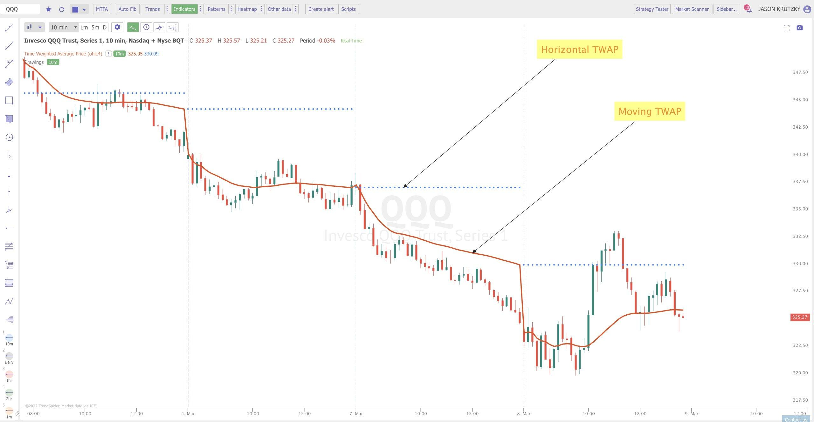

## Table of Contents

## What is Time-weighted Average Price (TWAP)?

Time-weighted Average Price (TWAP) is a way to measure the average price of something over a certain period of time. It's often used in trading to help people buy or sell things at a good price. To find the TWAP, you take the total value of the prices over the time period and divide it by the total time. This gives you an average price that takes into account how prices changed over time.

TWAP is useful because it helps traders avoid buying or selling at a bad time. For example, if the price of a stock goes up and down a lot during the day, using TWAP can help you get a better overall price by spreading out your trades. This way, you don't have to worry about the price at one specific moment, but instead, you can focus on the average price over a longer period.

## How does TWAP differ from other trading algorithms?

TWAP, or Time-weighted Average Price, is different from other trading algorithms because it focuses on spreading out trades evenly over a set period of time. This means that if you want to buy or sell a large amount of something, TWAP will break it into smaller parts and execute them at regular intervals. This helps to minimize the impact on the market price, making it less likely that your big order will cause the price to move against you. Other algorithms might focus on different things, like getting the best possible price at any given moment or reacting quickly to market changes.

For example, another common algorithm is the Volume-weighted Average Price (VWAP), which is similar to TWAP but takes into account the trading [volume](/wiki/volume-trading-strategy) at different times. VWAP tries to execute trades in line with the market's volume, so it might trade more when the market is busier and less when it's quieter. This can be useful if you want your trades to blend in with what everyone else is doing. On the other hand, TWAP doesn't care about volume; it just spreads out the trades evenly, which can be simpler and more predictable.

In summary, while TWAP and other algorithms like VWAP both aim to help traders get good prices, they do it in different ways. TWAP is all about timing and spreading trades evenly, which can be easier to plan and less likely to move the market. VWAP, however, focuses on trading in line with market volume, which can be more complex but might help you get even better prices if done right. Each algorithm has its own strengths and is suited to different trading situations.

## What are the main uses of TWAP in trading?

TWAP, or Time-weighted Average Price, is mainly used in trading to help people buy or sell things without causing big changes in the price. When someone wants to trade a large amount, they can use TWAP to break up their order into smaller parts and spread them out over time. This way, they don't have to buy or sell everything at once, which can make the price go up or down a lot. By using TWAP, traders can get a better average price because they're not putting too much pressure on the market at one time.

Another use of TWAP is to help traders follow a trading plan more easily. If someone decides they want to buy or sell something over a certain period, TWAP can help them stick to their plan by automatically spreading out their trades. This can be really helpful for people who want to trade without having to watch the market all the time. TWAP takes care of the timing for them, making it simpler and less stressful to trade.

## How is TWAP calculated?

To calculate TWAP, you need to know the prices of what you're trading at different times during a set period. Let's say you want to find the TWAP over one hour. You would add up all the prices you see during that hour and then divide by the total number of prices you recorded. For example, if you checked the price every 15 minutes and got prices of $10, $11, $12, and $13, you would add those up to get $46. Then, you would divide $46 by 4 (the number of prices) to get a TWAP of $11.50.

TWAP helps traders by giving them an average price over time, which can be more useful than just looking at the price at one moment. If you're trading a big amount, using TWAP means you can spread your trades out evenly over the hour, so you don't affect the price too much at once. This way, you get a fairer price because you're not just buying or selling when the price might be really high or low. It's like taking the average temperature over a day instead of just checking it at noon; it gives you a better idea of what's really going on.

## Can you explain the formula used to compute TWAP?

To calculate TWAP, you need to know the prices at different times over a certain period. Let's say you want to find the TWAP over one hour and you check the price every 15 minutes. You add up all the prices you see during that hour and then divide by the total number of prices you recorded. For example, if the prices at 15-minute intervals are $10, $11, $12, and $13, you add them up to get $46. Then, you divide $46 by 4 (the number of prices) to get a TWAP of $11.50.

TWAP helps traders by giving them an average price over time, which can be more useful than just looking at the price at one moment. If you're trading a big amount, using TWAP means you can spread your trades out evenly over the hour, so you don't affect the price too much at once. This way, you get a fairer price because you're not just buying or selling when the price might be really high or low. It's like taking the average temperature over a day instead of just checking it at noon; it gives you a better idea of what's really going on.

## What are the advantages of using TWAP for trading?

Using TWAP for trading has several advantages. One big advantage is that it helps traders get a better average price when they are buying or selling a lot of something. Instead of putting in one big order that could move the market price against them, TWAP breaks the order into smaller parts and spreads them out over time. This means the trader doesn't have to worry about the price going up or down a lot because of their own trades. It's like buying a little bit at a time when the price is good, rather than all at once when it might be high.

Another advantage of TWAP is that it makes trading easier and less stressful. Traders can set up their trades to happen automatically over a certain period, which means they don't have to watch the market all the time. This can be really helpful for people who have other things to do or who don't want to spend all day looking at price charts. By using TWAP, traders can follow their plan without having to make quick decisions about when to buy or sell. It's like setting a timer for your trades so you can relax and let the computer do the work.

## Are there any limitations or drawbacks to using TWAP?

One limitation of using TWAP is that it doesn't take into account how busy the market is at different times. If a lot of people are trading at one time, the price might move a lot, and TWAP won't change its plan to buy or sell at those busy times. This can mean that TWAP might not always get the best price because it's not smart enough to know when the market is moving a lot.

Another drawback is that TWAP can be too simple for some traders. If the market is changing quickly, TWAP will still spread out the trades evenly over time, which might not be the best way to trade. Some traders might want to use a smarter algorithm that can change its plan based on what's happening in the market. TWAP is good for simple, steady trading, but it might not work well for people who need to react fast to market changes.

## How can TWAP be implemented in a trading strategy?

To use TWAP in a trading strategy, you first need to decide how long you want to spread out your trades. For example, if you want to buy a lot of a stock over one hour, you can use TWAP to break your order into smaller parts and spread them out evenly every 15 minutes. This way, you don't buy everything at once, which could make the price go up a lot. Instead, you buy a little bit at a time, which can help you get a better average price.

TWAP can also be part of a bigger trading plan. If you have a goal to buy or sell a certain amount over a few days, you can use TWAP each day to make sure your trades are spread out evenly. This can help you stick to your plan without having to watch the market all the time. TWAP is like a helper that makes sure you're trading at a steady pace, which can be really useful if you want to trade without too much stress.

## What types of markets are best suited for TWAP?

TWAP works well in markets where prices don't change a lot and there's not too much trading going on. For example, it's good for trading stocks that don't have big price swings during the day. In these kinds of markets, TWAP can help you get a good average price without worrying about the price moving a lot because of your trades.

TWAP can also be useful in markets where you want to spread out your trades over time. If you're trading something like a currency pair that has steady trading volume, TWAP can help you buy or sell a big amount without making the price go up or down too much. This makes it easier to stick to your trading plan and get a fair price.

## How does TWAP help in reducing market impact?

TWAP helps reduce market impact by spreading out big trades over time. When someone wants to buy or sell a lot of something, doing it all at once can make the price go up or down a lot. This is because a big order can scare other traders and make them change their prices. But with TWAP, the big order is broken into smaller pieces and spread out evenly. This means the market doesn't see one big order that could move the price a lot. Instead, it sees smaller orders that don't scare other traders as much, so the price stays more stable.

By using TWAP, traders can get a better average price because they're not putting too much pressure on the market at one time. If you're buying a stock, for example, and you use TWAP to spread your buys over an hour, you might buy some when the price is a little lower and some when it's a little higher. This way, you end up with an average price that's fairer than if you had bought everything when the price was at its highest. TWAP helps you blend in with the market and trade without causing big price changes, which is good for getting a good deal.

## Can TWAP be used in conjunction with other trading algorithms?

Yes, TWAP can be used with other trading algorithms to make a better trading plan. For example, you can use TWAP to spread out your trades over time, and then use another algorithm like VWAP to make sure your trades happen when the market is busy. This way, you get the benefits of both: TWAP helps you not to move the market too much, and VWAP helps you trade when more people are trading, which can give you a better price.

Using TWAP with other algorithms can also help you react to changes in the market. If you're using TWAP and the market suddenly starts moving a lot, you could switch to a different algorithm that's better at dealing with fast changes. This way, you can start with TWAP to spread out your trades evenly, but then switch to another algorithm if you need to trade faster or at a better time. Combining TWAP with other algorithms can make your trading plan more flexible and effective.

## What are some advanced techniques for optimizing TWAP execution?

One advanced technique for optimizing TWAP execution is to adjust the time intervals based on market conditions. Instead of using fixed time intervals like every 15 minutes, you can make the intervals shorter or longer depending on how the market is moving. For example, if the market is really busy and prices are changing a lot, you might want to use shorter intervals to react faster. This way, you can still spread out your trades evenly, but you can also adjust to what's happening in the market.

Another technique is to use TWAP with other algorithms to get even better results. You can start with TWAP to spread out your trades, and then use another algorithm like VWAP to make sure you're trading when the market is busy. This can help you get a better average price because you're trading when more people are buying and selling. By combining TWAP with other algorithms, you can make your trading plan more flexible and effective, which can lead to better trades.

## How is TWAP calculated?

TWAP calculates an average price based exclusively on time intervals within a given trading period. This calculation aims to distribute an order evenly over time, reducing potential market impact. The TWAP formula is straightforward: it involves taking the sum of the prices, such as opening, high, low, and closing prices, for each time interval, and then dividing this sum by the total number of intervals. 

Mathematically, the simplified calculation of TWAP can be expressed as follows:

$$
\text{TWAP} = \frac{P_1 + P_2 + \cdots + P_n}{n}
$$

where $P_n$ represents the price at each specific time period, and $n$ is the number of such periods.

Different trading platforms may employ various methods for determining which prices to include in the TWAP calculation. Some platforms might use only the closing prices within each interval, while others might use an average of the high and low prices. Despite these variations, the primary objective remains to secure a time-weighted, consistent execution price. This technique ensures that no single large trade order disproportionately affects the market price at any given time, maintaining price stability and reducing market impact for traders executing substantial transactions.

## What are the differences between TWAP and VWAP?

TWAP and VWAP are two prominent algorithms used to execute large trade orders, each with distinct operational mechanics. The Time-Weighted Average Price (TWAP) focuses purely on time intervals for execution, breaking a large order into smaller, evenly distributed quantities over time. This method ensures a uniform trading pace without considering trading volume, providing a consistent time-based price measure. By contrast, the Volume Weighted Average Price (VWAP) integrates both trade volumes and prices, computing an average that weights the price of each trade by its volume. This volume-time weighted approach can be more market-sensitive, offering a dynamic reflection of the asset's price relative to its volume distribution within a trading session.

The formula for VWAP is:

$$
\text{VWAP} = \frac{\sum_{i=1}^{n} P_i \times V_i}{\sum_{i=1}^{n} V_i}
$$

where $P_i$ is the price of the trade, $V_i$ is the volume of the trade, and $n$ is the number of trades. This methodology helps traders benchmark their trades against the broader market volume, assessing performance relative to the executed volumes.

VWAP's sensitivity to volume variations makes it particularly adept at aligning trade execution with market [liquidity](/wiki/liquidity-risk-premium), thus minimizing price slippage during periods of high activity. This attribute is significant when investors aim to integrate their trades within the natural market flow, reducing information leakage and the potential for adverse price moves.

On the other hand, TWAP's reliance on time intervals circumvents the complexities introduced by varying trade volumes, ideal for scenarios where a trader wishes to conceal the size of their order and maintain discretion over volume exposure. This consistency is particularly advantageous in environments where preserving anonymity or avoiding a display of aggressive market presence is key.

In summary, the choice between TWAP and VWAP depends largely on the specific trading goals and market conditions faced by traders. VWAP provides a more market-sensitive execution tool through its integration of volume data, while TWAP offers a straightforward time-based method that can suit various trading situations where volume consideration is not paramount. Both serve as critical components in the execution strategies leveraged by algorithmic traders to optimize market impact and execution quality.

## References & Further Reading

[1]: Aldridge, I. (2013). ["High-Frequency Trading: A Practical Guide to Algorithmic Strategies and Trading Systems"](https://www.amazon.com/High-Frequency-Trading-Practical-Algorithmic-Strategies/dp/1118343506). Wiley.

[2]: Kissell, R. (2014). ["The Science of Algorithmic Trading and Portfolio Management"](https://www.sciencedirect.com/book/9780124016897/the-science-of-algorithmic-trading-and-portfolio-management). Academic Press.

[3]: Easley, D., López de Prado, M. M., & O'Hara, M. (2012). ["Flow Toxicity and Liquidity in a High-Frequency World"](https://www.stern.nyu.edu/sites/default/files/assets/documents/con_035928.pdf). The Review of Financial Studies, 25(5).

[4]: Madhavan, A. (2002). ["VWAP Strategies"](https://guides.pm-research.com/content/iijtrading/2002/1/32). The Journal of Financial and Quantitative Analysis, 37(3).

[5]: De Prado, M. L. (2018). ["Advances in Financial Machine Learning"](https://books.google.com/books/about/Advances_in_Financial_Machine_Learning.html?id=oU9KDwAAQBAJ). Wiley.