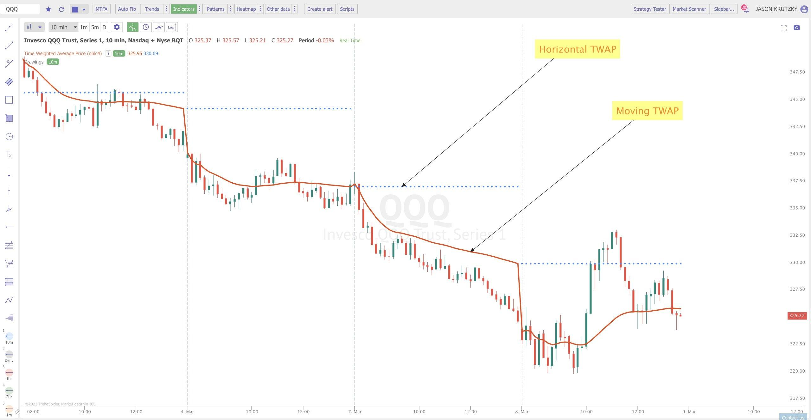

## Table of Contents

## What is the Time-Weighted Average Price (TWAP)?

Time-Weighted Average Price (TWAP) is a way to measure the average price of a stock or other financial asset over a specific period of time. It's calculated by taking the total value of all trades during that time and dividing it by the total number of trades. This method helps investors and traders understand the average price they paid or received for a security, which can be useful for making decisions about buying or selling.

TWAP is often used by traders who want to execute large orders without causing big changes in the market price. By breaking up a large order into smaller pieces and spreading them out over time, traders can use TWAP to get a better average price. This approach is especially helpful in markets that are very active and where prices can change quickly.

## How is TWAP calculated?

TWAP is calculated by adding up the prices of a stock or asset at different times during a specific period and then dividing by the number of times you checked the price. For example, if you want to find the TWAP over an hour and you check the price every 15 minutes, you would add up the prices at 0 minutes, 15 minutes, 30 minutes, and 45 minutes, and then divide by 4.

This method helps give a fair average price over time, which is useful for traders who want to buy or sell a lot of a stock without affecting the market too much. By spreading out their trades and using TWAP, they can get a better idea of the average price they are paying or receiving. It's a simple but effective way to manage large orders in busy markets.

## Why is TWAP important in trading?

TWAP is important in trading because it helps traders and investors get a fair average price for a stock or other asset over a certain time. When traders need to buy or sell a lot of a stock, they don't want to do it all at once because that could change the market price a lot. By using TWAP, they can break up their big order into smaller pieces and spread them out over time. This way, they can buy or sell without making the price go up or down too much.

This method is especially useful in busy markets where prices can change quickly. TWAP helps traders see the average price they are getting, which can make their trading decisions better. It's a simple tool that can make a big difference in how well traders can manage their orders and get good prices for their trades.

## Can you explain TWAP with a simple example?

Let's say you want to buy 100 shares of a company's stock, but you don't want to buy them all at once because that might make the price go up. Instead, you decide to buy them over an hour, checking the price every 15 minutes. At the start of the hour, the price is $10 per share. After 15 minutes, it's $10.50. After 30 minutes, it's $11. And after 45 minutes, it's $10.75.

To find the TWAP, you add up these prices: $10 + $10.50 + $11 + $10.75 = $42.25. Then, you divide by the number of times you checked the price, which is 4. So, $42.25 divided by 4 equals $10.5625. This means the TWAP for that hour is about $10.56 per share. By using TWAP, you can buy your 100 shares at different times and get an average price of $10.56, which helps you not affect the market too much.

## How does TWAP differ from Volume-Weighted Average Price (VWAP)?

TWAP and VWAP are both ways to find the average price of a stock over time, but they do it differently. TWAP is simple - it just adds up the prices at different times and divides by how many times you checked. For example, if you check the price every 15 minutes for an hour, TWAP would give you the average of those four prices. This method is good for spreading out big orders without affecting the market too much.

VWAP, on the other hand, also looks at how many shares were traded at each price. It takes the total value of all trades and divides it by the total number of shares traded. This means VWAP gives more weight to times when more shares were traded. If a lot of shares were bought or sold at a certain price, VWAP will consider that price more important. VWAP is useful for traders who want to see if they got a good price compared to the market's activity.

## In what scenarios is TWAP most effectively used?

TWAP is most effectively used when traders need to buy or sell a large number of shares without causing big changes in the market price. For example, if someone wants to buy 10,000 shares, doing it all at once could make the price go up a lot. By using TWAP, the trader can break up the order into smaller parts and spread them out over time. This way, the market doesn't notice the big order as much, and the trader can get a better average price for the shares.

Another good scenario for TWAP is in markets that move quickly. In these markets, prices can change a lot in a short time. TWAP helps traders keep track of the average price over a set period, like an hour or a day. By checking the price at regular intervals and using TWAP, traders can make smarter decisions about when to buy or sell. This is especially helpful for traders who want to manage their trades without causing too much of a stir in the market.

## What are the advantages of using TWAP for executing trades?

Using TWAP for executing trades has several advantages. One big advantage is that it helps traders buy or sell a lot of shares without making the market price go up or down too much. When you have a big order, if you do it all at once, it can change the price a lot. But if you use TWAP, you can break up the big order into smaller pieces and spread them out over time. This way, you can get a better average price for your shares without causing a big change in the market.

Another advantage of TWAP is that it's simple to use. You just need to check the price at regular times and then find the average. This makes it easy for traders to manage their trades, especially in busy markets where prices can change quickly. By using TWAP, traders can make better decisions about when to buy or sell, and they can do it without making a big impact on the market.

## What are the potential limitations or drawbacks of using TWAP?

One drawback of using TWAP is that it doesn't take into account how many shares are being traded at each price. This means that if a lot of shares are bought or sold at a certain time, TWAP won't give that time more importance. This can be a problem in markets where some times of the day are much busier than others. For example, if a lot of trading happens at the end of the day, TWAP won't show that those prices are more important because it treats all times the same.

Another limitation of TWAP is that it might not work well in markets that are very unpredictable. If prices are going up and down a lot, using TWAP to spread out your trades might mean you end up buying at high prices and selling at low prices. This could make you lose money. Traders need to be careful and maybe use other methods along with TWAP to make sure they are getting the best prices for their trades.

## How can TWAP be implemented in algorithmic trading?

In [algorithmic trading](/wiki/algorithmic-trading), TWAP can be used to spread out big orders over time to get a good average price. Traders can write a computer program that checks the price of a stock at regular times, like every 15 minutes. The program then uses TWAP to figure out the average price over the time period. For example, if a trader wants to buy 10,000 shares, the program can break up the order into smaller parts and buy them at different times based on the TWAP calculation. This helps the trader buy the shares without making the price go up too much.

Another way to use TWAP in algorithmic trading is to set up the program to automatically adjust the size of each small order based on the current market conditions. If the market is very busy, the program might decide to buy or sell smaller amounts more often to keep the impact low. This way, the trader can still use TWAP to get a good average price, but the program can also react to changes in the market. By using TWAP in this way, traders can manage their big orders more smoothly and effectively.

## What impact does market volatility have on TWAP?

Market [volatility](/wiki/volatility-trading-strategies) can make TWAP less effective. When prices go up and down a lot, using TWAP to spread out your trades might mean you buy at high prices and sell at low prices. This can make you lose money because TWAP treats all times the same, even if the market is very busy at some times and quiet at others. If the market is very unpredictable, TWAP might not be the best way to get a good average price for your trades.

To deal with market volatility, traders might use TWAP along with other methods. They can set up their trading programs to check the market more often and adjust the size of their orders based on how busy the market is. This way, they can still use TWAP to get a good average price, but they can also react to big changes in the market. By being flexible and using TWAP smartly, traders can manage their trades better even when the market is very volatile.

## How does TWAP help in reducing market impact?

TWAP helps reduce market impact by spreading out big orders over time. When you want to buy or sell a lot of shares, doing it all at once can make the price go up or down a lot. But if you use TWAP, you can break up your big order into smaller pieces and buy or sell them at different times. This way, the market doesn't notice your big order as much, and the price doesn't change as much.

By using TWAP, traders can get a better average price for their shares without making a big change in the market. TWAP is simple to use because you just need to check the price at regular times and find the average. This makes it easy for traders to manage their trades, especially in busy markets where prices can change quickly. By spreading out their trades and using TWAP, traders can make better decisions about when to buy or sell without causing too much of a stir in the market.

## What advanced strategies can be combined with TWAP for optimal trading?

One advanced strategy that can be combined with TWAP is using Volume-Weighted Average Price (VWAP) alongside it. While TWAP helps spread out trades evenly over time, VWAP takes into account how many shares are being traded at each price. By using both, traders can get a better sense of the market's activity. For example, if the market is very busy at certain times, VWAP can help traders decide to buy or sell more shares then, while TWAP can still be used to spread out the trades evenly. This combination can help traders get a better average price and manage their trades more effectively.

Another strategy is to use TWAP with market trend analysis. Traders can use TWAP to spread out their trades, but they can also look at market trends to decide when to buy or sell. If the market is going up, traders might want to buy more shares earlier in the time period. If the market is going down, they might want to sell more shares earlier. By combining TWAP with trend analysis, traders can make smarter decisions about when to buy or sell, while still spreading out their trades to reduce market impact. This can help them get a better average price and manage their trades more effectively in changing market conditions.

## What is Time-Weighted Average Price (TWAP) and how is it understood?

Time-Weighted Average Price (TWAP) is widely known as a method used to execute trades at an average price calculated over a specific timeframe. This is particularly useful for traders who wish to avoid the pitfalls of market turbulence caused by large, sudden transactions. By executing orders gradually over a predetermined period, TWAP strategies help in achieving a price that reflects the true market value of the security, thereby maintaining market equilibrium.

A central tenet of TWAP is its ability to offer a more nuanced and controlled approach to trading. Unlike strategies that involve the immediate execution of large order [volume](/wiki/volume-trading-strategy)s, TWAP reduces the risk of causing sharp price movements that could lead to unfavorable market perception. Instead, it allows traders to spread their trades evenly over time, thus minimizing their visibility and impact on the market.

Applying a TWAP strategy involves calculating an average price according to the formula: 

$$
P_{\text{TWAP}} = \frac{\sum (P_j \times T_j)}{\sum T_j}
$$

where $P_j$ represents the price of the security at time $j$, and $T_j$ denotes the time interval between transactions. This calculation helps ensure that traders can align their transactions closely with typical market conditions rather than reacting to short-term price fluctuations.

By using TWAP, traders can not only execute their strategies in a way that is less intrusive and more informed by actual trading conditions, but they can also better synchronize their buying and selling actions with genuine market dynamics. This method becomes particularly advantageous for institutional investors or large players in the market, who necessitate a tactical approach to managing capital without sparking unwanted market reactions.

## How do you calculate TWAP?

TWAP is calculated using the formula: 

$$
P_{\text{TWAP}} = \frac{\Sigma(P_j \times T_j)}{\Sigma T_j}
$$

where $P_j$ denotes the price of a security at a specific measurement time $j$, and $T_j$ signifies the time elapsed since the previous measurement. This formula ensures that the average price accurately reflects the movements of the security's price over the chosen time frame, without being distorted by fleeting price changes.

For example, consider a trading scenario where you take price measurements every hour. If you have prices $P_1, P_2, ..., P_n$ recorded at times $T_1, T_2, ..., T_n$, the TWAP would involve summing the products of each price and its respective time interval, divided by the sum of all time intervals.

The formula provides a weighted price that accounts for the duration of each price period, making it more representative of actual price trends rather than being skewed by momentary price fluctuations. This approach is particularly useful in environments where price stability is crucial and sharp, temporary price movements might otherwise lead to erroneous conclusions.

Choosing the right measurement interval is critical. A longer measurement period might result in a TWAP that does not reflect the most current market conditions due to the inclusion of older data. Conversely, shorter intervals can provide a TWAP that is more aligned with the current market state but may be more susceptible to short-term volatility. Therefore, the selection of an appropriate measurement interval should be aligned with the trading objectives and market conditions to ensure the effectiveness of the TWAP strategy.

## References & Further Reading

[1]: Kissell, R., & Malamut, R. (2005). ["Algorithmic Decision Making Framework."](https://www.semanticscholar.org/paper/Algorithmic-Decision-Making-Framework-Kissell-Malamut/5da40e3ffcf6ca9e60f1cdfa39bad1c0d2290ce5) Journal of Trading.

[2]: Madhavan, A. (2002). ["VWAP Strategies."](https://guides.pm-research.com/content/iijtrading/2002/1/32) The Journal of Portfolio Management.

[3]: Bouchaud, J. P., Gefen, Y., Potters, M., & Wyart, M. (2004). ["Fluctuations and response in financial markets: the subtle nature of 'random' price changes."](https://arxiv.org/abs/cond-mat/0307332) Quantitative Finance.

[4]: Stoikov, S., & Saglam, M. (2009). ["Option market making under inventory risk with Bayesian learning."](https://papers.ssrn.com/sol3/papers.cfm?abstract_id=1393818) Probability in the Engineering and Informational Sciences.

[5]: Hasbrouck, J. (2007). ["Empirical Market Microstructure: The Institutions, Economics, and Econometrics of Securities Trading."](https://academic.oup.com/book/52241) Oxford University Press.