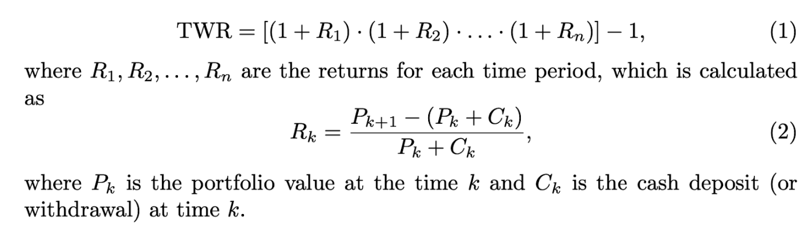

## Table of Contents

## What is the Time-Weighted Rate of Return (TWRR)?

The Time-Weighted Rate of Return (TWRR) is a way to measure how well an investment is doing over time. It looks at the growth of the investment without considering when money is added or taken out. This makes it fair to compare different investments, even if you put money in at different times.

TWRR is useful because it focuses only on the investment's performance. If you add more money to your investment, TWRR won't change just because of that. It's like taking a series of snapshots of your investment's growth and then figuring out the overall growth rate from those snapshots. This method helps you see how well the investment itself is doing, no matter when you added or withdrew money.

## Why is TWRR important in investment performance measurement?

TWRR is important in investment performance measurement because it gives a clear picture of how well an investment is doing over time, without being affected by when you add or take out money. Imagine you put more money into your investment at different times. With TWRR, these additions or withdrawals don't change the performance measure. This makes it fair to compare different investments or different managers, even if the timing of money movements is different.

This method is especially useful for investors who want to see how their investment choices are performing, separate from their own decisions about when to add or remove money. For example, if you're comparing two mutual funds, TWRR helps you see which fund did better, regardless of when you invested in them. It's like looking at the growth of your investment in a way that's not influenced by your own actions, giving you a true sense of the investment's performance.

## How does TWRR differ from the Money-Weighted Rate of Return (MWRR)?

TWRR and MWRR are two different ways to measure how well an investment is doing. TWRR looks at the growth of your investment over time without caring about when you add or take out money. It's like taking pictures of your investment at different times and then figuring out how much it grew overall. This is great if you want to compare different investments fairly, because it doesn't matter when you put money in or took it out.

On the other hand, MWRR, also known as the Internal Rate of Return (IRR), does care about when you add or take out money. It measures the growth of your investment based on the exact timing of your cash flows. If you add more money when the investment is doing well, it will make the MWRR look better. If you take out money when it's doing poorly, it can make the MWRR look worse. So, MWRR shows you how well your investment did, considering your own timing of putting in or taking out money.

In simple terms, TWRR is about the investment's performance itself, while MWRR is about how your timing of money movements affected the investment's performance. If you want to see how good an investment is on its own, go with TWRR. If you want to see how your own decisions about money affected the investment, go with MWRR.

## What are the steps to calculate the TWRR?

To calculate the Time-Weighted Rate of Return (TWRR), you first need to break down the investment period into smaller parts, usually whenever there's a cash flow like adding or taking out money. For each of these parts, you figure out how much the investment grew. You do this by dividing the value of the investment at the end of the part by the value at the beginning of that part. This gives you a series of growth rates, called sub-period returns.

Next, you take all these sub-period returns and multiply them together. This step combines all the growth rates to give you the total growth over the entire period. After multiplying, you take the result and raise it to the power of one divided by the number of sub-periods. This step adjusts for the time, giving you the average growth rate per period. Finally, you subtract one from this result to get the TWRR as a decimal, which you can then turn into a percentage.

## Can you explain the concept of sub-periods in TWRR?

In TWRR, sub-periods are smaller parts of the whole time you're looking at your investment. You break up the time whenever there's a change in your investment, like when you add or take out money. Each sub-period starts when there's a change and ends at the next change. This way, you can see how your investment grew in each of these smaller times.

For each sub-period, you figure out the growth rate by dividing the value of your investment at the end of the sub-period by its value at the beginning. This gives you a number that shows how much your investment grew during that specific time. By doing this for all sub-periods, you get a series of growth rates that you can use to calculate the overall TWRR.

## How do you handle cash flows in the TWRR calculation?

When you're calculating TWRR, you need to pay attention to cash flows, which are times when you add or take out money from your investment. Each time there's a cash flow, you start a new sub-period. For example, if you put more money in or take some out, that's when you divide your time into smaller parts. You then look at how your investment grew during each of these sub-periods. You do this by seeing how much the investment was worth right before the cash flow and right after it.

To find the growth rate for each sub-period, you take the value of the investment at the end of the sub-period and divide it by the value at the start. If you added money, you use the value right after you added it. If you took money out, you use the value right before you took it out. This way, the cash flows don't affect the growth rate you're calculating. You do this for every sub-period, and then you multiply all those growth rates together to get the total growth for the whole time you're looking at.

## What is the formula for TWRR and how is it applied?

The formula for TWRR is a bit tricky, but it's not too hard once you understand it. You start by figuring out how much your investment grew during each sub-period. You do this by dividing the value at the end of the sub-period by the value at the beginning. Then, you multiply all these growth rates together. This gives you the total growth for the whole time. After that, you take this total growth and raise it to the power of one divided by the number of sub-periods. This step adjusts for the time, giving you the average growth rate per period. Finally, you subtract one from this result to get the TWRR as a decimal, which you can then turn into a percentage.

Let's break it down with an example. Imagine you invested $100, and after the first month, it grew to $110. That's a growth rate of 110/100 = 1.10. Then, you added $50, making your new investment worth $160. After another month, it grew to $176. The growth rate for this second sub-period is 176/160 = 1.10. You multiply these growth rates together: 1.10 * 1.10 = 1.21. Now, you have two sub-periods, so you take 1.21 and raise it to the power of 1/2 (which is the same as taking the square root), getting about 1.10. Subtract one from this, and you get 0.10, which means your TWRR is 10%.

## Can you provide an example of TWRR calculation with multiple cash flows?

Imagine you started with $1,000 in an investment. After one month, it grew to $1,100. That's a growth rate of 1,100/1,000 = 1.10. Then, you added another $500, making your total investment $1,600. After another month, it grew to $1,760. The growth rate for this second sub-period is 1,760/1,600 = 1.10. You then took out $300, leaving you with $1,460. After one more month, it grew to $1,533. The growth rate for this third sub-period is 1,533/1,460 = 1.05.

Now, you multiply all these growth rates together: 1.10 * 1.10 * 1.05 = 1.265. You had three sub-periods, so you take 1.265 and raise it to the power of 1/3 (which is the same as taking the cube root), getting about 1.08. Subtract one from this, and you get 0.08, which means your TWRR is 8%. This shows how your investment grew over time, without being affected by when you added or took out money.

## How does TWRR help in comparing the performance of different investment managers?

TWRR is really helpful when you want to compare how different investment managers are doing. It looks at how well the investments are growing over time, without caring about when money is added or taken out. This means you can see which manager is making better choices with the investments, no matter when you or others put money in or took it out. It's like a fair way to see who's doing a better job, because it focuses just on the growth of the investments themselves.

For example, if you have two managers and you want to see who's better, TWRR helps you do that. One manager might have had more money added to their fund at different times, but TWRR ignores those changes. It only shows you how the investments grew under each manager's care. This way, you can tell which manager is [picking](/wiki/asset-class-picking) better investments or managing them better, without the timing of money movements getting in the way.

## What are the common pitfalls or errors when calculating TWRR?

When calculating TWRR, a common mistake is not correctly identifying the start and end of each sub-period. Each time money is added or taken out, you need to start a new sub-period. If you miss a cash flow, you might end up with the wrong growth rates for your sub-periods, which will mess up your final TWRR. Another error is not using the right values when calculating the growth rates for each sub-period. You need to use the value right before a cash flow for the start of a sub-period and the value right after for the end, to make sure the cash flow doesn't affect the growth rate you're calculating.

Another pitfall is mixing up TWRR with MWRR. TWRR ignores the timing of cash flows, while MWRR takes them into account. If you accidentally use the MWRR method when you're trying to calculate TWRR, your results will be wrong. It's also important to make sure you're doing the math right. When you multiply the sub-period growth rates together and then take the root to adjust for time, a small mistake can lead to a big error in your final TWRR. Always double-check your calculations to avoid these common pitfalls.

## How can TWRR be adjusted for fees and taxes?

To adjust TWRR for fees, you need to look at how fees affect the value of your investment. Imagine you have an investment that grows from $100 to $110 in a month, but you also have to pay a $5 fee. You would subtract the fee from the ending value, so instead of $110, you'd use $105 to calculate the growth rate for that sub-period. This way, the TWRR you calculate will show the real growth of your investment after fees are taken out. It's like taking a picture of your investment's growth, but with the fees already subtracted, so you see the true performance.

Adjusting TWRR for taxes is a bit trickier because taxes depend on your personal situation. If you have to pay taxes on your investment gains, you would subtract the tax amount from the ending value of each sub-period, just like with fees. For example, if your investment grew from $100 to $110, but you owe $3 in taxes, you'd use $107 as the ending value. This way, the TWRR you calculate will show how your investment grew after taxes. It's important to remember that everyone's tax situation is different, so you might need to talk to a tax advisor to make sure you're adjusting the TWRR correctly for your own taxes.

## What advanced tools or software are available for calculating TWRR in large portfolios?

For calculating TWRR in large portfolios, there are several advanced tools and software that can make the job easier. One popular tool is Bloomberg Terminal, which is widely used by financial professionals. It can handle complex calculations like TWRR, and it's great for managing big portfolios because it can deal with lots of data at once. Another tool is Morningstar Direct, which is also used a lot in the finance world. It has features that let you calculate TWRR and other performance metrics, and it's good for tracking investments over time.

There are also software solutions like FactSet and Zephyr that are designed for investment analysis and portfolio management. These tools can automatically calculate TWRR, taking into account all the cash flows and sub-periods without you having to do it by hand. They're especially helpful for large portfolios because they can process a lot of information quickly and accurately. If you're working with spreadsheets, Microsoft Excel with add-ons like the XIRR function can also help, but it might not be as fast or easy as the specialized software for very large portfolios.

## What is the Time-Weighted Rate of Return (TWR) and how is it understood?

The Time-Weighted Rate of Return (TWR) is a fundamental metric in investment analysis that represents the compounded rate of growth within a portfolio while systematically accounting for cash flow events across varying periods. It is particularly advantageous in assessing the performance of investment managers as it mitigates the skewed effects that cash inflows and outflows can have on investment returns. 

TWR becomes essential when portfolios undergo frequent deposits and withdrawals, as it isolates the investment manager’s performance from the investor’s cash flow decisions. By using the TWR method, one can ensure that the evaluation of a portfolio’s growth is unbiased and purely reflective of market movements and managerial decisions.

Mathematically, TWR is synonymous with the geometric mean return, which emphasizes how returns are compounded over time. This is calculated by segmenting the total investment period into sub-periods defined by the cash flow events. The return for each sub-period is computed, followed by the compounding of these returns to ascertain the overall growth rate. This can be expressed in the following formula:

$$
TWR = \left(\prod_{i=1}^{n} (1 + HP_i)\right) - 1
$$

where $HP_i$ represents the holding period return for each sub-period $i$.

The geometric nature of TWR allows investors to understand the true performance of their investments without interference from cash flow activities. As such, TWR stands out as a reliable measure in financial performance analysis, laying a solid foundation for evaluating the skill of investment managers and the underlying strategies of portfolio growth. Understanding TWR is pivotal for discerning how portfolio returns accumulate over time, providing a clearer picture of long-term investment performance.

## What is the TWR Formula and What Are the Calculation Steps?

The Time-Weighted Rate of Return (TWR) is a method used to assess the performance of an investment portfolio by accounting for the impact of cash flows over different periods. It effectively neutralizes the effects of deposits and withdrawals, focusing solely on the investment's performance. The TWR is calculated using the formula:

$$
\text{TWR} = (1 + \text{HP1}) \times (1 + \text{HP2}) \times ... \times (1 + \text{HPn}) - 1
$$

where HP represents the return for each sub-period.

To accurately calculate the TWR for a portfolio, follow these steps:

1. **Identify Cash Flow Events:**
   Break down the investment timeline into sub-periods that are determined by cash flow events, such as deposits or withdrawals. Each sub-period represents a distinct period between these cash flows. For instance, if an investor deposits funds into the account in March and withdraws in June, the period between March and June is a sub-period.

2. **Calculate Each Sub-period's Return:**
   For each identified sub-period, calculate the holding period return. The return for a sub-period can typically be calculated using the formula:

   \[ \text{HP}_i = \frac{\text{Ending Value}_i - \text{Beginning Value}_i}{\text{Beginning Value}_i}
$$

   It's crucial to include dividends or interest accrued within the sub-period in the ending value.

3. **Apply Compounding:**
   To determine the overall growth of the investment, add 1 to each sub-period return to prepare them for compounding:

   \[ (1 + \text{HP}_i)
$$

   This transformation helps in accurately accounting the compounded growth of returns over multiple periods.

4. **Multiply for Cumulative Growth:**
   Multiply all transformed sub-period returns together:

   \[ (1 + \text{HP1}) \times (1 + \text{HP2}) \times ... \times (1 + \text{HPn})
$$

   This step aggregates the compounded returns over all sub-periods, providing a comprehensive view of the investment's growth without distortion from cash flows.

5. **Subtract 1 to Find TWR:**
   Finally, subtract one from the cumulative product to obtain the TWR:

   \[ \text{TWR} = \text{Cumulative Product} - 1
$$

The process of breaking down the investment into sub-periods aligned with cash-flow events ensures that the TWR provides an accurate representation of the investment's growth over time, independent of any external cash flow decisions made by the investor. This method allows for a precise evaluation of an investment manager's performance, particularly in scenarios with frequent transactions that otherwise skew simplistic rate of return calculations.

### Practical Example

Consider a portfolio that starts with an initial value of $10,000. An investor adds $2,000 after 3 months, and the value of the portfolio before the cash inflow is $11,000. The portfolio then grows to $14,300 over the next 6 months before another withdrawal of $1,300 is made, leaving $13,000 in the portfolio.

- **Sub-Period 1:** $(11,000 - 10,000) / 10,000 = 0.1$ or 10%
- **Sub-Period 2:** $(14,300 - 11,000) / 11,000 = 0.3$ or 30%
- **Sub-Period 3:** $(13,000 - 14,300) / 14,300 = -0.0909$ or -9.09%

The TWR can be calculated as:

$$
(1 + 0.1) \times (1 + 0.3) \times (1 - 0.0909) - 1 = (1.1) \times (1.3) \times (0.9091) - 1 = 0.2999 \text{ or } 29.99\%
$$

This example illustrates how TWR provides a consistent measure of growth irrespective of the timing or size of cash flow events.

## What are the differences between TWR and ROR?

Time-weighted rate of return (TWR) and rate of return (ROR) are fundamental metrics in measuring investment performance, but they serve different purposes and contexts. Understanding these differences is essential for investors and financial analysts looking to accurately assess portfolio performance.

TWR is designed to eliminate the effects of external cash flows such as deposits and withdrawals in the evaluation period. It provides a cash flow-neutral measure of growth by segmenting the evaluation period into sub-periods around these cash flow events. The key advantage of TWR is its ability to reflect the true performance of the investment manager's ability to generate returns, independent of the timing and magnitude of investor cash flows. It is calculated using the formula: 

$$
TWR = \left(\prod_{i=1}^{n}(1 + HP_i)\right) - 1
$$

where $HP_i$ represents the holding period return for each sub-period.

On the other hand, ROR measures the percentage change in the value of an investment over a specific period, directly incorporating the effects of cash flows. It reflects actual gains or losses an investor experiences during that time and is expressed as:

$$
ROR = \frac{(Ending\:Value - Beginning\:Value + Dividends\:or\:Interest \:Gains)}{Beginning\:Value}
$$

While ROR provides the investor's realized return, it can be significantly influenced by the timing of external cash flows. For instance, a large deposit at the beginning of a period when the market rises will show a high ROR, whereas a withdrawal before an upswing can result in a lower ROR.

The choice between TWR and ROR depends on the analysis's objective. TWR is more appropriate when assessing an investment manager's performance irrespective of cash flow decisions made by investors. It allows for a fair comparison between different portfolios or funds, given its neutrality to cash flow timing. In contrast, ROR is useful for understanding the investor's perspective, reflecting the actual returns experienced, influenced by personal cash flow activities.

In summary, TWR is preferable in contexts where neutrality from cash inflows and outflows is desired, such as mutual fund performance evaluations, whereas ROR is suited for individual investor performance assessments where cash flows are integral to the investment outcome. Understanding when to use each of these metrics can lead to more informed evaluations and decisions in investment management.

## References & Further Reading

[1]: Christopherson, J. A., Carino, D. R., & Ferson, W. E. (2009). ["Portfolio Performance Measurement and Benchmarking."](https://www.amazon.com/Portfolio-Performance-Measurement-Benchmarking-McGraw-Hill/dp/0071496653) McGraw-Hill.

[2]: Grinold, R. C., & Kahn, R. N. (2000). ["Active Portfolio Management: A Quantitative Approach for Producing Superior Returns and Controlling Risk."](https://www.amazon.com/Active-Portfolio-Management-Quantitative-Controlling/dp/0070248826) McGraw-Hill.

[3]: Sharpe, W. F. (1994). ["The Sharpe Ratio."](https://web.stanford.edu/~wfsharpe/art/sr/SR.htm) Financial Analysts Journal, 49(1).

[4]: Fabozzi, F. J. (2000). ["The Handbook of Portfolio Mathematics: Formulas for Optimal Allocation & Leverage."](https://www.semanticscholar.org/paper/The-Handbook-of-Portfolio-Mathematics:-Formulas-for-Vince/afd081d07c81808c1a8a4f7fce2b38a3a7859151) Wiley.

[5]: Elton, E. J., Gruber, M. J., Brown, S. J., & Goetzmann, W. N. (2009). ["Modern Portfolio Theory and Investment Analysis."](https://books.google.com/books/about/Modern_Portfolio_Theory_and_Investment_A.html?id=181CEAAAQBAJ) Wiley.

[6]: Bodie, Z., Kane, A., & Marcus, A. J. (2014). ["Investments."](https://www.mheducation.com/highered/product/Investments-Bodie.html) McGraw-Hill Education.