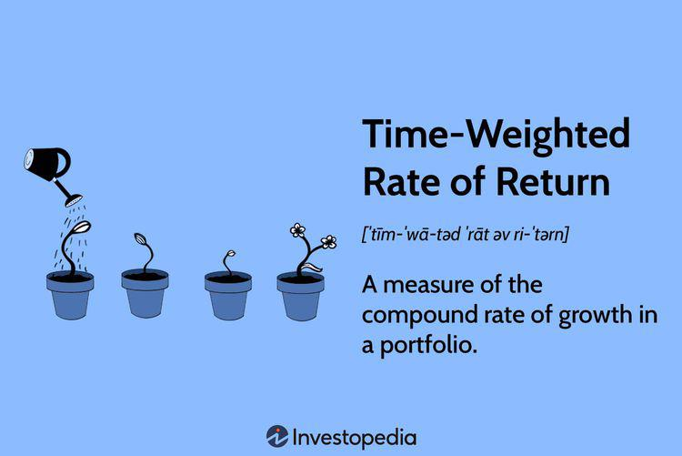

Measuring investment performance accurately is essential in the financial world. One metric that provides valuable insights into investment outcomes is the Time-Weighted Rate of Return (TWR). This measure is particularly important for investment portfolios with frequent cash flows, as it offers an unbiased evaluation of performance by eliminating the distortion effects that cash inflows and outflows might cause. TWR is favored for its ability to gauge performance independently of the timing and magnitude of those cash flows.

This article will focus on the TWR metric by discussing its formula, calculation methods, implications, and how it applies to algorithmic trading. Additionally, we will explore how TWR compares to other performance metrics, highlighting its benefits and limitations within financial performance analysis. Regardless of whether one is a seasoned investor, a financial advisor, or a beginner in trading, understanding the intricacies of TWR can significantly enhance investment strategies and decision-making capabilities.



## Table of Contents

## Understanding Time-Weighted Rate of Return (TWR)

The Time-Weighted Rate of Return (TWR) is a fundamental metric in investment analysis that represents the compounded rate of growth within a portfolio while systematically accounting for cash flow events across varying periods. It is particularly advantageous in assessing the performance of investment managers as it mitigates the skewed effects that cash inflows and outflows can have on investment returns. 

TWR becomes essential when portfolios undergo frequent deposits and withdrawals, as it isolates the investment manager’s performance from the investor’s cash flow decisions. By using the TWR method, one can ensure that the evaluation of a portfolio’s growth is unbiased and purely reflective of market movements and managerial decisions.

Mathematically, TWR is synonymous with the geometric mean return, which emphasizes how returns are compounded over time. This is calculated by segmenting the total investment period into sub-periods defined by the cash flow events. The return for each sub-period is computed, followed by the compounding of these returns to ascertain the overall growth rate. This can be expressed in the following formula:

$$
TWR = \left(\prod_{i=1}^{n} (1 + HP_i)\right) - 1
$$

where $HP_i$ represents the holding period return for each sub-period $i$.

The geometric nature of TWR allows investors to understand the true performance of their investments without interference from cash flow activities. As such, TWR stands out as a reliable measure in financial performance analysis, laying a solid foundation for evaluating the skill of investment managers and the underlying strategies of portfolio growth. Understanding TWR is pivotal for discerning how portfolio returns accumulate over time, providing a clearer picture of long-term investment performance.

## The TWR Formula and Calculation Steps

The Time-Weighted Rate of Return (TWR) is a method used to assess the performance of an investment portfolio by accounting for the impact of cash flows over different periods. It effectively neutralizes the effects of deposits and withdrawals, focusing solely on the investment's performance. The TWR is calculated using the formula:

$$
\text{TWR} = (1 + \text{HP1}) \times (1 + \text{HP2}) \times ... \times (1 + \text{HPn}) - 1
$$

where HP represents the return for each sub-period.

To accurately calculate the TWR for a portfolio, follow these steps:

1. **Identify Cash Flow Events:**
   Break down the investment timeline into sub-periods that are determined by cash flow events, such as deposits or withdrawals. Each sub-period represents a distinct period between these cash flows. For instance, if an investor deposits funds into the account in March and withdraws in June, the period between March and June is a sub-period.

2. **Calculate Each Sub-period's Return:**
   For each identified sub-period, calculate the holding period return. The return for a sub-period can typically be calculated using the formula:

   \[ \text{HP}_i = \frac{\text{Ending Value}_i - \text{Beginning Value}_i}{\text{Beginning Value}_i}
$$

   It's crucial to include dividends or interest accrued within the sub-period in the ending value.

3. **Apply Compounding:**
   To determine the overall growth of the investment, add 1 to each sub-period return to prepare them for compounding:

   \[ (1 + \text{HP}_i)
$$

   This transformation helps in accurately accounting the compounded growth of returns over multiple periods.

4. **Multiply for Cumulative Growth:**
   Multiply all transformed sub-period returns together:

   \[ (1 + \text{HP1}) \times (1 + \text{HP2}) \times ... \times (1 + \text{HPn})
$$

   This step aggregates the compounded returns over all sub-periods, providing a comprehensive view of the investment's growth without distortion from cash flows.

5. **Subtract 1 to Find TWR:**
   Finally, subtract one from the cumulative product to obtain the TWR:

   \[ \text{TWR} = \text{Cumulative Product} - 1
$$

The process of breaking down the investment into sub-periods aligned with cash-flow events ensures that the TWR provides an accurate representation of the investment's growth over time, independent of any external cash flow decisions made by the investor. This method allows for a precise evaluation of an investment manager's performance, particularly in scenarios with frequent transactions that otherwise skew simplistic rate of return calculations.

### Practical Example

Consider a portfolio that starts with an initial value of $10,000. An investor adds $2,000 after 3 months, and the value of the portfolio before the cash inflow is $11,000. The portfolio then grows to $14,300 over the next 6 months before another withdrawal of $1,300 is made, leaving $13,000 in the portfolio.

- **Sub-Period 1:** $(11,000 - 10,000) / 10,000 = 0.1$ or 10%
- **Sub-Period 2:** $(14,300 - 11,000) / 11,000 = 0.3$ or 30%
- **Sub-Period 3:** $(13,000 - 14,300) / 14,300 = -0.0909$ or -9.09%

The TWR can be calculated as:

$$
(1 + 0.1) \times (1 + 0.3) \times (1 - 0.0909) - 1 = (1.1) \times (1.3) \times (0.9091) - 1 = 0.2999 \text{ or } 29.99\%
$$

This example illustrates how TWR provides a consistent measure of growth irrespective of the timing or size of cash flow events.

## Practical Application of TWR

The Time-Weighted Rate of Return (TWR) is a metric that excellently represents investment performance by negating the effects of external cash flows. This characteristic allows TWR to provide an unbiased insight into a portfolio's growth pattern, making it particularly valuable when evaluating investment strategies and manager performance. Understanding the practical application of TWR involves examining how it maintains consistency in scenarios where cash flows vary significantly among investors.

Consider two hypothetical investors, Investor A and Investor B, both owning identical portfolios at the start of the investment period. Their portfolios initially consist of 100 shares each, valued at $10 per share, resulting in a portfolio value of $1,000. Over a six-month period, both portfolios experience similar market returns: an increase of 5% in the first three months followed by a decrease of 2% in the subsequent months.

- **Investor A** maintains a stable portfolio without any additional deposits or withdrawals throughout this period.

- **Investor B**, however, decides to inject an additional $500 halfway through the period, right before the value decrease.

Using the TWR, the performance measurement focuses purely on the investment returns, discarding the influence of cash inflows which would inflate the actual performance appearance. Here is a step-by-step look at how TWR is calculated for these scenarios:

1. **Define Sub-Periods Based on Cash Flows:**
   - For both investors, define sub-periods based on investment conditions:
     - **First sub-period:** Initial value to the point before the additional cash flow (or where none is made).
     - **Second sub-period:** After the cash flow change, if any, to the end of the period.

2. **Calculate Returns for Each Sub-Period:**
   - **First Sub-Period Return (HP1):**
     - $\text{Return} = \frac{\text{End Value} - \text{Start Value}}{\text{Start Value}} = \frac{1050 - 1000}{1000} = 0.05$ or 5%

   - **Second Sub-period Return (HP2):**
     - Portfolio of Investor A: $\text{Return} = \frac{1035 - 1050}{1050} = -0.0143$ or -1.43%
     - Portfolio of Investor B: Despite the cash influx, this return is similar as TWR neutralizes cash flow effects.

3. **Aggregate TWR Over All Sub-Periods:**
   - TWR Calculation for both investors:
     \[ \text{TWR} = [(1 + 0.05) \times (1 - 0.0143)] - 1 = 0.0357 \] or 3.57%

Both investors, though one introduced an additional $500, showcase the same TWR of 3.57%. This result demonstrates how the metric removes the ambiguity caused by differential cash flows and focuses purely on the manager's or portfolio's performance. The unbiased nature of TWR allows stakeholders to assess performance based on strategic decisions rather than timing or [volume](/wiki/volume-trading-strategy) of cash flows. 

This consistency is crucial when comparing multiple portfolios or evaluating effectiveness in varied investment strategies. By eliminating cash flow-induced distortions, TWR ensures a fair assessment of growth and can guide better-informed investment decisions.

## Differences Between TWR and ROR

Time-weighted rate of return (TWR) and rate of return (ROR) are fundamental metrics in measuring investment performance, but they serve different purposes and contexts. Understanding these differences is essential for investors and financial analysts looking to accurately assess portfolio performance.

TWR is designed to eliminate the effects of external cash flows such as deposits and withdrawals in the evaluation period. It provides a cash flow-neutral measure of growth by segmenting the evaluation period into sub-periods around these cash flow events. The key advantage of TWR is its ability to reflect the true performance of the investment manager's ability to generate returns, independent of the timing and magnitude of investor cash flows. It is calculated using the formula: 

$$
TWR = \left(\prod_{i=1}^{n}(1 + HP_i)\right) - 1
$$

where $HP_i$ represents the holding period return for each sub-period.

On the other hand, ROR measures the percentage change in the value of an investment over a specific period, directly incorporating the effects of cash flows. It reflects actual gains or losses an investor experiences during that time and is expressed as:

$$
ROR = \frac{(Ending\:Value - Beginning\:Value + Dividends\:or\:Interest \:Gains)}{Beginning\:Value}
$$

While ROR provides the investor's realized return, it can be significantly influenced by the timing of external cash flows. For instance, a large deposit at the beginning of a period when the market rises will show a high ROR, whereas a withdrawal before an upswing can result in a lower ROR.

The choice between TWR and ROR depends on the analysis's objective. TWR is more appropriate when assessing an investment manager's performance irrespective of cash flow decisions made by investors. It allows for a fair comparison between different portfolios or funds, given its neutrality to cash flow timing. In contrast, ROR is useful for understanding the investor's perspective, reflecting the actual returns experienced, influenced by personal cash flow activities.

In summary, TWR is preferable in contexts where neutrality from cash inflows and outflows is desired, such as mutual fund performance evaluations, whereas ROR is suited for individual investor performance assessments where cash flows are integral to the investment outcome. Understanding when to use each of these metrics can lead to more informed evaluations and decisions in investment management.

## TWR in Algorithmic Trading

Algorithmic trading, characterized by the use of advanced algorithms and models to execute trades at high speed and volume, requires precise performance metrics to evaluate the effectiveness of trading strategies. The Time-Weighted Rate of Return (TWR) serves as an indispensable metric for [algorithmic trading](/wiki/algorithmic-trading) systems. It offers a measurement of performance that remains unaffected by frequent buy/sell triggers, which are inherent in algorithmic strategies.

TWR is particularly advantageous in algorithmic trading due to its ability to deliver a consistent and reliable measure of performance over time. In contrast to traditional performance metrics, which may be influenced by the size and timing of cash flows, TWR neutralizes these variables. This neutrality ensures that the assessment of trading strategy effectiveness is not skewed by variables external to the strategy itself, such as investor deposits or withdrawals.

Consider an algorithmic trading system executing a strategy involving multiple trades over short time frames. Each trade's timing and volume can vary significantly, creating a challenge for accurately measuring performance using standard rate of return calculations. By applying the TWR formula – which involves calculating the return for each sub-period between cash flows, compounding these returns, and then aggregating them – algorithmic traders can gain a clearer picture of how well their strategies are performing independently of cash flow distortions.

For example, in Python, calculating TWR for an algorithmic trading strategy might involve the following steps:

```python
def twr(sub_period_returns):
    compounded_return = 1
    for ret in sub_period_returns:
        compounded_return *= (1 + ret)
    twr_result = compounded_return - 1
    return twr_result

# Example list of sub-period returns
sub_period_returns = [0.02, -0.01, 0.03, 0.04]
print("TWR:", twr(sub_period_returns))
```

This process computes the TWR by iterating over an array of sub-period returns, providing a compounded return that reflects the strategic performance accurately.

TWR's integration into algorithmic trading is crucial for ensuring precision irrespective of trading patterns and volumes. Unlike total return measures that might fluctuate with varying volumes and cash injections, TWR symbolizes true algorithmic efficacy, capturing only the effect of the investment decisions made by the trading strategy. As algorithmic trading continues to evolve, the role of TWR in delivering unbiased performance assessments remains vital, assisting traders and financial professionals in refining their strategies based on robust, distortion-free data.

## Limitations of TWR

Despite its strengths, the Time-Weighted Rate of Return (TWR) has several notable limitations that must be considered when selecting a performance measure for investment analysis. One of the primary challenges associated with TWR is its handling of frequent cash flows. The TWR calculation necessitates the segmentation of investment periods into sub-periods around every cash flow event, whether a deposit or withdrawal occurs. This process can be cumbersome for portfolios with frequent cash activities, as it requires breaking down the timeline into numerous sub-periods, each necessitating its calculation.

Moreover, TWR does not reflect the impacts of timing or magnitude of investors' cash flows, as it is designed to eliminate such influences to focus solely on the manager's ability to generate returns. While this feature is advantageous for unbiased performance evaluation, it fails to account for the actual investor experience where the timing of cash flows can significantly impact the realized returns.

Another substantial limitation is the computational intensity of TWR calculations. Especially in large portfolios or those with frequent transactions, the repeated need to calculate and multiply the string of sub-period returns necessitates sophisticated computational tools. Manual computations become impractical, making software solutions vital for efficiency and accuracy. The need for such technology may pose barriers for smaller investors or institutions that lack access to advanced computational resources.

Considering these limitations is crucial when selecting the appropriate performance measure for a portfolio. While TWR offers a precise and cash flow-neutral assessment, its application may not be suitable for all portfolios, particularly those with high-frequency cash flows or where reflective impacts of cash flow timing on performance are needed for analysis. Adapting the performance measurement approach to align with specific investment goals and operational capabilities can enhance the relevance and clarity of the financial insights derived.

## Conclusion

The Time-Weighted Rate of Return (TWR) is a robust metric for analyzing portfolio performance, providing an accurate and cash flow-neutral measure. This attribute makes it particularly beneficial in both investment management and algorithmic trading settings, where objectivity and precision are paramount. TWR's ability to eliminate distortions caused by cash flows ensures that the evaluation of investment managers' performance is based solely on their decision-making capabilities, rather than external investor influences.

By offering clear insights into the structural performance of an investment strategy, TWR allows for an unbiased assessment of how well portfolio managers and automated trading algorithms execute their respective goals. This attribute of eliminating cash flow impacts makes TWR a particularly effective tool in scenarios where comparing different strategies or managers is necessary, enabling stakeholders to ascertain the root performance drivers accurately.

For investors and financial professionals, adopting TWR in performance analysis provides a comprehensive view that enhances decision-making processes. This metric supports in-depth evaluations and strategic adjustments by spotlighting actual managerial skill and operational success independent of cash flow activities. Embracing TWR can thus lead to better-informed investment choices, fostering more effective portfolio management and improved financial outcomes over time.

## References & Further Reading

[1]: Christopherson, J. A., Carino, D. R., & Ferson, W. E. (2009). ["Portfolio Performance Measurement and Benchmarking."](https://www.amazon.com/Portfolio-Performance-Measurement-Benchmarking-McGraw-Hill/dp/0071496653) McGraw-Hill.

[2]: Grinold, R. C., & Kahn, R. N. (2000). ["Active Portfolio Management: A Quantitative Approach for Producing Superior Returns and Controlling Risk."](https://www.amazon.com/Active-Portfolio-Management-Quantitative-Controlling/dp/0070248826) McGraw-Hill.

[3]: Sharpe, W. F. (1994). ["The Sharpe Ratio."](https://web.stanford.edu/~wfsharpe/art/sr/SR.htm) Financial Analysts Journal, 49(1).

[4]: Fabozzi, F. J. (2000). ["The Handbook of Portfolio Mathematics: Formulas for Optimal Allocation & Leverage."](https://www.semanticscholar.org/paper/The-Handbook-of-Portfolio-Mathematics:-Formulas-for-Vince/afd081d07c81808c1a8a4f7fce2b38a3a7859151) Wiley.

[5]: Elton, E. J., Gruber, M. J., Brown, S. J., & Goetzmann, W. N. (2009). ["Modern Portfolio Theory and Investment Analysis."](https://books.google.com/books/about/Modern_Portfolio_Theory_and_Investment_A.html?id=181CEAAAQBAJ) Wiley.

[6]: Bodie, Z., Kane, A., & Marcus, A. J. (2014). ["Investments."](https://www.mheducation.com/highered/product/Investments-Bodie.html) McGraw-Hill Education.