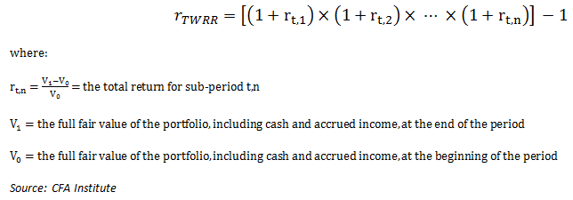

## Table of Contents

## What is the Time-weighted Rate of Return (TWRR)?

The Time-weighted Rate of Return (TWRR) is a way to measure how well an investment is doing over time. It looks at the performance of the investment without being affected by money being added or taken away. This makes it a good choice for figuring out how a portfolio manager is doing, because it shows the actual growth of the investment, no matter how much money is put in or taken out.

To calculate TWRR, you break the investment period into smaller parts, usually whenever money is added or withdrawn. You then find the return for each part and multiply these returns together. This method gives a clear picture of the investment's performance over time, making it easier to compare with other investments or benchmarks. It's especially useful for investors who want to see how their portfolio is growing, without the influence of their own deposits or withdrawals.

## How does TWRR differ from other return calculation methods like Money-weighted Rate of Return (MWRR)?

TWRR and MWRR are two ways to figure out how well an investment is doing, but they look at things differently. TWRR, or Time-weighted Rate of Return, focuses on the actual growth of the investment over time. It breaks the investment period into smaller parts, usually when money is added or taken out, and then calculates the return for each part. By doing this, TWRR shows how the investment itself is performing, without being affected by the amounts of money that are put in or taken out. This makes TWRR great for comparing the performance of different investments or seeing how a portfolio manager is doing.

On the other hand, MWRR, or Money-weighted Rate of Return, takes into account the timing and amount of money that is added to or taken out of the investment. It's like an average return that considers how much money you have in the investment at different times. If you put in a lot of money just before the investment goes up, MWRR will show a higher return because you had more money in at that time. This makes MWRR more personal to the investor, as it reflects their specific cash flows. It's useful for understanding the overall return on the money you've actually invested.

In simple terms, TWRR is about the investment's performance, while MWRR is about your personal return based on when and how much you invested. If you want to see how well the investment is doing without your actions affecting the result, go with TWRR. If you want to know how your specific investments and withdrawals have impacted your returns, MWRR is the way to go.

## Why is TWRR important for evaluating investment performance?

TWRR, or Time-weighted Rate of Return, is important for evaluating investment performance because it gives a clear picture of how the investment itself is doing over time. It doesn't get affected by when or how much money you put in or take out. This makes it really useful if you want to see how well the investment is growing, no matter what you do with your money. For example, if you're trying to figure out how good a fund manager is at picking investments, TWRR helps because it shows the actual growth of the investments they manage.

Another reason TWRR is important is that it lets you compare different investments or even different periods of time easily. Because it ignores your personal money moves, you can see how one investment stacks up against another without worrying about how your deposits or withdrawals might skew the results. This makes TWRR a great tool for investors who want to make fair comparisons and get a true sense of an investment's performance.

## How do you calculate TWRR for a single period?

To calculate TWRR for a single period, you first need to find the ending value of your investment and the beginning value. The TWRR for that period is then figured out by dividing the ending value by the beginning value and subtracting 1. This gives you the growth rate of your investment over that single period. For example, if your investment started at $100 and ended at $110, the TWRR would be ($110 / $100) - 1 = 0.10 or 10%.

In real life, things like adding or taking out money can break up a single period into smaller parts. But if you're just looking at one period without any money moving in or out, it's pretty straightforward. You just use the formula above to see how much your investment grew over that time. This simple calculation helps you understand the performance of your investment without any outside influences.

## What steps are involved in calculating TWRR for multiple periods?

To calculate TWRR for multiple periods, you first need to break down the investment's timeline into smaller parts, usually when money is added or taken out. For each of these periods, you calculate the return by dividing the ending value by the beginning value and subtracting 1. This gives you the growth rate for that specific period. You do this for every period you have, keeping track of each individual return.

Once you have the returns for each period, you link them together to find the overall TWRR. You do this by taking each return and adding 1 to it, then multiplying all these numbers together. After you've multiplied them, you subtract 1 from the result to get the final TWRR. This way, you can see how your investment has grown over time, without it being affected by your deposits or withdrawals.

## Can you explain the concept of sub-periods in TWRR calculation?

Sub-periods in TWRR calculation are like breaking a long trip into smaller parts. When you're figuring out the TWRR, you look at the time between any time money is added or taken out of your investment. These parts are called sub-periods. Each sub-period starts when money is added or taken out and ends when money is added or taken out again. You calculate the return for each of these sub-periods separately.

After you find the return for each sub-period, you put them all together to get the overall TWRR. You do this by adding 1 to each return, then multiplying all those numbers together. Once you've multiplied them, you subtract 1 to get the final TWRR. This way, you can see how well your investment did over the whole time, without it being affected by your deposits or withdrawals.

## How does TWRR handle external cash flows?

TWRR, or Time-weighted Rate of Return, is a way to measure how well an investment is doing over time. It's special because it doesn't let money being added or taken out affect the results. When you calculate TWRR, you break the time into smaller parts called sub-periods. Each sub-period starts and ends when money is added or taken out. You find out how much the investment grew during each sub-period, and then you put all those growth rates together to get the overall TWRR.

This method is great because it shows the true performance of the investment, no matter what you do with your money. If you put in a lot of money right before the investment goes up, or take out money right before it goes down, it won't change the TWRR. This makes TWRR perfect for comparing different investments or seeing how well a fund manager is doing, because it focuses on the investment's growth, not on your money moves.

## What are the advantages of using TWRR for investment portfolios?

TWRR, or Time-weighted Rate of Return, is really useful for looking at how well an investment portfolio is doing. It's great because it doesn't let the money you put in or take out affect the results. This means you can see how the investment itself is growing, no matter what you do with your money. For example, if you add a lot of money just before the investment goes up, or take some out right before it goes down, TWRR won't change. This makes it easy to compare different investments or see how well a fund manager is doing, because it shows the true performance of the investments they manage.

Another advantage of TWRR is that it's perfect for looking at performance over long periods of time. When you break the time into smaller parts, called sub-periods, you can see how the investment did during each part. By putting all these parts together, you get a clear picture of how the investment grew over the whole time. This method helps you understand how the investment is doing without being confused by your own money moves. It's a fair way to see how your portfolio is performing and makes it easier to make smart choices about your investments.

## In what scenarios might TWRR be less effective or misleading?

TWRR might be less effective or even misleading if you're trying to see how your own money decisions affect your investment returns. Since TWRR doesn't take into account when or how much money you put in or take out, it won't show you the personal impact of your cash flows. For example, if you add a lot of money right before the investment goes down, TWRR won't show that your timing was bad. It just shows how the investment itself did, not how your choices affected your returns.

Another scenario where TWRR might not be the best choice is when you're looking at investments with very few or no cash flows. If there are no sub-periods because you didn't add or take out any money, TWRR is the same as the simple return calculation. In this case, using TWRR doesn't give you any extra information or benefits over other methods. So, if you're looking at a very simple investment without any money moving in or out, TWRR might not be the most useful tool for you.

## How can TWRR be used to compare the performance of different investment managers?

TWRR is a great way to compare how well different investment managers are doing because it looks at the growth of the investments they manage, without letting the money that's added or taken out affect the results. If you want to see which manager is picking better investments, TWRR helps you do that. It breaks the time into smaller parts, called sub-periods, and calculates the return for each part. By putting all these returns together, you can see how the investments grew over time, no matter when or how much money was moved in or out.

This makes TWRR fair for comparing managers because it focuses on the performance of the investments themselves. If one manager's portfolio grows more than another's, even if they had different amounts of money added or taken out, TWRR will show that. This way, you can tell which manager is doing a better job at growing the investments, without your own money moves getting in the way.

## What are the common software tools or platforms that support TWRR calculations?

Many software tools and platforms support TWRR calculations to help investors and financial professionals measure investment performance accurately. Some popular ones include Microsoft Excel, which is widely used because it's easy to use and flexible. You can set up formulas to calculate TWRR for different periods and link them together. Another common tool is Morningstar Direct, which is used by many financial advisors and institutions. It has features that automatically calculate TWRR, making it easier to compare different investments and see how they're doing over time.

Other platforms like Bloomberg Terminal and FactSet are also used a lot, especially in professional settings. They offer detailed financial data and tools for calculating TWRR, which helps in making informed investment decisions. For individual investors, there are also apps and online platforms like Personal Capital and Wealthfront that support TWRR calculations. These tools make it simple for anyone to track their investment performance without needing to know complex formulas.

## How does the Global Investment Performance Standards (GIPS) relate to TWRR?

The Global Investment Performance Standards (GIPS) are rules that help investment firms show their performance in a fair way. GIPS says that firms should use TWRR, or Time-weighted Rate of Return, to measure how well their investments are doing. This is because TWRR doesn't let the money that's added or taken out affect the results. It shows how the investments themselves are growing, which is important for comparing different firms or seeing how well a manager is doing.

Using TWRR helps make sure that everyone is following the same rules when they report their performance. This makes it easier for investors to trust the numbers and compare different investment options. By sticking to GIPS and using TWRR, firms can show their performance clearly and honestly, which helps build trust with their clients.

## What is the Understanding of Time-Weighted Rate of Return (TWRR)?

The Time-Weighted Rate of Return (TWRR) is a metric used to measure the compound rate of growth of an investment portfolio over a specified period, without the distortion caused by external cash flows such as deposits and withdrawals. This feature is critical because it isolates the investment's actual performance from the effects of cash movement, offering a more accurate insight into an investment manager's efficacy.

By segregating the measurement into distinct periods—each between significant cash flow events—TWRR calculates the return for each sub-period and then compounds these returns to reflect the overall performance. This approach allows for a precise assessment of how an investment strategy or asset manager performs independently of investor actions, which could skew traditional return metrics.

In [algorithmic trading](/wiki/algorithmic-trading), precision in results is crucial. Algorithms are designed and evaluated based on their ability to generate returns under specified conditions, and TWRR serves as an effective tool in this context. It ensures that the performance of a trading algorithm is analyzed based on the trading strategy itself, without being affected by the timing or magnitude of cash flows into and out of the trading account.

The calculation involves dividing the investment horizon into sub-periods, each starting with a cash flow event. The rate of return for each sub-period $HP_n$ is calculated as follows:

$$
HP_n = \frac{\text{Ending Value}_n - \text{Starting Value}_n + \text{Cash Flow}_n}{\text{Starting Value}_n}
$$

The overall TWRR is computed by compounding the returns of all sub-periods:

$$
TWR = (1 + HP_1) \times (1 + HP_2) \times \ldots \times (1 + HP_n) - 1
$$

By segmenting the portfolio into these intervals and assuming no cash flow occurs within each sub-period, TWRR reflects true performance, ideal for complex and high-frequency trading scenarios typical in algo trading.

Ultimately, TWRR is a powerful metric that provides a true-to-context measure of investment performance. It facilitates an accurate assessment by excluding the irregular influence of additional capital, thereby delivering a clearer view of how an investment portfolio or algorithmic trading strategy has performed purely based on market conditions and the investment decisions made.

## What is the Formula and Calculation of TWRR?

The Time-Weighted Rate of Return (TWRR) is a fundamental metric in evaluating the performance of investment portfolios, particularly important in eliminating the distorting effects of cash flows. The calculation of TWRR, while straightforward in concept, requires careful handling to ensure accuracy. The formula used for TWRR is structured as follows:

$$
\text{TWR} = \left[(1 + \text{HP1}) \times (1 + \text{HP2}) \times \ldots \times (1 + \text{HPn})\right] - 1
$$

Here, $\text{HPn}$ represents the return for each sub-period within the total assessment period. Each sub-period is defined by times when there are no additional capital inflows or outflows, thus necessitating a breakdown into intervals where each interval marks a period between cash flows.

### Step-by-Step Calculation:

**1. Define Sub-Periods:**  
Begin by identifying all points where cash is either added to or withdrawn from the portfolio. Each such event marks the end of a sub-period and the beginning of a new one.

**2. Calculate Sub-Period Returns:**  
For each sub-period, calculate the holding period return (HPn). It is typically calculated as:

$$
\text{HPn} = \left(\frac{\text{Ending Value} - \text{Beginning Value}}{\text{Beginning Value}}\right)
$$

The return should capture the performance of the investments excluding any external cash flows by valuing the portfolio just before and just after each cash movement. 

**3. Compound the Sub-Period Returns:**  
Multiply all the calculated holding period returns for the sub-periods as per the formula to assess the overall compounded growth of the portfolio:

$$
\text{Overall Return} = \left[(1 + \text{HP1}) \times (1 + \text{HP2}) \times \ldots \times (1 + \text{HPn})\right] - 1
$$

This approach compiles the returns in a manner that weeds out the impact of external cash events, focusing solely on the performance of the investment decisions themselves.

**4. Adjust for Cash Flows:**  
To ensure accurate portrayal of portfolio growth, every instance where the cash flow alters the portfolio needs a bifurcation into a new sub-period. This ensures that each sub-period reflects returns only from investment performance rather than newly injected or withdrawn capital.

### Importance of Cash Flow Sub-Periodization:

The principal reason for subdividing the timeline with each cash flow event is to prevent any misinterpretation of investment performance due to external cash deposits or withdrawals. By creating multiple segments, each evaluated independently, TWRR provides an unambiguous reflection of whether the portfolio itself is gaining value through the returns generated by investments as opposed to simply growing due to new inflows of cash.

This detailed treatment of cash flows ensures that the TWRR emerges as a robust measure of how effectively an investment strategy or algorithm performs over time, presenting investors and traders with the purified results of their investment activities.

## What is the difference between TWRR and Rate of Return (ROR)?

Time-Weighted Rate of Return (TWRR) and Rate of Return (ROR) are two distinct metrics used to evaluate investment performance, yet they serve different analytical purposes in the context of trading, particularly algorithmic trading.

TWRR is designed to measure the pure performance of an investment portfolio by isolating the effects of cash flows, i.e., contributions and withdrawals. This metric calculates the return for each sub-period between cash flows, compounding these sub-period returns to provide an overall measure of growth. The significance of TWRR lies in its ability to reflect the underlying growth attributable to investment decisions, thus eliminating the distortions introduced by investor-driven cash movements.

Compared to TWRR, ROR includes all cash flows, offering a perspective that encompasses the total change in portfolio value. It is defined as:

$$
ROR = \frac{\text{Ending Value} - \text{Beginning Value} + \text{Cash Flows}}{\text{Beginning Value}}
$$

While this can be useful for understanding the overall financial position and cash movements over a period, it can skew performance metrics where significant inflows or outflows occur. This makes ROR less suitable for precisely assessing the efficiency of an algorithmic trading strategy where input control and consistent capital deployment are factors.

In algorithmic trading, where precision and functional clarity are required, TWRR shines as it evaluates the algorithm's effectiveness independently of capital fluctuations. For instance, if an algorithm aims to achieve consistent monthly returns, TWRR facilitates a clear analysis by segmenting and compounding returns without cash flow-induced noise, enabling traders to assess the strategy's inherent trading prowess.

Conversely, consider a scenario with an algorithm predicting market movements over a year with varying capital allocations. Here, solely relying on ROR could misrepresent the algorithm's acumen if significant investments are deployed during particularly volatile periods based merely on cash availability rather than strategic positioning. 

This distinction is crucial in determining when to apply each metric. For performance attribution analysis or strategy evaluation in algorithmic portfolios, TWRR is preferred. In contrast, for a holistic view of financial condition, inclusive of strategic cash usage, ROR remains relevant. In essence, TWRR offers more nuanced insights for algorithmic traders when pure performance devoid of cash flow effects is required.

## References & Further Reading

[1]: Førsund, F.R. (2015). ["Investment Performance Measurement: Evaluating and Presenting Results"](https://link.springer.com/book/10.1007/978-1-4899-7519-5) CFA Institute Research Foundation.

[2]: Bacon, C.R. (2008). ["Practical Portfolio Performance Measurement and Attribution."](https://onlinelibrary.wiley.com/doi/book/10.1002/9781119206309) John Wiley & Sons.

[3]: Carver, R. (2019). ["Systematic Trading: A Unique New Method for Designing Trading and Investing Systems."](https://www.amazon.com/Systematic-Trading-designing-trading-investing/dp/0857194453) Harriman House Limited.

[4]: Grinold, R.C., & Kahn, R.N. (2000). ["Active Portfolio Management: A Quantitative Approach for Producing Superior Returns and Controlling Risk."](https://www.amazon.com/Active-Portfolio-Management-Quantitative-Controlling/dp/0070248826) McGraw-Hill.

[5]: Lo, A.W. (2017). ["Adaptive Markets: Financial Evolution at the Speed of Thought."](https://www.jstor.org/stable/45200293) Princeton University Press.