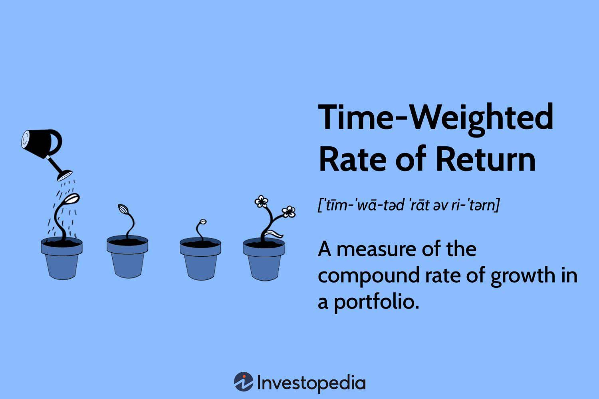

Algorithmic trading, often referred to as algo trading, is an intricate domain that intertwines financial expertise with technological sophistication. A fundamental element within this sphere is the measurement of investment performance, a crucial factor for traders and investors aiming to maximize returns and minimize risks. This measurement, however, is not straightforward due to the dynamic nature of financial markets and the varying cash flows within investment portfolios.

The Time-Weighted Rate of Return (TWRR) emerges as a pivotal metric in discussions about performance evaluation. TWRR is specifically designed to provide a clear depiction of an investment's growth trajectory by neutralizing the effects of capital inflows and outflows. This focus on intrinsic growth makes TWRR a valuable tool for assessing an investment manager's performance, irrespective of external cash movements.

As financial decisions increasingly rely on algorithmic processes, the precision and clarity provided by TWRR become indispensable. Unlike other metrics that might conflate performance with external financial activities, TWRR offers a cleaner perspective by isolating the impact of the investment strategy itself. This feature is particularly beneficial in algorithmic trading, where traders seek to refine strategies with pinpoint accuracy and systematic learning.

Through this article, the specifics surrounding TWRR will be explored, demonstrating its significance in algo trading and setting it against other commonly used performance metrics. Calculation methods will be outlined with step-by-step guidance to ensure clarity and facilitate understanding. Moreover, insights into the implementation and limitations of TWRR will be shared to equip traders and investors with the knowledge needed to leverage this metric effectively, thereby enhancing decision-making and strategic planning.

## Table of Contents

## Understanding Time-Weighted Rate of Return (TWRR)

The Time-Weighted Rate of Return (TWRR) is a metric used to measure the compound rate of growth of an investment portfolio over a specified period, without the distortion caused by external cash flows such as deposits and withdrawals. This feature is critical because it isolates the investment's actual performance from the effects of cash movement, offering a more accurate insight into an investment manager's efficacy.

By segregating the measurement into distinct periods—each between significant cash flow events—TWRR calculates the return for each sub-period and then compounds these returns to reflect the overall performance. This approach allows for a precise assessment of how an investment strategy or asset manager performs independently of investor actions, which could skew traditional return metrics.

In [algorithmic trading](/wiki/algorithmic-trading), precision in results is crucial. Algorithms are designed and evaluated based on their ability to generate returns under specified conditions, and TWRR serves as an effective tool in this context. It ensures that the performance of a trading algorithm is analyzed based on the trading strategy itself, without being affected by the timing or magnitude of cash flows into and out of the trading account.

The calculation involves dividing the investment horizon into sub-periods, each starting with a cash flow event. The rate of return for each sub-period $HP_n$ is calculated as follows:

$$
HP_n = \frac{\text{Ending Value}_n - \text{Starting Value}_n + \text{Cash Flow}_n}{\text{Starting Value}_n}
$$

The overall TWRR is computed by compounding the returns of all sub-periods:

$$
TWR = (1 + HP_1) \times (1 + HP_2) \times \ldots \times (1 + HP_n) - 1
$$

By segmenting the portfolio into these intervals and assuming no cash flow occurs within each sub-period, TWRR reflects true performance, ideal for complex and high-frequency trading scenarios typical in algo trading.

Ultimately, TWRR is a powerful metric that provides a true-to-context measure of investment performance. It facilitates an accurate assessment by excluding the irregular influence of additional capital, thereby delivering a clearer view of how an investment portfolio or algorithmic trading strategy has performed purely based on market conditions and the investment decisions made.

## Formula and Calculation of TWRR

The Time-Weighted Rate of Return (TWRR) is a fundamental metric in evaluating the performance of investment portfolios, particularly important in eliminating the distorting effects of cash flows. The calculation of TWRR, while straightforward in concept, requires careful handling to ensure accuracy. The formula used for TWRR is structured as follows:

$$
\text{TWR} = \left[(1 + \text{HP1}) \times (1 + \text{HP2}) \times \ldots \times (1 + \text{HPn})\right] - 1
$$

Here, $\text{HPn}$ represents the return for each sub-period within the total assessment period. Each sub-period is defined by times when there are no additional capital inflows or outflows, thus necessitating a breakdown into intervals where each interval marks a period between cash flows.

### Step-by-Step Calculation:

**1. Define Sub-Periods:**  
Begin by identifying all points where cash is either added to or withdrawn from the portfolio. Each such event marks the end of a sub-period and the beginning of a new one.

**2. Calculate Sub-Period Returns:**  
For each sub-period, calculate the holding period return (HPn). It is typically calculated as:

$$
\text{HPn} = \left(\frac{\text{Ending Value} - \text{Beginning Value}}{\text{Beginning Value}}\right)
$$

The return should capture the performance of the investments excluding any external cash flows by valuing the portfolio just before and just after each cash movement. 

**3. Compound the Sub-Period Returns:**  
Multiply all the calculated holding period returns for the sub-periods as per the formula to assess the overall compounded growth of the portfolio:

$$
\text{Overall Return} = \left[(1 + \text{HP1}) \times (1 + \text{HP2}) \times \ldots \times (1 + \text{HPn})\right] - 1
$$

This approach compiles the returns in a manner that weeds out the impact of external cash events, focusing solely on the performance of the investment decisions themselves.

**4. Adjust for Cash Flows:**  
To ensure accurate portrayal of portfolio growth, every instance where the cash flow alters the portfolio needs a bifurcation into a new sub-period. This ensures that each sub-period reflects returns only from investment performance rather than newly injected or withdrawn capital.

### Importance of Cash Flow Sub-Periodization:

The principal reason for subdividing the timeline with each cash flow event is to prevent any misinterpretation of investment performance due to external cash deposits or withdrawals. By creating multiple segments, each evaluated independently, TWRR provides an unambiguous reflection of whether the portfolio itself is gaining value through the returns generated by investments as opposed to simply growing due to new inflows of cash.

This detailed treatment of cash flows ensures that the TWRR emerges as a robust measure of how effectively an investment strategy or algorithm performs over time, presenting investors and traders with the purified results of their investment activities.

## TWRR in Algorithmic Trading

Algorithmic trading is highly dependent on precision, requiring metrics that reflect true performance devoid of external factors. Time-Weighted Rate of Return (TWRR) serves as an ideal metric in this context, as it focuses purely on the algorithm's capability to generate returns, isolated from the effects of cash inflows and outflows.

### Importance of TWRR in Assessing Algorithmic Performance

TWRR's primary advantage in algorithmic trading is its ability to evaluate the intrinsic performance of a trading strategy, independent of the amount of capital invested at different times. Traditional metrics like the simple Rate of Return (ROR) can be skewed by large cash inflows or outflows, which may not reflect the algorithm's true efficiency or skill. TWRR overcomes this by breaking down the investment period into smaller intervals, recalculating the return each time there is a cash movement. This approach allows traders to focus solely on the strategy's effectiveness.

In algorithmic trading, the separation of performance analysis from investment size is crucial. Algorithm developers and portfolio managers are often interested in the algorithms’ pure skill — how it performs given a fixed methodology, free from the noise introduced by cash movement or variations in capital deployment. TWRR provides this clarity by measuring only the returns due to price changes, aligning with the core objective of algorithmic evaluation.

### Examples of TWRR in Strategy Evaluation

Consider an algorithmic trading strategy operating in a volatile market. Suppose during a particularly successful trading period, a large sum of money is added to the investment portfolio. If one were to use a non-time-weighted metric, this influx of capital could distort the apparent performance of the trading strategy due to the weighted influence of the additional funds on overall returns. The TWRR neutralizes this effect, as it calculates returns in segments defined by cash inflows, thus maintaining a clear picture of the strategy’s performance based solely on market movements.

Moreover, in [backtesting](/wiki/backtesting) scenarios, where historical data is used to evaluate algorithmic strategies, TWRR can provide consistency in performance evaluation by ignoring biases introduced through hypothetical cash flows. Trading algorithms are often deployed in simulations to test their robustness and expected behavior under historical market conditions. By utilizing TWRR, testers can observe the genuine efficiency of the algorithm over these periods without artificial distortion from simulating cash impacts.

In summary, within algorithmic trading environments, the TWRR elucidates a more precise measure of trading performance by ignoring cash flow impacts and emphasizing the algorithm's actual market maneuvering skills. This focus on the strategy’s intrinsic [earning](/wiki/earning-announcement) potential makes TWRR indispensable for traders seeking to objectively assess and optimize their trading algorithms.

## TWRR versus Rate of Return (ROR)

Time-Weighted Rate of Return (TWRR) and Rate of Return (ROR) are two distinct metrics used to evaluate investment performance, yet they serve different analytical purposes in the context of trading, particularly algorithmic trading.

TWRR is designed to measure the pure performance of an investment portfolio by isolating the effects of cash flows, i.e., contributions and withdrawals. This metric calculates the return for each sub-period between cash flows, compounding these sub-period returns to provide an overall measure of growth. The significance of TWRR lies in its ability to reflect the underlying growth attributable to investment decisions, thus eliminating the distortions introduced by investor-driven cash movements.

Compared to TWRR, ROR includes all cash flows, offering a perspective that encompasses the total change in portfolio value. It is defined as:

$$
ROR = \frac{\text{Ending Value} - \text{Beginning Value} + \text{Cash Flows}}{\text{Beginning Value}}
$$

While this can be useful for understanding the overall financial position and cash movements over a period, it can skew performance metrics where significant inflows or outflows occur. This makes ROR less suitable for precisely assessing the efficiency of an algorithmic trading strategy where input control and consistent capital deployment are factors.

In algorithmic trading, where precision and functional clarity are required, TWRR shines as it evaluates the algorithm's effectiveness independently of capital fluctuations. For instance, if an algorithm aims to achieve consistent monthly returns, TWRR facilitates a clear analysis by segmenting and compounding returns without cash flow-induced noise, enabling traders to assess the strategy's inherent trading prowess.

Conversely, consider a scenario with an algorithm predicting market movements over a year with varying capital allocations. Here, solely relying on ROR could misrepresent the algorithm's acumen if significant investments are deployed during particularly volatile periods based merely on cash availability rather than strategic positioning. 

This distinction is crucial in determining when to apply each metric. For performance attribution analysis or strategy evaluation in algorithmic portfolios, TWRR is preferred. In contrast, for a holistic view of financial condition, inclusive of strategic cash usage, ROR remains relevant. In essence, TWRR offers more nuanced insights for algorithmic traders when pure performance devoid of cash flow effects is required.

## Limitations of TWRR

The Time-Weighted Rate of Return (TWRR) is a powerful tool for measuring investment performance, particularly useful in removing the distortions caused by cash inflows and outflows. However, it is not without its limitations. The primary challenge associated with TWRR involves the necessity for daily valuations whenever there are changes in cash flow. This requirement can make TWRR calculations cumbersome, especially in highly active portfolios where cash movements are frequent.

Consider an algorithmic trading strategy that involves multiple transactions within a short period. Each transaction can cause a shift in the cash balance, necessitating the recalculation of returns for each sub-period. This means that traders must meticulously track and calculate the TWRR for every time segment, which can become labor-intensive and time-consuming. The administrative burden increases as the number of transactions and cash flow changes intensifies, potentially diverting resources away from other critical trading activities.

In light of these challenges, alternative measures such as Money-Weighted Returns (MWR), also known as the Internal Rate of Return (IRR), offer practical solutions. Unlike TWRR, MWR takes into account the timing and magnitude of cash flows, providing an integrated performance metric that reflects the investor's actual experiences over the investment period. The MWR is calculated by solving for the [interest rate](/wiki/interest-rate-trading-strategies) that equates the present value of cash inflows with the present value of cash outflows. This can often be more aligned with the investor's perspective, as it considers the capital employed at different points in time.

While MWR can simplify calculations in portfolios with high cash flow activities, it may introduce its own set of biases by considering the size and timing of cash flows, thus reflecting decisions at an investment level rather than the manager's performance. Therefore, the choice between TWRR and MWR largely depends on the specific context and goals of the analysis. In some scenarios, it may be beneficial to use both measures in tandem to gain a more comprehensive understanding of a portfolio's performance.

## Conclusion

The Time-Weighted Rate of Return (TWRR) is an essential tool in evaluating investment performance, particularly in algorithmic trading. By isolating the growth rate of a portfolio from the influence of extraneous cash flows, it provides a clearer perspective of a trading strategy's effectiveness. TWRR achieves this by segmenting the overall return into discrete intervals, counteracting the distorting influence of deposits and withdrawals. 

Mastering the calculation of TWRR empowers traders to make more informed decisions, supported by precise and consistent data. This precision is invaluable in algorithmic trading, where the need to differentiate true performance from the background noise of cash movements is critical. It protects against misinterpretations that could arise from changes in the capital due to investor actions rather than investment performance.

However, while TWRR offers significant insights, it's most beneficial when used in conjunction with other performance metrics. By integrating TWRR with various measures, such as Money-Weighted Returns or the simple Rate of Return, investors gain a more comprehensive view of their strategies' success. This holistic approach helps in identifying strengths and weaknesses of different strategies, enabling a balanced and robust investment decision-making process.

## References & Further Reading

[1]: Førsund, F.R. (2015). ["Investment Performance Measurement: Evaluating and Presenting Results"](https://link.springer.com/book/10.1007/978-1-4899-7519-5) CFA Institute Research Foundation.

[2]: Bacon, C.R. (2008). ["Practical Portfolio Performance Measurement and Attribution."](https://onlinelibrary.wiley.com/doi/book/10.1002/9781119206309) John Wiley & Sons.

[3]: Carver, R. (2019). ["Systematic Trading: A Unique New Method for Designing Trading and Investing Systems."](https://www.amazon.com/Systematic-Trading-designing-trading-investing/dp/0857194453) Harriman House Limited.

[4]: Grinold, R.C., & Kahn, R.N. (2000). ["Active Portfolio Management: A Quantitative Approach for Producing Superior Returns and Controlling Risk."](https://www.amazon.com/Active-Portfolio-Management-Quantitative-Controlling/dp/0070248826) McGraw-Hill.

[5]: Lo, A.W. (2017). ["Adaptive Markets: Financial Evolution at the Speed of Thought."](https://www.jstor.org/stable/45200293) Princeton University Press.