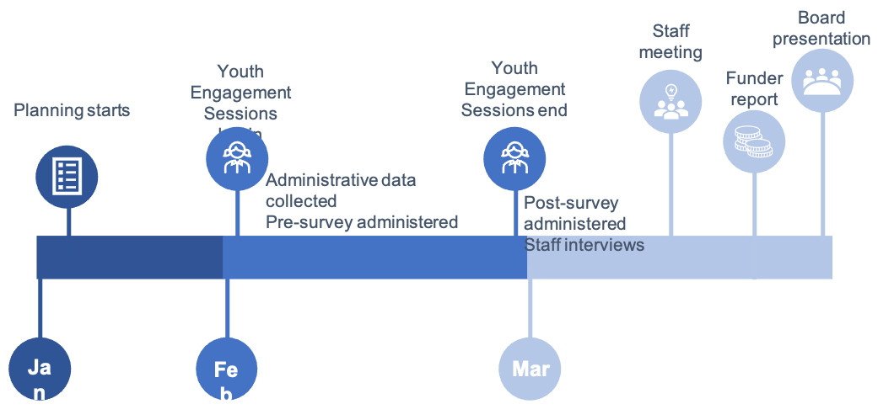

## Table of Contents

## What is timeliness in the context of evaluation?

Timeliness in the context of evaluation refers to how quickly and appropriately information is gathered, analyzed, and reported. It's about making sure that the evaluation results are available when they are needed, so that decisions can be made on time. For example, if a school wants to know if a new teaching method is working, the evaluation needs to be done quickly enough to help decide whether to keep using the method or try something different.

Being timely is important because it helps keep evaluations useful and relevant. If the results come too late, they might not be helpful anymore. Imagine a business waiting for feedback on a new product; if the evaluation takes too long, the business might miss the chance to improve the product before it's too late. So, timeliness makes sure that the information from evaluations can be used effectively to make good decisions.

## Why is timeliness important in evaluation processes?

Timeliness is important in evaluation processes because it makes sure that the information we get is useful when we need it. If we are evaluating something, like a new way of teaching or a new product, we want to know if it's working well soon enough to make changes or decisions. If the evaluation takes too long, the information might come too late to be helpful. For example, if a school waits too long to find out if a new teaching method is working, they might keep using a method that isn't helping students.

Also, being timely helps keep the evaluation relevant. Things can change quickly, and if our evaluation results are not timely, they might not match the current situation. Imagine a business that wants to improve a product based on customer feedback. If the evaluation of the feedback takes too long, the business might miss the chance to make the product better before customers lose interest. So, timeliness in evaluations helps us make good decisions at the right time.

## How does timeliness affect the accuracy of evaluations?

Timeliness can affect the accuracy of evaluations in a few ways. If an evaluation is done too late, the information it provides might not be accurate anymore because things can change over time. For example, if a school waits too long to evaluate a new teaching method, the results might not show how well it worked when it was first used. The students and the teaching situation might have changed, so the evaluation might not give a true picture of the method's effectiveness.

On the other hand, rushing an evaluation to be timely can also affect its accuracy. If evaluators are in a hurry, they might not take the time to gather all the necessary data or analyze it carefully. This can lead to mistakes or missing important details. For example, if a business quickly evaluates customer feedback on a new product without checking all the responses, they might make decisions based on incomplete information. So, it's important to find a balance between being timely and being thorough to make sure evaluations are accurate.

## What are the common methodologies used to assess timeliness in evaluations?

To assess timeliness in evaluations, one common method is to set clear deadlines and milestones from the start. This helps everyone involved know when things need to be done. Evaluators can then check if these deadlines are met. If the evaluation results are ready on time, it shows good timeliness. If not, it might mean there are delays that need to be fixed.

Another method is to use tracking and monitoring tools. These tools help keep an eye on the progress of the evaluation. They can show if the evaluation is moving at the right pace. By regularly checking these tools, evaluators can make sure the evaluation stays on track and meets its deadlines. This helps make sure the results are timely and useful.

Sometimes, feedback from those who use the evaluation results is also used to assess timeliness. If people say the results came too late to be helpful, it shows there might be a problem with timeliness. On the other hand, if people find the results timely and useful, it means the evaluation process is working well. This feedback helps evaluators know if they need to speed up their process or if they are doing well.

## Can you explain the difference between timeliness and efficiency in evaluations?

Timeliness in evaluations means getting the results when they are needed. It's about making sure the information is available on time so that people can use it to make decisions. For example, if a school is trying out a new way of teaching, they need to know if it's working soon enough to decide whether to keep using it or try something else. If the evaluation takes too long, the results might not be helpful anymore.

Efficiency in evaluations is about doing the work in the best way possible, without wasting time or resources. It means using smart methods to gather and analyze information quickly and correctly. For example, a business might use a survey to get feedback on a new product. If they can design the survey to be short and easy to understand, they can get the information they need more efficiently. Efficiency helps make sure the evaluation is done well, but it's different from timeliness because it focuses on how the work is done, not just when the results are ready.

So, timeliness is about when the evaluation results are available, and efficiency is about how well the evaluation process is carried out. Both are important, but they focus on different things. Timeliness makes sure the results are useful when needed, while efficiency makes sure the process of getting those results is done in the best way possible.

## What tools or technologies can be used to improve timeliness in evaluations?

One tool that can help improve timeliness in evaluations is a project management software. These programs, like Trello or Asana, let you plan out all the steps of the evaluation and set deadlines for each part. This way, everyone knows what needs to be done and when. The software can also send reminders and show progress, so it's easier to stay on track and make sure the evaluation is finished on time.

Another helpful technology is data collection tools, like online surveys or mobile apps. These tools can gather information quickly from a lot of people. For example, if a school wants to know what students think about a new teaching method, they can use an online survey to get feedback fast. This speeds up the data collection part of the evaluation, which helps get the results sooner.

Lastly, data analysis software, like SPSS or Excel, can also make evaluations more timely. These programs help analyze the information collected faster and more accurately. Instead of spending a lot of time going through data by hand, evaluators can use these tools to find patterns and results quickly. This means the evaluation can be finished and the results shared sooner, making the whole process more timely.

## How do different industries measure and prioritize timeliness in their evaluation processes?

In the healthcare industry, timeliness is very important because it can affect patient care. Hospitals and clinics measure timeliness by looking at how quickly they can evaluate new treatments or procedures. They want to know if a new medicine is working as soon as possible to help patients. They might use electronic health records to gather data quickly and analyze it with software to get results faster. Timeliness is a top priority because it can mean the difference between helping a patient or not. If a new treatment is found to be effective, doctors can start using it right away to improve patient outcomes.

In the business world, companies measure timeliness by how fast they can evaluate products or services. They often use customer feedback surveys to gather information quickly. Businesses want to know if their product is good or if it needs changes before it's too late. They might use project management tools to keep track of the evaluation process and make sure it's done on time. Timeliness is important because it helps businesses stay competitive. If they can quickly find out what customers like or don't like, they can make improvements and keep their customers happy.

In the education sector, schools and universities measure timeliness by how soon they can evaluate new teaching methods or programs. They use tools like online surveys to get feedback from students and teachers quickly. Schools want to know if a new way of teaching is helping students learn better as soon as possible. They might use data analysis software to look at the results fast. Timeliness is a priority because it helps schools make quick changes to improve education. If a new method isn't working, they can switch to something else before it affects students' learning too much.

## What are the challenges faced when trying to maintain timeliness in large-scale evaluations?

When trying to keep large-scale evaluations timely, one big challenge is dealing with a lot of data. Large evaluations often involve collecting information from many people or places, which takes time. It can be hard to gather all this data quickly and make sure it's correct. Once the data is collected, analyzing it can also take a long time, especially if there's a lot of it. If the evaluation team doesn't have the right tools or enough people to help, it can slow things down even more. So, having enough resources and the right technology is important to keep things moving fast.

Another challenge is coordinating everyone involved in the evaluation. In large-scale projects, many different people or groups might be working together. Keeping everyone on the same page and making sure they meet their deadlines can be tough. Communication problems or disagreements can cause delays. Also, if the evaluation covers a wide area or many different locations, it can be harder to manage and keep everything on track. Good planning and clear communication are key to making sure the evaluation stays timely, but it's not always easy to get right.

## How can timeliness be integrated into the design of an evaluation framework?

To make sure an evaluation is timely, it's important to think about timeliness right from the start when designing the evaluation framework. This means setting clear deadlines for each part of the evaluation, like when to collect data, analyze it, and share the results. Using project management tools can help keep track of these deadlines and make sure everyone knows what they need to do and when. It's also a good idea to plan for any possible delays by building in extra time or having backup plans. This way, if something goes wrong, the evaluation can still stay on track and be finished on time.

Another way to make sure the evaluation stays timely is by choosing the right tools and methods for gathering and analyzing data. Using online surveys or mobile apps can help collect information quickly from a lot of people. Data analysis software can also help process the information faster and more accurately. By picking the right tools, the evaluation can move along more smoothly and get results out when they're needed. This helps make sure the evaluation is useful and relevant, so people can make decisions based on the results without waiting too long.

## What are the best practices for reporting on timeliness in evaluation outcomes?

When reporting on timeliness in evaluation outcomes, it's important to clearly show how long each part of the evaluation took and if the results were ready on time. Start by explaining the deadlines that were set at the beginning of the evaluation. Then, compare these deadlines to when things were actually finished. If the evaluation was on time, say so and explain how this helped make the results useful. If there were delays, be honest about them and talk about why they happened and what was done to fix them. This helps everyone understand how well the evaluation process worked and if the results can be trusted.

It's also helpful to use simple charts or graphs to show the timeline of the evaluation. This makes it easy for people to see at a glance if everything was done on time. Include any feedback from people who used the evaluation results to show if the timeliness made a difference. For example, if a school found out quickly that a new teaching method was working, they could start using it right away to help students. By reporting on timeliness clearly and honestly, you help make sure the evaluation is seen as reliable and useful.

## How does the concept of timeliness evolve with advancements in data analytics and real-time processing?

The concept of timeliness in evaluations has changed a lot because of new data analytics and real-time processing. Before, evaluations took a long time because people had to gather and analyze data by hand. Now, with new technology, data can be collected and analyzed much faster. Real-time processing means that information can be looked at as soon as it comes in, so evaluations can give results almost right away. This is really helpful for things like checking how well a new product is doing or if a new way of teaching is working. It means decisions can be made quicker, which can make a big difference.

But even with these new tools, keeping evaluations timely can still be hard. There's so much data now that it can be tricky to make sure it's all correct and useful. Also, the technology needs to be used the right way to really help with timeliness. If it's not set up well, it might not make things faster. So, while data analytics and real-time processing can make evaluations more timely, it's important to use them smartly and make sure they're helping to get the right results at the right time.

## Can you discuss case studies where timeliness significantly impacted the outcome of evaluations?

In one case, a school district wanted to try a new way of teaching reading. They used an online survey to quickly get feedback from students and teachers. Because the evaluation was done fast, they found out within a few weeks that the new method was helping students read better. The school district could then start using the new method in all their schools right away. If the evaluation had taken longer, they might have missed the chance to help more students improve their reading skills that year.

Another case happened in a business that was launching a new product. They used real-time data analytics to quickly gather and analyze customer feedback. This let them see within days that customers were having trouble using the product. The business was able to fix the problem and make the product better before too many customers got frustrated and stopped using it. If they had waited longer to evaluate the product, they might have lost a lot of customers and hurt their sales.

## What are the key metrics for evaluating algorithmic trading performance?

In assessing the effectiveness of algorithmic trading strategies, several key metrics are employed that provide insights into both performance and risk management capabilities. These metrics are indispensable tools for evaluating the practical outcomes of trading algorithms in real market conditions.

1. **Financial Viability**: This metric primarily involves the analysis of the return on investment (ROI) yielded by a trading algorithm. ROI is calculated as:
$$
   \text{ROI} = \frac{\text{Net Profit}}{\text{Initial Investment}} \times 100

$$

   A positive ROI indicates that the algorithm is generating profits beyond the initial capital invested, thus proving its viability as a trading strategy.

2. **Sharpe Ratio**: This metric evaluates risk-adjusted returns, offering insights into how well an algorithm compensates investors for the risk undertaken. The Sharpe Ratio is computed as:
$$
   \text{Sharpe Ratio} = \frac{R_a - R_f}{\sigma_a}

$$

   where $R_a$ is the algorithm’s average return, $R_f$ is the risk-free rate, and $\sigma_a$ is the standard deviation of the algorithm’s return. A higher Sharpe Ratio indicates more efficient generation of returns per unit of risk.

3. **Winning Percentage**: This metric examines the proportion of successful trades executed by the algorithm, providing a direct measure of its success rate. It is calculated by:
$$
   \text{Winning Percentage} = \left(\frac{\text{Number of Profitable Trades}}{\text{Total Number of Trades}}\right) \times 100

$$

   A higher winning percentage signifies a greater frequency of profitable trades, reflecting the algorithm’s competence in identifying favorable market conditions.

4. **Maximum Drawdown**: This is a crucial metric for understanding the potential financial downturns an algorithmic strategy might endure. It represents the largest peak-to-trough decline experienced during a trading period and is expressed as a percentage. Lower maximum drawdown values indicate stronger resilience against market volatility and effective risk management.

5. **Volatility Metrics**: Evaluating the algorithm’s exposure to market fluctuations is essential for maintaining a balanced risk-return profile. Standard deviation is often used to measure this volatility, with algorithms showing lower standard deviations being preferred for their stability.

Incorporating these metrics can aid traders and investors in refining their algorithmic strategies, ensuring that they not only pursue profitable opportunities but also manage associated risks effectively. Using Python, one might employ libraries such as NumPy and pandas to perform these calculations and automate the monitoring of these performance indicators in a trading system:

```python
import numpy as np
import pandas as pd

def calculate_metrics(trades):
    roi = (trades['net_profit'].sum() / trades['initial_invest'].sum()) * 100
    annual_return = trades['returns'].mean() * 252  # Assuming daily returns
    risk_free_rate = 0.01  # Example risk-free rate
    sharpe_ratio = (annual_return - risk_free_rate) / trades['returns'].std()
    winning_percentage = (trades[trades['net_profit'] > 0].shape[0] / trades.shape[0]) * 100
    max_drawdown = trades['net_profit'].min() / trades['net_profit'].max() * 100
    volatility = trades['returns'].std() * np.sqrt(252)

    return roi, sharpe_ratio, winning_percentage, max_drawdown, volatility
```

By leveraging these calculations, traders can continuously evaluate the performance of their algorithms, making necessary adjustments to improve both profitability and resilience against market changes.

## References & Further Reading

[1]: Bergstra, J., Bardenet, R., Bengio, Y., & Kégl, B. (2011). ["Algorithms for Hyper-Parameter Optimization."](https://dl.acm.org/doi/10.5555/2986459.2986743) Advances in Neural Information Processing Systems 24.

[2]: ["Advances in Financial Machine Learning"](https://www.amazon.com/Advances-Financial-Machine-Learning-Marcos/dp/1119482089) by Marcos Lopez de Prado

[3]: ["Evidence-Based Technical Analysis: Applying the Scientific Method and Statistical Inference to Trading Signals"](https://www.amazon.com/Evidence-Based-Technical-Analysis-Scientific-Statistical/dp/0470008741) by David Aronson

[4]: ["Machine Learning for Algorithmic Trading"](https://github.com/stefan-jansen/machine-learning-for-trading) by Stefan Jansen

[5]: ["Quantitative Trading: How to Build Your Own Algorithmic Trading Business"](https://www.amazon.com/Quantitative-Trading-Build-Algorithmic-Business/dp/1119800064) by Ernest P. Chan