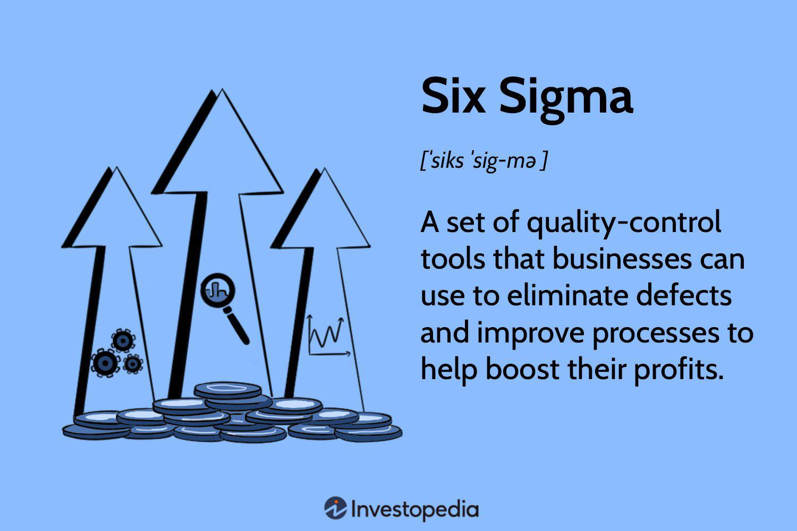

In the ever-evolving landscape of financial markets, algorithmic trading has emerged as a powerful tool for investors and traders seeking precision and efficiency. By leveraging advanced computational models and high-frequency data, algorithmic trading strategies can execute trades at speeds and accuracies that are unattainable through manual methods. Central to the achievement of these strategies is the concept of timeliness evaluation along with rating methodologies. Timeliness evaluation relates to the ability of trading algorithms to process and respond to market data rapidly, enabling traders to make well-informed decisions in real-time. Rating methodologies, on the other hand, provide a framework for assessing stock performance predictions, allowing algorithms to prioritize trades based on potential future gains. By integrating these elements, algorithmic traders can optimize decision-making processes and improve outcomes in financial markets.

## Table of Contents



## Understanding Timeliness in Algo Trading

Timeliness in algorithmic trading refers to the swift acquisition and analysis of financial data to enable effective trading decisions. At its core, this concept involves ranking stocks based on predicted price performance, drawing on a vast array of historical data and anticipated future movements. The aim is to provide investors and traders with insights that can influence their buy or sell strategies, optimizing the timing of transactions to achieve better financial outcomes.

The principle of timeliness in trading is grounded in stock analysis rating systems. These systems evaluate a stock's potential by examining factors such as past performance trends, future earnings forecasts, and market sentiment. This information is crucial for creating algorithms that respond to market changes with speed and precision. For instance, if a stock has displayed a consistent upward trajectory, an algorithm may prioritize this stock for purchase when conditions align.

To illustrate, consider a scenario where an algorithm evaluates a stock's 10-day moving average against its 50-day moving average. If the short-term average exceeds the long-term average, the algorithm might generate a buy signal, assuming an upward trend. This kind of analysis uses historical data to predict short-term trends, which is essential for making timely trades.

Timeliness also encompasses the capability of the trading system to adapt quickly to new information. This includes the processing of news updates, financial reports, and real-time price changes. Advanced algorithms can parse through vast data streams from various sources, allowing them to update their evaluations and recommendations in a matter of milliseconds.

Python is often employed to implement these algorithms due to its robust data handling libraries, such as pandas and numpy. Here's a simple example of a Python script that could be used to compute a moving average crossover strategy:

```python
import pandas as pd

# Fetch stock data (using hypothetical function)
# stock_data would be a DataFrame with Date as index and 'Close' prices
stock_data = fetch_stock_data('ticker')

# Calculate moving averages
stock_data['Short_MA'] = stock_data['Close'].rolling(window=10).mean()
stock_data['Long_MA'] = stock_data['Close'].rolling(window=50).mean()

# Determine buy/sell signals
stock_data['Signal'] = 0
stock_data['Signal'][10:] = np.where(
    stock_data['Short_MA'][10:] > stock_data['Long_MA'][10:], 1, -1
)

# Calculate positions
stock_data['Position'] = stock_data['Signal'].diff()
```

In this script, the cross of the short-term and long-term moving averages is used as a signal to buy (1) or sell (-1) a stock. The effectiveness of such strategies depends heavily on the timeliness of the data processed and the algorithm's ability to react instantly to market shifts.

Overall, timeliness plays an integral role in refining decision-making algorithms, striving to ensure they are not only proactive but also reactive to the ever-changing dynamics of the financial markets.

## Timeliness Ratings Methodology

Timeliness ratings are a crucial component of [algorithmic trading](/wiki/algorithmic-trading), calculated using proprietary models designed to evaluate a range of elements. These models primarily focus on historical price performance, earnings data, and market [volatility](/wiki/volatility-trading-strategies) to forecast future stock movements with greater accuracy. The Value Line timeliness rating system exemplifies such models by assessing a decade-long trend in relative earnings, prices, and recent changes in these parameters. This systematic approach allows for the categorization and ranking of stocks based on anticipated performance, providing invaluable data for refining trading algorithms.

Algorithmic trading practitioners capitalize on these methodologies by integrating them into predictive models, thereby enhancing their capacity to generate optimal trading decisions. Key elements typically evaluated within these models include:

1. **Historical Price Performance**: Analysis of historical price trends offers insights into stock behavior over time, allowing algorithms to identify patterns and possible future movements.

2. **Earnings Data**: Earnings trends and recent earnings reports play a significant role in shaping timeliness ratings. They are indicative of a company's financial health and often correlate with stock performance.

3. **Market Volatility**: Volatility is a critical factor in financial markets. High volatility can lead to significant price swings, while stable markets might indicate more predictable trends. Understanding these dynamics enables more precise forecasting.

A practical example of employing these metrics in algorithmic trading is through a simplified Python code snippet that calculates a basic timeliness score:

```python
def calculate_timeliness_score(price_data, earnings_data):
    price_change = (price_data[-1] - price_data[0]) / price_data[0]
    earnings_change = (earnings_data[-1] - earnings_data[0]) / earnings_data[0]
    volatility = np.std(price_data) / np.mean(price_data)

    timeliness_score = (price_change * 0.4) + (earnings_change * 0.3) - (volatility * 0.3)
    return timeliness_score

# Example usage:
price_data = [150, 155, 160, 158, 162]  # Historical price data
earnings_data = [3.5, 3.7, 3.8, 3.9, 4.0]  # Historical earnings data

score = calculate_timeliness_score(price_data, earnings_data)
print("Timeliness Score:", score)
```

This code snippet calculates a timeliness score using a weighted average of price and earnings changes while accounting for market volatility. Such computational methods allow traders to systematically refine their predictions, leading to enhanced trading outcomes. By incorporating timeliness ratings into algorithmic models, investors increase their ability to capitalize on informed insights, thus driving better investment decisions.

## Key Metrics for Evaluating Algorithmic Trading Performance

In assessing the effectiveness of algorithmic trading strategies, several key metrics are employed that provide insights into both performance and risk management capabilities. These metrics are indispensable tools for evaluating the practical outcomes of trading algorithms in real market conditions.

1. **Financial Viability**: This metric primarily involves the analysis of the return on investment (ROI) yielded by a trading algorithm. ROI is calculated as:
$$
   \text{ROI} = \frac{\text{Net Profit}}{\text{Initial Investment}} \times 100

$$

   A positive ROI indicates that the algorithm is generating profits beyond the initial capital invested, thus proving its viability as a trading strategy.

2. **Sharpe Ratio**: This metric evaluates risk-adjusted returns, offering insights into how well an algorithm compensates investors for the risk undertaken. The Sharpe Ratio is computed as:
$$
   \text{Sharpe Ratio} = \frac{R_a - R_f}{\sigma_a}

$$

   where $R_a$ is the algorithm’s average return, $R_f$ is the risk-free rate, and $\sigma_a$ is the standard deviation of the algorithm’s return. A higher Sharpe Ratio indicates more efficient generation of returns per unit of risk.

3. **Winning Percentage**: This metric examines the proportion of successful trades executed by the algorithm, providing a direct measure of its success rate. It is calculated by:
$$
   \text{Winning Percentage} = \left(\frac{\text{Number of Profitable Trades}}{\text{Total Number of Trades}}\right) \times 100

$$

   A higher winning percentage signifies a greater frequency of profitable trades, reflecting the algorithm’s competence in identifying favorable market conditions.

4. **Maximum Drawdown**: This is a crucial metric for understanding the potential financial downturns an algorithmic strategy might endure. It represents the largest peak-to-trough decline experienced during a trading period and is expressed as a percentage. Lower maximum drawdown values indicate stronger resilience against market volatility and effective risk management.

5. **Volatility Metrics**: Evaluating the algorithm’s exposure to market fluctuations is essential for maintaining a balanced risk-return profile. Standard deviation is often used to measure this volatility, with algorithms showing lower standard deviations being preferred for their stability.

Incorporating these metrics can aid traders and investors in refining their algorithmic strategies, ensuring that they not only pursue profitable opportunities but also manage associated risks effectively. Using Python, one might employ libraries such as NumPy and pandas to perform these calculations and automate the monitoring of these performance indicators in a trading system:

```python
import numpy as np
import pandas as pd

def calculate_metrics(trades):
    roi = (trades['net_profit'].sum() / trades['initial_invest'].sum()) * 100
    annual_return = trades['returns'].mean() * 252  # Assuming daily returns
    risk_free_rate = 0.01  # Example risk-free rate
    sharpe_ratio = (annual_return - risk_free_rate) / trades['returns'].std()
    winning_percentage = (trades[trades['net_profit'] > 0].shape[0] / trades.shape[0]) * 100
    max_drawdown = trades['net_profit'].min() / trades['net_profit'].max() * 100
    volatility = trades['returns'].std() * np.sqrt(252)

    return roi, sharpe_ratio, winning_percentage, max_drawdown, volatility
```

By leveraging these calculations, traders can continuously evaluate the performance of their algorithms, making necessary adjustments to improve both profitability and resilience against market changes.

## Timeliness vs. Safety in Risk Management

In algorithmic trading, effective risk management is critical for long-term success. This involves striking a balance between the potential for gains and the protection against losses. To this end, the concepts of "timeliness" and "safety" ratings are integral.

Timeliness in trading refers to the speed and effectiveness with which an algorithm can process market data and initiate trades. An algorithm that capitalizes on timeliness is designed to react swiftly to market movements and seize opportunities before they dissipate. For example, a trading strategy might use moving averages or [momentum](/wiki/momentum) indicators to flag entry or [exit](/wiki/exit-strategy) points for trades, translating to the algorithm being "timely" in its market execution.

Contrasting this, safety ratings prioritize the stability and resilience of an asset. This evaluation considers factors such as historical volatility, the financial health of the issuing company, market conditions, and macroeconomic indicators. Safety ratings are essential for understanding the risk profile of an investment. They guide algorithms in selecting stocks or financial instruments that offer not only potential returns but also a certain level of risk mitigation.

When these two metrics are combined, they furnish a comprehensive framework for building robust trading strategies. The joint consideration of timeliness and safety helps in identifying opportunities that are not only timely but also reasonably secure. For instance, an algorithm could deploy a weighted scoring system where stocks are evaluated based on a combination of timeliness and safety metrics. Python pseudocode for such a system could be:

```python
def evaluate_stock(timeliness_score, safety_score, timeliness_weight=0.6, safety_weight=0.4):
    overall_score = (timeliness_score * timeliness_weight) + (safety_score * safety_weight)
    return overall_score

# Example usage
stock_timeliness = 8.5  # scale of 1 to 10
stock_safety = 7.0  # scale of 1 to 10

overall_rating = evaluate_stock(stock_timeliness, stock_safety)
print("Overall Stock Rating:", overall_rating)
```

In this example, the algorithm ensures that both factors contribute to the decision-making process. By assigning weights, traders can tailor strategies to align with their risk tolerance and market outlook. This method delivers a balanced approach, ensuring that the pursuit of high returns does not come at the expense of increased exposure to risk. Understanding and applying these paired evaluations of timeliness and safety can lead to a more informed and effective management of trading portfolios.

## Integrating Timeliness and Evaluation Metrics in Algo Trading Strategies

To optimize algorithmic trading systems, integrating timeliness ratings with key performance metrics is essential. Timeliness ratings offer predictive insights into market trends, facilitating informed decision-making aligned with current and expected market conditions. These ratings, when combined with performance metrics such as ROI, Sharpe Ratio, and volatility assessments, provide a comprehensive framework for evaluating and enhancing trading strategies.

In practice, integrating these elements requires a systematic approach. The timeliness rating acts as a leading indicator, guiding the timing of trade execution. For instance, if a stock receives a favorable timeliness rating, an algorithm can prioritize trades involving this stock, assuming other performance metrics corroborate its potential. The Sharpe Ratio further refines this process by assessing the risk-adjusted returns, ensuring that the algorithm not only targets high-return opportunities but also maintains a balanced risk profile.

Algorithmic systems can employ [machine learning](/wiki/machine-learning) models to automate the integration of these metrics. By feeding historical and real-time data into such models, it becomes possible to continuously adjust trading strategies. Below is a simple example using Python to highlight how machine learning might integrate timeliness ratings with other performance metrics:

```python
import numpy as np
from sklearn.ensemble import RandomForestRegressor

# Sample data
timeliness_ratings = np.array([1, 2, 3, 4, 5])  # Example ratings
roi = np.array([0.05, 0.07, 0.06, 0.09, 0.08])  # Example ROI
sharpe_ratio = np.array([1.2, 1.5, 1.3, 1.6, 1.4])  # Example Sharpe Ratios

# Features and target
X = np.column_stack((timeliness_ratings, roi, sharpe_ratio))
y = np.array([0.10, 0.12, 0.11, 0.14, 0.13])  # Target: possible future returns

# Model training
model = RandomForestRegressor()
model.fit(X, y)

# Prediction
new_data = np.array([[4, 0.09, 1.6]])  # New data point
predicted_return = model.predict(new_data)
print(f"Predicted Return: {predicted_return[0]}")
```

In this example, a RandomForestRegressor is trained on a dataset comprising timeliness ratings, ROI, and Sharpe Ratios to predict future returns. The model can help in evaluating whether the integrated metrics support a particular trading decision.

Furthermore, understanding the dynamic correlation between timeliness evaluation and volatility metrics ensures that algorithms are responsive to sudden market changes. By continuously [backtesting](/wiki/backtesting) and optimizing algorithms with historical data, traders can fine-tune this integration, ultimately achieving a robust strategy capable of effectively navigating market uncertainties and capitalizing on emerging opportunities.

## Conclusion

Timeliness evaluation concepts and rating methodologies are imperative for achieving success in algorithmic trading. These tools provide traders with predictive insights that help optimize trading strategies, mitigating risks associated with market fluctuations. The ability to rapidly process and analyze market data through timeliness ratings enhances traders' capacity for swift decision-making, resulting in efficient capital allocation and improved performance metrics.

By integrating these methodologies into algorithmic systems, market participants can balance potential rewards with inherent risks. This integration leads to more informed strategic decisions, enabling traders to harness profitable opportunities while managing exposure to adverse market conditions. Overall, an effective application of timeliness concepts and evaluative metrics offers a competitive edge, contributing to sustained success in the dynamic financial markets.

## References & Further Reading

[1]: Bergstra, J., Bardenet, R., Bengio, Y., & Kégl, B. (2011). ["Algorithms for Hyper-Parameter Optimization."](https://dl.acm.org/doi/10.5555/2986459.2986743) Advances in Neural Information Processing Systems 24.

[2]: ["Advances in Financial Machine Learning"](https://www.amazon.com/Advances-Financial-Machine-Learning-Marcos/dp/1119482089) by Marcos Lopez de Prado

[3]: ["Evidence-Based Technical Analysis: Applying the Scientific Method and Statistical Inference to Trading Signals"](https://www.amazon.com/Evidence-Based-Technical-Analysis-Scientific-Statistical/dp/0470008741) by David Aronson

[4]: ["Machine Learning for Algorithmic Trading"](https://github.com/stefan-jansen/machine-learning-for-trading) by Stefan Jansen

[5]: ["Quantitative Trading: How to Build Your Own Algorithmic Trading Business"](https://www.amazon.com/Quantitative-Trading-Build-Algorithmic-Business/dp/1119800064) by Ernest P. Chan