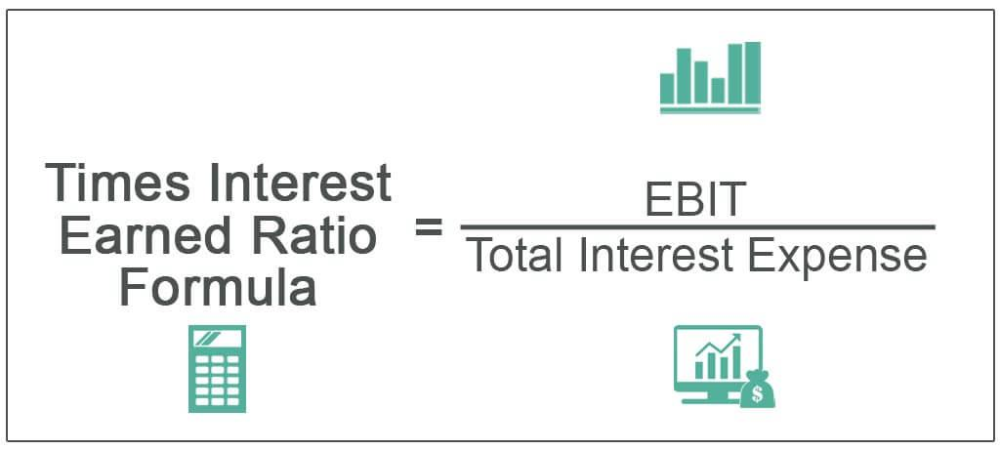

The Times Interest Earned (TIE) ratio is a crucial financial metric that assesses a company's capacity to meet its debt obligations, particularly interest payments on outstanding loans. It is calculated by dividing earnings before interest and taxes (EBIT) by the interest expense: 

$$
\text{TIE Ratio} = \frac{\text{EBIT}}{\text{Interest Expense}}
$$



This ratio is significant for evaluating a company's financial health as it provides insight into its ability to service its debt. A higher TIE ratio indicates a stronger capacity to meet interest obligations, signaling financial stability and lower risk to creditors and investors.

Financial metrics like the TIE ratio play an essential role in business finance. They provide quantitative measures of a company's performance, guiding decision-making and strategic planning. These metrics are instrumental for both internal stakeholders, such as management and employees, and external stakeholders, including investors, creditors, and regulators. Their ability to offer a snapshot of a company's financial health aids in the effective management of resources, risk assessment, and investment evaluation.

The intersection of TIE with algorithmic trading presents an intriguing development in financial analysis. Algorithmic trading, which involves using computer algorithms to execute trading strategies, relies heavily on real-time data and accurate financial metrics. Incorporating financial metrics like the TIE ratio into these trading algorithms can enhance the capability to assess the financial stability of companies, thereby influencing trading decisions and strategies. This integration is important as it enables the development of more sophisticated trading algorithms that can potentially improve returns by factoring in a company's financial health indicators.

The discussion will cover how the TIE ratio is integrated with algorithmic trading strategies, highlighting the process of incorporating TIE into trading models and the potential benefits. This exploration will include an examination of techniques for automating the assessment of TIE alongside other financial metrics and will delve into real-world examples where TIE has been effectively utilized in trading algorithms. By understanding the utility of TIE in financial analysis, stakeholders can appreciate its impact on trading actions or signals within algorithmic frameworks.

## Table of Contents

## Understanding the Times Interest Earned Ratio

The Times Interest Earned (TIE) ratio is a financial metric that provides insight into a company's ability to meet its debt obligations. Calculated by dividing a company’s earnings before interest and taxes (EBIT) by its interest expense, the TIE ratio is expressed as:

$$
\text{TIE Ratio} = \frac{\text{EBIT}}{\text{Interest Expense}}
$$

The significance of the TIE ratio lies in its ability to assess the financial risk associated with a company's debt levels. A higher TIE ratio indicates robust financial health, suggesting that the company generates sufficient earnings to cover its interest obligations multiple times over. For example, a TIE ratio of 5 implies that a company earns five times the interest expense it needs to pay, signaling financial stability and a lower risk for creditors and investors. Conversely, a low TIE ratio, particularly one below 1, suggests that a company may struggle to meet interest obligations, raising a red flag for potential insolvency risks.

Creditors and investors use the TIE ratio to evaluate the risk profile of lending to or investing in a company. A positive, high TIE ratio reassures creditors of prompt interest payments, potentially leading to favorable borrowing terms. Investors also see a high TIE as a sign of healthy operations and reduced [volatility](/wiki/volatility-trading-strategies) risk. In contrast, a negative or low TIE ratio may indicate profitability issues or excessive debt, influencing creditors to impose higher interest rates and deterring investors wary of financial instability.

Several factors can affect a company's TIE ratio. Profitability significantly impacts EBIT; therefore, fluctuations in sales and operational efficiency can influence the TIE ratio. Economic conditions affecting interest rates and a company's debt levels also play crucial roles in determining TIE outcomes. Companies with high fixed costs may experience more drastic TIE fluctuations, especially during economic downturns that affect revenue streams.

The TIE ratio can be compared with other financial metrics, such as the Debt-to-Equity (D/E) ratio and the current ratio. While the D/E ratio provides a broader view of a company's financial leverage by comparing total liabilities to shareholder equity, the current ratio evaluates a company’s short-term [liquidity](/wiki/liquidity-risk-premium) by measuring current assets against current liabilities. Unlike these broader metrics, the TIE ratio specifically focuses on a company's ability to cover interest expenses, making it particularly valuable for debt-holding assessments.

In summary, the TIE ratio is a vital component in evaluating a company's financial health as it provides insight into its ability to manage and sustain debt obligations. For both investors and creditors, it serves as a necessary indicator of risk, influencing both investment strategies and lending decisions.

## The Role of Financial Metrics in Business Finance

Financial metrics serve as fundamental tools for analyzing and comprehending a company's performance. They offer quantitative measures that reflect various aspects of a business's operations, providing insights into profitability, liquidity, solvency, and operational efficiency. These metrics are indispensable in guiding strategic planning and decision-making processes within organizations.

One of the crucial roles of financial metrics is aiding in strategic planning and decision-making. For example, a company's profit margin ratios, such as gross profit margin and net profit margin, help management determine pricing strategies, cost control measures, and marketing efforts. By assessing return on equity (ROE) or return on assets (ROA), businesses can evaluate the effectiveness of their resource utilization. Financial metrics also inform risk management strategies by identifying potential financial weaknesses that need addressing to avoid financial distress.

Financial metrics do not operate in isolation but are interconnected with other financial ratios, playing a pivotal role in overall business analysis. For instance, while the debt-to-equity ratio provides insights into a company's capital structure, it is often analyzed alongside the times interest earned (TIE) ratio to assess a firm's ability to meet debt obligations. This interconnectedness ensures a comprehensive understanding of financial health and aids in drawing a complete picture of a company's operational efficiency and financial stability.

These metrics are crucial not only for internal stakeholders, such as management and employees but also for external stakeholders including investors, creditors, and regulatory bodies. For internal stakeholders, financial metrics guide operational decisions, resource allocation, and performance evaluations. For external parties, these metrics are vital for assessing the viability of investments, determining creditworthiness, and making informed economic decisions. Investors often rely on metrics like earnings per share (EPS) and price-to-earnings (P/E) ratios to evaluate growth potential and investment value.

Financial metrics significantly influence a company's access to capital and investment opportunities. A strong financial metric profile can enhance a company's attractiveness to investors and lenders, facilitate better credit terms, and lower the cost of borrowing. For instance, a favorable liquidity ratio, such as the current ratio or quick ratio, reassures creditors about a company’s short-term financial health, thus improving its chances of securing loans or credit lines. In contrast, weak financial metrics might restrict access to necessary capital, hindering a company's ability to expand or invest in opportunities.

In conclusion, the role of financial metrics in business finance is multi-dimensional, aiding in strategic decision-making, providing comprehensive insights through interconnected ratios, supporting internal and external stakeholder analysis, and influencing access to capital. These metrics are vital for sustaining a company's financial health and facilitating informed strategic planning, making them indispensable tools in the modern financial ecosystem.

## Algorithmic Trading and Financial Metrics

Algorithmic trading, also known as automated trading, leverages computer programs to execute trades at speeds and frequencies beyond human capabilities. This process relies heavily on financial metrics to inform decision-making and optimize trading strategies. Among the key metrics, the Times Interest Earned (TIE) ratio plays a significant role in assessing a company's financial stability. The TIE ratio is particularly pertinent as it measures a company's ability to meet its debt obligations. This is calculated using the formula:

$$
\text{TIE Ratio} = \frac{\text{Earnings Before Interest and Taxes (EBIT)}}{\text{Interest Expense}}
$$

The precision of financial metrics, such as TIE, influences the efficacy of trading algorithms by providing critical insights into a company’s financial health. Accurate financial data allow algorithms to discern investment risks and potential returns more effectively. For instance, a higher TIE ratio indicates a company has ample earnings to cover interest expenses, portraying financial robustness. Such data can inform algorithmic strategies, alerting to potentially lucrative investment opportunities.

Real-time financial data is crucial in [algorithmic trading](/wiki/algorithmic-trading) to capitalize on rapidly changing market conditions. Immediate access to financial metrics allows trading algorithms to adjust promptly to new information, optimizing trading outcomes. This timeliness is essential since delays can result in missed opportunities or increased risks.

Integration of financial metrics in trading strategies involves embedding these data points into algorithmic models to guide trading decisions. Metrics like TIE can be used in multiple facets of trading algorithms, such as filtering stocks for trading, adjusting risk management protocols, and driving execution strategies. Python, with its robust libraries like pandas and NumPy, is often utilized in developing these complex models due to its efficiency in handling and analyzing extensive datasets.

To illustrate, consider an algorithmic trading platform that employs TIE as a marker of financial stability. A strategy might involve scanning companies with a TIE ratio above a certain threshold, flagging them as potential investment targets. This analysis allows the platform to filter out companies that may struggle financially, thus minimizing risk for trades.

By using TIE and other financial metrics, algorithmic trading platforms can effectively assess the financial soundness of companies, ensuring trades are grounded in reliable financial analysis. This enhances predictive accuracy and increases the potential for profitable trading outcomes, demonstrating the invaluable role of financial metrics in modern algorithmic trading strategies.

## Integrating TIE Ratio into Algorithmic Trading Strategies

Integrating the Times Interest Earned (TIE) ratio into algorithmic trading strategies involves leveraging its capabilities as a financial metric to enhance decision-making processes. The TIE ratio, calculated as:

$$
\text{TIE} = \frac{\text{Earnings Before Interest and Taxes (EBIT)}}{\text{Interest Expense}}
$$

provides an indication of a company's ability to cover interest expenses with its operating income. Using TIE in algorithmic trading enables more comprehensive assessments of a company's financial health, thus refining trading strategies.

Automating the assessment of the TIE ratio within algorithmic trading models can be achieved using programming languages such as Python. Including TIE as part of a broader set of financial metrics in trading algorithms requires accessing real-time financial data. Python libraries like `pandas` and `yahoo_fin` can facilitate this:

```python
import pandas as pd
from yahoo_fin import stock_info as si

# Fetch financial data
def get_tie(ticker):
    financials = si.get_financials(ticker)
    ebit = financials['yearly_income_statement'].loc['EBIT'].values[0]
    interest_expense = financials['yearly_income_statement'].loc['Interest Expense'].values[0]
    tie = ebit / interest_expense
    return tie

# Example usage
tie_ratio = get_tie('AAPL')
print(f'TIE Ratio for AAPL: {tie_ratio}')
```

Incorporating the TIE ratio with other financial metrics allows for creating algorithms that assess companies more holistically. This can be particularly advantageous when seeking to identify financially stable companies, as TIE provides insight into debt management capabilities.

The advantages of using TIE in trading algorithms include its ability to provide quick assessments of financial stability and comparative analysis with industry peers. However, there are potential pitfalls. TIE doesn't account for cash flows and might not fully reflect liquidity issues or future [earning](/wiki/earning-announcement) potentials. It's crucial for algorithms utilizing TIE to integrate it with other liquidity and profitability ratios for balanced analysis.

Real-world examples highlight the use of TIE in identifying companies with robust financial health, thereby reducing investment risks. When combined with other indicators, such as debt-to-equity ratios, TIE can serve as a trigger for executing buy or sell decisions. For instance, a significant drop in the TIE ratio might signal increased financial risk, prompting an algorithm to initiate a sell order.

Algorithms can be designed to monitor changes in the TIE ratio and execute trades based on predefined thresholds. When a company’s TIE falls below certain levels, it could trigger selling actions to mitigate potential losses, whereas a high TIE might validate a company’s ability to leverage debt efficiently, indicating a potential buying opportunity. By continually adjusting to changes in TIE values, algorithms can dynamically align with market conditions, optimizing trading outcomes.

## Challenges and Considerations

The Times Interest Earned (TIE) ratio is a critical financial metric, yet it presents certain challenges and limitations, particularly when utilized in financial analysis and algorithmic trading. Understanding these limitations is crucial for leveraging TIE effectively.

One significant limitation of using the TIE ratio revolves around its dependency on historical data, which may not always reflect the current market conditions or the company's future ability to service debt. This is particularly pertinent when market dynamics shift rapidly, potentially rendering historical TIE data obsolete. Therefore, maintaining up-to-date and accurate TIE data is essential for its reliability. However, this can be a challenge due to discrepancies in financial reporting practices and variations in fiscal periods across companies.

Interpreting TIE results can also be complex and prone to misconceptions. A high TIE ratio, often considered indicative of a low risk of default, might not account for other potential financial stresses, such as cash flow issues or off-balance-sheet liabilities. Conversely, a low TIE ratio may not always signal financial distress if a company is in a capital-intensive growth phase with anticipated future earnings increases.

Regulatory and market dynamics further complicate the effectiveness of the TIE ratio. Changes in interest rates, tax regulations, and industry standards can all impact the calculation and interpretation of the TIE ratio. For instance, an increase in interest rates may decrease a company’s TIE ratio, not necessarily due to a decline in earnings, but due to higher interest expenses. This underscores the importance of considering external economic and regulatory factors when analyzing TIE data.

To overcome these challenges, several strategies can be employed. Incorporating real-time data analytics and [machine learning](/wiki/machine-learning) algorithms can help ensure that TIE calculations reflect the most current financial status of a company. Algorithmic trading systems could be programmed to adjust for known upcoming regulatory changes or [interest rate](/wiki/interest-rate-trading-strategies) shifts. Furthermore, enhancing TIE analysis with additional financial metrics can provide a more comprehensive picture of a company's financial health. For instance, leveraging cash flow metrics alongside TIE can help identify potential liquidity issues not apparent through TIE analysis alone.

In summary, while the TIE ratio is a valuable tool for assessing a company's financial stability, it is important to recognize its limitations and the broader context in which it is applied. By staying vigilant to data accuracy, understanding potential misconceptions, considering regulatory impacts, and enhancing TIE with complementary analyses, financial professionals can maximize the benefits of using TIE in both traditional financial analysis and algorithmic trading strategies.

## Conclusion

The Times Interest Earned (TIE) ratio is a crucial financial metric that has demonstrated its significance in evaluating a company's financial health. Throughout this article, we have explored how this ratio serves as an indicator of a company's ability to meet its debt obligations effectively, thereby offering insights not only to creditors and investors but also to strategic business facilitators. The TIE ratio's calculation, which involves dividing a company's earnings before interest and taxes (EBIT) by its interest expenses, provides a clear picture of financial stability and risk management. This simplicity and utility underscore the metric's importance in business finance.

In the context of algorithmic trading, the integration of TIE presents new possibilities for enhanced financial analysis. Algorithmic trading, which relies heavily on accurate and real-time financial data, can benefit immensely from incorporating the TIE ratio into its models. By leveraging TIE, trading algorithms can better assess a company's financial condition, allowing for more informed trading decisions that align closely with financial realities. This integration highlights the dynamic intersection between traditional financial analysis and modern trading technologies.

As both business finance and algorithmic trading continue to advance, there is a tremendous opportunity for ongoing learning and adaptation. Professionals and stakeholders are encouraged to remain abreast of developments in these fields, exploring innovative ways to utilize financial metrics like TIE in crafting sophisticated trading strategies. The continued evolution of financial technology presents exciting prospects for further research and application.

Future exploration could focus on refining algorithmic models to integrate a wider array of financial metrics alongside TIE, developing more robust predictive models that capture market nuances. Additionally, research could investigate the implications of changing market conditions on the TIE ratio and subsequently on trading outcomes, ensuring that models remain adaptive and effective in fluctuating economic environments. These endeavors would significantly contribute to the growing body of knowledge, enhancing the efficacy of both financial analysis and algorithmic trading systems.

## References & Further Reading

[1]: Damodaran, Aswath. ["The Basics of Valuation and the Variations."](https://people.stern.nyu.edu/adamodar/pdfiles/invphiloh/valuation.pdf) SSRN. (2012).

[2]: ["The Financial Ratios Handbook: Everything Investors Need to Know"](https://corporatefinanceinstitute.com/resources/accounting/financial-ratios/) by Michael Taillard

[3]: Khandani, A. E., & Lo, A. W. (2011). ["What Happened To The Quants In August 2007?"](https://web.mit.edu/Alo/www/Papers/august07.pdf) NBER Working Paper No. 13752.

[4]: Lopez de Prado, Marcos. ["Advances in Financial Machine Learning."](https://www.amazon.com/Advances-Financial-Machine-Learning-Marcos/dp/1119482089) Wiley. (2018).

[5]: Chan, Ernest P. ["Algorithmic Trading: Winning Strategies and Their Rationale."](https://github.com/ftvision/quant_trading_echan_book) Wiley. (2013).