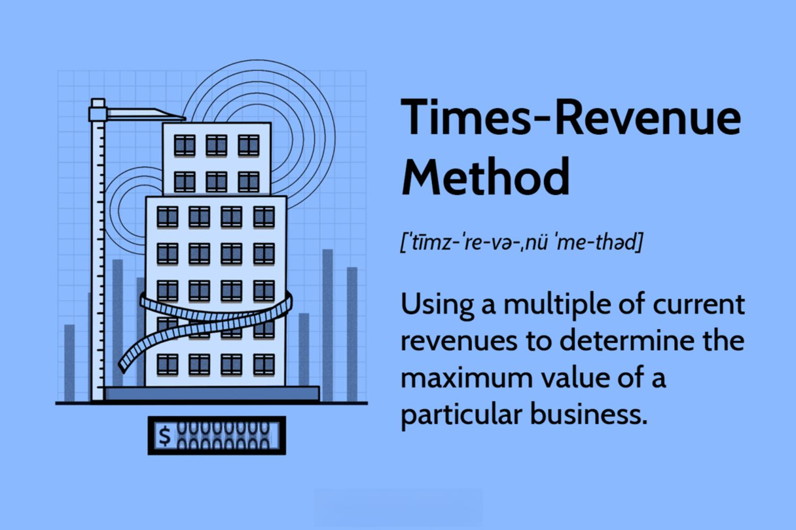

In the world of corporate finance, determining the value of a company is a critical task, especially for potential investors and stakeholders involved in mergers and acquisitions. Accurate company valuation influences decisions on investments, buyouts, and strategic partnerships. One of the methods frequently employed for such valuations is the times-revenue method. This approach bases a company's value on its revenue by multiplying it by a specific multiplier correlated with industry standards. The multipliers vary based on industry characteristics, growth potential, and economic factors, offering a direct metric tied to revenue.

The times-revenue method provides a straightforward valuation by focusing on a company's current revenue stream without delving into cost structures or profitability. This simplicity proves advantageous in assessing young companies with volatile earnings but considerable revenue flow. However, the methodology inherently overlooks several financial nuances, such as profit margins and operational costs, which could lead to skewed valuations if used in isolation.

In recent years, the financial landscape has evolved with the rise of algorithmic trading, which employs complex computer algorithms to automate and optimize trading strategies. The integration of valuation methods like the times-revenue method within algorithmic trading systems has become increasingly prevalent. Such integration helps in generating trading signals and making swift decisions aligned with company valuation assessments.

This article explores the intersection of the times-revenue method and algorithmic trading in the finance industry. The influence of revenue-based valuation on algorithmic trading strategies is examined, highlighting both the advantages and potential pitfalls traders may encounter. Understanding these dynamics is essential for leveraging algorithmic tools effectively and navigating the complexities of modern financial markets.

## Table of Contents

## Understanding the Times-Revenue Method

The times-revenue method, often utilized in corporate finance, is a valuation approach whereby a business's value is derived by multiplying its current revenue by a specific multiplier. This multiplier is not static; it can fluctuate considerably based on several factors including the industry in which the company operates, its growth trajectory, and prevailing economic conditions.

The formula for the times-revenue valuation can be expressed as:

$$
\text{Business Value} = \text{Revenue} \times \text{Multiplier}
$$

This straightforward formula provides a simplistic view of a business's valuation through its revenue figures. Each industry typically has its standard or range for multipliers, influenced by the prospects and risks associated with companies within that sector. For example, technology firms with high growth potential might command higher multipliers compared to more traditional industries with slower growth, such as manufacturing.

The core benefit of the times-revenue method lies in its simplicity and speed, making it an attractive option for quickly assessing the value of a company, especially those with substantial revenue streams. It is particularly useful for startups or companies where profit margins may not yet be illustrative of their market positioning or growth potential.

However, the method's simplicity also leads to significant limitations. By focusing exclusively on revenue, it neglects critical financial metrics such as costs, profitability, or debt levels. Companies with high revenues but equally high costs might receive valuations not reflective of their financial health. Therefore, without accounting for profitability, the times-revenue method can produce misleading valuations.

In investment contexts, understanding these nuances is essential for making informed decisions. While the times-revenue method provides a quick and useful snapshot, it is most effective when used in conjunction with other valuation methods that consider a broader range of financial data. This provides a more balanced and comprehensive view of a company's true value.

## Algorithmic Trading: A Quick Overview

Algorithmic trading, commonly referred to as algo trading, utilizes advanced computer programs to manage and execute trading operations. By integrating complex algorithms, this method automates the trading process, resulting in high efficiency and speed, minimizing human intervention. Algorithmic trading employs a predefined set of rules and criteria to evaluate market data in real time, facilitating prompt and precise order executions that enhance profit potential while mitigating risks.

A central concept in [algorithmic trading](/wiki/algorithmic-trading) is the utilization of these algorithms to identify optimal trading opportunities based on quantitative criteria. These algorithms can analyze vast datasets faster than any human trader, enabling them to detect trends or price discrepancies that may signify profitable trades. For instance, algorithms can scrutinize historical price data to forecast future price movements or react instantaneously to market events, capitalizing on short-lived opportunities before manual traders could.

The impact of algorithmic trading on security markets is profound. This trading approach contributes significantly to market [liquidity](/wiki/liquidity-risk-premium), as automated systems can execute a substantial number of trades in a short period. Moreover, it reduces the bid-ask spread and enhances market efficiency by ensuring that security prices swiftly reflect new information and changing conditions.

Company valuation, particularly methods like the times-revenue approach, is a critical element in crafting algorithmic trading strategies. While the times-revenue method provides a straightforward estimation based on a company's revenue, algorithmic trading systems can incorporate this valuation as a part of a larger strategy. For example, an algorithm could be programmed to compare the times-revenue valuation with other market indicators to decide when to buy or sell a stock. This integration of valuation models into trading algorithms helps align trading strategies with the underlying financial metrics of targeted securities.

## The Intersection of Revenue Valuation and Algorithmic Trading

Valuation models are fundamental components of algorithmic trading systems, as they provide insights into a company's potential value, which can critically influence trading decisions. In algorithmic trading, a company’s evaluation using the times-revenue method could serve as an initial broad indicator of the company's worth. This method multiplies a company's revenue by a specific industry-related multiplier to estimate the company's value. Although simplistic, this approach can trigger buy or sell signals within trading algorithms by suggesting whether a company's stock might be undervalued or overvalued relative to its revenue.

Algo trading, which benefits from the speed and precision of computer-driven processes, can leverage the times-revenue method as a quick screening tool to identify potential trading opportunities. The alignment or divergence of a company's market value with its revenue-based valuation might indicate profitable trading directions. For example, if a company’s market price falls significantly below its times-revenue valuation, an algorithm might flag this as a potential buy opportunity based on the assumption that the market may correct this valuation discrepancy over time.

However, the use of the times-revenue method in algo trading is not without its limitations. The methodology’s primary shortcoming is its lack of consideration for profitability and operational costs, components that are pivotal in accurate valuation. A high-revenue company might still face financial difficulties if expenses and debt obligations outweigh earnings, leading to an inflated valuation under this method. Thus, if an algorithm relies heavily on the times-revenue method without integrating additional financial indicators, it risks making misinformed trading decisions based on incomplete data.

To mitigate these risks, a robust algorithmic trading strategy should incorporate multiple valuation metrics. Integrating the times-revenue method with other financial analyses, such as cash flow, earnings before interest and taxes (EBIT), or debt-to-equity ratios, can offer a more comprehensive understanding of a company’s financial health. By balancing the simplicity of the times-revenue approach with the thoroughness of multi-dimensional financial analyses, algorithmic traders can enhance the reliability of their trading signals and make more informed investment decisions.

## Advantages and Limitations of the Times-Revenue Method

The times-revenue method is praised for its straightforward nature, primarily due to its simple calculation process. By multiplying the current revenue of a company by an industry-specific multiplier, investors can quickly estimate the business's value. This ease of use makes it an attractive option for valuing young companies, especially those with significant revenue streams but either non-existent or highly volatile earnings.

An example formula to calculate a company's valuation using this method is:

$$
\text{Valuation} = \text{Revenue} \times \text{Multiplier}
$$

This formula allows stakeholders to generate a preliminary value based on accessible revenue data without delving into the complexities of cost analysis or profit margins.

However, the method is not without its drawbacks. A significant criticism is its disregard for profitability and costs. By focusing solely on revenue, the times-revenue method can result in valuations that do not accurately reflect a company's financial health. This approach may be misleading, particularly for businesses with high operating expenses or slim profit margins, as it might not account for the true economic value of the company.

In the context of algorithmic trading, relying solely on the times-revenue method can lead to a narrow perspective. Algo traders benefit from incorporating multiple valuation methods, which provide a more comprehensive picture. By combining different techniques, such as discounted cash flow (DCF) analysis or price-to-earnings ratios alongside the times-revenue method, traders can create more robust trading strategies that accommodate various market conditions and company characteristics. This integration helps mitigate the limitations of a single-method approach, improving accuracy and decision-making in security markets.

## Case Study: Times-Revenue Method in Action

To exemplify the practical application and effects of the times-revenue method, consider the case of the recent acquisition of a prominent tech firm, TechInnovate LLC, by a larger conglomerate. This scenario demonstrates how revenue-based valuation informed both the acquisition process and subsequent algorithmic trading activities.

TechInnovate LLC, recognized for its innovative software solutions, reported robust revenue growth over several years but faced challenges in profitability due to high R&D expenditure. The acquiring company sought a swift valuation process, opting for the times-revenue method owing to its simplicity and focus on revenue growth.

### Determining the Initial Price Point
The times-revenue method was employed by multiplying TechInnovate's annual revenue by an industry-specific multiplier, which, in this case, was predetermined through analysis of recent acquisitions within the tech sector.

$$
\text{Valuation} = \text{Annual Revenue} \times \text{Industry Multiplier}
$$

Given TechInnovate's annual revenue of $50 million and an industry multiplier of 5, computed based on comparables in the software industry, the initial valuation was calculated as:

$$
\text{Valuation} = 50 \, \text{million USD} \times 5 = 250 \, \text{million USD}
$$

This valuation served as an integral component in negotiations, setting an initial price benchmark that both parties could assess relative to other financial metrics.

### Algorithmic Trading Response
Post-announcement of the acquisition and its valuation, algorithmic trading strategies swiftly reacted to the news. For instance, algorithms designed to monitor acquisition activities in the tech sector flagged the valuation as a significant event, triggering trading signals across various platforms. This reaction was particularly pronounced in trading systems that prioritize recent acquisitions as indicators for potential stock appreciation in related firms.

### Impact on Automated Investing Decisions
The reliance on revenue figures underscored by the times-revenue method had a notable influence on algorithmic decision-making. For instance, tech stocks associated with similar revenue profiles saw increased trading activity as investors anticipated similar acquisition interest. Furthermore, adjustments in the valuation metrics echoed through algorithmic portfolios, prompting recalibrations in investment models to account for updated financial realities.

Through this case study, it becomes evident that while the times-revenue method provides a streamlined approach to company valuation, its impact stretches across trading activities, highlighting both the advantages and constraints of revenue-focused assessments. Integrating such valuations into algorithmic frameworks requires acknowledgment of their inherent limitations, particularly concerning comprehensive financial health indicators.

## Conclusion: Making Informed Trading Decisions

While the times-revenue method provides a straightforward mechanism for rapid business valuation, its effectiveness in algorithmic trading hinges on a clear understanding of both its benefits and constraints. The major advantage of this method is its simplicity, allowing traders to quickly estimate company value based on revenue data. However, this approach neglects crucial elements like profitability and operational costs, which can critically misrepresent a company's true financial state. 

To achieve more precise valuations, it's advisable to combine the times-revenue method with other financial tools such as the Discounted Cash Flow (DCF) analysis or the Price-to-Earnings (P/E) ratio. This hybrid strategy mitigates the oversights of a single-method approach, offering a multifaceted view of a company's financial health. For instance, integrating P/E ratios can account for profitability, while DCF can incorporate future cash flow projections.

Algorithmic trading, with its reliance on thoroughly vetted data and predictive models, benefits considerably from robust valuation frameworks. As trading algorithms become more sophisticated, their reliance on accurate financial data will only increase. By employing a suite of financial analysis methods, traders can enhance their decision-making power, adapt to varied market conditions, and potentially improve their trading outcomes. 

Thus, while the times-revenue method remains a useful initial step in company valuation, its role should be part of a broader financial strategy in algorithmic environments. As trading technologies evolve, making informed valuation decisions through comprehensive financial analyses will remain essential for optimizing strategy performance and ensuring accurate, data-driven trading actions.

## References & Further Reading

[1]: Damodaran, A. (2012). ["Investment Valuation: Tools and Techniques for Determining the Value of Any Asset."](https://books.google.com/books/about/Investment_Valuation.html?id=5SRHAAAAQBAJ) John Wiley & Sons.

[2]: ["Corporate Valuation Using the Income Approach: Current Trends and Issues"](https://www.marcumllp.com/insights/the-income-approach-to-valuation) by Vladimir R. Antikarov

[3]: Pardo, R. (2008). ["The Evaluation and Optimization of Trading Strategies."](https://onlinelibrary.wiley.com/doi/book/10.1002/9781119196969) John Wiley & Sons.

[4]: Hull, J. C. (2017). ["Options, Futures, and Other Derivatives."](https://www.semanticscholar.org/paper/Options%2C-Futures%2C-and-Other-Derivatives-Hull/89bdee500c8623864fc9eb7a471546aa713acc44) Pearson Education.

[5]: ["Machine Learning for Asset Managers"](https://ia802907.us.archive.org/31/items/machine_learning_for_asset_managers/machine_learning_for_asset_managers.pdf) by Marcos López de Prado