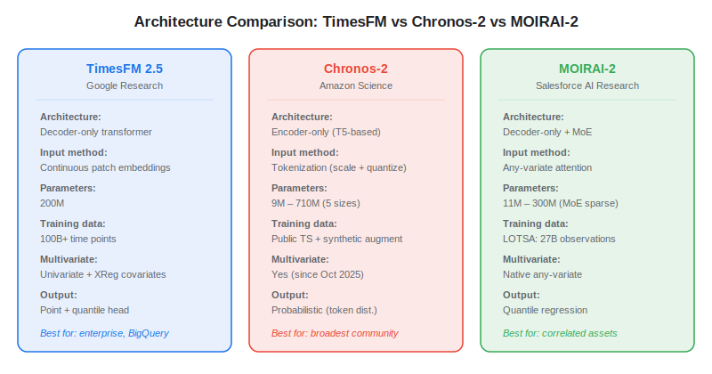
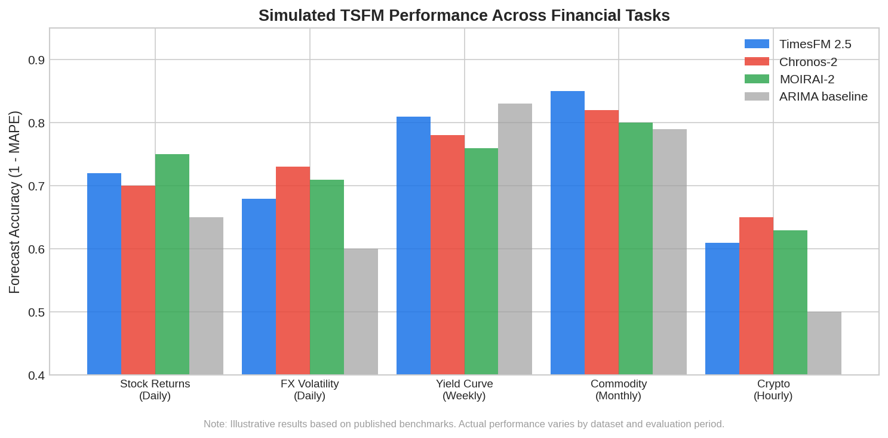

Choosing the right **time series foundation model** (TSFM) for financial forecasting means understanding the architectural trade-offs between the three leading open-source options: Google's **TimesFM 2.5**, Amazon's **Chronos-2**, and Salesforce's **MOIRAI-2**. Each takes a fundamentally different approach to turning raw price data into probabilistic forecasts — and those differences matter when the target is noisy, non-stationary financial data rather than seasonal energy demand or web traffic. This comparison covers architecture, financial-data performance, inference speed, and practical Python usage to help algo traders make an informed choice.

## Architecture at a Glance

The three models share the transformer backbone but diverge on almost every other design choice — how they ingest data, how they generate forecasts, and whether they handle multivariate inputs natively.



**TimesFM 2.5** uses a decoder-only transformer with continuous patch embeddings. The raw series is split into fixed-length patches, embedded into a continuous vector space, and processed autoregressively. It was pre-trained on over 100 billion time points from Google Trends, Wikipedia, and synthetic data. Version 2.5 added a quantile head for probabilistic forecasting and XReg support for external regressors, but the core architecture remains univariate — each series is forecast independently.

**Chronos-2** takes a language-modelling approach: it *tokenizes* continuous time series values by scaling and quantizing them into a discrete vocabulary, then uses an encoder-only [transformer](https://paperswithbacktest.com/wiki/transformer) (derived from T5) to predict the next token. This makes it natively probabilistic — the output is a distribution over tokens. The October 2025 update added multivariate and covariate-informed forecasting. Chronos comes in five sizes (9M–710M parameters), giving teams flexibility to trade accuracy for speed.

**MOIRAI-2** is a decoder-only transformer augmented with Mixture-of-Experts (MoE), which means different expert sub-networks activate for different types of time series. Its "any-variate attention" mechanism handles arbitrary numbers of input variables without fixed dimensions — making it the strongest choice for modelling correlated financial instruments. Pre-trained on 27 billion observations from the LOTSA dataset across nine domains, MOIRAI-2 uses quantile regression with multi-token prediction for its output.

## Performance on Financial Data

No single model dominates across all financial tasks. The GIFT-Eval benchmark (the standard leaderboard with 97 task configurations) shows Chronos-2 with the highest overall win rate, but the ranking shifts depending on data frequency, asset class, and forecast horizon.



Key findings from the literature: Marconi et al. (2025) evaluated TTM and Chronos on three financial tasks (US Treasury yields, EUR/USD volatility, equity spreads) and found that pre-trained models required 3–10 fewer years of data to reach comparable accuracy. However, traditional specialist models still matched or exceeded TSFM performance in two of three tasks. A separate global equities study confirmed that off-the-shelf TSFMs underperform on financial data, but finance-native pre-training delivers substantial gains.

| Scenario | Recommended Model | Why |
|---|---|---|
| Single-stock daily forecasting | TimesFM 2.5 | Fast univariate, BigQuery integration |
| Correlated portfolio (multi-asset) | MOIRAI-2 | Native any-variate cross-series modelling |
| Probabilistic risk bands | Chronos-2 | Token-distribution output, five model sizes |
| Low-compute / CPU-only | Chronos-Bolt (small) | 9M params, 300+ forecasts/sec |
| New asset with minimal history | Any TSFM (few-shot) | Pre-training transfers general knowledge |

## Python: Quick Forecast with Each Model

**TimesFM 2.5:**

```python
import numpy as np
import timesfm

model = timesfm.TimesFM_2p5_200M_torch.from_pretrained(
    "google/timesfm-2.5-200m-pytorch"
)
model.compile(timesfm.ForecastConfig(max_context=512, max_horizon=20))
point, quantiles = model.forecast(horizon=20, inputs=[prices[-512:]])
```

**Chronos-2:**

```python
import torch
from chronos import ChronosPipeline

pipeline = ChronosPipeline.from_pretrained(
    "amazon/chronos-t5-base", device_map="auto", torch_dtype=torch.float32
)
forecast = pipeline.predict(
    context=torch.tensor(prices[-512:]).unsqueeze(0), prediction_length=20
)
median = forecast.median(dim=1).values  # point forecast
```

**MOIRAI-2:**

```python
from uni2ts.model.moirai import MoiraiForecast, MoiraiModule

model = MoiraiForecast(
    module=MoiraiModule.from_pretrained("Salesforce/moirai-1.0-R-large"),
    prediction_length=20, context_length=512, num_samples=50,
    patch_size="auto", target_dim=1,
)
# Use GluonTS dataset format for multivariate support
```

All three run on a single GPU. For CPU-only setups, Chronos-Bolt (small) and Lag-Llama (~10M params) are the lightest options.

## Key Trade-Offs for Algo Traders

**Multivariate matters in finance.** If you are forecasting a portfolio of correlated assets — equities and their sector ETFs, FX pairs with shared macro drivers — MOIRAI-2's any-variate attention captures cross-series dependencies that TimesFM and early Chronos versions miss entirely. Chronos-2 added multivariate support in late 2025, but MOIRAI was designed for it from the start.

**Benchmarking is treacherous.** Several studies have found that TSFM evaluations inadvertently include test datasets that overlap with pre-training data, inflating accuracy by 47–184%. Always verify that your test data was not in the model's training corpus — a non-trivial exercise given the opaque training sets of some models.

**Fine-tuning is where the real gains are.** As explored in depth in our article on [why foundation models struggle with financial data](https://paperswithbacktest.com/wiki/foundation-models-financial-time-series-challenges), generic pre-training is a starting point, not a destination. Few-shot fine-tuning on your specific asset class consistently outperforms zero-shot inference for financial applications.

## Conclusion

There is no single best [time series foundation model](https://paperswithbacktest.com/wiki/time-series-foundation-models) for all financial forecasting — the right choice depends on your data structure, compute budget, and integration requirements. TimesFM 2.5 is the most enterprise-ready (BigQuery, Google Cloud). Chronos-2 has the broadest community and most flexible sizing. MOIRAI-2 is architecturally strongest for multi-asset portfolios. For most algo traders, the practical recommendation is: start with Chronos-2 (largest community, easiest to prototype), evaluate on your data, then consider MOIRAI-2 if multivariate modelling proves important. In all cases, invest time in fine-tuning on financial data before drawing performance conclusions from zero-shot results alone.

---

**Explore further on PapersWithBacktest:**
- Browse [backtested trading strategies](https://paperswithbacktest.com/strategies) with Python code and performance metrics
- Access [clean historical market data](https://paperswithbacktest.com/datasets) for equities, crypto, and futures — ideal for TSFM fine-tuning
- Take the [algo trading course](https://paperswithbacktest.com/course) — 60+ video lessons and notebooks
- Related wiki pages: [Time Series Foundation Models Explained](https://paperswithbacktest.com/wiki/time-series-foundation-models) · [Understanding Transformer Models](https://paperswithbacktest.com/wiki/transformer)
