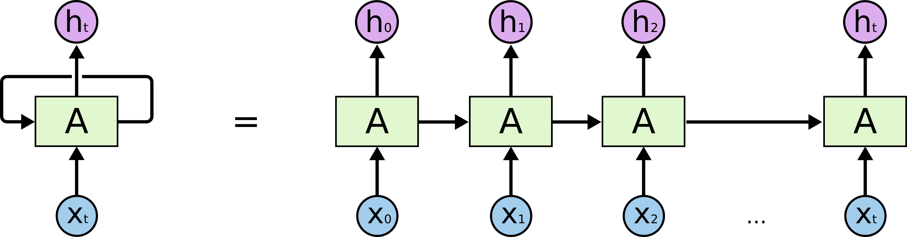

## Table of Contents

## What is a timestep in the context of machine learning?

In machine learning, a timestep refers to a single point in time within a sequence of data. This concept is particularly important in models that deal with time series data or sequential data, such as recurrent neural networks (RNNs) and long short-term memory (LSTM) networks. A timestep allows the model to process data in order, capturing patterns and dependencies over time. For example, in a language model, each word in a sentence can be considered a timestep, allowing the model to understand the context and flow of the text.

When working with timesteps, it's crucial to understand how data is fed into the model. At each timestep, the model receives a piece of data, processes it, and updates its internal state. This process is repeated for each subsequent timestep, enabling the model to make predictions or generate outputs based on the entire sequence. For instance, in a weather forecasting model, each timestep could represent hourly temperature readings, and the model would use these to predict future temperatures. Understanding and correctly implementing timesteps is key to the success of models that rely on sequential data.

## How does the concept of timestep apply to time series data?

In time series data, a timestep represents a single point in time where a data point is recorded. Imagine you're tracking the daily temperature of a city. Each day is a timestep, and the temperature recorded for that day is the data point associated with that timestep. When you use this data in machine learning, the model processes each day's temperature one at a time, in sequence. This allows the model to understand patterns over time, like how temperatures change from one day to the next.

For example, if you're using a model to predict future temperatures, it would look at the temperature at each timestep (each day) and use that information to make its predictions. The model can learn that if it's very hot one day, it might be hot the next day too, or it might start to cool down. By processing the data in this way, the model can capture trends and seasonal patterns, making its predictions more accurate. This is why understanding and correctly using timesteps is crucial when working with time series data in [machine learning](/wiki/machine-learning).

## Can you explain the role of timesteps in recurrent neural networks (RNNs)?

In recurrent neural networks (RNNs), a timestep is like a single step in a journey where the network looks at one piece of data at a time. Imagine you're reading a book. Each word you read is a timestep. The RNN processes each word one by one, and as it does, it remembers what it has read so far. This memory helps the RNN understand the context and meaning of the text. For example, if the sentence is "The cat is on the mat," the RNN processes "The" first, then "cat," and so on, using what it learned from earlier words to make sense of the later ones.

The way RNNs use timesteps is really important for tasks like language translation or predicting stock prices. At each timestep, the RNN takes in a new piece of data, updates its internal state, and then makes a prediction or generates an output. This process repeats for each timestep, allowing the network to capture patterns and dependencies over time. For instance, in stock price prediction, each timestep could represent a day, and the RNN would use the price from each day to predict future prices. By processing data in this step-by-step manner, RNNs can learn and predict sequences effectively.

## What is the difference between a timestep and a time window in machine learning?

A timestep in machine learning is like a single snapshot in time. Imagine you're watching a movie; each frame you see is a timestep. In a model, a timestep is the moment when the model looks at one piece of data, like one word in a sentence or one day's temperature. The model processes this data and then moves to the next timestep, using what it learned to understand the sequence better.

A time window, on the other hand, is like looking at several frames of the movie at once. Instead of focusing on just one moment, a time window captures a range of timesteps. For example, if you're predicting the weather, a time window might include the temperatures from the last seven days. The model then uses this window of data to make its predictions. While a timestep is about processing data one piece at a time, a time window is about looking at a collection of timesteps together to get a broader view.

## How do timesteps affect the training of models like Long Short-Term Memory (LSTM) networks?

In Long Short-Term Memory (LSTM) networks, timesteps play a big role in how the model learns. Each timestep is like a single moment where the LSTM looks at one piece of data, like one word in a sentence or one day's temperature. When training an LSTM, the model goes through each timestep one by one. At each step, it decides what to remember and what to forget from the past, and what new information to add. This helps the LSTM understand long sequences of data better than regular neural networks, because it can keep track of important information over many timesteps.

The way timesteps work in LSTMs also affects how the model is trained. During training, the LSTM processes the entire sequence of data, updating its weights and biases at each timestep. This means the model learns from the whole sequence, not just individual data points. If the sequence is long, the LSTM has more timesteps to learn from, which can help it capture more complex patterns. But it also means the training can take longer, because the model has to process more data. So, understanding how timesteps work is key to getting the most out of an LSTM network.

## What are some common challenges associated with handling timesteps in machine learning models?

One common challenge when working with timesteps in machine learning is dealing with variable-length sequences. Not all sequences are the same length, like sentences in a language model or time series data from different sources. This makes it hard for models to process them in a uniform way. To handle this, techniques like padding or masking are used. Padding adds extra timesteps to make all sequences the same length, while masking tells the model to ignore the extra padded timesteps. But these solutions can add complexity to the model and might affect how well it learns.

Another challenge is capturing long-term dependencies. In models like RNNs and LSTMs, information can get lost over many timesteps. This means the model might struggle to remember important details from earlier in the sequence. For example, in a long document, the model might forget the context set at the beginning by the time it reaches the end. To tackle this, advanced architectures like LSTMs and GRUs (Gated Recurrent Units) are used. These models are designed to better remember information over long sequences, but they can be harder to train and might need more computational power.

Lastly, computational efficiency is a big concern. Processing data one timestep at a time can be slow, especially with long sequences. This can make training and using the model take a lot of time. To speed things up, techniques like parallel processing or using GPUs can help. But these solutions require careful implementation and might not work for all types of models or data. So, finding the right balance between model performance and computational efficiency is key when working with timesteps.

## How can one optimize the use of timesteps to improve model performance?

To optimize the use of timesteps and improve model performance, it's helpful to focus on how the model processes sequences. One way to do this is by using techniques like truncating or padding sequences. Truncating means cutting off extra timesteps from long sequences, while padding adds extra timesteps to shorter sequences. This helps make all sequences the same length, which can make the model easier to train. For example, if you're working with text data, you might decide to only use the first 50 words of each document. This can help the model learn faster and perform better, especially if the important information is usually at the beginning of the sequence.

Another way to optimize timesteps is by using more advanced architectures like LSTMs or GRUs. These models are better at remembering information over many timesteps, which can help them capture long-term dependencies in the data. For instance, an LSTM might be able to remember the context set at the beginning of a long document and use it to understand the end better. This can lead to better performance on tasks like language translation or time series forecasting. However, these models can be more complex to train and might need more computational power, so it's important to balance the benefits with the resources available.

Lastly, optimizing the computational efficiency of processing timesteps can also improve model performance. One approach is to use parallel processing or GPUs to speed up the training and prediction phases. This can make a big difference, especially with long sequences. For example, you could use a GPU to process multiple timesteps at once, which can significantly reduce the time it takes to train the model. However, setting this up correctly can be tricky, and it might not work for all types of models or data. So, it's important to carefully consider the trade-offs between speed and accuracy when optimizing the use of timesteps.

## What are the implications of choosing different timestep lengths in model design?

Choosing different timestep lengths can have a big impact on how well a model works. If you use shorter timesteps, the model gets more detailed information at each step. This can help the model catch small changes in the data, like how a word changes the meaning of a sentence or how temperature changes from hour to hour. But, using shorter timesteps means the model has to process more data, which can make training and using the model take longer. On the other hand, longer timesteps give the model less detailed information at each step. This can make the model simpler and faster to train, but it might miss out on important details in the data. So, finding the right balance between detail and speed is important when deciding on timestep length.

The choice of timestep length also affects how well the model can learn patterns over time. For example, if you're using a model to predict stock prices, using daily timesteps might be good for seeing weekly trends, but hourly timesteps could be better for catching short-term changes. If the timestep length is too long, the model might miss out on important patterns that happen over shorter periods. But if the timestep length is too short, the model might get bogged down with too much detail and struggle to see the bigger picture. So, choosing the right timestep length depends on what kind of patterns you want the model to learn and how much detail you need it to capture.

## How do timesteps influence the architecture of sequence-to-sequence models?

In sequence-to-sequence models, timesteps play a key role in how the model processes and generates data. These models often use an encoder-decoder architecture, where the encoder takes in a sequence of input data one timestep at a time. For example, if you're translating a sentence from English to French, the encoder looks at each English word as a timestep. As it processes each word, it builds up a hidden state that captures the meaning of the entire sentence. This hidden state is then passed to the decoder, which generates the output sequence (the French translation) one timestep at a time. The choice of timestep length can affect how well the model understands and translates the sequence, as shorter timesteps might capture more detail but require more processing, while longer timesteps might be simpler but could miss important nuances.

The architecture of sequence-to-sequence models is designed to handle the flow of information across timesteps effectively. In models like LSTMs or GRUs, special mechanisms are used to remember or forget information over many timesteps. This helps the model keep track of long sentences or complex sequences. For instance, when translating a long sentence, the model needs to remember the context set at the beginning to accurately translate the end. The way timesteps are managed in the encoder and decoder parts of the model influences how well it can capture these long-term dependencies. Choosing the right timestep length and understanding how to manage the flow of information across these steps is crucial for building effective sequence-to-sequence models.

## Can you discuss advanced techniques for managing variable length timesteps in deep learning?

One advanced technique for managing variable length timesteps in [deep learning](/wiki/deep-learning) is using attention mechanisms. Attention allows the model to focus on different parts of the input sequence at each timestep, even if the sequences are of different lengths. For example, in a language translation model, attention helps the decoder to look back at the most relevant parts of the input sentence when generating each word of the output. This way, the model can handle sentences of different lengths without needing to pad or truncate them to a fixed size. By dynamically weighting the importance of each input timestep, attention mechanisms improve the model's ability to understand and generate sequences more effectively.

Another technique is using dynamic recurrent neural networks (RNNs) like the Clockwork RNN. This type of RNN allows different parts of the network to update at different frequencies, which can be useful for handling variable length timesteps. For example, in time series data, some features might change quickly while others change slowly. A Clockwork RNN can be set up so that some hidden units update every timestep, while others update less frequently. This helps the model capture both short-term and long-term patterns in the data without being overwhelmed by the variable length of the sequences. By allowing different parts of the network to operate on different time scales, Clockwork RNNs can handle variable length timesteps more efficiently and effectively.

## What are the latest research trends involving timesteps in machine learning?

Recent research in machine learning involving timesteps has focused a lot on improving how models handle sequences of different lengths. One big trend is the use of transformers, which are models that don't process data one timestep at a time like RNNs or LSTMs. Instead, transformers look at all the timesteps at once using attention mechanisms. This helps them handle variable length sequences better and has led to big improvements in tasks like language translation and text generation. Researchers are now working on ways to make transformers even better at understanding long sequences and capturing complex patterns over time.

Another trend is the development of models that can learn from irregularly spaced timesteps. In real-world data, like medical records or stock prices, the time between data points can vary a lot. Traditional models that expect regular timesteps struggle with this. So, researchers are creating new models that can handle these irregular intervals. For example, some models use special techniques to fill in the gaps between timesteps or to adjust how they process the data based on the time between points. This is important for making machine learning more useful in fields where data doesn't come in neat, regular intervals.

## How might future advancements in hardware affect the processing of timesteps in machine learning models?

Future advancements in hardware, like more powerful GPUs and specialized chips like TPUs, could make processing timesteps in machine learning models much faster and more efficient. These chips can handle a lot of calculations at the same time, which is perfect for models that need to process many timesteps. For example, when training a model like an LSTM, which looks at each timestep one by one, faster hardware can speed up this process a lot. This means models can learn from longer sequences of data without taking too much time, which can help them understand patterns over time better.

Also, new hardware might allow for new ways to process timesteps. For instance, quantum computing could change how we handle timesteps by processing them in ways that are different from today's computers. This could lead to new types of models that can capture even more complex patterns in data. As hardware keeps getting better, it could open up new possibilities for how we use timesteps in machine learning, making models more accurate and able to handle bigger and more complex data sets.