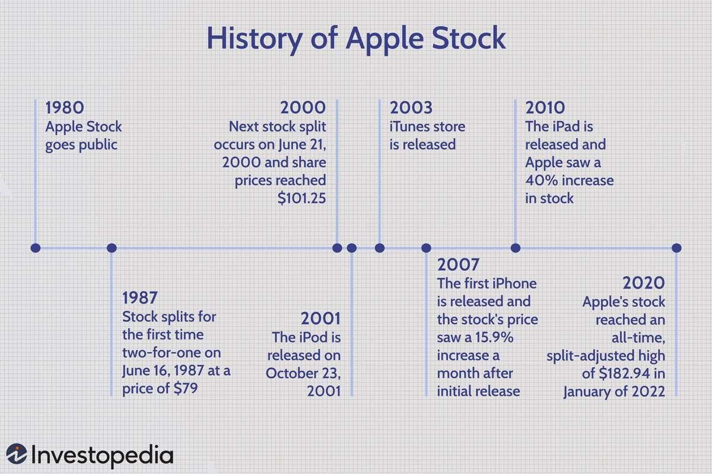

## Table of Contents

## What is the typical release cycle for new iPhone models?

Apple usually releases new iPhone models every year. The release typically happens in September. This is when Apple has a big event to show off the new phones. People get excited and start talking about the new features and designs.

Sometimes, Apple also releases a new iPhone in the spring. This is usually a less expensive version of the phone that came out in the fall. It helps people who want a new iPhone but don't want to spend a lot of money. So, you can expect at least one new iPhone every year, and sometimes two.

## How does the announcement of a new iPhone model affect Apple's stock price?

When Apple announces a new iPhone, it often makes their stock price go up. People get excited about the new phone and think it will sell well. This makes more people want to buy Apple's stock, which pushes the price higher. The announcement usually happens at a big event where Apple shows off the new phone's features and design. If the new iPhone looks really good and has cool new things, the stock price can go up a lot.

But sometimes, the stock price can go down after the announcement. This can happen if people think the new iPhone isn't that exciting or if it doesn't have many new features. Also, if the phone is too expensive, people might worry that it won't sell well. So, the stock price can be a bit unpredictable. It depends on what people think about the new iPhone and how it might affect Apple's future sales.

## What are the key dates to watch for in the iPhone release cycle?

The main date to watch for in the iPhone release cycle is usually in September. This is when Apple has a big event to show off the new iPhone. They talk about all the new features and designs. After the event, people can start pre-ordering the new iPhone, and it usually goes on sale a week or two later. This is the most exciting time for iPhone fans because they get to see what's new and decide if they want to buy it.

Sometimes, Apple also releases a new iPhone in the spring, around March or April. This is often a less expensive version of the phone that came out in the fall. It's good for people who want a new iPhone but don't want to spend a lot of money. So, if you're interested in iPhones, keep an eye on September and also check around March or April for any new releases.

## How can historical data on iPhone releases inform stock purchase timing?

Looking at past iPhone releases can help you decide when to buy Apple's stock. Usually, Apple's stock price goes up right after they announce a new iPhone in September. People get excited about the new phone and think it will sell well, so they want to buy Apple's stock. If you look at past years, you can see that the stock often goes up a lot in the days after the announcement. So, if you want to buy Apple's stock, it might be a good idea to do it just before the September event.

But, the stock price can also go down after the announcement if people don't like the new iPhone. If the phone doesn't have many new features or if it's too expensive, people might worry that it won't sell well. So, it's important to look at what people are saying about the new iPhone. If you think the new phone will be popular, buying the stock before the announcement could be a good move. But if you're not sure, you might want to wait and see how people react to the new iPhone before buying the stock.

## What are the risks of buying Apple stock just before an iPhone release?

Buying Apple stock right before an iPhone release can be risky. The stock price often goes up after the announcement if people like the new iPhone. But if the new phone doesn't have many new features or if it's too expensive, the stock price can go down. So, you might lose money if the new iPhone isn't popular.

It's also hard to predict how people will react to the new iPhone. Sometimes, the stock price goes up a lot, and sometimes it doesn't move much at all. If you buy the stock just before the announcement, you're betting that people will like the new phone. But if you're wrong, you could end up losing money instead of making it.

## How do market expectations and actual iPhone sales figures impact stock prices?

Market expectations play a big role in how Apple's stock price moves. Before a new iPhone comes out, people start guessing what it will be like and how well it will sell. If everyone thinks the new iPhone will be amazing and sell a lot, the stock price can go up even before the phone is announced. But if people think the new iPhone won't be that exciting, the stock price might not go up as much, or it could even go down. So, what people expect before the iPhone comes out can make the stock price move a lot.

After the iPhone is released, the actual sales numbers are important too. If the new iPhone sells really well, the stock price usually goes up because it means Apple is making more money. But if the iPhone doesn't sell as well as people thought it would, the stock price can go down. Sometimes, the sales numbers are better or worse than what people expected, and this can make the stock price move a lot. So, both what people expect before the iPhone comes out and how well it actually sells can make Apple's stock price go up or down.

## What technical indicators should be monitored around iPhone release dates?

Around iPhone release dates, it's good to keep an eye on a few technical indicators. One important one is the stock's moving averages, like the 50-day and 200-day moving averages. These can help you see if the stock is going up or down over time. If the stock price is above these averages, it might be a good sign that people are feeling positive about Apple. Another thing to watch is the stock's trading [volume](/wiki/volume-trading-strategy). If a lot more people are buying and selling the stock around the iPhone release, it can show how excited or worried people are about the new phone.

Also, you should look at the stock's [volatility](/wiki/volatility-trading-strategies). This means how much the stock price is moving up and down. Around iPhone release dates, the stock can be more volatile because people are trying to guess what will happen. If the stock price is moving a lot, it might be a good idea to be careful. Lastly, keep an eye on the Relative Strength Index (RSI). This can tell you if the stock is overbought or oversold. If the RSI is very high, it might mean the stock has gone up too fast and could go down soon. If it's very low, it might mean the stock has gone down too much and could go up soon.

## How does Apple's product diversification affect stock price sensitivity to iPhone releases?

Apple's product diversification means they don't just sell iPhones. They also have products like iPads, Mac computers, Apple Watches, and services like Apple Music and the App Store. This helps make Apple's stock price less sensitive to just iPhone releases. If the new iPhone isn't as popular as expected, Apple can still make money from their other products and services. So, the stock price doesn't go up and down as much just because of the iPhone.

Even though the iPhone is still a big part of Apple's business, having other products and services helps balance things out. If the iPhone sales are not great, but the iPad or Apple Watch sales are doing well, it can keep the stock price more stable. This means that while the iPhone release is still important, Apple's stock price is affected by more than just one product. So, it's good to look at how all of Apple's products and services are doing, not just the iPhone, when thinking about the stock price.

## What role do analyst forecasts and ratings play in the timing of Apple stock purchases?

Analyst forecasts and ratings can help you decide when to buy Apple stock. Analysts are people who study companies and predict how they will do in the future. They give ratings like "buy," "hold," or "sell" based on their research. If a lot of analysts are saying "buy" before an iPhone release, it might mean they think the new iPhone will do well and that Apple's stock price will go up. So, you might want to buy the stock before the iPhone comes out if the forecasts are good.

But, it's important to remember that analysts can be wrong sometimes. Their forecasts are just guesses based on what they know now. If the new iPhone doesn't do as well as they thought, the stock price could go down even if they said to buy. So, it's a good idea to look at what analysts are saying, but also think about other things like how Apple's other products are doing and what people are saying about the new iPhone. This can help you make a better decision about when to buy Apple stock.

## How can options trading strategies be used to capitalize on iPhone release volatility?

Options trading can be a good way to make money from the ups and downs of Apple's stock price around iPhone releases. One strategy is to buy call options before the iPhone announcement if you think the stock price will go up. A call option gives you the right to buy the stock at a certain price. If the stock price goes up after the announcement, you can make money by buying the stock at the lower price and then selling it at the higher price. But if the stock price goes down, you could lose the money you spent on the option.

Another strategy is to use a straddle. This means you buy both a call option and a put option at the same time, with the same price and date. A put option gives you the right to sell the stock at a certain price. With a straddle, you can make money if the stock price moves a lot in either direction. If the stock price goes up a lot after the iPhone release, you can use the call option to make money. If it goes down a lot, you can use the put option. But if the stock price doesn't move much, you could lose the money you spent on both options. So, options trading can be risky, but it can also help you make money from the big changes in Apple's stock price around iPhone releases.

## What are the long-term trends in Apple's stock performance related to iPhone releases?

Over the years, Apple's stock has usually gone up after new iPhone releases. When a new iPhone comes out in September, people get excited about the new features and design. This makes more people want to buy the phone, which can make Apple's stock price go up. If you look at the past, you can see that the stock often goes up a lot in the days and weeks after the iPhone is announced. This shows that the iPhone is a big part of why people want to buy Apple's stock.

But, the stock doesn't always go up after an iPhone release. Sometimes, if the new iPhone doesn't have many new features or if it's too expensive, people might not be as excited. This can make the stock price go down instead of up. Also, Apple has other products like iPads and Apple Watches, and services like Apple Music. These help make the stock price less sensitive to just the iPhone. So, while the iPhone is important, other things can affect Apple's stock price too.

## How do global economic conditions influence the impact of iPhone releases on Apple's stock?

Global economic conditions can change how much iPhone releases affect Apple's stock price. If the world economy is doing well, people have more money to spend on things like new iPhones. This can make the stock price go up a lot after a new iPhone comes out because more people are buying the phone. But if the economy is not doing well, people might not want to spend money on new phones. This can make the stock price go up less or even go down after an iPhone release because fewer people are buying the phone.

Also, things like interest rates and currency values can affect how well Apple's stock does after an iPhone release. If interest rates are low, it's cheaper for people to borrow money to buy things like iPhones. This can make the stock price go up more. But if the value of the dollar goes up, it can make Apple's products more expensive in other countries. This might make fewer people buy the new iPhone, which can make the stock price go up less or go down. So, the world economy can make a big difference in how much the iPhone release affects Apple's stock price.

## References & Further Reading

[1]: ["Advances in Financial Machine Learning"](https://www.amazon.com/Advances-Financial-Machine-Learning-Marcos/dp/1119482089) by Marcos Lopez de Prado

[2]: ["Machine Learning for Algorithmic Trading"](https://github.com/PacktPublishing/Machine-Learning-for-Algorithmic-Trading-Second-Edition) by Stefan Jansen

[3]: ["Quantitative Trading: How to Build Your Own Algorithmic Trading Business"](https://books.google.com/books/about/Quantitative_Trading.html?id=j70yEAAAQBAJ) by Ernest P. Chan

[4]: Chen, Sheng-Tzong, et al. ["Examining the Effects of New Product Announcement on Stock Price: The Case of iPhone."](https://www.researchgate.net/profile/Sheng-Tzong-Cheng) International Journal of Services and Standards, 2012.

[5]: Narang, Rudra. ["Algorithmic Trading of ADL Releases with Machine Learning Models."](https://journals.sagepub.com/doi/full/10.1177/2053951720926558) Available at SSRN 3244527, 2018.