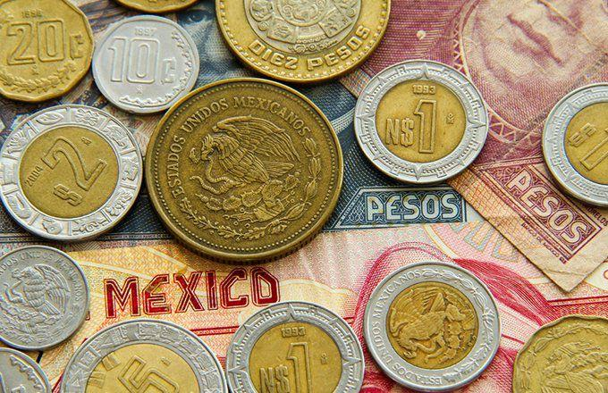

## Table of Contents

## What is the Mexican Peso and why is it important in forex trading?

The Mexican Peso is the official currency of Mexico. It is represented by the symbol "$" or "MXN". The Peso is important because it is used every day by people in Mexico to buy things like food, clothes, and other stuff they need. It is also used by businesses in Mexico to trade with other countries.

In forex trading, the Mexican Peso is important because it is one of the most traded currencies in the world. Forex trading is when people buy and sell different currencies to make money. Traders watch the Mexican Peso closely because changes in its value can affect their trading decisions. For example, if the Peso becomes stronger, it might be a good time to buy it, and if it becomes weaker, it might be a good time to sell it. This makes the Mexican Peso a key player in the global forex market.

## How does the time of day affect trading the Mexican Peso?

The time of day can really change how the Mexican Peso is traded. During the day, when banks and big businesses in Mexico are open, there is a lot more trading happening. This is usually from around 8 AM to 4 PM Mexico time. More trading means more people are buying and selling the Peso, which can make its value move up and down a lot. Traders often pay close attention to the Peso during these hours because they can see big changes happening.

At night, when Mexico's markets are closed, trading the Peso can be quieter. Fewer people are trading, so the Peso might not move as much. But, it's still important to watch because other big markets, like in the United States or Europe, might still be open. These markets can affect the Peso too. So, even though it might be night in Mexico, the Peso can still change because of what's happening in other parts of the world.

## What are the typical trading hours for the Mexican Peso?

The typical trading hours for the Mexican Peso are during the times when the Mexican stock market, called the Bolsa Mexicana de Valores (BMV), is open. This is usually from 8 AM to 4 PM Mexico City time, from Monday to Friday. During these hours, there is a lot of buying and selling of the Peso because banks and big businesses in Mexico are open and actively trading.

Outside of these hours, the trading of the Mexican Peso can still happen, but it might be less active. When it's night in Mexico, the Peso can still be traded in other big markets like the United States or Europe. So, even though the Mexican market is closed, the Peso's value can still change because of what's happening in other parts of the world.

## How do economic releases from Mexico impact the timing of Peso trades?

Economic releases from Mexico, like reports on how the country's economy is doing, can really shake things up for the Mexican Peso. When these reports come out, they can make the Peso's value jump around a lot. Traders watch these releases closely because they want to buy or sell the Peso at the best time. For example, if a report shows that Mexico's economy is doing well, the Peso might get stronger, and traders might want to buy it. But if the report shows the economy is struggling, the Peso might get weaker, and traders might want to sell it.

These economic releases usually happen at set times, so traders know when to be ready. They might trade more right before and after these releases because they want to act fast on the new information. For instance, if a big report is coming out at 9 AM Mexico time, traders will be watching the Peso closely around that time. This can make the Peso's value move a lot during those hours, so it's a busy time for trading.

## What role do U.S. economic indicators play in trading the Mexican Peso?

U.S. economic indicators, like reports on how the U.S. economy is doing, can really affect the Mexican Peso. This is because the U.S. and Mexico have a lot of trade between them. When the U.S. economy is doing well, it often means more business for Mexico, which can make the Peso stronger. But if the U.S. economy is struggling, it can hurt Mexico's economy, making the Peso weaker. So, traders watch U.S. economic indicators closely because they can give clues about what might happen to the Peso.

These U.S. indicators, like jobs reports or inflation numbers, come out at set times. When they are released, traders might trade the Peso more because they want to react to the new information quickly. For example, if a U.S. jobs report shows that more people are working, it might mean the U.S. economy is getting better, and traders might buy the Peso expecting it to get stronger. But if the report shows fewer jobs, traders might sell the Peso, expecting it to get weaker. So, U.S. economic indicators can make the Peso move a lot, especially right after they come out.

## How can traders use the overlap of the New York and London sessions to trade the Mexican Peso effectively?

The overlap of the New York and London trading sessions, which happens from around 8 AM to 12 PM Eastern Time, is a busy time for [forex](/wiki/forex-system) trading. During these hours, a lot of people are buying and selling currencies, including the Mexican Peso. This means there is a lot of action and the Peso can move up and down more than at other times. Traders can use this time to watch the Peso closely because big changes can happen fast. If traders see the Peso getting stronger or weaker, they can make quick decisions to buy or sell it.

Traders can also pay attention to any news or economic reports coming out from the U.S. or Europe during this overlap. Since the U.S. and Mexico have a lot of trade, U.S. news can affect the Peso a lot. If there's good news from the U.S., like more jobs or a strong economy, traders might expect the Peso to get stronger and buy it. If there's bad news, they might expect it to get weaker and sell it. The same goes for big news from Europe, which can also move the Peso. So, the overlap of these sessions is a good time for traders to be active and make smart moves with the Mexican Peso.

## What are the best times to trade the Mexican Peso for maximizing liquidity?

The best times to trade the Mexican Peso for maximizing liquidity are during the hours when the Mexican stock market, called the Bolsa Mexicana de Valores (BMV), is open. This is from 8 AM to 4 PM Mexico City time, Monday to Friday. During these hours, there are a lot of people buying and selling the Peso because banks and big businesses in Mexico are open and actively trading. This means there is a lot of action, and it's easier to buy or sell the Peso quickly without big changes in its price.

Another good time to trade the Mexican Peso is during the overlap of the New York and London trading sessions, which happens from around 8 AM to 12 PM Eastern Time. This is a busy time for forex trading because a lot of people from both the U.S. and Europe are trading. Since the U.S. and Mexico have a lot of trade, what happens in the U.S. can affect the Peso a lot. So, during this overlap, there is a lot of liquidity, and traders can make quick moves with the Peso.

## How does the Mexican Peso react to global commodity prices, and what timing considerations should be made?

The Mexican Peso can move a lot when global commodity prices change. Mexico is a big exporter of oil, so when oil prices go up, it's often good for the Peso. More money from oil sales can make the Mexican economy stronger, which can make the Peso stronger too. But if oil prices go down, it can hurt Mexico's economy and make the Peso weaker. Other commodities like metals can also affect the Peso, but oil is the biggest one to watch.

When trading the Peso, it's important to know when commodity prices are announced. Oil prices can change every day, but big reports on oil come out at set times. For example, the U.S. releases its oil inventory report every Wednesday at 10:30 AM Eastern Time. This report can move oil prices a lot, which can then move the Peso. Traders should be ready to trade the Peso around these times because the Peso might jump around a lot right after these reports come out. So, watching the timing of commodity price announcements can help traders make smart moves with the Peso.

## What are the seasonal patterns that affect the Mexican Peso, and how should traders time their trades accordingly?

The Mexican Peso can change a lot because of the seasons. One big reason is tourism. In the winter, a lot of people from the U.S. and Canada visit Mexico for vacation. This means more money coming into Mexico, which can make the Peso stronger. But in the summer, fewer tourists come, so the Peso might get weaker. Another reason is farming. Mexico grows a lot of crops like corn and avocados. When it's harvest time, usually in the fall, Mexico sells more of these crops to other countries. This can make the Peso stronger because more money is coming in. But when it's not harvest time, the Peso might not be as strong.

Traders should watch these seasonal patterns to time their trades better. If they know more tourists are coming in the winter, they might want to buy the Peso before it gets stronger. And if they know fewer tourists are coming in the summer, they might want to sell the Peso before it gets weaker. The same goes for farming. Traders can buy the Peso before the fall harvest when they expect it to get stronger from more crop sales. And they can sell it after the harvest when the Peso might not be as strong. By watching the seasons, traders can make smarter moves with the Mexican Peso.

## How can technical analysis be used to determine the best timing for entering and exiting Mexican Peso trades?

Technical analysis is a way to look at charts and numbers to guess what the Mexican Peso might do next. Traders use things like moving averages, which are lines on a chart that show the average price of the Peso over time. If the Peso's price goes above a moving average, it might be a good time to buy because it could mean the Peso is getting stronger. But if the price goes below the moving average, it might be a good time to sell because the Peso could be getting weaker. Traders also look at support and resistance levels, which are like invisible lines on the chart where the Peso's price often stops going up or down. If the Peso breaks through a resistance level, it might keep going up, so traders might want to buy. If it falls through a support level, it might keep going down, so traders might want to sell.

Another tool traders use is the Relative Strength Index (RSI), which tells them if the Peso is being bought or sold too much. If the RSI is over 70, it might mean the Peso is being bought too much and could soon get weaker, so traders might want to sell. If the RSI is under 30, it might mean the Peso is being sold too much and could soon get stronger, so traders might want to buy. By using these tools, traders can pick the best times to enter and [exit](/wiki/exit-strategy) their trades with the Mexican Peso. They watch the charts closely and make their moves when they see the right signals, helping them make smarter decisions about when to buy or sell the Peso.

## What are the implications of political events in Mexico on the timing of Peso trades?

Political events in Mexico can really shake up the Mexican Peso. When there's a big election or a new law being passed, it can make the Peso move a lot. If people think the new government or law will be good for Mexico's economy, the Peso might get stronger. But if they think it will be bad, the Peso might get weaker. Traders watch these events closely because they want to buy or sell the Peso at the best time. For example, if a new president is elected and traders think they will help the economy, they might buy the Peso expecting it to go up.

Knowing when these political events will happen is important for timing trades. Big events like elections have set dates, so traders can plan to trade more around those times. If there's a big election coming up, traders might start trading more a few days before and after the election because they want to act fast on the new information. Even smaller events, like a new law being passed, can make the Peso jump around. Traders need to keep an eye on the news and be ready to trade when these events happen. By watching the timing of political events, traders can make smarter moves with the Mexican Peso.

## How can advanced traders use algorithmic trading strategies to optimize the timing of their Mexican Peso trades?

Advanced traders can use algorithmic trading strategies to make smarter moves with the Mexican Peso. These strategies use computer programs to watch the Peso's price and other information all the time. The programs can look for patterns and signals that tell the trader when to buy or sell the Peso. For example, if the program sees that the Peso's price is about to break through a resistance level, it can tell the trader to buy the Peso quickly. Or if it sees the Peso getting weaker and about to fall through a support level, it can tell the trader to sell. By using these programs, traders can make trades at the best times without having to watch the market every second.

These algorithmic strategies can also help traders take advantage of small changes in the Peso's price. The programs can be set up to trade the Peso many times a day, buying when the price goes up a little and selling when it goes down a little. This can help traders make money from small moves in the Peso's price. The programs can also be set to trade more around big events, like economic reports or political news, when the Peso might jump around a lot. By using these smart computer programs, advanced traders can time their Peso trades better and make more money.

## What is Algorithmic Trading in the MXN/USD Market?

Algorithmic trading, known simply as algo trading, employs computer programs to automate the process of executing trades based on pre-defined criteria, thus enhancing the overall trading efficiency. This approach is particularly useful in the USD/MXN market, where high [volatility](/wiki/volatility-trading-strategies) and irregular trading volumes are common.

Traders utilize algorithms to efficiently navigate these market conditions by analyzing patterns, executing high-speed transactions, and managing large datasets. Algorithmic systems are designed to capitalize on small price movements by conducting a large number of trades in rapid succession, which can be something as simple as capturing a favorable trend or as complex as hedging risks using advanced models.

The primary allure of [algorithmic trading](/wiki/algorithmic-trading) lies in its advantages over manual trading methods, specifically efficiency, speed, and the removal of emotional biases. These systems can operate around the clock without fatigue, analyzing vast amounts of data faster than any human could. For example, a mean reversion strategy might be employed where an algorithm buys the peso when its price drops below its historical average and sells when it rises above, which is typically defined by:

$$
\text{Buy signal if } \, P < \mu - \sigma
$$
$$
\text{Sell signal if } \, P > \mu + \sigma
$$

Where $P$ is the current price of the peso, $\mu$ is the average price over a certain period, and $\sigma$ represents the standard deviation.

Moreover, these programs can seamlessly integrate multiple data sources to make informed decisions, ensuring trades are executed at optimal prices and times. By eliminating the emotional aspect of trading, algorithmic systems can prevent irrational decision-making that could result in losses, thus adhering strictly to a disciplined trading strategy based on statistical and mathematical models.

Language like Python is frequently used to build these trading algorithms due to its extensive libraries and ease of use. A simple Python script to execute a moving average crossover strategy could look like this:

```python
import pandas as pd

# Load historical data for the USD/MXN pair
data = pd.read_csv('usd_mxn_data.csv')
data['SMA_50'] = data['Close'].rolling(window=50).mean()
data['SMA_200'] = data['Close'].rolling(window=200).mean()

# Define buy/sell signals
data['Signal'] = 0
data.loc[data['SMA_50'] > data['SMA_200'], 'Signal'] = 1  # Buy
data.loc[data['SMA_50'] < data['SMA_200'], 'Signal'] = -1  # Sell

# Calculate positions
data['Position'] = data['Signal'].shift()

# Display trading signals
print(data[['Date', 'Close', 'SMA_50', 'SMA_200', 'Signal', 'Position']].dropna())
```

This script reads historical price data, calculates moving averages, and generates buy and sell signals based on the crossover of these averages, reflecting a straightforward execution of an algorithmic trading strategy.

Overall, the integration of algorithmic trading in the USD/MXN market allows traders to improve transaction accuracy, optimize execution timing, and potentially increase profitability while managing the volatility and [liquidity](/wiki/liquidity-risk-premium) challenges inherent in this currency pair.

## References & Further Reading

[1]: Bergstra, J., Bardenet, R., Bengio, Y., & Kégl, B. (2011). ["Algorithms for Hyper-Parameter Optimization."](https://dl.acm.org/doi/10.5555/2986459.2986743) Advances in Neural Information Processing Systems 24.

[2]: ["Advances in Financial Machine Learning"](https://www.amazon.com/Advances-Financial-Machine-Learning-Marcos/dp/1119482089) by Marcos Lopez de Prado

[3]: ["Evidence-Based Technical Analysis: Applying the Scientific Method and Statistical Inference to Trading Signals"](https://www.amazon.com/Evidence-Based-Technical-Analysis-Scientific-Statistical/dp/0470008741) by David Aronson

[4]: ["Machine Learning for Algorithmic Trading"](https://github.com/stefan-jansen/machine-learning-for-trading) by Stefan Jansen

[5]: ["Quantitative Trading: How to Build Your Own Algorithmic Trading Business"](https://www.amazon.com/Quantitative-Trading-Build-Algorithmic-Business/dp/1119800064) by Ernest P. Chan