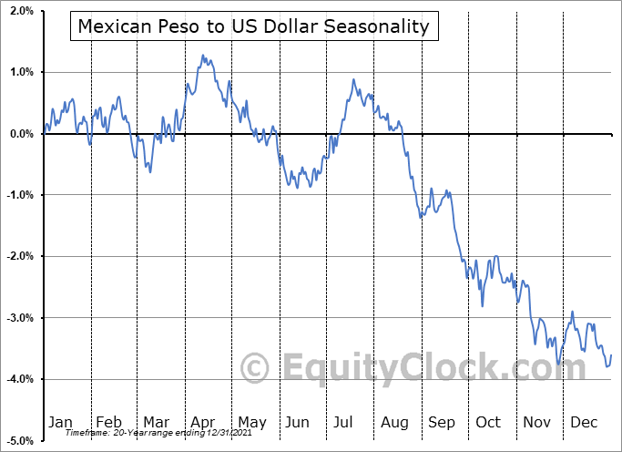

Forex trading, with its vast and intricate framework, offers traders a platform to engage with various currencies on a global scale. Central to this trading ecosystem is the Mexican peso (MXN) and its exchange rate against the US dollar (USD), which forms a crucial node in accessing the Latin American markets. The USD/MXN currency pair holds substantial significance due to Mexico's position as a leading emerging market economy and its strong economic ties with the United States, the world's largest economy.

Algorithmic trading introduces a sophisticated dimension to trading the USD/MXN pair, allowing investors to systematically exploit the fluctuations that characterize this currency exchange. Modern advancements in technology enable traders to deploy algorithms that can automate decisions, thus optimizing trades by considering both historical data and real-time market conditions. This automation provides a strategic edge in dealing with MXN's dynamic pricing landscape.



Understanding the forces driving the Mexican peso's value is essential for anyone involved in forex trading. Various elements such as economic data releases, commodity prices, particularly oil, and domestic policies in Mexico influence this exchange rate. These factors, intertwined with global economic events, create unique opportunities as well as challenges for market participants. 

The aim of this guide extends beyond a mere overview; it seeks to arm traders with practical insights and strategies to effectively engage with the USD/MXN pair. By dissecting both the algorithmic techniques available and the macroeconomic indicators at play, traders can better navigate the fluid foreign exchange market, thus enhancing their potential for successful trades.

## Table of Contents

## The Significance of the Mexican Peso in Forex Trading

The Mexican peso (MXN) plays a significant role in forex trading, particularly within emerging market dynamics. As one of the most traded currencies in Latin America, the peso offers traders distinctive opportunities that are not typically available with major currencies like the euro or yen. Traders engaging with MXN gain exposure to various Mexican economic factors and geopolitical risks, which influence the currency's volatility and can lead to substantial trading potential. 

One of the defining characteristics of the USD/MXN currency pair is its volatility. This stems from a complex interplay of events occurring in Mexico and its economic exchanges with the United States. Mexico's economy is heavily intertwined with that of the US, primarily due to geographic proximity, trade agreements, and supply chain linkages. Consequently, fluctuations in this relationship inevitably impact the USD/MXN exchange rate.

Additionally, MXN's [volatility](/wiki/volatility-trading-strategies) presents both challenges and opportunities. For instance, when political events in Mexico, such as elections or policy reforms, occur, they can cause significant shifts in investor sentiment, influencing currency movements. Similarly, the peso's value is susceptible to changes in global economic conditions, trade negotiations, and commodity prices, especially oil, given Mexico's role as a prominent oil exporter.

Traders who understand these dynamics can potentially leverage the peso's fluctuations for strategic gains. In comparison to more stable currencies, the MXN allows for the possibility of higher returns, albeit accompanied by greater risk. Therefore, understanding the intrinsic and extrinsic factors influencing the Mexican peso is crucial for traders seeking to capitalize on the unique opportunities available in the USD/MXN market.

## Key Factors Influencing the USD/MXN Exchange Rate

Economic indicators from both the United States and Mexico play a crucial role in shaping the USD/MXN exchange rate. One of the significant influences comes from commodity prices, especially oil. Mexico is recognized as a significant oil producer, and fluctuations in oil prices can directly impact the Mexican peso. When oil prices rise, Mexico benefits from increased revenue, potentially strengthening the peso. Conversely, a drop in oil prices can lead to a depreciation of the peso as market sentiment towards Mexico's economic outlook deteriorates.

Moreover, monetary policies enacted by the Federal Reserve (Fed) and the Bank of Mexico (Banxico) are fundamental in shaping [interest rate](/wiki/interest-rate-trading-strategies) differentials, which in turn influence capital flows between the two nations. The Fed's decisions on interest rates and quantitative easing impact the demand for the US dollar. When the Fed increases interest rates, it often leads to a stronger dollar as investors seek higher returns on dollar-denominated assets. Similarly, Banxico's monetary policy decisions, including changes to the Mexican interest rate, can affect the attractiveness of investments denominated in pesos.

Political developments within Mexico also have the potential to sway the peso's value against the dollar. Government reforms, policy shifts, or political instability can affect investor confidence, impacting capital flows and economic performance. For instance, reforms that are perceived as beneficial for economic growth or business operations in Mexico may strengthen the peso. Conversely, political uncertainty or policies that deter foreign investment could lead to a depreciation of the peso.

In essence, the interplay of economic indicators, commodity prices, monetary policies, and political developments creates a complex environment where the USD/MXN exchange rate is continuously reshaped. Understanding these factors is essential for traders looking to capitalize on movements within this currency pair.

## Algorithmic Trading in the MXN/USD Market

Algorithmic trading, known simply as algo trading, employs computer programs to automate the process of executing trades based on pre-defined criteria, thus enhancing the overall trading efficiency. This approach is particularly useful in the USD/MXN market, where high volatility and irregular trading volumes are common.

Traders utilize algorithms to efficiently navigate these market conditions by analyzing patterns, executing high-speed transactions, and managing large datasets. Algorithmic systems are designed to capitalize on small price movements by conducting a large number of trades in rapid succession, which can be something as simple as capturing a favorable trend or as complex as hedging risks using advanced models.

The primary allure of [algorithmic trading](/wiki/algorithmic-trading) lies in its advantages over manual trading methods, specifically efficiency, speed, and the removal of emotional biases. These systems can operate around the clock without fatigue, analyzing vast amounts of data faster than any human could. For example, a mean reversion strategy might be employed where an algorithm buys the peso when its price drops below its historical average and sells when it rises above, which is typically defined by:

$$
\text{Buy signal if } \, P < \mu - \sigma
$$
$$
\text{Sell signal if } \, P > \mu + \sigma
$$

Where $P$ is the current price of the peso, $\mu$ is the average price over a certain period, and $\sigma$ represents the standard deviation.

Moreover, these programs can seamlessly integrate multiple data sources to make informed decisions, ensuring trades are executed at optimal prices and times. By eliminating the emotional aspect of trading, algorithmic systems can prevent irrational decision-making that could result in losses, thus adhering strictly to a disciplined trading strategy based on statistical and mathematical models.

Language like Python is frequently used to build these trading algorithms due to its extensive libraries and ease of use. A simple Python script to execute a moving average crossover strategy could look like this:

```python
import pandas as pd

# Load historical data for the USD/MXN pair
data = pd.read_csv('usd_mxn_data.csv')
data['SMA_50'] = data['Close'].rolling(window=50).mean()
data['SMA_200'] = data['Close'].rolling(window=200).mean()

# Define buy/sell signals
data['Signal'] = 0
data.loc[data['SMA_50'] > data['SMA_200'], 'Signal'] = 1  # Buy
data.loc[data['SMA_50'] < data['SMA_200'], 'Signal'] = -1  # Sell

# Calculate positions
data['Position'] = data['Signal'].shift()

# Display trading signals
print(data[['Date', 'Close', 'SMA_50', 'SMA_200', 'Signal', 'Position']].dropna())
```

This script reads historical price data, calculates moving averages, and generates buy and sell signals based on the crossover of these averages, reflecting a straightforward execution of an algorithmic trading strategy.

Overall, the integration of algorithmic trading in the USD/MXN market allows traders to improve transaction accuracy, optimize execution timing, and potentially increase profitability while managing the volatility and [liquidity](/wiki/liquidity-risk-premium) challenges inherent in this currency pair.

## Optimal Trading Strategies for USD/MXN

Successful trading strategies for the USD/MXN currency pair require integrating technical analysis with fundamental economic insights, offering traders the ability to anticipate market trends through data-driven decisions.

Technical analysis often forms the backbone of effective trading strategies. By analyzing price charts and using indicators such as moving averages, Relative Strength Index (RSI), and Bollinger Bands, traders can identify potential entry and [exit](/wiki/exit-strategy) points. Moving averages, for instance, help smooth out price data to identify trends over time. A common strategy involves using crossover points of short-term and long-term moving averages to generate buy or sell signals. Here's a basic Python code snippet employing the moving average crossover strategy:

```python
import pandas as pd

# Example USD/MXN price data
data = pd.read_csv('usdmxn_price_data.csv')
data['Short_MA'] = data['Close'].rolling(window=50).mean()
data['Long_MA'] = data['Close'].rolling(window=200).mean()

# Identify where short-term MA crosses long-term MA
data['Signal'] = 0
data.loc[data['Short_MA'] > data['Long_MA'], 'Signal'] = 1
data.loc[data['Short_MA'] < data['Long_MA'], 'Signal'] = -1

# View signals
print(data[['Date', 'Close', 'Signal']])
```

Alongside technical strategies, monitoring economic releases remains crucial. Economic indicators such as interest rate decisions from the Federal Reserve and the Bank of Mexico can significantly influence the USD/MXN exchange rate. Similarly, trade balance reports provide insight into trade activity between the two countries, affecting currency demand.

Energy prices play a pivotal role given Mexico's status as a major oil exporter. Oil price fluctuations can impact the peso's value by influencing export revenues. Traders often track global [crude oil](/wiki/crude-oil) prices as part of their [fundamental analysis](/wiki/fundamental-analysis) to anticipate potential movements in the USD/MXN pair.

Day trading is another popular strategy that exploits the currency pair's volatility. This involves taking advantage of short-term price movements and typically requires trading during periods of high liquidity, such as the overlap between the New York and Mexican trading sessions. Hedging techniques like using options and futures contracts can also be employed to mitigate risks associated with exchange rate fluctuations. For instance, traders might use a put option to protect against potential peso depreciation.

To effectively navigate the volatile nature of the USD/MXN, incorporating a blend of technical and fundamental analysis, being alert to economic indicators and energy prices, and employing strategic [day trading](/wiki/day-trading-spy) and hedging techniques are essential practices for traders aiming to optimize their strategies in the foreign exchange market.

## Risks and Considerations in Trading USD/MXN

The USD/MXN currency pair, while attractive due to its potential for high returns, is accompanied by considerable risks chiefly attributable to its pronounced volatility. This volatility can be triggered by numerous factors, including macroeconomic indicators, changes in energy prices, and geopolitical events, which can cause rapid and unexpected shifts in the exchange rate.

Geopolitical tensions are a notable risk [factor](/wiki/factor-investing) that can impact the USD/MXN exchange rate. Events such as changes in domestic policies in Mexico, trade agreements alterations, or political unrest can lead to sharp currency movements. For example, news of reforms in Mexico's energy sector or announcements related to U.S.-Mexico trade relations can cause immediate reactions in the [forex](/wiki/forex-system) market.

Market liquidity is another critical consideration. The liquidity of the USD/MXN pair can vary significantly, leading to potential price slippage during periods of low liquidity. Price slippage occurs when there is a difference between the expected price of a trade and the actual price at which the trade is executed. This risk is particularly prevalent during off-market hours or when major economic news is released, causing sudden spikes in trading [volume](/wiki/volume-trading-strategy).

To mitigate these risks, traders can employ risk management techniques. Stop-loss orders, a common strategy, enable traders to cap potential losses by automatically selling a position when it reaches a certain price. For instance, if a trader wants to limit the downside risk on a long USD/MXN position, they might set a stop-loss order below the current market price. This is vital in a volatile market where prices can move swiftly against an open position.

Diversification is another effective strategy in managing risk. By diversifying their portfolios across different currency pairs or financial instruments, traders can reduce the impact of adverse movements in the USD/MXN pair on their overall trading results. This approach spreads exposure and reduces the reliance on a single market dynamic or economic event.

In summary, while the USD/MXN pair presents a lucrative opportunity, it demands robust risk management planning. Being aware of geopolitical developments and market liquidity conditions, alongside the strategic use of stop-loss orders and diversification, can significantly enhance a trader's ability to navigate the inherent risks of trading this volatile currency pair.

## Conclusion

Trading the USD/MXN currency pair necessitates a thorough understanding of both technical and fundamental market drivers. Technical analysis involves studying past market data, primarily price and volume, to forecast future price movements. Traders often rely on indicators such as Moving Averages, Relative Strength Index (RSI), and Bollinger Bands to identify trends and potential buy or sell signals in the USD/MXN market. Fundamental analysis, on the other hand, requires keeping abreast of economic indicators like GDP growth rates, employment figures, and interest rates from both Mexico and the United States, as these can significantly impact the exchange rate.

Algorithmic trading has become an integral part of dealing with the volatility inherent in the USD/MXN pair. By using computer programs to execute trades based on pre-determined criteria, traders gain efficiency, precision, and the ability to execute trades at speeds impossible for human traders. Algorithms can be designed to identify [arbitrage](/wiki/arbitrage) opportunities arising from small price disparities or to execute trades during high-impact news releases when price movements are more pronounced. Below is a simple Python example of a moving average crossover strategy, which is a common algorithmic trading method:

```python
import pandas as pd

# Load historical data into DataFrame
data = pd.read_csv('usdmxn_historical_data.csv')
data['SMA_50'] = data['Close'].rolling(window=50).mean()
data['SMA_200'] = data['Close'].rolling(window=200).mean()

# Generate signals
data['Signal'] = 0
data.loc[data['SMA_50'] > data['SMA_200'], 'Signal'] = 1
data.loc[data['SMA_50'] < data['SMA_200'], 'Signal'] = -1

# Print signals for trading decisions
print(data[['Date', 'Close', 'SMA_50', 'SMA_200', 'Signal']].tail())
```

In addition to these technical aspects, staying informed on global economic trends is crucial for traders looking to seize opportunities in the USD/MXN market. Commodity prices, particularly oil, play a significant role in the value of the Mexican peso due to Mexico's status as a major oil exporter. Fluctuations in oil prices can lead to corresponding movements in the exchange rate. Monitoring other commodities, as well as geopolitical events and policy changes in either country, helps traders make more informed decisions.

In conclusion, the dual approach of combining technical analysis with fundamental insights, complemented by algorithmic trading strategies, equips traders with the necessary tools to navigate the complexities of the USD/MXN pair. By continually updating their knowledge of market trends and economic indicators, traders can position themselves to take advantage of the dynamic and often volatile opportunities this currency pair presents.

## References & Further Reading

[1]: Bergstra, J., Bardenet, R., Bengio, Y., & Kégl, B. (2011). ["Algorithms for Hyper-Parameter Optimization."](https://dl.acm.org/doi/10.5555/2986459.2986743) Advances in Neural Information Processing Systems 24.

[2]: ["Advances in Financial Machine Learning"](https://www.amazon.com/Advances-Financial-Machine-Learning-Marcos/dp/1119482089) by Marcos Lopez de Prado

[3]: ["Evidence-Based Technical Analysis: Applying the Scientific Method and Statistical Inference to Trading Signals"](https://www.amazon.com/Evidence-Based-Technical-Analysis-Scientific-Statistical/dp/0470008741) by David Aronson

[4]: ["Machine Learning for Algorithmic Trading"](https://github.com/stefan-jansen/machine-learning-for-trading) by Stefan Jansen

[5]: ["Quantitative Trading: How to Build Your Own Algorithmic Trading Business"](https://www.amazon.com/Quantitative-Trading-Build-Algorithmic-Business/dp/1119800064) by Ernest P. Chan