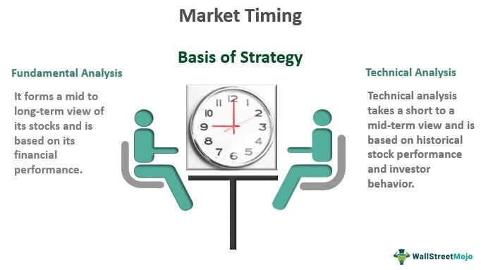

## Table of Contents

## What is timing in financial trading?

Timing in financial trading refers to the specific moments when traders buy or sell assets. It's about choosing the right time to make these moves in order to maximize profits or minimize losses. Traders use various tools and strategies, like technical analysis or market news, to help them decide when to trade. Good timing can make a big difference in how much money a trader makes or loses.

Getting the timing right is tricky because markets can be unpredictable. Even with the best tools and strategies, it's hard to always know the perfect time to buy or sell. That's why many traders spend a lot of time studying the markets and practicing their timing. Over time, they hope to get better at figuring out when to make their moves.

## Why is timing important in trading?

Timing is really important in trading because it can make a big difference in how much money you make or lose. If you buy something at the right time, you might be able to sell it later for a lot more money. But if you buy at the wrong time, you might end up selling for less than you paid, which means you lose money. So, getting the timing right can help you make more money and avoid losing money.

Traders use different tools and strategies to try to get their timing right. They look at charts, read news, and use other information to decide when to buy or sell. Even though it's hard to always get the timing perfect, practicing and learning can help traders get better at it. Over time, good timing can lead to better trading results and more success in the markets.

## How does market timing differ from other trading strategies?

Market timing is a trading strategy where traders try to predict the best times to buy and sell assets based on what they think the market will do next. They use things like charts, news, and other information to guess when prices will go up or down. The goal is to buy low and sell high, making money from the changes in price. This is different from other strategies because it focuses a lot on when to trade, rather than what to trade.

Other trading strategies might focus more on the types of assets to buy or sell, rather than the exact timing. For example, a value investing strategy looks for assets that seem to be priced lower than they should be, and holds onto them for a long time. A [momentum](/wiki/momentum) trading strategy, on the other hand, tries to follow trends and buy assets that are already going up in price, hoping they will keep going up. These strategies care about timing too, but they don't try to predict short-term market movements as much as market timing does.

## What are the basic principles of timing the market?

Timing the market is all about trying to guess when prices will go up or down so you can buy low and sell high. Traders use tools like charts and news to help them make these guesses. They look for patterns or big news that might change prices. The idea is to get in and out of the market at the best times to make more money. It's a bit like trying to catch a wave at just the right moment to surf it to the shore.

But timing the market is really hard because nobody can predict the future perfectly. Even with all the tools and information, the market can still surprise you. That's why it's important to keep learning and practicing. Over time, traders hope to get better at figuring out when to make their moves. Even though it's tough, many traders believe that trying to time the market can help them do better than just buying and holding onto their investments.

## Can you explain the concept of 'buy low, sell high' in relation to timing?

The idea of 'buy low, sell high' is all about trying to make money by buying something when it's cheap and selling it when it's more expensive. In trading, this means you want to buy an asset when its price is low and then sell it later when the price goes up. The timing part is super important because it's all about figuring out when the price is at its lowest and when it's at its highest. If you can time it right, you can make a lot of money.

But getting the timing right is really hard. You have to guess when the price will be low enough to buy and when it will be high enough to sell. Traders use things like charts and news to help them make these guesses. Even though it's tough, many traders believe that trying to time the market and follow the 'buy low, sell high' idea can help them do better than just holding onto their investments for a long time.

## What are some common indicators used for timing trades?

Traders use many different indicators to help them decide when to buy or sell. Some common ones are moving averages, which help show the general direction of a price over time. If a short-term moving average crosses above a long-term one, it might be a good time to buy. Another popular indicator is the Relative Strength Index (RSI), which measures how fast prices are changing. If the RSI is low, it might mean the price is about to go up, so it could be a good time to buy. And if the RSI is high, it might mean the price is about to go down, so it could be a good time to sell.

Another useful indicator is the MACD, or Moving Average Convergence Divergence. This one helps traders see if the price momentum is changing. If the MACD line crosses above the signal line, it might be a good time to buy. If it crosses below, it might be a good time to sell. Volume is also important. If lots of people are buying or selling an asset, it can mean the price might keep moving in that direction. So, if you see high [volume](/wiki/volume-trading-strategy) when the price is going up, it might be a good time to buy, and if you see high volume when the price is going down, it might be a good time to sell.

## How can a beginner start practicing market timing?

A beginner can start practicing market timing by first learning the basics of how the market works. They can read [books](/wiki/algo-trading-books), watch videos, or take online courses to understand what makes prices go up and down. It's also a good idea to start with a practice account, called a demo account, where you can trade with fake money. This way, you can try out different strategies and see how they work without risking any real money. Using tools like moving averages, RSI, and MACD can help you make guesses about when to buy and sell.

Once you feel more comfortable, you can start trading with small amounts of real money. It's important to keep track of your trades and see what works and what doesn't. Over time, you'll get better at figuring out when to make your moves. Remember, market timing is hard, and nobody gets it right all the time. So, be patient and keep learning. With practice and experience, you'll get better at deciding when to buy low and sell high.

## What are the risks associated with trying to time the market?

Trying to time the market can be risky because it's really hard to predict when prices will go up or down. If you guess wrong, you might buy something when it's expensive and then have to sell it when it's cheaper, which means you lose money. Even with all the tools and information, the market can still surprise you. This can lead to big losses if you're not careful.

Another risk is that you might miss out on good opportunities. If you're always waiting for the perfect time to buy or sell, you might end up not trading at all. The market can move quickly, and if you wait too long, you might miss out on making money. So, trying to time the market can make you feel stressed and unsure about what to do next.

## How do experienced traders use technical analysis for better timing?

Experienced traders use technical analysis to look at charts and patterns to help them decide when to buy or sell. They look for things like moving averages, which show the general direction of a price over time. If a short-term moving average crosses above a long-term one, it might be a good time to buy. They also use tools like the Relative Strength Index (RSI) to see if a price is about to change direction. If the RSI is low, it might mean the price is about to go up, so it could be a good time to buy. And if the RSI is high, it might mean the price is about to go down, so it could be a good time to sell.

Another tool they use is the MACD, or Moving Average Convergence Divergence, which helps them see if the price momentum is changing. If the MACD line crosses above the signal line, it might be a good time to buy. If it crosses below, it might be a good time to sell. Volume is also important. If lots of people are buying or selling an asset, it can mean the price might keep moving in that direction. So, if you see high volume when the price is going up, it might be a good time to buy, and if you see high volume when the price is going down, it might be a good time to sell. By using these tools together, experienced traders try to make better guesses about when to make their moves.

## What role does fundamental analysis play in timing financial trades?

Fundamental analysis helps traders decide when to buy or sell by looking at the basic health and value of a company or asset. Traders use things like earnings reports, economic news, and other information to figure out if a company is doing well or if it's a good time to invest. If a company's earnings are better than expected, it might be a good time to buy because the price could go up. On the other hand, if a company is doing poorly, it might be a good time to sell before the price goes down.

While [fundamental analysis](/wiki/fundamental-analysis) is not as focused on short-term timing as technical analysis, it still plays a big role in deciding when to make trades. Traders might use fundamental analysis to spot long-term trends or big changes that could affect prices. For example, if there's news about a new product that could make a company more successful, traders might decide to buy before the price goes up. By combining fundamental analysis with other tools, traders can make better guesses about when to buy low and sell high.

## How can algorithmic trading improve timing in financial markets?

Algorithmic trading can help traders make better timing decisions by using computers to quickly analyze lots of data and make trades at the best times. These computers can look at things like price changes, news, and other information much faster than a person can. This means they can spot good times to buy or sell and do it before the prices change too much. This can be really helpful because the market moves fast, and being able to act quickly can make a big difference in how much money you make or lose.

Another way [algorithmic trading](/wiki/algorithmic-trading) helps with timing is by taking out some of the guesswork and emotions that can mess up a trader's decisions. When people trade, they might get scared or excited and make bad choices. But a computer follows a set of rules and doesn't get emotional. So, it can stick to a plan and make trades at the times that the rules say are best. This can lead to more consistent and better timing in the market, helping traders make more money over time.

## What advanced strategies do expert traders use to optimize their timing?

Expert traders use advanced strategies to make their timing even better. One strategy they use is called pairs trading. This means they look for two assets that usually move together but are not moving together right now. They might buy one asset and sell the other at the same time, betting that they will go back to moving together soon. This can help them make money even when the market is not going up or down a lot. Another strategy is called mean reversion, where they look for prices that have moved a lot away from their average and bet that they will come back to that average soon.

Another advanced strategy is using options to time their trades better. Options let traders buy or sell an asset at a certain price in the future. They can use options to make money if they think the price will go up or down a lot in a short time. This can help them make big profits if they get the timing right. Expert traders also use something called [backtesting](/wiki/backtesting), where they test their timing strategies on old market data to see if they would have worked in the past. This helps them fine-tune their strategies and make them even better for the future.

These strategies help expert traders make more money by getting their timing just right. But they also need to be careful because these strategies can be risky. The market can be unpredictable, and even the best strategies don't always work. So, expert traders always keep learning and adjusting their strategies to stay ahead.

## References & Further Reading

[1]: Aldridge, I. (2013). ["High-Frequency Trading: A Practical Guide to Algorithmic Strategies and Trading Systems,"](https://onlinelibrary.wiley.com/doi/pdf/10.1002/9781119203803.fmatter) 2nd Edition. Wiley.

[2]: Narang, R. K. (2013). ["Inside the Black Box: A Simple Guide to Quantitative and High-Frequency Trading."](https://onlinelibrary.wiley.com/doi/book/10.1002/9781118662717) Wiley.

[3]: Lopez de Prado, M. (2018). ["Advances in Financial Machine Learning."](https://www.amazon.com/Advances-Financial-Machine-Learning-Marcos/dp/1119482089) Wiley.

[4]: Kissell, R. (2013). ["The Science of Algorithmic Trading and Portfolio Management."](https://www.sciencedirect.com/book/9780124016897/the-science-of-algorithmic-trading-and-portfolio-management) Academic Press.

[5]: Chan, E. (2009). ["Quantitative Trading: How to Build Your Own Algorithmic Trading Business."](https://github.com/ftvision/quant_trading_echan_book) Wiley.