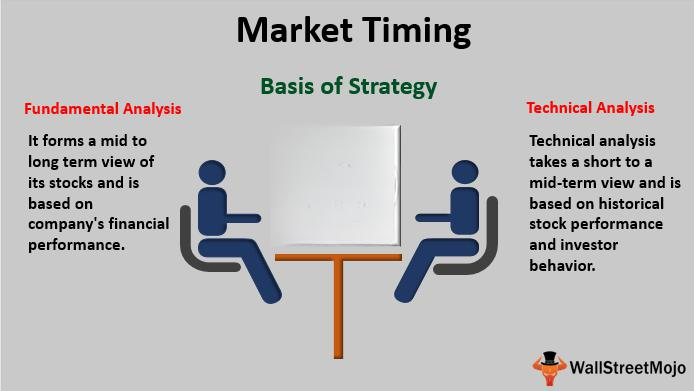

Timing is a pivotal factor in financial trading market strategies, influencing both the potential for profit and the management of risk exposure. Financial markets operate on a continuous basis with trades executed in fractions of a second. As such, the precise timing of market entry and exit can be the difference between profit and loss. This is where algorithmic trading intersects with timing strategies, leveraging technology to optimize trade execution.

Algorithmic trading, or algo trading, is the process of using computer algorithms to automate trading decisions and transactions. This method of trading has transformed modern markets by introducing speed, precision, and the ability to process vast quantities of data. Key elements of algorithmic trading include quantitative data analysis, rule-based decision making, and the execution of trades across various asset classes such as equities, bonds, forex, and derivatives.



The influence of algorithmic trading on market dynamics is significant. By reducing human error and subjective decision-making, algorithms enhance the efficiency and accuracy of transactions. In turn, this impacts liquidity and volatility, as algorithms can react rapidly to market movements and mitigate risk through the execution of predefined strategies.

Traditional trading methods also rely heavily on timing, albeit often through manual analysis and execution. While these methods have historically proven successful, they lack the speed and analytical capacity offered by algorithmic systems. Timing is crucial regardless of the approach, as the market's inherently volatile nature means that opportunities can rapidly appear and disappear.

In algorithmic trading, the integration of sophisticated timing strategies is essential. Algorithms are capable of analyzing real-time data, historical patterns, and market signals to identify optimal trading moments. This capability provides traders with a competitive edge, as it allows for faster and more informed decision-making.

The importance of timing is underscored by its role in securing profitable trades. Market participants must navigate factors such as market trends, news events, and economic indicators, all of which can impact asset prices significantly. By accurately timing trades, investors and traders can capitalize on favorable conditions while minimizing exposure to adverse movements.

This introduction sets the stage for a deeper analysis of strategy timing in algorithmic trading, where precision and technology-driven strategies meet the critical element of timing to enhance trading outcomes. Understanding and mastering timing in trading, both algorithmic and traditional, is fundamental for achieving success in the fast-paced financial markets.

## Table of Contents

## Understanding Financial Trading Market Strategy

Financial trading market strategies are essential for navigating the complexities of the global financial markets. These strategies rely on various key concepts to help traders make informed decisions. At the core, financial trading involves buying and selling assets such as stocks, bonds, foreign exchanges ([forex](/wiki/forex-system)), and derivatives to achieve profit.

**Stocks, Bonds, Forex, and Derivatives**  
Stocks represent ownership in a company and provide the right to a portion of its earnings. Bonds are debt instruments through which issuers, such as governments or corporations, raise capital by promising regular interest payments and returning the principal upon maturity. Forex involves trading currencies against each other, typically around economic events and [interest rate](/wiki/interest-rate-trading-strategies) changes. Derivatives, such as options and futures, derive their value from underlying assets or benchmarks and are used for hedging risks or speculating on price movements.

**Developing a Successful Market Strategy**  
To develop a profitable market strategy, traders often need a solid foundation grounded in market analysis, risk management, and financial understanding. The strategy should align with the trader's goals, risk tolerance, and market conditions.

**Market Analysis: Fundamental and Technical**  
Market analysis is critical in developing market strategies. It includes fundamental and technical analysis. Fundamental analysis evaluates an asset's intrinsic value by examining related economic factors, financial statements, and industry conditions. Technical analysis, on the other hand, analyzes past market data, primarily price and [volume](/wiki/volume-trading-strategy), using charts and statistical indicators to predict future market behavior.

For example, traders might use moving averages to identify trends or the Relative Strength Index (RSI) to detect overbought or oversold market conditions. Python libraries like `pandas` and `matplotlib` can assist in implementing these analyses:

```python
import pandas as pd
import matplotlib.pyplot as plt

# Example data loading and simple moving average calculation
data = pd.read_csv('market_data.csv')  # Load market data
data['SMA_50'] = data['Close'].rolling(window=50).mean()  # 50-day simple moving average

# Plotting the data
plt.figure(figsize=(12,6))
plt.plot(data['Close'], label='Close Price')
plt.plot(data['SMA_50'], label='50-Day SMA', color='orange')
plt.legend()
plt.show()
```

**Impact of Market Cycles on Trading Strategies**  
Market cycles—phases of expansion, peak, contraction, and trough—significantly influence trading strategies. During expansion, traders might adopt growth strategies, focusing on stocks with strong earnings potential. In contrast, defensive strategies, concentrating on stable and dividend-paying stocks, are often preferred during market contractions.

Understanding and adapting to these cycles enable traders to position themselves effectively for long-term success. While the Efficient Market Hypothesis (EMH) suggests that price movements are unpredictable, recognizing cyclical patterns can help traders capitalize on market inefficiencies.

By combining these elements—understanding different trading assets, applying appropriate market analyses, and adapting to market cycles—traders can construct robust strategies tailored to exploit potential opportunities within the financial markets.

## The Role of Timing in Financial Trading

Market timing refers to the strategic approach of making buy or sell decisions of financial assets based on predictions about future market price movements. It plays a pivotal role in financial trading as correctly timing the market can significantly influence the profitability of trading strategies. Historically, successful market timing has contributed to lucrative returns for traders. However, mastering market timing is fraught with complexities and challenges, making it a contested topic in both theoretical and practical domains.

Theoretical frameworks, like the Efficient Market Hypothesis (EMH), challenge the feasibility of market timing by suggesting that it is impossible to consistently achieve returns exceeding average market returns on a risk-adjusted basis, given that asset prices fully reflect all available information. The EMH posits that if markets are efficient, forecasting future price movements, and hence successful market timing, is not feasible. This theory is often contrasted with the behavioral finance perspective, which argues that markets can be subject to irrational behaviors, leading to opportunities for successful timing.

Several historical instances highlight the importance of market timing. For example, investors who exited the stock market before the crash of 1929 or the financial crisis of 2008 preserved their capital and, in many cases, avoided significant losses. These instances underscore the potential for market timing to mitigate downside risk during periods of market turbulence.

Despite its potential, market timing remains complex and challenging due to factors such as market [volatility](/wiki/volatility-trading-strategies), economic unpredictability, and psychological biases. Traders attempting market timing must navigate various unforeseen variables that could impact asset prices. Furthermore, the pressure to predict short-term market movements accurately adds an additional layer of difficulty.

Common tools and techniques for market timing involve both fundamental and technical analysis. Fundamental analysis examines economic indicators, company earnings, and industry trends to determine asset value and timing for trades. Technical analysis, on the other hand, focuses on statistical trends from historical price movement data. Some of the popular technical indicators include moving averages, relative strength index (RSI), and stochastic oscillators, which aim to identify overbought or oversold conditions that might precede a market reversal.

With advancements in computational technologies, [machine learning](/wiki/machine-learning) techniques are increasingly being employed to refine market timing strategies. These include neural networks and other [artificial intelligence](/wiki/ai-artificial-intelligence) algorithms capable of detecting complex patterns that may elude human analysts. However, while technology can enhance precision, it can also introduce risks such as overfitting, where a model performs well on historical data but poorly in real-time market conditions. 

In conclusion, while market timing has the potential to significantly impact trading outcomes, it remains a sophisticated endeavor demanding a nuanced understanding of market dynamics and meticulous application of analytical tools. As traders continue to seek ways to surpass market averages, mastering the intricate balancing act of timing remains as much an art as it is a science.

 to Algorithmic Trading

Algorithmic trading, often referred to as algotrading, is the process of executing trades using pre-programmed instructions based on predetermined criteria. These criteria can include timing, price, and volume, enabling traders to execute orders with minimal human intervention. The rise of [algorithmic trading](/wiki/algorithmic-trading) in modern markets is attributed to technological advancements and increased market complexity, leading to its widespread adoption across various asset classes.

Algorithmic trading can be categorized into different types, such as high-frequency trading ([HFT](/wiki/high-frequency-trading-strategies)), statistical trading, and artificial intelligence-based trading. High-frequency trading leverages extremely fast computational speeds to execute a large number of orders within fractions of a second. This method capitalizes on small price discrepancies that may occur in very short time frames, often employing strategies like market-making and [arbitrage](/wiki/arbitrage).

Statistical algorithms rely on quantitative analysis and statistical models to identify and exploit market inefficiencies. These algorithms are typically driven by historical data analysis, pattern recognition, and [statistical arbitrage](/wiki/statistical-arbitrage) strategies that attempt to profit from minute and systematic price movements.

Artificial intelligence-based algorithms utilize machine learning techniques to learn from data and improve their trading strategies over time. Unlike traditional methods that rely on static rules, AI-based algorithms can adapt and refine their operations based on new information, potentially leading to more robust trading outcomes.

The optimization of trading through algorithmic approaches primarily revolves around speed and precision. Algorithms operate at high speeds, far exceeding human capabilities, thereby enabling traders to capitalize on fleeting market opportunities. Additionally, these algorithms execute trades with precision, reducing the impact of emotional decision-making and increasing the likelihood of successful trade execution.

The benefits and efficiencies brought by algorithmic trading are significant. It enhances the [liquidity](/wiki/liquidity-risk-premium) and depth of markets, facilitating quicker trade execution and tighter spreads. Furthermore, algotrading enables scalability, allowing traders to manage large volumes of transactions without a proportional increase in personnel. It also ensures consistency in trade execution, as algorithms strictly adhere to their predefined criteria, minimizing the risk of human error.

Overall, algorithmic trading has transformed modern trading practices, providing a competitive edge through its ability to process vast amounts of data rapidly and execute trades efficiently. As the technology continues to evolve, its influence on market dynamics and trading strategies is expected to grow even further.

## Key Algorithmic Trading Strategies

Algorithmic trading has revolutionized financial markets by employing systematic trading strategies that leverage technological advances and quantitative analysis. Among the myriad of strategies, [trend following](/wiki/trend-following), arbitrage, and mean reversion stand out as foundational techniques in algorithmic trading. Understanding these strategies involves exploring their mechanics, implications, and their integration with market timing algorithms.

### Trend Following

Trend following strategies are based on the belief that financial instruments that have been trending upward or downward will continue to do so. Algorithms in this domain typically rely on [momentum](/wiki/momentum) indicators and moving averages to identify and exploit market trends. A common approach is the moving average crossover strategy, where a buy signal is generated when a short-term moving average crosses above a long-term moving average, suggesting an upward trend.

Python Example for Trend Following Strategy Using Moving Averages:
```python
import numpy as np
import pandas as pd

def moving_average_crossover(signals, short_window=40, long_window=100):
    """
    Implement a moving average crossover strategy.
    """
    signals['Short_Moving_Avg'] = signals['Close'].rolling(window=short_window, min_periods=1, center=False).mean()
    signals['Long_Moving_Avg'] = signals['Close'].rolling(window=long_window, min_periods=1, center=False).mean()
    signals['Signal'] = 0.0
    signals['Signal'][short_window:] = np.where(signals['Short_Moving_Avg'][short_window:] > signals['Long_Moving_Avg'][short_window:], 1.0, 0.0)   
    signals['Positions'] = signals['Signal'].diff()
    return signals
```

### Arbitrage

Arbitrage strategies capitalize on price discrepancies of the same asset across different markets or in derivative forms. In its simplest form, arbitrage involves buying low in one market and simultaneously selling high in another. Algorithmic trading maximizes the efficiency of arbitrage by rapidly executing trades to exploit fleeting opportunities, often employing statistical models to identify mispricings.

### Mean Reversion

The mean reversion strategy operates under the assumption that asset prices will revert to a long-term mean or average. This strategy is predicated on the identification of overbought or oversold conditions. Quantitative techniques such as Bollinger Bands or moving averages are frequently used to estimate the mean and identify reversion points.

### Market Timing Algorithms

Market timing algorithms are designed to predict market movements and allocate capital accordingly. These algorithms analyze vast datasets to identify patterns or anomalies that precede market shifts. They are particularly adept at optimizing entry and [exit](/wiki/exit-strategy) points to reduce risk and enhance returns. The use of machine learning models has further refined the predictive power of market timing algorithms, allowing them to adapt to new market conditions rapidly.

### Index Fund Rebalancing

Algorithmic trading plays a vital role in the rebalancing of index funds, ensuring that the fund's asset composition mirrors its underlying index. Algorithms execute rebalancing in a manner that minimizes tracking error and trading costs. They assess liquidity, market impact, and timing to execute large trades efficiently, which is essential for maintaining fund performance.

### Impact on Market Liquidity and Volatility

Algorithmic trading strategies significantly affect market liquidity and volatility. While they provide liquidity by executing high volumes of trades, they can also contribute to market volatility, especially when multiple algorithms react simultaneously to market events. The rapid speed and volume of trades can lead to price fluctuations, sometimes resulting in flash crashes where markets experience abrupt, severe drops in asset prices.

In conclusion, while algorithmic trading strategies offer substantial benefits in terms of efficiency and precision, they also present challenges in terms of market impact. Traders and institutions must employ sophisticated risk management and regulatory compliance to ensure the stability and fairness of markets.

## Integrating Timing with Algorithmic Trading

### Integrating Timing with Algorithmic Trading

Market timing strategies are essential for making informed trading decisions by predicting price movements. Algorithmic trading, which employs automated systems and sophisticated algorithms, significantly enhances timing precision while minimizing human error. These algorithms analyze vast datasets at speeds unattainable by human traders, adjusting to market changes quickly and executing trades with precision.

Algorithms achieve superior timing precision through the utilization of machine learning models and statistical techniques that detect patterns and potential price movements. For instance, high-frequency trading (HFT) algorithms execute a large number of orders within milliseconds, exploiting small price differences across venues. The speed of these trades reduces latency, optimizing timing, and efficiently capitalizing on arbitrage opportunities.

Case studies show the effectiveness of accurate timing in algorithmic trading. For example, the implementation of Statistical Arbitrage—a strategy relying on the historical correlation of asset prices—demonstrates how algorithms can make real-time calculations to identify temporary mispricings. Such systems quickly initiate trades to exploit these inefficiencies before prices revert to their mean. Another instance involves the use of momentum-based strategies where algorithms rely on recent price trends to make buy or sell decisions, capturing profits from sustained market directions.

However, integrating timing strategies with algorithmic trading presents challenges and risks. One major risk is the potential overfitting of models, where algorithms perform excellently on historical data but fail to predict future trends accurately. Furthermore, technological failures such as downtime or bugs in trading software can lead to significant financial losses.

Another challenge is the volatility induced by algorithmic trading itself. High-speed executions can exacerbate market fluctuations, leading to events like the "Flash Crash" of 2010, where rapid algorithmic trading contributed to a brief but dramatic drop in U.S. stock prices. Regulatory challenges also arise as financial authorities look to monitor and mitigate the risks posed by these algorithms to ensure fair market practices.

Mitigating these risks involves incorporating robust risk management frameworks and diversification strategies. Algorithms must be continually assessed and adapted to handle changing market dynamics, ensuring that their predictive capabilities remain effective. As traders and firms advance in integrating timing with algorithmic trading, understanding these complexities is crucial for maximizing profits while minimizing risks.

## Risks and Challenges in Timing and Algo Trading

Algorithmic trading, characterized by its reliance on complex mathematical models and high-speed computations, is not without its risks and challenges. Despite its potential to optimize the timing and execution of trades, inherent pitfalls such as technology failures and over-optimization present considerable concerns.

Technology failures can significantly disrupt trading operations. Systems that execute trades at lightning speed rely heavily on the robustness of hardware and software infrastructures. Network outages, hardware malfunctions, and software glitches can lead to execution errors, missed opportunities, or unintended trades. These failures highlight the importance of having robust, redundant systems and effective backup protocols to minimize potential downtimes.

Over-optimization, often referred to as "curve fitting," occurs when a trading algorithm is excessively tailored to historical data. While this may generate impressive [backtesting](/wiki/backtesting) results, it often fails under live trading conditions as the market environment changes. Algorithms that are too finely tuned to past data are less adaptable to future, unforeseen scenarios, leading to poor performance and potential losses.

Regulatory challenges also pose significant considerations. As algorithmic trading increases in volume and complexity, regulatory bodies worldwide face the task of ensuring fairness, transparency, and stability in the markets. Regulations may include restrictions on trading speeds or mandates for system testing. Moreover, oversight aims to prevent manipulative practices such as spoofing, where traders place fake orders to manipulate stock prices. Ensuring compliance with evolving regulations is crucial for traders to avoid legal repercussions and maintain market integrity.

Algorithms, if unchecked, have the potential to lead to market instability. High-frequency trading, a subset of algorithmic trading, can contribute to market volatility, as evidenced by events like the "Flash Crash" of 2010, where the stock market suddenly plummeted within minutes. Such incidents can erode investor confidence and disrupt the normal functioning of market dynamics.

To mitigate these risks, diversification and risk management play pivotal roles. Diversification across different asset classes, markets, and strategies can reduce the impact of potential adverse market movements on a portfolio. Risk management strategies, such as setting stop-loss limits and continuously monitoring risk exposure, are vital in minimizing potential losses. Furthermore, incorporating machine learning techniques can enhance an algorithm's adaptability to changing market conditions, improving its resilience and performance over time.

By understanding and addressing these challenges, traders can leverage the strengths of algorithmic trading while minimizing the associated risks. This requires a balanced approach that blends technological innovation with stringent oversight and risk management practices.

## The Future of Timing in Algo Trading

Advancements in technology are continuously shaping the landscape of financial trading, particularly in the context of algorithmic trading. Emerging technologies such as machine learning and artificial intelligence (AI) are pivotal in refining timing strategies. Machine learning algorithms excel in identifying patterns within large datasets, making them particularly useful for predicting market movements. These algorithms analyze multiple variables such as historical prices, trading volumes, and economic indicators to make more informed decisions on entry and exit points in the market. AI models can dynamically learn from new data, thus improving their predictive accuracy over time.

One promising application is the use of [reinforcement learning](/wiki/reinforcement-learning), a subset of AI where algorithms learn optimal trading strategies through trial and error interactions with market simulations. This method allows systems to develop sophisticated timing strategies without a predefined dataset, adjusting to changes in market conditions in real-time. The following Python snippet illustrates a simple reinforcement learning framework that could be adapted for trading strategies:

```python
import gym
import numpy as np

# Define a simple trading environment
class TradingEnv(gym.Env):
    def __init__(self):
        self.action_space = gym.spaces.Discrete(3)  # Buy, Hold, Sell
        self.observation_space = gym.spaces.Box(low=0, high=1, shape=(1,))

    def reset(self):
        return np.random.rand(1)

    def step(self, action):
        state = np.random.rand(1)
        reward = state[0] * (1 if action == 0 else -1)  # Simplified reward calculation
        done = False
        return state, reward, done, {}

env = TradingEnv()

# Placeholder for Q-learning setup
Q = np.zeros((env.observation_space.shape[0], env.action_space.n))
```

In addition to technological advancements, evolving algorithms have the potential to unlock new market opportunities. For instance, real-time data analytics paired with increased computational power enables the discovery of arbitrage opportunities that were previously too small or too rapid to capture. Furthermore, enhanced data processing capabilities facilitate the emergence of new trading instruments that require precise timing, such as cryptocurrencies and tokenized assets.

The rapid development in these areas underscores the importance of continuous learning and adaptation in trading. Traders and firms need to stay informed about technological progress and incorporate these innovations into their strategies to remain competitive. This necessity for ongoing education is critical, as the trading environment becomes increasingly complex with the integration of novel technologies. Firms that prioritize adaptive learning can better navigate the complexities beyond traditional market behaviors, thereby leveraging emerging tools for optimized trading outcomes.

In conclusion, the future of timing in algorithmic trading is intrinsically linked with technological progress. Machine learning and AI continue to refine trading strategies, while new algorithms present fresh opportunities. To capitalize on these innovations, traders must embrace a culture of continuous learning and adaptability.

## Conclusion

Timing is a pivotal [factor](/wiki/factor-investing) in financial trading markets, determining the success of both investment and speculative endeavors. It dictates entry and exit points, aligning trades with market movements to boost profitability. The precision in timing not only minimizes risks associated with unexpected market fluctuations but also maximizes gains by capitalizing on favorable price changes. It is the cornerstone of both traditional and algorithmic trading methods, and its significance cannot be overstated.

Algorithmic trading has profoundly transformed timing strategies. By harnessing computational power, algorithms execute trades at speeds and accuracies far beyond human capability. This automation reduces emotional biases that can cloud judgment and allows traders to exploit minute market inefficiencies swiftly. As a result, the operational efficiency and precision timing provided by algorithms have revolutionized the trading landscape, presenting traders with unparalleled opportunities to enhance their strategies.

To reap the maximum benefits from algorithmic trading, staying informed about technological advancements and market dynamics is crucial. The rapid evolution in trading technologies, including machine learning and AI, continues to redefine timing strategies. Traders must be adaptive, integrating new tools and techniques to stay competitive. Continuous education on emerging market trends and technological advancements is essential for leveraging these capabilities effectively.

However, while the potential rewards are significant, algorithmic trading comes with its challenges. Balancing risks and opportunities requires a comprehensive understanding of both market mechanics and the algorithms employed. Over-reliance on technology can expose traders to technological failures and market anomalies, necessitating robust risk management practices. Employing diversification and maintaining a vigilant approach to trading strategy adjustments can mitigate such risks, ensuring traders are well-positioned to capitalize on market opportunities safely and efficiently.

In conclusion, the integration of precise timing with algorithmic trading offers a transformative edge. By maintaining a balance between embracing innovative strategies and managing inherent risks, traders can optimize outcomes and sustain success in the ever-evolving financial markets.

## References & Further Reading

[1]: Aldridge, I. (2013). ["High-Frequency Trading: A Practical Guide to Algorithmic Strategies and Trading Systems,"](https://onlinelibrary.wiley.com/doi/pdf/10.1002/9781119203803.fmatter) 2nd Edition. Wiley.

[2]: Narang, R. K. (2013). ["Inside the Black Box: A Simple Guide to Quantitative and High-Frequency Trading."](https://onlinelibrary.wiley.com/doi/book/10.1002/9781118662717) Wiley.

[3]: Lopez de Prado, M. (2018). ["Advances in Financial Machine Learning."](https://www.amazon.com/Advances-Financial-Machine-Learning-Marcos/dp/1119482089) Wiley.

[4]: Kissell, R. (2013). ["The Science of Algorithmic Trading and Portfolio Management."](https://www.sciencedirect.com/book/9780124016897/the-science-of-algorithmic-trading-and-portfolio-management) Academic Press.

[5]: Chan, E. (2009). ["Quantitative Trading: How to Build Your Own Algorithmic Trading Business."](https://github.com/ftvision/quant_trading_echan_book) Wiley.