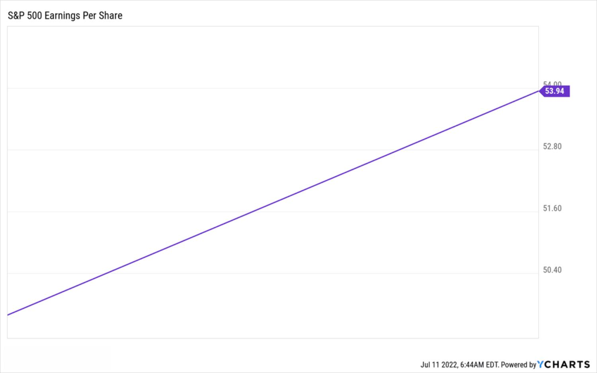

## Table of Contents

## What is earnings season?

Earnings season is a time when many companies release their financial reports for the last quarter. This usually happens four times a year, around the same time. It's important because investors and analysts want to know how much money the companies made and how well they are doing.

During earnings season, companies share details about their profits, losses, and other financial information. This can affect the stock market because if a company does better than expected, its stock price might go up. If it does worse, the stock price might go down. People watch earnings season closely to make decisions about buying or selling stocks.

## When does earnings season typically occur?

Earnings season usually happens four times a year. It starts about a month after the end of each quarter. So, for the first quarter ending in March, earnings season starts in April. For the second quarter ending in June, it starts in July. The third quarter ends in September, so earnings season starts in October. And for the fourth quarter ending in December, earnings season starts in January.

During these times, lots of companies share their financial reports all at once. This makes it a busy time for people who invest in stocks. They look at these reports to see if companies made more or less money than they expected. If a company does well, its stock price might go up. If it doesn't do well, the stock price might go down. That's why earnings season is important for people who buy and sell stocks.

## Why is the timing of earnings season important for investors?

The timing of earnings season is important for investors because it tells them when they can expect to see new financial information from companies. This information helps investors decide if they want to buy, sell, or keep their stocks. If a company does better than people thought it would, its stock price might go up. If it does worse, the stock price might go down. So, knowing when earnings season happens helps investors plan their moves.

Also, earnings season happens around the same time every three months. This regular schedule lets investors prepare and look at many companies' reports at once. They can compare how different companies are doing and make better choices about where to put their money. If investors miss the earnings reports, they might not have all the information they need to make good decisions about their investments.

## How does the timing of earnings season affect stock prices?

The timing of earnings season can make stock prices go up or down. When companies share their earnings reports, investors look at how much money the company made. If a company makes more money than people thought it would, its stock price might go up because investors think it's doing well. But if the company makes less money than expected, its stock price might go down because investors might worry about the company's future.

Earnings season happens about a month after the end of each quarter. This regular schedule helps investors know when to expect new information. During this time, many companies share their reports all at once, so it can be a busy time. If investors see that a lot of companies are doing well, it might make the whole stock market go up. But if many companies are not doing well, it could make the stock market go down. So, the timing of earnings season can have a big impact on what happens with stock prices.

## What are the key dates to watch during earnings season?

During earnings season, the key dates to watch are when big companies share their earnings reports. This usually starts about a month after the end of each quarter. So, for the first quarter ending in March, you'll see reports starting in April. For the second quarter ending in June, reports come out in July. The third quarter ends in September, so reports start in October. And for the fourth quarter ending in December, reports come out in January.

These dates are important because they tell you when new information about how companies are doing will be available. Investors look at these reports to decide if they want to buy or sell stocks. If a company does better than expected, its stock price might go up. If it does worse, the stock price might go down. So, knowing when these reports come out helps you plan what to do with your investments.

## How do companies schedule their earnings releases during earnings season?

Companies usually schedule their earnings releases to come out a month after the end of each quarter. This means that if a quarter ends in March, companies will start sharing their earnings reports in April. The same goes for the other quarters: June earnings come out in July, September earnings in October, and December earnings in January. This regular schedule helps everyone know when to expect new financial information.

During earnings season, companies often try to pick a date and time that works well for them. Some might choose to release their reports early in the morning before the stock market opens, while others might do it after the market closes. This timing can affect how quickly the stock price reacts to the news. Companies also consider what other big companies are doing, trying not to release their reports at the same time as others to stand out more.

## What factors influence the timing of a company's earnings report?

Companies usually plan to release their earnings reports about a month after the end of each quarter. This means if a quarter ends in March, they will share their reports in April. The same goes for the other quarters: June earnings come out in July, September earnings in October, and December earnings in January. This regular schedule helps everyone know when to expect new financial information.

When [picking](/wiki/asset-class-picking) the exact date and time, companies think about a few things. Some might choose to release their reports early in the morning before the stock market opens, while others might do it after the market closes. This timing can affect how quickly the stock price reacts to the news. Companies also look at what other big companies are doing, trying not to release their reports at the same time as others to stand out more.

## How can investors prepare for earnings season?

Investors can get ready for earnings season by doing a few things. First, they should make a list of the companies they care about and find out when those companies will share their earnings reports. This helps them know when to look for new information. They can also read what experts think about these companies and see if there are any guesses about how much money the companies will make. This can give them a good idea of what to expect.

Next, investors should think about what they might do with their stocks after they see the earnings reports. If a company does better than people thought, its stock price might go up, and investors might want to buy more of that stock. But if a company does worse than expected, its stock price might go down, and investors might want to sell some of their stock. By planning ahead, investors can make better choices during earnings season and not feel rushed when the reports come out.

## What are the differences in earnings season timing across different industries?

Earnings season timing is pretty much the same for most companies, no matter what industry they are in. It usually starts about a month after the end of each quarter. So, if a quarter ends in March, companies start sharing their earnings reports in April. The same goes for the other quarters: June earnings come out in July, September earnings in October, and December earnings in January. This regular schedule helps everyone know when to expect new financial information.

However, some industries might have a little different timing. For example, big banks and financial companies often share their earnings reports earlier in the season. They do this because their reports can affect the whole stock market, so people want to see them first. Other industries, like tech companies, might spread out their reports over a longer time. This can help them stand out and not get lost in the crowd when lots of companies are sharing their reports at the same time.

## How does global earnings season timing impact international investing?

Global earnings season timing can make a big difference for people who invest in companies from different countries. In the United States, earnings season starts about a month after the end of each quarter. But in other countries, the timing might be a little different. For example, some European companies might share their earnings reports at a different time than American companies. This means that investors who have stocks from all over the world need to keep track of many different schedules. They have to know when each company will share its earnings report so they can make good choices about buying or selling stocks.

Because of these different schedules, international investing can be more complicated during earnings season. If an investor has stocks in both American and European companies, they might see earnings reports coming out at different times. This can affect how they plan their investments. For example, if a European company does really well, its stock price might go up, and the investor might want to buy more of that stock. But if they are waiting for an American company's report, they might need to wait a bit longer before making a decision. Keeping track of all these different timings helps investors stay on top of their investments and make the best choices possible.

## What advanced strategies can investors use during earnings season to maximize returns?

During earnings season, investors can use a few smart strategies to try to make more money. One way is to look at what experts think about a company before its earnings report comes out. If experts think the company will do well, and it does even better than they thought, the stock price might go up a lot. Investors can buy the stock before the report comes out and then sell it after the price goes up. Another strategy is to use options. Options let investors bet on whether a stock will go up or down without having to buy the stock itself. If an investor thinks a company's stock will go up after its earnings report, they can buy a call option. If they think it will go down, they can buy a put option.

Another advanced strategy is to look at how a company's earnings report might affect other companies in the same industry. If one company does really well, it might mean that other companies in the same industry will do well too. Investors can buy stocks in those other companies before their earnings reports come out, hoping their stock prices will go up. Also, investors can pay attention to what company leaders say during their earnings calls. Sometimes, they give hints about what they think will happen in the future. If an investor hears something good, they might want to buy more of that company's stock. If they hear something bad, they might want to sell some of their stock. By using these strategies, investors can try to make the most money during earnings season.

## How have historical trends in earnings season timing affected long-term investment strategies?

Over the years, the timing of earnings season has stayed pretty much the same, happening about a month after the end of each quarter. This regular schedule has helped long-term investors plan their moves better. They know when to expect new financial information from companies, so they can decide if they want to keep, buy, or sell their stocks. For example, if an investor sees that a company usually does well during a certain time of year, they might hold onto that stock and wait for the earnings report to come out. This can help them make more money over time because they are ready for the ups and downs in stock prices.

Also, because earnings season happens at the same time every year, investors can look at how companies did in the past during these times. They can see if there are patterns, like if a company always does better in one quarter than another. This information can help them make better long-term investment choices. For example, if a company usually has strong earnings in the fourth quarter, an investor might decide to buy more of that stock before that time. By understanding these historical trends, investors can build a strategy that helps them do well over the long run.

## References & Further Reading

[1]: Bergstra, J., Bardenet, R., Bengio, Y., & Kégl, B. (2011). ["Algorithms for Hyper-Parameter Optimization."](https://dl.acm.org/doi/10.5555/2986459.2986743) Advances in Neural Information Processing Systems 24.

[2]: ["Advances in Financial Machine Learning"](https://www.amazon.com/Advances-Financial-Machine-Learning-Marcos/dp/1119482089) by Marcos Lopez de Prado

[3]: ["Evidence-Based Technical Analysis: Applying the Scientific Method and Statistical Inference to Trading Signals"](https://www.amazon.com/Evidence-Based-Technical-Analysis-Scientific-Statistical/dp/0470008741) by David Aronson

[4]: ["Machine Learning for Algorithmic Trading"](https://github.com/PacktPublishing/Machine-Learning-for-Algorithmic-Trading-Second-Edition) by Stefan Jansen

[5]: ["Quantitative Trading: How to Build Your Own Algorithmic Trading Business"](https://books.google.com/books/about/Quantitative_Trading.html?id=j70yEAAAQBAJ) by Ernest P. Chan

[6]: Fama, E. F., & French, K. R. (1993). ["Common risk factors in the returns on stocks and bonds,"](https://www.sciencedirect.com/science/article/pii/0304405X93900235) Journal of Financial Economics, 33(1), 3-56.

[7]: Bartram, S., & Bodnar, G. (2009). ["No place to hide: The global crisis in equity markets in 2008/2009,"](https://www.sciencedirect.com/science/article/pii/S0261560609000941) Journal of International Money and Finance.

[8]: Liu, Y., & Qian, E. (2010). ["Earnings Surprises Do Matter: What We Can Learn From PEAD."](https://onlinelibrary.wiley.com/doi/10.1002/adfm.202003619) CFA Institute.

[9]: Tetlock, P. C. (2007). ["Giving Content to Investor Sentiment: The Role of Media in the Stock Market,"](https://www.columbia.edu/~pt2238/papers/Tetlock_Media_Sentiment_JF.pdf) Journal of Finance, 62(3), 1139-1168.