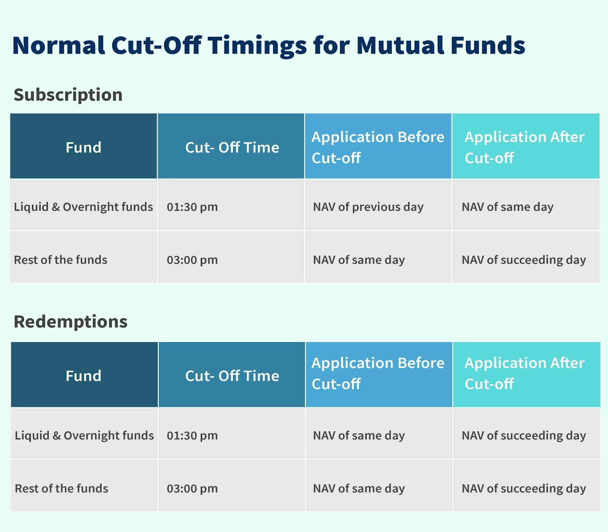

## Table of Contents

## What is a mutual fund?

A mutual fund is a type of investment where many people put their money together to buy a variety of stocks, bonds, or other assets. It's like a big basket where everyone chips in to own a piece of many different things. A professional manager picks what goes into the basket, trying to make the best choices to grow the money over time.

When you invest in a mutual fund, you buy shares of the fund. The value of your shares goes up or down based on how well the investments in the basket are doing. Mutual funds are popular because they let you spread your money across many different investments, which can be less risky than putting all your money into just one thing. Plus, it's easier than trying to pick and manage all those investments yourself.

## Why is the timing of mutual fund price updates important?

The timing of mutual fund price updates is important because it tells you the value of your investment at a specific time. Mutual funds update their prices once a day, usually after the market closes. This is called the Net Asset Value (NAV). Knowing the NAV helps you decide if you want to buy more shares, sell what you have, or just keep things as they are. If you're thinking about buying or selling, you need to know the latest price to make a good choice.

Also, the timing can affect how much money you make or lose. If you buy shares right before the price goes up, you might make more money. But if you buy right before the price drops, you could lose money. Since mutual funds only update their prices once a day, you need to think carefully about when you make your moves. Waiting for the next day's price could mean a better or worse deal, depending on what happens in the market.

## How often are mutual fund prices updated?

Mutual fund prices are updated once every day. This happens after the stock market closes, usually around 4 p.m. Eastern Time. The price you see is called the Net Asset Value, or NAV, and it shows what each share of the mutual fund is worth at that time.

Knowing when the prices are updated is important because it helps you decide if you want to buy or sell shares. If you want to buy or sell, you have to wait until the next day's NAV is calculated. This means you need to think about what might happen in the market overnight before making your decision.

## What time of day are mutual fund prices typically updated?

Mutual fund prices are usually updated once a day, after the stock market closes. This happens around 4 p.m. Eastern Time. The price you see is called the Net Asset Value, or NAV. It tells you what each share of the mutual fund is worth at that time.

Knowing when the prices are updated is important because it helps you decide if you want to buy or sell shares. If you want to buy or sell, you have to wait until the next day's NAV is calculated. This means you need to think about what might happen in the market overnight before making your decision.

## Can mutual fund prices be updated more frequently than daily?

Mutual fund prices are usually updated just once a day, after the stock market closes at around 4 p.m. Eastern Time. This daily update is called the Net Asset Value, or NAV. It tells you what each share of the mutual fund is worth at that time. The reason they do it this way is because mutual funds hold a lot of different things like stocks and bonds, and it takes time to figure out the value of all those things at the end of the day.

Some people might wonder if mutual fund prices can be updated more often than once a day. The short answer is no, they can't. Mutual funds are set up to give you a price once a day because that's how they're designed to work. If you want to know the price more often, you might want to look at other types of investments, like exchange-traded funds (ETFs), which update their prices all day long while the market is open.

## How does the timing of price updates affect buying and selling decisions?

The timing of mutual fund price updates is important because it affects when you can buy or sell shares. Mutual funds update their prices just once a day, after the stock market closes at around 4 p.m. Eastern Time. This means if you want to buy or sell shares, you have to wait until the next day's price is calculated. Knowing this, you need to think about what might happen in the market overnight before making your decision.

For example, if you think the market might go up the next day, you might want to wait and buy at the higher price because you think the fund will keep growing. On the other hand, if you think the market might go down, you might want to sell your shares before the price drops. Because you can't know the exact price until the next day, you have to guess based on what you think will happen. This can be a bit tricky, but it's part of making smart choices with mutual funds.

## What is the 'net asset value' (NAV) and how is it related to price updates?

The 'net asset value' or NAV is the price of one share of a mutual fund. It's calculated by taking the total value of all the things the mutual fund owns, like stocks and bonds, and then subtracting any money the fund owes. This total value is then divided by the number of shares people own in the fund. The NAV tells you how much each share is worth at the end of the day.

The NAV is important because it's the price you see when you want to buy or sell shares in a mutual fund. Since mutual funds update their NAV once a day, after the stock market closes, you have to wait until the next day to know the price. This means if you want to buy or sell, you need to think about what might happen in the market overnight and decide if you want to wait for the next day's price.

## How do different types of mutual funds handle price update timing?

All types of mutual funds, whether they focus on stocks, bonds, or a mix of both, update their prices once a day, after the stock market closes. This happens around 4 p.m. Eastern Time. The price you see is called the Net Asset Value, or NAV. It shows what each share of the mutual fund is worth at that time. No matter what kind of mutual fund it is, you have to wait until the next day to know the new price if you want to buy or sell shares.

Some people might wonder if different types of mutual funds could update their prices at different times. But they don't. All mutual funds work the same way when it comes to updating their prices. This is because figuring out the value of everything a mutual fund owns takes time, and it's done at the end of each day. So, whether you're looking at a stock fund, a bond fund, or a fund that mixes different kinds of investments, you'll always see the new price the next day after the market closes.

## What are the regulatory requirements for mutual fund price updates?

The rules for updating mutual fund prices come from the U.S. Securities and Exchange Commission (SEC). They say that mutual funds have to calculate their Net Asset Value, or NAV, once every day after the stock market closes. This is to make sure everyone gets a fair price when they buy or sell shares. The SEC wants to keep things clear and honest, so they set these rules to protect people who invest in mutual funds.

Mutual funds have to follow these rules no matter what kind of investments they hold, like stocks or bonds. The daily update helps keep the price of the fund clear and easy to understand for everyone. If a mutual fund doesn't follow these rules, the SEC can take action to make sure things are done right. This way, people can trust that the prices they see are correct and fair.

## How do international mutual funds handle time zone differences in price updates?

International mutual funds, like all mutual funds, update their prices once a day after the stock market closes. But because they invest in different countries, they have to think about time zones. If a fund invests in places like Japan or Australia, their markets close at different times than the U.S. market. To keep things fair, international mutual funds usually use the closing prices from all the markets they invest in to figure out their Net Asset Value, or NAV. This means they might wait until all the markets they care about have closed for the day before they update their price.

Even with time zone differences, the goal is to make sure everyone gets a fair price when they buy or sell shares. So, if you're investing in an international mutual fund, you still have to wait until the next day to know the new price, just like with any other mutual fund. The fund will take the closing prices from all the different markets, add them up, and then tell you what each share is worth. This way, no matter where the investments are, everyone gets the same information at the same time.

## What technological systems are used to manage mutual fund price updates?

Mutual funds use special computer systems to manage their price updates. These systems are designed to gather all the information about what the fund owns, like stocks and bonds, and figure out the value of everything at the end of the day. They take the closing prices from the stock market and other markets where the fund invests, add them all up, and then divide by the number of shares to find the Net Asset Value, or NAV. This process is done automatically by the computer to make sure it's quick and accurate.

Once the NAV is calculated, the system updates the price on the mutual fund's website and other places where people can see it. This helps everyone know the new price the next day when they want to buy or sell shares. The technology also keeps track of all the buying and selling that happens, making sure everything is done fairly and according to the rules set by the SEC. This way, the system helps keep the mutual fund running smoothly and keeps investors informed about their investments.

## How can investors access real-time or near real-time mutual fund price information?

Investors can't get real-time or near real-time mutual fund price information because mutual funds update their prices just once a day, after the stock market closes. This means you have to wait until the next day to see the new price. The price you see is called the Net Asset Value, or NAV, and it tells you what each share of the mutual fund is worth at that time.

If you want to know how your mutual fund is doing more often, you might want to look at other types of investments, like exchange-traded funds (ETFs). ETFs update their prices all day long while the market is open, so you can see what's happening in real-time. But for mutual funds, you'll have to wait until the next day to get the latest price.

## What is the understanding of Mutual Fund Prices and Net Asset Value (NAV)?

Mutual fund pricing is fundamentally based on the calculation of the Net Asset Value (NAV), which is a crucial metric for investors engaging with mutual funds. NAV is calculated once per day, typically at the close of the trading day, providing a snapshot of the fund's value. The formula for computing NAV is given by:

$$
\text{NAV} = \frac{\text{Total Assets} - \text{Total Liabilities}}{\text{Number of Shares Outstanding}}
$$

This equation ensures that investors are consistently informed about the current value of their holdings. The NAV is significant because it reflects the per-share value of a mutual fund, serving as a baseline for transactions, whether investors are buying or selling shares.

Understanding NAV is essential, as it is a fundamental component that differentiates between open-end and closed-end funds. Open-end funds, the more common type, allow unlimited investment as they continually issue new shares to investors. The NAV plays a pivotal role in these funds, as shares are bought and sold at the NAV price, ensuring alignment with the current market value of the assets.

Conversely, closed-end funds operate differently. These funds issue a fixed number of shares at the time of the initial public offering (IPO), and subsequently, these shares are traded on the stock market like regular stocks. The market price of closed-end funds can be higher or lower than the NAV, influenced by supply and demand dynamics, among other factors. Therefore, while NAV is a reference point, the actual trading price is determined by the market.

Investors’ decision-making can benefit from understanding these distinctions. Open-end funds, with their emphasis on NAV, offer transparency and [liquidity](/wiki/liquidity-risk-premium), suitable for those seeking flexibility in their investments. In contrast, closed-end funds may appeal to investors who are willing to navigate the nuances of market pricing for potentially higher dividends or capital appreciation.

In summary, the calculation and understanding of NAV are indispensable for investors in mutual funds. It not only provides a clear and consistent valuation method but also allows investors to make strategic choices between open-end and closed-end fund structures based on their investment objectives and risk tolerance.

## What is the Importance of Daily Price Updates?

In the evolving world of finance, daily price updates play a pivotal role in ensuring that investors are equipped with the latest information necessary to make informed investment decisions. Mutual fund prices, represented by the net asset value (NAV), are typically updated once every trading day after the stock market closes, usually between 4 p.m. and 6 p.m. EST. This crucial process involves calculating the NAV by dividing the total value of a fund's assets minus its liabilities by the number of shares outstanding. The formula for NAV can be expressed as:

$$
\text{NAV} = \frac{\text{Total Assets} - \text{Total Liabilities}}{\text{Number of Shares Outstanding}}
$$

Daily price updates are essential for maintaining accurate pricing of mutual fund shares. Accurate NAV calculations ensure that the value of an investor's holding is reflective of current market conditions, aiding in transparency and fairness. This accuracy is crucial, particularly in environments of economic turbulence or uncertainty, where fluctuations in the value of underlying asset components are expected. Market [volatility](/wiki/volatility-trading-strategies) can significantly impact daily NAV calculations, as the prices of stocks and other assets held within a mutual fund can change rapidly. As markets respond to economic reports, geopolitical events, and shifts in investor sentiment, these variations must be captured accurately in the daily NAV.

The implications of price updates not being constant or timely can be far-reaching. Inconsistent or delayed updates can result in asset mispricing, potentially causing investors to buy or sell shares based on outdated information. This can lead to [arbitrage](/wiki/arbitrage) opportunities, where savvy traders exploit the difference between an asset's perceived and actual value, potentially resulting in a loss for less informed investors.

In the context of mutual funds, routine and precise daily price updates are critical. They assure investors of reliable data, reduce the risk of mispricing, and facilitate sound trading decisions. As technology and data analytics continue to evolve, the mechanisms for ensuring timely and accurate NAV calculations will likely become more sophisticated, benefiting the broader investment community.

## References & Further Reading

[1]: Bergstra, J., Bardenet, R., Bengio, Y., & Kégl, B. (2011). ["Algorithms for Hyper-Parameter Optimization."](https://papers.nips.cc/paper/4443-algorithms-for-hyper-parameter-optimization) Advances in Neural Information Processing Systems 24.

[2]: ["Advances in Financial Machine Learning"](https://www.amazon.com/Advances-Financial-Machine-Learning-Marcos/dp/1119482089) by Marcos Lopez de Prado

[3]: ["Evidence-Based Technical Analysis: Applying the Scientific Method and Statistical Inference to Trading Signals"](https://www.amazon.com/Evidence-Based-Technical-Analysis-Scientific-Statistical/dp/0470008741) by David Aronson

[4]: ["Machine Learning for Algorithmic Trading"](https://github.com/stefan-jansen/machine-learning-for-trading) by Stefan Jansen

[5]: ["Quantitative Trading: How to Build Your Own Algorithmic Trading Business"](https://www.amazon.com/Quantitative-Trading-Build-Algorithmic-Business/dp/1119800064) by Ernest P. Chan