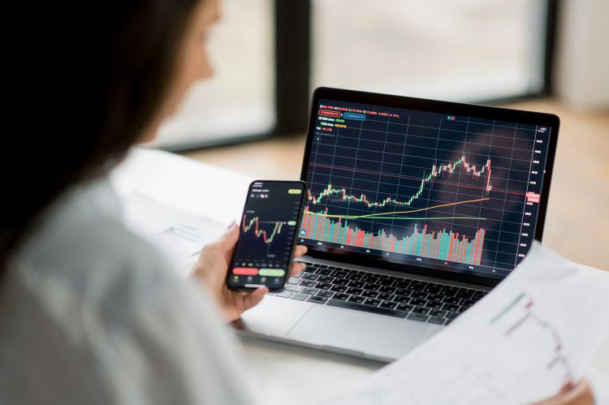

The financial landscape is experiencing significant transformation, driven by the integration of advanced technologies such as algorithmic trading. This evolution is reshaping how investors approach their strategies, placing a greater emphasis on managing timing risk while seeking optimal returns. Algorithmic trading, characterized by its high-speed, data-driven approach, allows investors to execute trades with precision and efficiency that surpasses traditional methods. As a result, understanding the interplay between timing risk, investment strategies, and algorithmic trading is becoming increasingly vital for those looking to succeed in a technologically advanced market.

Timing risk is a pivotal concern for investors as it involves the uncertainty of making investment decisions based on predictions of future stock prices. Poor timing can result in missed opportunities or significant financial losses, thereby affecting the overall performance of an investment portfolio. As the debate continues over the efficacy of market timing versus "time in the market," investors are compelled to develop strategies that mitigate these risks. This growing focus is encouraging the adoption of risk management practices that aim to shield investments from unexpected market fluctuations.



Algorithmic trading plays an essential role in market timing strategies by leveraging computational power to analyze vast datasets and execute trades at a speed and accuracy beyond human capability. This technology enhances liquidity and reduces bid-ask spreads, thereby contributing to market efficiency. However, it also introduces new challenges, such as potential market manipulation and increased volatility, necessitating careful oversight by regulatory entities.

Investors must balance the advantages of algorithmic trading with comprehensive risk management practices. By understanding how timing risk, investment strategies, and algorithmic trading influence market dynamics, investors can craft more robust strategies. In this technologically driven market, maintaining a nuanced understanding of these elements is crucial for optimizing investment outcomes and achieving strategic success.

## Table of Contents

## Understanding Timing Risk

Timing risk refers to the inherent uncertainties that investors confront when trying to capitalize on future stock price movements. The challenge lies in accurately predicting when to buy or sell assets to maximize returns or minimize losses. This risk is fundamentally linked to the concept of market timing, which involves making investment decisions based on anticipated market movements rather than adhering to a long-term investment strategy.

One of the primary issues with timing risk is the potential to miss significant price movements that can lead to potential gains. If an investor sells a stock anticipating a short-term decline, but the market moves upward, the investor misses out on the gains. Conversely, if they delay selling in hopes of continued gains and the market declines, they could face substantial losses. This underscores a persistent debate among investors: the feasibility and effectiveness of market timing versus a more static approach referred to as "time in the market."

"Time in the market" suggests that remaining invested over prolonged periods typically yields better results than attempting to time market entry and exits. Studies have demonstrated that missing just a few of the market's best days can significantly diminish portfolio returns, suggesting that sustained exposure to the market often outweighs the benefits of trying to time it short-term. For instance, an analysis might reveal that missing only ten of the best trading days over two decades could drastically reduce an investor's returns compared to a passive holding strategy.

The debate between market timing and time in the market continues, as both strategies have merits and pitfalls. Market timing, although potentially lucrative, requires precision and often relies on speculative methods, which can lead to substantial underperformance. Contrastingly, maintaining a long-term perspective enables investors to weather short-term [volatility](/wiki/volatility-trading-strategies), usually increasing the potential for favorable long-term outcomes. This debate underscores the need for investors to comprehend timing risk, balancing potential returns against the likelihood of misjudging market tendencies.

## Risk Management Strategies in Investment

Effective risk management is a cornerstone of successful investing, providing a buffer against unpredictable market fluctuations. The primary objective is preserving capital while optimizing returns, which requires implementing diverse strategies that address various risk factors.

One of the fundamental techniques is diversification, which involves spreading investments across different asset classes, sectors, or geographical regions. This approach reduces the impact of a poor performance in any single investment on the overall portfolio. By not "putting all eggs in one basket," investors can achieve a more stable and resilient portfolio. For instance, an investor might allocate assets across stocks, bonds, real estate, and commodities, thereby cushioning against sector-specific downturns.

Setting stop-loss orders is another effective strategy. This mechanism automatically sells a security when its price falls to a predetermined level, thus limiting potential losses. By using stop-loss orders, investors can protect their portfolios from severe market downswings without constantly monitoring price movements.

Dynamic position sizing is a more advanced risk management strategy that adjusts the size of investment positions based on market conditions and individual risk tolerance. This methodology involves calculating the optimal position size using factors like market volatility and the investor’s capital at risk per trade. One common formula is the Kelly Criterion, which determines the proportion of capital to allocate based on the expected return and variance of an investment. The formula is:

$$
f^* = \frac{bp - q}{b}
$$

where $f^*$ is the fraction of the capital to bet, $b$ is the odds received on the wager, $p$ is the probability of winning, and $q$ is the probability of losing. Implementing such dynamic strategies can enhance a portfolio's risk-adjusted returns.

Effective risk management also involves maintaining stability through disciplined adherence to established investment plans, which helps mitigate emotional decisions spurred by market volatility. Regularly reviewing and adjusting the portfolio mix in response to changing market conditions and personal financial goals is essential for optimizing returns.

Preserving capital is not solely about minimizing losses but also about ensuring the sustainability of investment strategies over time. By employing a combination of diversification, stop-loss orders, and dynamic position sizing, investors can create robust portfolios that withstand market turbulence and achieve long-term financial objectives.

## The Role of Algorithmic Trading in Market Timing

Algorithmic trading has revolutionized market timing strategies by leveraging high-speed, computer-driven decision-making processes. The core advantage of [algorithmic trading](/wiki/algorithmic-trading) lies in its precision and efficiency, enabling the processing of vast amounts of data at speeds that far exceed human capabilities. This technological advancement allows traders to execute large orders at optimal times, reducing the impact of timing risk associated with manual trading.

The precision offered by algorithmic trading enhances [liquidity](/wiki/liquidity-risk-premium) in financial markets. By enabling the automatic execution of orders based on predetermined criteria, algorithms contribute to tighter bid-ask spreads, thereby reducing trading costs for investors. This increased efficiency and improved price accuracy benefit not just institutional traders but also retail investors by providing a more stable and transparent market environment.

However, the widespread adoption of algorithmic trading has raised concerns about market manipulation and volatility. The ability of algorithms to execute orders in milliseconds can lead to abrupt market movements, sometimes causing "flash crashes" and other unintended consequences. A notable example is the 2010 Flash Crash, where the Dow Jones Industrial Average plummeted by nearly 1,000 points within minutes, primarily due to algorithmic trading activities. Such incidents highlight the potential risks associated with high-frequency trading strategies and underscore the need for effective oversight and regulation.

Regulatory bodies worldwide are actively monitoring the challenges posed by the rapid adoption of algorithmic trading. They are continually updating guidelines to ensure fair and orderly markets. For instance, the Securities and Exchange Commission (SEC) and the Commodity Futures Trading Commission (CFTC) in the United States have implemented measures to curb excessive volatility and discourage manipulative practices. These regulations include requirements for pre-trade risk controls and post-trade surveillance aimed at identifying and addressing potential abuses in the marketplace.

In summary, algorithmic trading has significantly enhanced market timing strategies by offering unprecedented speed and precision. While its adoption has improved liquidity and reduced trading costs, it has also introduced new challenges, necessitating vigilant regulatory oversight to mitigate potential risks and ensure the integrity of financial markets.

## Managing Risks in Algorithmic Trading

Algorithmic trading has revolutionized the financial industry, yet it brings a set of intricate risks that need effective management to safeguard investments and ensure operational stability. Addressing these risks requires meticulous strategies that encompass technical, market, operational, and behavioral dimensions.

### Technical Risks

Technical risks in algorithmic trading arise from system failures, latency issues, or software bugs that can disrupt trading operations. To mitigate these risks, comprehensive system testing and regular maintenance are imperative. This involves rigorous [backtesting](/wiki/backtesting) of algorithms under varied market conditions to ensure robustness. Implementing redundant systems can reduce the impact of hardware failures. Consider a Python function that routinely tests different scenarios, ensuring the algorithm’s stability:

```python
def backtest_algorithm(trading_algorithm, market_data):
    results = []
    for data in market_data:
        try:
            result = trading_algorithm.run(data)
            results.append(result)
        except Exception as e:
            print(f"Error encountered: {e}")
            continue
    return results
```

This function emphasizes the importance of systematic testing in maintaining the integrity and reliability of trading algorithms.

### Market Risks

Market risks stem from the intrinsic fluctuations in asset prices that algorithms are designed to exploit or hedge against. Setting stop-loss orders is essential in limiting potential losses due to adverse market movements. Portfolio diversification further mitigates market risk by spreading investments across various asset classes, reducing the volatility impact of any single asset.

Quantitative risk techniques, such as Value at Risk (VaR) and stress testing, are employed to evaluate potential losses in different market conditions. These methods provide a statistical measure of risk that informs decision-making processes.

### Operational Risks

Operational risks involve errors in trade execution, discrepancies in data feeds, or misconfigurations. Automating verification processes and implementing checks can help reduce these risks. An example of such automation might include a Python script that verifies data integrity and correctness before trades are executed:

```python
def verify_data(data_feed):
    if not data_feed or len(data_feed) == 0:
        raise ValueError("Data feed is empty or corrupted")
    # Additional verification checks
    return True

verified = verify_data(market_data)
if verified:
    execute_trades(market_data)
```

This process ensures data quality and minimizes the chance of errors affecting decision-making.

### Behavioral Risks

Behavioral risks involve the psychological aspects that may influence trading decisions. While algorithms are devoid of emotions, human oversight can lead to irrational modifications to algorithmic strategies based on emotional biases. To counter this, a disciplined approach to execution, adhering strictly to predefined algorithms, is necessary. Continuous monitoring and periodic reviews of algorithm performance help in maintaining discipline and preventing deviations from strategic objectives.

By understanding and systematically addressing these risks, algorithmic traders can create a resilient trading environment that not only optimizes performance but also provides a safeguard against the multifaceted challenges presented by financial markets.

## Balancing Human Insight with Automated Strategies

The integration of human insight with automated trading strategies creates a dynamic synergy that enhances decision-making in financial markets. Algorithms provide unmatched speed and the ability to process vast quantities of data. However, the nuanced judgment and adaptability of human traders remain crucial, particularly in scenarios requiring contextual understanding that machines may lack. This collaboration is not about choosing between humans or machines but augmenting each other's capabilities to optimize trading outcomes.

Human intuition plays a pivotal role in interpreting market signals and trends that may not be evident through purely quantitative analysis. For instance, a human trader might recognize a pattern influenced by geopolitical events, something that might require intricate algorithmic modeling to predict accurately. By combining human expertise with automated systems, traders can achieve a more comprehensive view of the market.

Incorporating [machine learning](/wiki/machine-learning) into trading systems further enhances predictive accuracy. Machine learning models, such as neural networks or decision trees, can identify complex patterns in historical data and adapt to evolving market conditions. For example, a simple machine learning model could be implemented in Python as follows:

```python
from sklearn.ensemble import RandomForestClassifier
from sklearn.model_selection import train_test_split
from sklearn.metrics import accuracy_score

# Sample data: financial indicators and market outcomes
X = [...]  # Features (e.g., moving averages, [volume](/wiki/volume-trading-strategy) changes)
y = [...]  # Target variable (e.g., market up or down)

# Split the data into training and test sets
X_train, X_test, y_train, y_test = train_test_split(X, y, test_size=0.2, random_state=42)

# Initialize and train the model
model = RandomForestClassifier()
model.fit(X_train, y_train)

# Make predictions and evaluate the model
predictions = model.predict(X_test)
accuracy = accuracy_score(y_test, predictions)
print(f"Model Accuracy: {accuracy}")
```

By leveraging machine learning alongside human analysis, traders can refine their strategies and improve predictive capabilities. However, it is essential to maintain a balanced approach, ensuring that the automated systems complement human strategies rather than replace them entirely. This balance is important for navigating the challenges of market timing and maximizing trading performance.

Ultimately, the most effective trading strategies are those that harness the strengths of both human and machine intelligence. Using automation to handle repetitive and data-intensive tasks allows humans to focus on strategic decision-making. This symbiotic relationship not only enhances efficiency but also increases the potential for achieving refined and successful market timing.

## Conclusion

Navigating the modern financial market requires a combination of strategic foresight and technological adaptability. This involves understanding how timing risk, investment strategies, and risk management are integral to successful investing. Timing risk concerns the unpredictability of optimal entry and [exit](/wiki/exit-strategy) points in the market, and managing this uncertainty is essential for achieving favorable investment outcomes.

Investment strategies must be designed to account for various market conditions, and risk management plays a pivotal role in minimizing potential losses while maximizing returns. Key approaches such as diversification, stop-loss orders, and dynamic position sizing are fundamental to maintaining a resilient investment portfolio.

Algorithmic trading offers significant advantages by leveraging high-speed computations and vast data processing capabilities to enhance precision in market timing. However, it also brings complexities requiring comprehensive risk management to mitigate potential issues such as technical failures, market manipulation, and operational risks. Understanding market dynamics and maintaining a balanced integration of algorithmic systems with human oversight is crucial.

Investors must remain informed and flexible in response to the rapidly changing landscape of financial markets. Continual learning and adaptation are vital to leveraging both established and innovative techniques effectively. This strategic blend of foresight and technological adaptability will ultimately underpin successful navigation and thriving in today's dynamic financial environment.

## References & Further Reading

[1]: Bergstra, J., Bardenet, R., Bengio, Y., & Kégl, B. (2011). ["Algorithms for Hyper-Parameter Optimization."](https://dl.acm.org/doi/10.5555/2986459.2986743) Advances in Neural Information Processing Systems 24.

[2]: ["Advances in Financial Machine Learning"](https://www.amazon.com/Advances-Financial-Machine-Learning-Marcos/dp/1119482089) by Marcos Lopez de Prado

[3]: ["Evidence-Based Technical Analysis: Applying the Scientific Method and Statistical Inference to Trading Signals"](https://www.amazon.com/Evidence-Based-Technical-Analysis-Scientific-Statistical/dp/0470008741) by David Aronson

[4]: ["Machine Learning for Algorithmic Trading"](https://github.com/stefan-jansen/machine-learning-for-trading) by Stefan Jansen

[5]: ["Quantitative Trading: How to Build Your Own Algorithmic Trading Business"](https://www.amazon.com/Quantitative-Trading-Build-Algorithmic-Business/dp/1119800064) by Ernest P. Chan