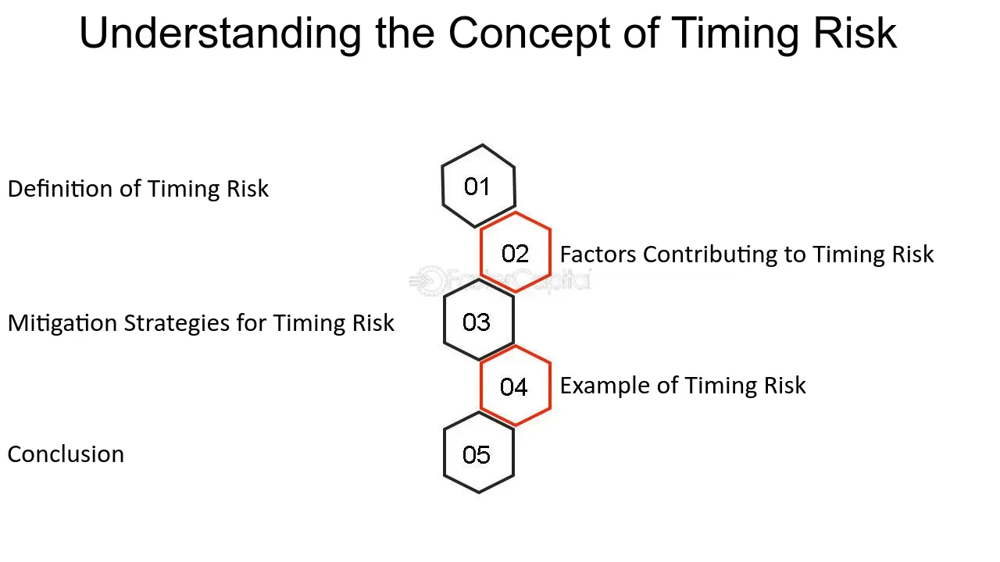

## Table of Contents

## What is timing risk?

Timing risk is the chance that you might buy or sell an investment at the wrong time. This can happen because of many reasons, like sudden changes in the market or unexpected news. If you buy an investment right before its value goes down, you might lose money. On the other hand, if you sell an investment right before its value goes up, you might miss out on making more money.

To lower timing risk, some people use strategies like dollar-cost averaging. This means they invest a fixed amount of money at regular times, no matter what the market is doing. This can help smooth out the ups and downs of the market over time. However, no strategy can completely remove timing risk, so it's important to think carefully and maybe talk to a financial advisor before making big investment decisions.

## How does timing risk affect investment decisions?

Timing risk can make people feel nervous about when to buy or sell investments. If someone buys a stock right before its price drops, they might lose money. Or if they sell a stock right before its price goes up, they could miss out on making more money. This fear of getting the timing wrong can make people hesitate or change their investment plans. They might decide to wait for a better time to invest, which could mean missing good opportunities.

To deal with timing risk, some people use strategies like dollar-cost averaging. This means they put money into investments at regular times, no matter what the market is doing. This can help spread out the risk over time. But even with these strategies, timing risk is still there. It's important for people to think carefully and maybe talk to a financial advisor to make the best investment decisions and not let the fear of bad timing stop them from investing.

## What are the common causes of timing risk?

Timing risk happens because of things that can change quickly and unexpectedly. One big reason is how the market moves. The stock market can go up and down because of news, like a company doing better or worse than expected, or because of bigger things like changes in the economy. If you buy a stock right before bad news comes out, its price might drop and you could lose money. Another reason is that people often try to guess what the market will do next. But it's hard to predict, and if you guess wrong, you might buy or sell at the wrong time.

Another cause of timing risk is events that no one can predict, like natural disasters or big political changes. These things can shake up the market and make prices change a lot in a short time. For example, if there's a big earthquake, it might affect companies in that area and make their stock prices go down. Also, sometimes people get emotional about their investments. They might feel scared and sell their stocks when the market goes down, even if it might be better to wait. This can make timing risk even worse because emotions can lead to quick decisions that aren't always the best.

## Can timing risk be completely eliminated?

Timing risk can't be completely eliminated because it's tied to how unpredictable the market is. The stock market changes all the time because of news, economic changes, and things that no one can predict, like natural disasters or political events. Even if you use smart strategies like dollar-cost averaging, where you invest a little bit of money regularly, there's still a chance you might buy or sell at the wrong time.

That's why it's important to think carefully about when to invest and maybe talk to a financial advisor. They can help you make a plan that fits your goals and how much risk you're okay with. But no matter what you do, there will always be some timing risk because the future is hard to predict. The best you can do is try to manage it and not let the fear of bad timing stop you from making good investment decisions.

## How can an investor measure timing risk?

Measuring timing risk can be tricky because it's about guessing what the market might do next, and that's hard to predict. One way to get an idea of timing risk is to look at how much a stock or investment has gone up and down in the past. This is called volatility. If a stock's price jumps around a lot, it might be riskier to buy or sell at the wrong time. Another way is to use tools like a risk-reward ratio, which helps you see how much you might gain compared to how much you could lose if you buy or sell at a certain time.

Another thing to think about is the timing of economic cycles. These are big changes in the economy that happen over time, like booms and recessions. By looking at where we are in these cycles, you can guess if it's a good time to buy or sell. But remember, these are just guesses. No one can tell the future for sure. So, even if you use all these ways to measure timing risk, there's still a chance you might get it wrong. That's why it's good to spread your investments around and not put all your money in one place.

## What strategies can be used to mitigate timing risk?

One way to lessen timing risk is to use a strategy called dollar-cost averaging. This means you put a little bit of money into your investments at regular times, like every month, no matter what the market is doing. By doing this, you buy more shares when prices are low and fewer shares when prices are high. Over time, this can help smooth out the ups and downs of the market and reduce the chance of buying at the wrong time. It's like spreading your bets so that one bad day doesn't hurt you too much.

Another strategy is to diversify your investments. Instead of putting all your money into one stock or one type of investment, you spread it out across different kinds of investments, like stocks, bonds, and real estate. This way, if one investment goes down because of bad timing, the others might go up and balance things out. It's like not putting all your eggs in one basket. Diversification can help protect you from the ups and downs of the market and reduce the impact of timing risk.

It's also helpful to focus on the long term instead of trying to guess what the market will do next. Instead of trying to time the market perfectly, think about your long-term goals and invest with those in mind. This can help you stay calm and make better decisions, even when the market is going up and down. Talking to a financial advisor can also be a good idea. They can help you make a plan that fits your goals and how much risk you're okay with, which can help you manage timing risk better.

## How does timing risk differ from other types of investment risks?

Timing risk is different from other types of investment risks because it's all about when you buy or sell an investment. For example, market risk is about how the whole market goes up or down, and it can affect all your investments at the same time. But timing risk is more about the specific moment you decide to make a move. If you buy a stock right before its price drops, you could lose money because of bad timing, even if the overall market is doing okay. 

Another type of risk is company-specific risk, which is about things that happen to one company, like a bad earnings report or a scandal. This risk can make the stock of that company go down, but it doesn't affect the whole market. Timing risk, on the other hand, can happen to any investment, no matter how good or bad the company is doing. It's about the timing of your decision, not the quality of the investment itself. So, while other risks are about what happens in the market or to a company, timing risk is about when you choose to act.

## What role does market timing play in managing timing risk?

Market timing is when someone tries to guess the best times to buy and sell investments based on what they think the market will do next. It's like trying to jump into a game at just the right moment to win. People who try to time the market think they can buy low and sell high by watching the market closely. But it's really hard to do this right because the market can change quickly and without warning. If someone gets the timing wrong, they could end up buying when prices are about to drop or selling right before prices go up, which is what timing risk is all about.

Because market timing is so hard and risky, many people choose to avoid it. Instead, they might use strategies like dollar-cost averaging, where they invest a little bit of money regularly, no matter what the market is doing. This way, they don't have to worry about getting the timing perfect. Over time, this can help reduce the impact of timing risk because they're spreading out their investments. So, while market timing can be a way to try and manage timing risk, it's often seen as too risky and unpredictable, and many people prefer safer strategies that don't rely on guessing the market's next move.

## How have historical market events demonstrated the impact of timing risk?

Historical market events have shown how timing risk can affect investors in big ways. One big example is the dot-com bubble that burst in the early 2000s. Many people invested in tech companies thinking they would keep going up forever. But when the bubble burst, those who bought stocks right before the crash lost a lot of money because of bad timing. If they had waited a bit longer or sold earlier, they might not have lost as much. This shows how hard it is to time the market perfectly and how big losses can happen if you get the timing wrong.

Another example is the 2008 financial crisis. The housing market crashed, and it dragged down the whole economy. People who bought stocks or houses right before the crash faced huge timing risk. Their investments lost a lot of value very quickly. On the other hand, those who waited until after the crisis to buy could have bought at much lower prices and made good returns when the market recovered. These events show that timing risk is real and can lead to big wins or losses depending on when you decide to buy or sell.

## What advanced statistical models are used to predict and manage timing risk?

Advanced statistical models like time series analysis and machine learning are used to predict and manage timing risk. Time series analysis looks at how prices or other data change over time. It uses past data to find patterns and make guesses about what might happen next. For example, it can help figure out if a stock's price is likely to go up or down in the future. Machine learning, on the other hand, uses computers to learn from lots of data and make predictions. It can look at things like news, economic reports, and even social media to guess what the market might do next. Both of these methods try to help investors make better decisions about when to buy or sell.

But even with these fancy models, timing risk is still hard to manage perfectly. That's because the market can be affected by things that are hard to predict, like sudden news or big world events. These models can give investors a better idea of what might happen, but they can't tell the future for sure. So, while they can help lower timing risk, they can't get rid of it completely. That's why many investors still use other strategies, like dollar-cost averaging and diversification, to manage timing risk along with these statistical models.

## How do professional fund managers incorporate timing risk into their portfolio strategies?

Professional fund managers think a lot about timing risk when they make plans for their portfolios. They know that trying to buy and sell at just the right time is really hard and risky. So, instead of trying to guess the perfect time to make a move, they often use strategies that spread out the risk over time. One common strategy is dollar-cost averaging, where they invest a little bit of money regularly, no matter what the market is doing. This way, they don't have to worry about getting the timing perfect. They also look at how much the market goes up and down, called volatility, to understand how risky it might be to buy or sell at certain times.

Another way fund managers deal with timing risk is by spreading their investments across different types of assets, like stocks, bonds, and real estate. This is called diversification. By not putting all their money in one place, they can lower the chance that bad timing with one investment will hurt their whole portfolio. They also use advanced tools like time series analysis and machine learning to help predict what the market might do next. These tools can give them a better idea of when to buy or sell, but they know these predictions aren't perfect. So, they combine these tools with other strategies to manage timing risk as best they can.

## What are the future trends in managing timing risk with the advent of AI and machine learning?

As AI and machine learning get better, they will help a lot with managing timing risk. These technologies can look at huge amounts of data really fast, like news, social media, and past market trends. This helps them guess what the market might do next. In the future, AI could give investors better advice on when to buy or sell, making it easier to avoid the big losses that can come from bad timing. But even with all this help, timing risk won't go away completely. The market can still be affected by unexpected events, so AI and machine learning will be tools to use alongside other strategies, not a magic solution.

Another trend we might see is more personalized investment plans. AI can learn about each investor's goals, how much risk they're okay with, and their past choices. Then, it can make custom advice that fits each person better. This could help investors make decisions that are less about guessing the market and more about sticking to a plan that works for them. As these technologies keep improving, they'll make it easier for people to manage timing risk in a way that feels right for them, without having to be experts on the market.

## What are the Risk Management Strategies in Investment?

Effective risk management is a cornerstone of successful investing, providing a buffer against unpredictable market fluctuations. The primary objective is preserving capital while optimizing returns, which requires implementing diverse strategies that address various risk factors.

One of the fundamental techniques is diversification, which involves spreading investments across different asset classes, sectors, or geographical regions. This approach reduces the impact of a poor performance in any single investment on the overall portfolio. By not "putting all eggs in one basket," investors can achieve a more stable and resilient portfolio. For instance, an investor might allocate assets across stocks, bonds, real estate, and commodities, thereby cushioning against sector-specific downturns.

Setting stop-loss orders is another effective strategy. This mechanism automatically sells a security when its price falls to a predetermined level, thus limiting potential losses. By using stop-loss orders, investors can protect their portfolios from severe market downswings without constantly monitoring price movements.

Dynamic position sizing is a more advanced risk management strategy that adjusts the size of investment positions based on market conditions and individual risk tolerance. This methodology involves calculating the optimal position size using factors like market volatility and the investor’s capital at risk per trade. One common formula is the Kelly Criterion, which determines the proportion of capital to allocate based on the expected return and variance of an investment. The formula is:

$$
f^* = \frac{bp - q}{b}
$$

where $f^*$ is the fraction of the capital to bet, $b$ is the odds received on the wager, $p$ is the probability of winning, and $q$ is the probability of losing. Implementing such dynamic strategies can enhance a portfolio's risk-adjusted returns.

Effective risk management also involves maintaining stability through disciplined adherence to established investment plans, which helps mitigate emotional decisions spurred by market volatility. Regularly reviewing and adjusting the portfolio mix in response to changing market conditions and personal financial goals is essential for optimizing returns.

Preserving capital is not solely about minimizing losses but also about ensuring the sustainability of investment strategies over time. By employing a combination of diversification, stop-loss orders, and dynamic position sizing, investors can create robust portfolios that withstand market turbulence and achieve long-term financial objectives.

## References & Further Reading

[1]: Bergstra, J., Bardenet, R., Bengio, Y., & Kégl, B. (2011). ["Algorithms for Hyper-Parameter Optimization."](https://dl.acm.org/doi/10.5555/2986459.2986743) Advances in Neural Information Processing Systems 24.

[2]: ["Advances in Financial Machine Learning"](https://www.amazon.com/Advances-Financial-Machine-Learning-Marcos/dp/1119482089) by Marcos Lopez de Prado

[3]: ["Evidence-Based Technical Analysis: Applying the Scientific Method and Statistical Inference to Trading Signals"](https://www.amazon.com/Evidence-Based-Technical-Analysis-Scientific-Statistical/dp/0470008741) by David Aronson

[4]: ["Machine Learning for Algorithmic Trading"](https://github.com/stefan-jansen/machine-learning-for-trading) by Stefan Jansen

[5]: ["Quantitative Trading: How to Build Your Own Algorithmic Trading Business"](https://www.amazon.com/Quantitative-Trading-Build-Algorithmic-Business/dp/1119800064) by Ernest P. Chan