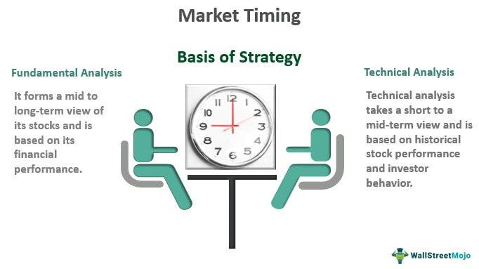

The stock market is a complex and dynamic environment that offers various strategies for investors seeking to maximize their returns. Among these strategies, short selling and algorithmic trading have become increasingly popular, enabling traders to capitalize on stock price movements in unique ways. This article explores the essentials of investment strategies focusing on short selling and algorithmic (algo) trading, providing insights into their workings, benefits, and potential risks.

Short selling is an investment technique where traders anticipate a decline in a security's price. By borrowing shares to sell them at the current market rate, investors aim to repurchase them later at a reduced price, thus profiting from the price difference. This strategy can lead to substantial gains, but it also carries inherent risks, such as the possibility of unlimited losses if the market moves unfavorably.



On the other hand, algorithmic trading utilizes computer programs to execute trades based on predetermined criteria. These algorithms can evaluate vast amounts of data at lightning speed, executing trades far faster than humanly possible. By relying on algorithms grounded in timing, price, quantity, or sophisticated mathematical models, traders strive to remove emotional biases from their decisions and enhance their trade execution's efficiency.

Whether you're a seasoned investor or a novice trying to navigate the stock market, understanding these techniques can be crucial in enhancing your investment portfolio. We begin by examining the fundamentals of short selling, followed by algorithmic trading, and explore methods to effectively implement these strategies.

## Table of Contents

## Understanding Short Selling

Short selling is an investment strategy where an investor borrows a security, typically from a brokerage, and sells it on the open market with the intention of repurchasing it later at a lower price. The fundamental objective is to profit from the depreciation in the price of the security. This process can be broken down into several critical steps, each associated with unique opportunities and risks.

### Steps and Mechanics

1. **Borrowing the Security**: The investor first borrows shares from a broker, often requiring a margin account due to the intricacies and risks involved.
2. **Selling the Security**: These borrowed shares are sold at the current market price.
3. **Repurchasing ("Covering")**: The investor aims to buy back the shares at a lower price to return them to the lender.
4. **Returning the Security**: The borrowed shares are returned to the broker, and the profit or loss is realized.

### Key Indicators for Short Selling

To effectively navigate short selling, identifying the right stocks is vital. There are several indicators that signal when a stock might be suitable for this strategy:

- **Deteriorating Fundamentals**: Potential candidates for short selling often exhibit weakened financial metrics, such as declining revenues, shrinking profit margins, or increasing debt levels.

- **Insider Selling**: A trend of insider selling, where company executives or insiders sell significant amounts of their own stock, may signal a lack of confidence in the company's future performance.

- **Declining Sector Trends**: Stocks in a declining sector or industry may be more vulnerable to further price declines, making them attractive options for short sellers.

### Risks Involved

Short selling carries significant risks, primarily due to the potential for unlimited losses. While the maximum gain is capped—since the price of a stock cannot fall below zero—the losses can be boundless if the stock price surges unexpectedly.

**Short Squeezes**: This occurs when a heavily shorted stock's price rises sharply, forcing short sellers to buy back shares at higher prices to mitigate losses. This buying activity can further drive up the stock price, exacerbating losses.

### Regulatory Considerations

Engaging in short selling necessitates navigating a complex regulatory landscape:

- **Margin Requirements**: Short sellers must maintain a margin account with their broker, which stipulates certain equity requirements to cover potential losses.

- **Rule Compliance**: Investors must adhere to regulations such as the "Regulation SHO" in the United States, designed to govern short selling practices and prevent abusive trading behaviors.

Understanding these fundamentals equips investors with the knowledge needed to potentially capitalize on short selling opportunities while managing the inherent risks and regulatory demands associated with the strategy.

## Algorithmic Trading Explained

Algorithmic trading involves utilizing computer programs to execute trades at speeds and frequencies beyond human capability. These algorithms are built on a set of rules based on timing, price, quantity, or any mathematical model designed to eliminate emotional influence and ensure precise execution.

A key attribute of [algorithmic trading](/wiki/algorithmic-trading) is its reliance on structured data analysis and computational power to make rapid trading decisions. Algorithms can identify profitable trading opportunities by analyzing market data, historical trends, and statistical patterns. This quantitative approach allows traders to implement strategies with minimal manual intervention, improving efficiency.

Popular algorithmic trading strategies include trend-following, [arbitrage](/wiki/arbitrage) opportunities, and mean reversion. Trend-following involves capitalizing on market [momentum](/wiki/momentum) by identifying and following market trends, assuming that existing price movements will continue. Arbitrage strategies exploit price discrepancies between different markets or instruments to profit from temporary mismatches in valuation. Mean reversion assumes that prices will eventually revert to their historical mean, allowing traders to buy or sell based on deviations from this equilibrium.

While algorithmic trading offers significant benefits, such as reducing transaction costs and enhancing precision, it also poses challenges. High capital costs are a barrier to entry due to the technological infrastructure required, including access to high-speed data feeds and low-latency trading platforms. Moreover, heavy dependence on technology introduces risks such as system failures or unexpected market conditions that algorithms might not handle effectively.

Successfully implementing algorithmic trading requires a robust technological setup and proficiency in programming and quantitative analysis. Traders often use programming languages like Python to develop and test trading algorithms. For example, a basic trend-following strategy in Python might look like this:

```python
import pandas as pd
import numpy as np

# Sample function to generate a simple moving average cross strategy
def moving_average_crossover(data, short_window=40, long_window=100):
    signals = pd.DataFrame(index=data.index)
    signals['price'] = data['price']
    # Create short simple moving average (SMA)
    signals['short_mavg'] = data['price'].rolling(window=short_window, min_periods=1, center=False).mean()
    # Create long simple moving average (SMA)
    signals['long_mavg'] = data['price'].rolling(window=long_window, min_periods=1, center=False).mean()

    # Create signals
    signals['signal'] = 0.0
    signals['signal'][short_window:] = np.where(signals['short_mavg'][short_window:] > signals['long_mavg'][short_window:], 1.0, 0.0)    
    signals['positions'] = signals['signal'].diff()

    return signals

# Example data
data = pd.DataFrame({
    'price': np.random.random(365)
})

signals = moving_average_crossover(data)
```

In summary, algorithmic trading represents a sophisticated approach to financial markets, leveraging speed and computational power. While it provides a competitive edge, successful deployment hinges on the ability to craft and refine complex trading algorithms.

## Advantages and Risks of Short Selling and Algorithmic Trading

Short selling and algorithmic trading serve as powerful tools for traders aiming to enhance their returns across varying market contexts. Each strategy offers distinct advantages but also comes with inherent risks that must be managed effectively.

Short selling allows investors to profit from declining stock prices. This strategy can be particularly beneficial in bear markets or during downturns in specific sectors. By identifying companies with weak fundamentals, negative public sentiment, or industry challenges, traders can capitalize on expected price declines. The primary advantage here is the ability to achieve returns even when traditional long positions would be unprofitable. However, short selling carries the potential for unlimited losses if the stock price unexpectedly rises, a situation termed a short squeeze. To mitigate these risks, traders often employ risk management techniques such as stop-loss orders and position sizing.

Algorithmic trading offers systematic and disciplined trading opportunities by using computer algorithms to execute trades based on pre-defined criteria. This method eliminates emotional decision-making, increasing the consistency and efficiency of execution. Some of the main strategies include trend-following, arbitrage, and [statistical arbitrage](/wiki/statistical-arbitrage), which endeavor to produce profits through precise and timely execution. A significant advantage of algorithmic trading is the ability to process large volumes of data and execute orders at high speeds, far beyond human capabilities. Yet, the strategy is not without its challenges. It requires substantial investment in technology and infrastructure, and traders must be vigilant about latency issues, which can lead to significant financial impact if trades are not executed at the intended price. The reliance on technology also means that technical failures or errors in the algorithm can result in substantial trading losses.

Ultimately, while both short selling and algorithmic trading provide mechanisms to maximize returns, they require a thorough understanding and careful management of associated risks. Investors must not only weigh potential rewards against these risks but also implement strategies to manage them effectively. This could include continuous monitoring of market conditions, adapting strategies as needed, and ensuring that adequate financial and risk management systems are in place. As is true for any investment approach, a comprehensive plan informed by real-time data and a disciplined execution framework is essential for success in both short selling and algorithmic trading.

## Strategies for Successful Short Selling and Algorithmic Trading

Employing robust strategies is critical for success in both short selling and algorithmic trading. Understanding and applying appropriate tactics for each approach can significantly enhance profitability while mitigating risks. 

### Short Selling Strategies

1. **Selling a Pullback in a Downtrend**: One effective strategy for short selling involves capitalizing on minor recoveries within a broader downward trend. By identifying stocks that temporarily increase in value, traders can enter short positions at these higher points, anticipating a continuation of the overall decline. This requires a keen understanding of technical analysis to recognize suitable pullback levels within the downtrend.

2. **Timing Entry Around Key Support Levels**: Traders may also focus on short selling when prices fall below established support levels. Support levels represent points where a stock price tends to stop falling and might reverse. When a stock breaches these levels, it often indicates a potential for further decline, making it an opportune moment for entering a short position. Understanding and identifying these critical levels mandates a thorough analysis of past price actions.

3. **Using Stop-Loss Orders**: To mitigate risks, employing stop-loss orders is essential. A stop-loss order automatically triggers a buy-to-cover transaction if the stock price reaches a specified level, limiting potential losses. This risk management tool helps short sellers protect their positions against unpredictable market movements, where stocks might rise contrary to expectations.

### Algorithmic Trading Strategies

1. **Developing Efficient Algorithms**: In algorithmic trading, efficiency and accuracy in identifying trading opportunities are paramount. Algorithms should be designed to process vast amounts of data and spot patterns or anomalies that signify profitable trades. Python, with libraries such as NumPy and pandas, provides a robust platform for developing such algorithms. A basic example might involve using a moving average crossover strategy:

   ```python
   import pandas as pd
   # assuming 'data' is a DataFrame with price data
   data['short_ma'] = data['Close'].rolling(window=40).mean()
   data['long_ma'] = data['Close'].rolling(window=100).mean()
   data['signal'] = 0
   data['signal'][40:] = np.where(data['short_ma'][40:] > data['long_ma'][40:], 1, 0)
   data['positions'] = data['signal'].diff()
   ```

2. **Backtesting Algorithms**: Before deploying algorithms in live trading, backtesting against historical data ensures their viability. Backtesting validates the algorithm's effectiveness by simulating its performance over past market conditions. This step is crucial for identifying strengths, weaknesses, and unexpected behaviors of the trading strategy, leading to fine-tuning and optimization before real-world application.

By judiciously applying these strategies, both short selling and algorithmic trading can be leveraged to capitalize on stock market dynamics. However, ongoing evaluation and adaptation to changing market conditions are essential for sustained success.

## Practical Steps for Implementing These Strategies

To engage in short selling, investors must establish a margin account. This is essential because short selling involves borrowing stocks, and a margin account serves as collateral. Familiarity with market regulations and restrictions is crucial, as short selling is subject to various rules, such as the uptick rule and minimum margin requirements. Investors should ensure compliance with these regulations to avoid penalties or forced closures of their positions.

In contrast, algorithmic trading demands a different skill set. Aspiring algo traders should focus on acquiring proficiency in computer programming and data analysis. Python is a popular language due to its simplicity and availability of numerous financial libraries such as Pandas, NumPy, and SciPy, which facilitate data manipulation and mathematical computations. Understanding financial markets is equally important to develop effective algorithms. Here's a basic example of a trading algorithm using Python:

```python
import pandas as pd
import numpy as np

# Load historical stock data
data = pd.read_csv('historical_stock_data.csv')

# Calculate moving averages
data['short_ma'] = data['Close'].rolling(window=40).mean()
data['long_ma'] = data['Close'].rolling(window=100).mean()

# Generate trading signals
data['signal'] = 0
data.loc[data['short_ma'] > data['long_ma'], 'signal'] = 1  # Buy signal
data.loc[data['short_ma'] < data['long_ma'], 'signal'] = -1  # Sell signal

# Output the dataset with signals
print(data)
```

Beginner traders are encouraged to start with basic algorithms and progressively tackle more complex strategies as they gain expertise. The journey often involves iterative testing and refining of algorithms, known as [backtesting](/wiki/backtesting), which assesses the effectiveness of a strategy on historical data. This process helps in identifying potential pitfalls and optimizes the strategy before live implementation.

Both novice and experienced investors can benefit from leveraging educational resources and trade simulations. Online courses, webinars, and financial literature are valuable tools for understanding both short selling and algorithmic trading. Moreover, simulation platforms offer a risk-free environment to practice new strategies and understand market dynamics without financial exposure. By continuously updating knowledge and skills, traders can enhance their ability to capitalize on stock market opportunities.

## Conclusion

Understanding and implementing investment strategies like short selling and algorithmic trading can provide significant opportunities for stock market profits. These methods are not merely speculative; they are rooted in strategic analysis and data-driven decisions that allow investors to potentially capitalize on various market conditions. 

Short selling, for example, enables investors to profit from declining stock prices, offering a way to hedge against downturns in a portfolio. Meanwhile, algorithmic trading facilitates trading with speed and precision, utilizing computer algorithms to make decisions based on pre-set conditions. This removes emotional biases from trading and allows for systematic and disciplined execution. However, despite these advantages, both strategies present distinct challenges and risks that require careful management.

Short selling can lead to unlimited losses if the market moves unfavorably, a risk requiring diligent oversight and risk management. Algorithmic trading, on the other hand, demands significant resources, including high capital and technological infrastructure. Furthermore, it is susceptible to technical glitches and latency issues which can affect trade execution.

Continuous learning and adaptation to market trends are crucial. Markets are dynamic, and strategies that were effective yesterday might not work tomorrow. Therefore, investors must stay informed about new developments and adjust their strategies accordingly. This involves not only keeping up with financial news and market analysis but also understanding technological advancements that can affect trading dynamics.

As markets evolve, staying informed and adaptable can help investors maintain a competitive edge in short selling and algorithmic trading. By combining thorough market research, disciplined execution, and continuous education, investors can enhance their ability to navigate the complexities of the stock market effectively. This approach also fosters resilience and a preparedness to pivot strategies in response to shifting market conditions, ultimately ensuring that investors are not only reactive but also proactive in their trading efforts.

## References & Further Reading

[1]: ["Algorithms for Hyper-Parameter Optimization"](https://dl.acm.org/doi/10.5555/2986459.2986743) by Bergstra, J., Bardenet, R., Bengio, Y., & Kégl, B. Advances in Neural Information Processing Systems 24 (2011).

[2]: ["Advances in Financial Machine Learning"](https://www.amazon.com/Advances-Financial-Machine-Learning-Marcos/dp/1119482089) by Marcos Lopez de Prado, Wiley (2018).

[3]: ["Evidence-Based Technical Analysis: Applying the Scientific Method and Statistical Inference to Trading Signals"](https://www.amazon.com/Evidence-Based-Technical-Analysis-Scientific-Statistical/dp/0470008741) by David Aronson, Wiley (2006).

[4]: ["Machine Learning for Algorithmic Trading"](https://github.com/stefan-jansen/machine-learning-for-trading) by Stefan Jansen, Packt Publishing (2018).

[5]: ["Quantitative Trading: How to Build Your Own Algorithmic Trading Business"](https://github.com/LucindaYa/quant-resources/blob/master/Quantitative%20Trading%20How%20to%20Build%20Your%20Own%20Algorithmic%20Trading%20Business.pdf) by Ernest P. Chan, Wiley (2008).