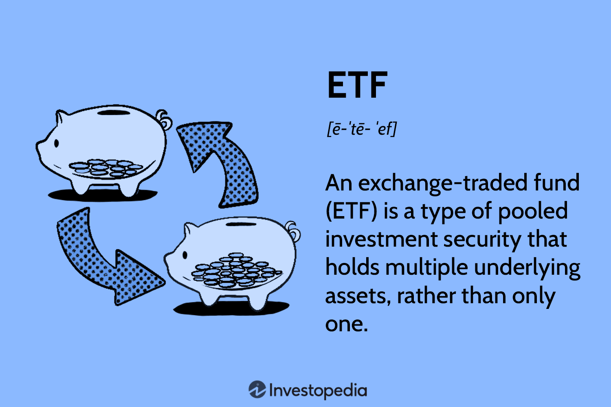

## Table of Contents

## What is a TIPS ETF?

A TIPS ETF, or Treasury Inflation-Protected Securities Exchange-Traded Fund, is a type of investment fund that holds Treasury Inflation-Protected Securities (TIPS). TIPS are special bonds issued by the U.S. government that help protect investors from inflation. The value of TIPS goes up with inflation, which means the principal amount of the bond increases as the cost of living rises. This makes TIPS a good choice for people who want to keep their money's value safe from inflation.

A TIPS ETF makes it easier for people to invest in TIPS without having to buy the bonds directly. By buying shares of a TIPS ETF, investors can own a small piece of a large collection of TIPS. This provides diversification and can be more convenient than buying individual TIPS. TIPS ETFs are traded on stock exchanges, just like stocks, so they can be bought and sold during the trading day at market prices. This makes them a flexible option for investors looking to protect their savings from inflation.

## How do TIPS ETFs work?

TIPS ETFs work by holding a basket of Treasury Inflation-Protected Securities (TIPS) and allowing investors to buy shares in the fund. When you buy shares in a TIPS ETF, you're essentially investing in a collection of TIPS without having to buy each bond individually. This makes it easier and more convenient for you to protect your money from inflation. The value of the TIPS inside the ETF goes up with inflation, which means the principal amount of the bonds increases as the cost of living rises. This helps keep the value of your investment safe.

TIPS ETFs are traded on stock exchanges, just like stocks. This means you can buy and sell shares of the [ETF](/wiki/etf-trading-strategies) during the trading day at market prices. The price of the ETF can go up or down based on the value of the TIPS it holds and other market factors. By investing in a TIPS ETF, you get the benefits of TIPS, like protection from inflation, along with the flexibility of being able to trade your investment easily. This makes TIPS ETFs a good choice for people who want to keep their money's value safe and have the ability to adjust their investments as needed.

## What are Treasury Inflation-Protected Securities (TIPS)?

Treasury Inflation-Protected Securities, or TIPS, are special bonds issued by the U.S. government. They are designed to help protect your money from inflation. Inflation is when the cost of things goes up over time, making your money worth less. TIPS work by adjusting the bond's principal amount based on changes in the Consumer Price Index, which measures inflation. So, if inflation goes up, the value of your TIPS goes up too. This means you get more money back when the bond matures, helping to keep your money's value safe.

TIPS pay interest twice a year, and the [interest rate](/wiki/interest-rate-trading-strategies) is set when you buy the bond. But because the principal amount changes with inflation, the amount of interest you get also changes. If inflation goes up, you get more interest, and if it goes down, you get less. TIPS are a good choice if you want to make sure your savings keep up with the rising cost of living. They are backed by the U.S. government, which makes them a safe investment.

## What are the benefits of investing in TIPS ETFs?

Investing in TIPS ETFs can help protect your money from inflation. Inflation means the cost of things goes up over time, making your money worth less. TIPS ETFs hold special bonds called Treasury Inflation-Protected Securities, which adjust their value based on inflation. This means if the cost of living goes up, the value of your investment in a TIPS ETF goes up too. It's like having a safety net that keeps your money's value safe as prices rise.

Another benefit of TIPS ETFs is that they are easy to buy and sell. You can trade them on stock exchanges just like stocks, which means you can buy or sell them during the trading day at market prices. This makes it simple to adjust your investments whenever you need to. Plus, by investing in a TIPS ETF, you're spreading your money across many TIPS bonds, which can lower your risk compared to buying just one or a few bonds. This diversification can make your investment more stable and safer.

## How do TIPS ETFs protect against inflation?

TIPS ETFs protect against inflation by holding Treasury Inflation-Protected Securities, or TIPS. These are special bonds from the U.S. government that change their value based on inflation. When inflation goes up, the value of TIPS goes up too. This means if the cost of living rises, the value of your investment in a TIPS ETF also rises, keeping your money's worth safe.

Investing in a TIPS ETF is an easy way to guard against inflation without having to buy each TIPS bond yourself. TIPS ETFs trade on stock exchanges like stocks, so you can buy or sell them during the trading day at market prices. This makes it simple to adjust your investments as needed. By putting your money in a TIPS ETF, you're spreading it across many TIPS bonds, which can make your investment more stable and safer from the ups and downs of inflation.

## What are the risks associated with TIPS ETFs?

Investing in TIPS ETFs comes with some risks you should know about. One risk is that even though TIPS ETFs protect against inflation, they might not do as well as other investments when inflation is low or goes down. If inflation doesn't rise as much as expected, the value of your TIPS ETF might not grow much, and you might miss out on better returns from other investments.

Another risk is that TIPS ETFs can go up and down in value just like any other investment. The price of the ETF can change based on what's happening in the market and how people feel about inflation. If the market gets scared or if there's a big change in inflation expectations, the price of your TIPS ETF could drop, and you might lose money if you need to sell it at that time.

## How do TIPS ETFs differ from other bond ETFs?

TIPS ETFs are different from other bond ETFs because they focus on protecting your money from inflation. TIPS ETFs hold special bonds called Treasury Inflation-Protected Securities, or TIPS, which change their value based on inflation. This means if the cost of living goes up, the value of your investment in a TIPS ETF goes up too. Other bond ETFs might hold regular bonds that don't adjust for inflation, so their value stays the same even if prices rise. This makes TIPS ETFs a good choice if you want to keep your money's worth safe as prices go up.

Another way TIPS ETFs differ is in how they pay interest. TIPS ETFs pay interest based on the changing principal amount of the TIPS they hold. If inflation goes up, the principal amount goes up, and so does the interest you get. Other bond ETFs pay a fixed amount of interest that doesn't change with inflation. This means the interest from TIPS ETFs can grow if inflation rises, while the interest from other bond ETFs stays the same. This makes TIPS ETFs a better option if you're worried about inflation eating away at your returns.

## What are the key factors to consider when choosing a TIPS ETF?

When [picking](/wiki/asset-class-picking) a TIPS ETF, one important thing to look at is the expense ratio. This is how much the ETF charges you to manage your money. A lower expense ratio means you keep more of your money, which is good. Another thing to think about is the ETF's tracking error. This is how well the ETF follows the performance of the TIPS it holds. A smaller tracking error means the ETF is doing a better job at matching the performance of the TIPS.

You should also check the ETF's duration. Duration tells you how sensitive the ETF is to changes in interest rates. If you think interest rates might go up, you might want an ETF with a shorter duration. Another [factor](/wiki/factor-investing) is the size and [liquidity](/wiki/liquidity-risk-premium) of the ETF. A bigger and more popular ETF usually means it's easier to buy and sell without affecting the price too much. Finally, consider the ETF's yield. This tells you how much income you can expect from the ETF. A higher yield might be nice, but make sure it fits with your goals and how much risk you're okay with.

## How do TIPS ETFs perform in different economic conditions?

TIPS ETFs do well when inflation is high. They are made to protect your money from rising prices. When the cost of living goes up, the value of the TIPS inside the ETF goes up too. This means your investment grows along with inflation. In times when inflation is really high, TIPS ETFs can be a good choice because they help keep your money's worth safe. But if inflation stays low or even goes down, TIPS ETFs might not grow as much as you hope. They could even lose value if people think inflation will stay low for a long time.

In a time when the economy is doing well and growing, TIPS ETFs might not be the best choice. Other investments like stocks or regular bond ETFs might do better because they can grow faster. But if the economy is shaky and inflation is a big worry, TIPS ETFs can be a safe place to put your money. They won't grow as fast as riskier investments, but they can help protect you from losing money if prices start to rise a lot. So, TIPS ETFs can be a good part of your investment plan, especially if you want to keep your money safe from inflation no matter what the economy is doing.

## What is the tax treatment of TIPS ETFs?

When you invest in TIPS ETFs, you need to know about the taxes. The interest you get from TIPS ETFs is taxed as regular income. This means you pay taxes on it every year, just like you would with money from a job. The tricky part is that the interest from TIPS ETFs includes the inflation adjustment to the principal. So, even though you might not get cash every year, you still have to pay taxes on the increase in the bond's value due to inflation.

If you sell your TIPS ETF and make a profit, that's called a capital gain. Capital gains can be taxed at a lower rate than regular income, but it depends on how long you held the ETF. If you held it for more than a year, it's a long-term capital gain, and the tax rate might be lower. If you held it for less than a year, it's a short-term capital gain, and you'll pay taxes at your regular income tax rate. So, it's a good idea to think about how long you plan to keep your TIPS ETF and how that might affect your taxes.

## How can TIPS ETFs be used in a diversified investment portfolio?

TIPS ETFs can be a great addition to a diversified investment portfolio because they help protect your money from inflation. Inflation is when the cost of things goes up over time, making your money worth less. By adding TIPS ETFs to your portfolio, you're making sure that part of your money grows along with the cost of living. This can be really helpful if you're saving for the future and want to make sure your savings keep up with rising prices. TIPS ETFs are easy to buy and sell on stock exchanges, so you can adjust your investments as needed without having to buy individual TIPS bonds.

In a diversified portfolio, TIPS ETFs can balance out other investments that might not do well when inflation is high. For example, if you have stocks or regular bond ETFs, they might not grow as much if prices start to rise a lot. But TIPS ETFs can help keep your overall portfolio safe because they go up in value with inflation. By mixing TIPS ETFs with other types of investments, you're spreading your risk and making your portfolio more stable. This way, no matter what the economy is doing, you have a part of your money that's protected against inflation.

## What are some of the top TIPS ETFs available in the market?

Some of the top TIPS ETFs you can find in the market are the iShares TIPS Bond ETF (TIP) and the Schwab U.S. TIPS ETF (SCHP). The iShares TIPS Bond ETF is one of the biggest and most popular TIPS ETFs. It's known for having a low expense ratio, which means it doesn't cost a lot to invest in it. This ETF tries to match the performance of the Bloomberg U.S. Treasury Inflation-Protected Securities (TIPS) Index. The Schwab U.S. TIPS ETF is another good choice. It also has a low expense ratio and aims to track the performance of the Bloomberg Barclays U.S. Treasury Inflation-Protected Securities (TIPS) Index (Series L).

Another top TIPS ETF is the Vanguard Short-Term Inflation-Protected Securities ETF (VTIP). This ETF focuses on TIPS with shorter durations, which means it's less sensitive to changes in interest rates. It's a good pick if you're worried about interest rates going up. The Vanguard ETF also has a very low expense ratio, making it cost-effective to invest in. All these ETFs are great options if you want to protect your money from inflation while keeping your investment costs low.

## What are Treasury Inflation-Protected Securities (TIPS) and how do they work?

Treasury Inflation-Protected Securities (TIPS) are U.S. Treasury bonds specifically designed to provide protection against inflation. Unlike traditional U.S. Treasury bonds, which pay a fixed interest rate over their term, TIPS offer a principal value that adjusts based on inflation, as measured by the Consumer Price Index (CPI). This inflation-adjustment feature ensures that the investment's value keeps pace with rising prices, safeguarding the purchasing power of investors.

### Inflation Protection and Interest Payments

The mechanism of inflation protection in TIPS involves periodic adjustments to the bond's principal. As inflation increases, the principal amount of TIPS is adjusted upwards, ensuring that the bondholder's real return is preserved. Conversely, if deflation occurs, the principal may be adjusted down, although TIPS will never pay less than their original principal amount upon maturity. Interest payments, made semi-annually, are calculated on this adjusted principal amount. Therefore, during periods of inflation, investors receive higher interest payments, reflecting the increased principal.

Mathematically, if $P$ represents the initial principal, and $I$ the inflation index, the adjusted principal $P_{\text{adj}}$ is calculated as:

$$
P_{\text{adj}} = P \times \left(1 + \frac{I}{100}\right)
$$

where $I$ is the percentage change in the CPI. The interest payment $I_{\text{payment}}$ is thus:

$$
I_{\text{payment}} = \frac{R}{2} \times P_{\text{adj}}
$$

where $R$ is the annual nominal interest rate.

### Importance in Hedging Against Inflation

TIPS are essential for hedging against inflation because they maintain the purchasing power of fixed-income investments. Traditional bonds can lose value in real terms when inflation rises, as fixed interest payments become less valuable. In contrast, TIPS adjust both principal and interest payments to reflect changes in the CPI, offering a robust safeguard against inflationary pressures.

### Investors in TIPS

Various types of investors are drawn to TIPS, including both institutional and retail investors. Institutional investors, such as pension funds and insurance companies, find TIPS attractive due to their stability and inflation protection, aligning with liabilities that are sensitive to inflation. Retail investors also invest in TIPS to preserve their savings' purchasing power, especially during times of economic uncertainty and expected inflation increases. Investment managers may incorporate TIPS into diversified portfolios as a strategic asset to hedge against inflation risk, ensuring balanced and resilient investment outcomes.

## References & Further Reading

[1]: Campbell, J. Y., Shiller, R. J., & Viceira, L. M. (2009). ["Understanding Inflation-Indexed Bond Markets."](https://www.nber.org/papers/w15014) Journal of Finance.

[2]: Bodie, Z. (1990). ["Inflation and the Role of Bonds in Investor Portfolios."](https://www.nber.org/system/files/chapters/c11420/c11420.pdf) The Journal of Portfolio Management.

[3]: Fabozzi, F. J. (Ed.). (2004). ["Handbook of Inflation-Indexed Bonds."](https://books.google.com/books/about/Handbook_of_Inflation_Indexed_Bonds.html?id=ErIfkItIQmMC) Wiley.

[4]: ["Advances in Financial Machine Learning"](https://www.amazon.com/Advances-Financial-Machine-Learning-Marcos/dp/1119482089) by Marcos Lopez de Prado.

[5]: ["Exchange-Traded Funds Manual"](https://onlinelibrary.wiley.com/doi/book/10.1002/9781118266946) by Gary Gastineau.

[6]: Hasbrouck, J. (2003). ["Intraday Price Formation in U.S. Equity Index Markets."](https://onlinelibrary.wiley.com/doi/10.1046/j.1540-6261.2003.00609.x)00037-3/fulltext) Journal of Empirical Finance.

[7]: ["Quantitative Momentum: A Practitioner's Guide to Building a Momentum-Based Stock Selection System"](https://books.google.com/books/about/Quantitative_Momentum.html?id=K2npCgAAQBAJ) by Wesley R. Gray and Jack R. Vogel.