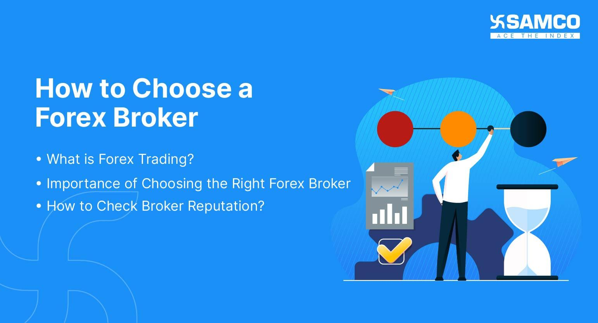

## Table of Contents

## What is a forex broker and why is it important to choose the right one?

A forex broker is a company that helps people buy and sell different currencies. They give you a platform where you can trade and they take care of all the complicated stuff in the background. Think of them like a middleman that makes it easier for you to trade currencies without having to do everything yourself.

Choosing the right forex broker is important because it can affect how much money you make or lose. A good broker will have low fees, a user-friendly platform, and good customer support. If you pick a bad broker, you might end up paying a lot in fees, having trouble using their platform, or not getting help when you need it. So, taking the time to find a good broker can save you a lot of headaches and help you trade better.

## What are the key factors a beginner should consider when selecting a forex broker?

When you're starting out in forex trading, one of the first things you need to do is pick a good broker. One key factor to consider is the fees they charge. Some brokers might have high fees that can eat into your profits, so it's a good idea to look for one with low fees. Another thing to think about is the trading platform they offer. You want a platform that's easy to use and understand, especially if you're new to trading. It should have all the tools you need to make smart trades without being too complicated.

Another important [factor](/wiki/factor-investing) is the broker's reputation and regulation. You want to make sure the broker is regulated by a reputable authority, like the FCA in the UK or the CFTC in the US. This helps ensure that they follow the rules and keep your money safe. Also, take a look at what other people are saying about the broker. Reading reviews and testimonials can give you a good idea of how reliable they are and how well they treat their customers. Lastly, consider the customer support they offer. A good broker will have helpful and responsive support to answer your questions and help you out when you need it.

## How can I evaluate the reliability and reputation of a forex broker?

To evaluate the reliability and reputation of a [forex](/wiki/forex-system) broker, start by checking if they are regulated by a well-known authority. Regulators like the FCA in the UK or the CFTC in the US make sure brokers follow strict rules to protect traders. If a broker is regulated, it's a good sign that they are reliable. You can usually find this information on the broker's website or by searching online for their regulatory status.

Another way to gauge a broker's reputation is by reading reviews and testimonials from other traders. Look for feedback on independent review sites and forums where traders share their experiences. Pay attention to comments about the broker's customer service, how easy it is to withdraw money, and any issues with the trading platform. If a lot of people are saying good things about the broker, it's likely they are reputable. But if you see a lot of complaints or negative reviews, it might be best to look for another broker.

## What types of trading platforms do forex brokers offer and which is best for beginners?

Forex brokers offer different types of trading platforms, but the main ones are web-based platforms, desktop platforms, and mobile apps. Web-based platforms are easy to use because you can access them from any internet browser without needing to download anything. Desktop platforms are software you install on your computer, and they often have more features and tools for trading. Mobile apps let you trade on your phone or tablet, which is handy if you want to trade on the go.

For beginners, a web-based platform is usually the best choice. They are simple to use and you don't need to worry about installing anything. Plus, they often have a lot of educational resources and guides to help you learn how to trade. If you're just starting out, you want a platform that's easy to understand and navigate, so you can focus on learning the basics of forex trading without getting overwhelmed by complicated tools or features.

## What are the costs associated with using a forex broker, including spreads, commissions, and other fees?

When you use a forex broker, you'll come across different costs like spreads, commissions, and other fees. Spreads are the difference between the buy and sell price of a currency pair. Brokers make money from these spreads, so a smaller spread means you pay less to trade. Some brokers also charge commissions, which is a fee they take for each trade you make. These commissions can be a fixed amount or a percentage of the trade value. It's important to understand these costs because they can affect how much money you make or lose from trading.

Apart from spreads and commissions, there might be other fees to watch out for. Some brokers charge a fee for keeping your account open if you don't trade enough, called an inactivity fee. There could also be fees for withdrawing money from your account, or for using certain payment methods. It's a good idea to read the broker's fee schedule carefully before you start trading so you know all the costs involved. This way, you can pick a broker that offers good value and helps you keep more of your profits.

## How important is customer support and what should I look for in a forex broker's support services?

Customer support is really important when you choose a forex broker. Trading can be confusing, especially if you're new to it. Good customer support means you can get help quickly when you have questions or problems. If you can't reach your broker or they take a long time to answer, it can be frustrating and might even cost you money if you can't fix a problem fast enough.

When looking at a forex broker's support services, think about how easy it is to contact them. Good brokers offer several ways to get in touch, like phone, email, and live chat. It's also important that they answer you quickly and can help solve your issues. Reading reviews from other traders can tell you a lot about how good the support is. If many people say the support is helpful and fast, that's a good sign.

## What regulatory bodies should a forex broker be registered with to ensure safety and security?

When you're [picking](/wiki/asset-class-picking) a forex broker, it's important to check if they are registered with a trusted regulatory body. This helps make sure your money is safe and the broker follows the rules. In the United States, the main regulatory body is the Commodity Futures Trading Commission (CFTC), and they work with the National Futures Association (NFA) to keep an eye on forex brokers. In the UK, the Financial Conduct Authority (FCA) is the one that regulates forex brokers. These organizations make sure that brokers are honest and protect your money.

In Australia, the Australian Securities and Investments Commission (ASIC) is the key regulator for forex brokers. In Europe, the Cyprus Securities and Exchange Commission (CySEC) and the German Federal Financial Supervisory Authority (BaFin) are important, too. If your broker is registered with one of these groups, it's a good sign that they are reliable. Always check the broker's website or the regulator's website to make sure they are really registered and following the rules.

## How does the choice of forex broker affect trading strategies for intermediate traders?

For intermediate traders, the choice of forex broker can have a big impact on their trading strategies. One key factor is the trading platform the broker offers. A good platform with lots of tools and features can help intermediate traders analyze the market better and make smarter trades. For example, if you like using technical analysis, you'll want a platform that has good charting tools and indicators. On the other hand, if you prefer [fundamental analysis](/wiki/fundamental-analysis), you might need a platform that gives you easy access to economic news and data. The right platform can help you execute your strategies more effectively and improve your chances of making profitable trades.

Another way the choice of broker affects trading strategies is through the costs involved. Intermediate traders often trade more frequently than beginners, so the spreads and commissions charged by the broker can really add up. If your broker has high costs, it can eat into your profits and make some trading strategies less viable. For example, if you like to scalp (making lots of small trades to catch small price movements), you need a broker with very low spreads and no commissions. Otherwise, the costs might be too high to make this strategy work. So, choosing a broker with competitive costs is important for intermediate traders to make their strategies work well.

## What advanced tools and features should an expert trader look for in a forex broker?

For expert traders, the choice of forex broker is crucial because they need advanced tools and features to execute their complex trading strategies effectively. One important feature is high-quality charting software with customizable indicators and drawing tools. Expert traders often rely on technical analysis, so they need a platform that allows them to set up multiple charts, apply different timeframes, and use advanced indicators like Fibonacci retracements, Bollinger Bands, and moving averages. Another essential tool is the ability to automate trading through Expert Advisors (EAs) or [algorithmic trading](/wiki/algorithmic-trading). This lets expert traders program their strategies into the platform, so trades can be executed automatically based on specific criteria, saving time and potentially increasing efficiency.

In addition to advanced charting and automation, expert traders should look for brokers that offer low latency and fast execution speeds. This is critical for strategies like [scalping](/wiki/gamma-scalping), where even a small delay can mean missing out on profitable trades. Brokers with direct market access (DMA) can provide the speed and reliability needed for these strategies. Expert traders also benefit from having access to a wide range of tradable instruments, including major, minor, and exotic currency pairs, as well as other financial products like commodities and indices. This allows them to diversify their trading and take advantage of different market opportunities. Finally, having access to real-time market data, economic calendars, and detailed market analysis can help expert traders make informed decisions and stay ahead of market movements.

## How can I assess the quality of a forex broker's market analysis and educational resources?

To assess the quality of a forex broker's market analysis, start by looking at how often they update their analysis and how detailed it is. Good market analysis should be updated regularly, at least daily, to keep you informed about the latest market trends and events. It should also be easy to understand, with clear explanations and charts. You can compare the broker's analysis with other sources like financial news websites or other brokers to see if their insights are accurate and useful. If the broker's analysis helps you make better trading decisions, that's a sign of high quality.

For educational resources, check if the broker offers a variety of materials like video tutorials, webinars, eBooks, and articles. The best resources will cover different skill levels, from beginner to advanced, and explain things in a way that's easy to understand. You can test the quality by trying out some of their resources to see if they help you learn and improve your trading skills. Also, look for feedback from other traders to see if they find the educational content helpful. If the broker's resources make trading easier to understand and improve your knowledge, they are likely of good quality.

## What are the benefits and drawbacks of using a forex broker that offers high leverage?

Using a forex broker that offers high leverage can be a big help for traders. Leverage lets you trade with more money than you actually have in your account. This means you can make bigger trades and possibly earn more profit with less of your own money. For example, if you have $1,000 and use 100:1 leverage, you can trade like you have $100,000. This can be great if the market moves in your favor, because your small investment can turn into big profits.

But high leverage also has risks. If the market moves against you, your losses can be much bigger than what you put in. With high leverage, even small changes in the market can wipe out your account quickly. It's like borrowing a lot of money to bet on something; if you win, you win big, but if you lose, you lose big too. So, while high leverage can help you make more money, it can also lead to big losses if you're not careful.

## How can I compare forex brokers to make an informed decision based on my trading experience and goals?

To compare forex brokers and make a good choice based on your trading experience and goals, start by thinking about what you need from a broker. If you're a beginner, you might want a broker with a simple platform and lots of educational resources to help you learn. Look for low fees, good customer support, and a broker that's regulated by a trusted authority to keep your money safe. If you're more experienced, you might need advanced tools like good charting software, the ability to automate trades, and fast execution speeds. Also, consider what you want to achieve with your trading. Are you looking to make quick profits with short-term trades, or do you want to build wealth over time with long-term strategies? Your goals will help you decide what features are most important to you.

Once you know what you need, you can start comparing brokers. Look at their websites to see what platforms they offer and what their fees are. Check if they have the tools and features you need for your trading style. It's also a good idea to read reviews from other traders to see what they think about the broker's reliability and customer service. Make sure the broker is regulated by a reputable authority to ensure they follow the rules and protect your money. By comparing all these factors, you can find a broker that matches your experience level and helps you reach your trading goals.

## References & Further Reading

[1]: ["Forex Trading: A Beginner's Guide"](https://www.investopedia.com/articles/forex/11/why-trade-forex.asp) - Investopedia

[2]: ["The Role of a Broker in Forex Trading"](https://www.forexgdp.com/learn/role-of-brokers/) - Trusted Broker Reviews

[3]: Nassar, M. (2013). ["Algorithmic Trading & DMA: An Introduction to Direct Access Trading Strategies."](https://www.semanticscholar.org/paper/Algorithmic-trading-%26-DMA-%3A-an-introduction-to-Johnson/aa5de1ab883d5e23b6651faa7c1807586d688e4b) Apress.

[4]: Chawla, G. (2016). [*FX Derivatives Trader School*](https://www.wiley.com/en-us/FX+Derivatives+Trader+School-p-9781118967454). Palgrave Macmillan.

[5]: ["A Guide to Backtesting Trading Strategies"](https://gocharting.com/blog/backtesting-trading/) - QuantConnect

[6]: Watanabe, T. (2020). ["Impact of Algorithmic Trading: Evidence from the Tokyo Stock Exchange."](https://papers.ssrn.com/sol3/papers.cfm?abstract_id=2022034) Economic Review.