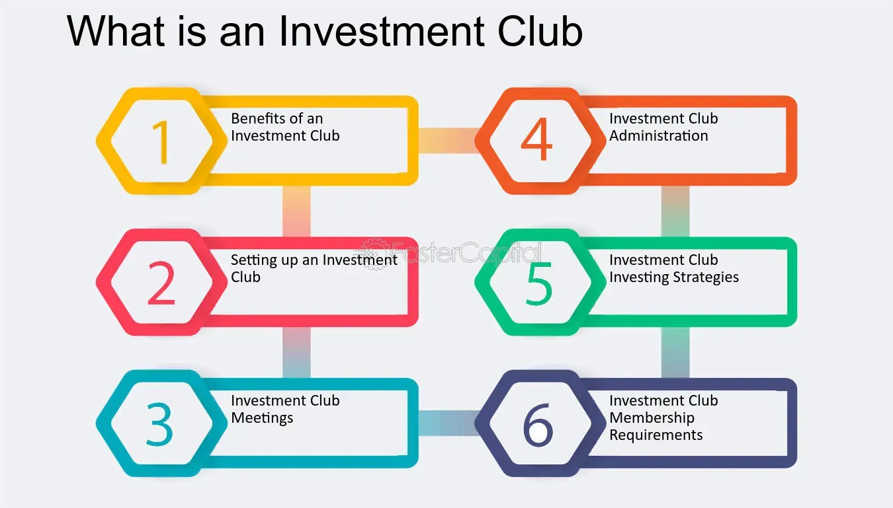

## Table of Contents

## What is an investment club and how does it work?

An investment club is a group of people who pool their money together to invest in stocks, bonds, or other types of investments. The members of the club usually meet regularly to discuss and decide which investments to make. This way, everyone in the club can learn about investing and share their ideas.

Investment clubs work by having each member contribute a certain amount of money each month. The club then uses this money to buy investments. The profits or losses from these investments are shared among the members based on how much money each person put in. It's a great way for people to learn about the stock market and investing while sharing the risks and rewards with others.

## What are the benefits of joining an investment club?

Joining an investment club can help you learn a lot about investing. When you're part of a club, you get to hear different ideas and opinions from other members. This can teach you new things about the stock market and how to make smart investment choices. It's like having a group of friends who are all interested in the same thing and can help each other learn and grow.

Another benefit is that you can share the risks and rewards with others. Instead of investing all your money by yourself, you can put in a smaller amount and still be part of bigger investments. This means if the investments do well, everyone in the club shares the profits. And if things don't go as planned, the losses are also shared, so it's not as hard on any one person. It's a great way to start investing without feeling too much pressure.

## How can I find an investment club to join?

Finding an investment club to join can be easy if you know where to look. One good place to start is online. There are websites like BetterInvesting.org and Meetup.com where you can search for investment clubs in your area. These sites let you see what clubs are near you and what they are all about. You can also join online forums and social media groups where people talk about investing. Someone there might know of a club you can join.

Another way to find an investment club is by asking people you know. Maybe a friend, family member, or coworker is already part of a club and can invite you to join. You can also check with local community centers, libraries, or colleges. Sometimes they have information about investment clubs or even host meetings. Don't be shy to ask around because you never know who might be able to help you find a club that's a good fit for you.

## What should I consider when choosing an investment club?

When choosing an investment club, it's important to think about what you want to get out of it. Are you looking to learn more about investing, or do you want to make money? Some clubs focus more on education and helping members learn, while others might be more about making profits. Think about what the club's goals are and if they match what you're looking for. Also, consider how much time you can spend on the club. Some clubs meet often and expect members to do a lot of research, while others might be more relaxed.

Another thing to consider is the people in the club. It's good to join a club where you feel comfortable and can get along with the other members. You'll be working together and sharing ideas, so it's important that everyone respects each other and works well as a team. Also, find out how the club makes decisions. Do all members get a say, or do a few people make the choices? Make sure the way the club works fits with what you think is fair and right.

## What are the typical requirements for joining an investment club?

Joining an investment club usually means you need to meet some basic requirements. Most clubs ask you to pay a one-time fee to join, and then you'll need to contribute a certain amount of money each month. This money goes into the club's investment pool. Clubs also often have rules about how often you need to attend meetings. They want members to be active and take part in the club's decisions.

Another thing to think about is that clubs might want you to do some work. This could mean researching investments or helping to run the club. They want everyone to be involved and learn together. It's also common for clubs to have rules about how long you need to stay in the club. They might ask you to commit to being a member for at least a year or so. This helps keep the club stable and makes sure everyone is serious about being part of the group.

## How do investment clubs make decisions on investments?

Investment clubs usually make decisions on investments by talking things over at their meetings. Everyone in the club gets a chance to share their ideas and thoughts about which stocks or other investments to buy. They might look at different companies, read reports, and discuss what they think will happen in the future. After everyone has had a say, the club votes on what to do. Some clubs need everyone to agree, while others just need most people to be okay with the choice.

The way decisions are made can be different from one club to another. Some clubs have rules that say how they will vote, like needing a certain number of people to agree before they can buy or sell something. Other clubs might let a smaller group of members, like a board or committee, make the final call. No matter how they do it, the important thing is that everyone in the club feels like they have a say and that the decisions are fair.

## What are the common investment strategies used by investment clubs?

Investment clubs often use a strategy called "value investing." This means they look for companies that they think are a good deal. They buy stocks in these companies when they think the price is low compared to what the company is really worth. The club members do a lot of research to find these good deals. They look at things like how much money the company makes and how much it owes. The idea is to buy the stock, hold onto it for a while, and then sell it when the price goes up.

Another common strategy is "growth investing." With this approach, clubs look for companies that are growing fast. They want to invest in businesses that are getting bigger and making more money over time. The club members might look at new tech companies or other businesses that are doing well. They hope that as the company grows, the price of its stock will go up too. This can be riskier than value investing, but it can also lead to bigger rewards if the company does well.

Some clubs also use a "diversification" strategy. This means they spread their money across different types of investments to lower the risk. Instead of putting all their money into one or two stocks, they might invest in a mix of stocks, bonds, and maybe even real estate. This way, if one investment doesn't do well, the others might help balance things out. Diversification can help the club feel more secure and make steadier gains over time.

## How can I contribute effectively to an investment club?

To contribute effectively to an investment club, it's important to be an active member. This means you should go to meetings regularly and take part in the discussions. When you have ideas about which investments to make, share them with the group. Do your own research on companies and stocks, and be ready to explain why you think they are good choices. It's also helpful to listen to what others have to say. Everyone in the club has different knowledge and experiences, so you can learn a lot from each other. By being involved and sharing your thoughts, you can help the club make better decisions.

Another way to contribute is by taking on responsibilities within the club. This could mean helping to keep track of the club's money, organizing meetings, or leading research on potential investments. When you take on these roles, you show that you are committed to the club's success. It's also a great way to learn more about investing and how the club works. Remember, the more you put into the club, the more you'll get out of it. By being a good team player and doing your part, you can help the club grow and do well.

## What are the legal and tax implications of being part of an investment club?

Being part of an investment club means you need to know about some legal and tax rules. Investment clubs are usually set up as partnerships, which means each member shares the profits and losses. You'll need to report your share of the club's earnings on your personal tax return. The club itself doesn't pay taxes, but it does need to file a partnership return to show how much money each member made. It's a good idea to keep good records of all the club's activities and investments, so you can easily figure out what to report on your taxes.

There are also some legal things to think about. Investment clubs need to follow rules about how they invest money and make decisions. For example, they might need to have a written agreement that says how the club works and what the rules are. This can help avoid problems later on. If the club is going to buy or sell investments often, it might need to register with the Securities and Exchange Commission (SEC) or follow other rules. It's always a good idea to talk to a lawyer or a tax professional to make sure your club is doing everything right.

## How can I track and evaluate the performance of an investment club?

To track and evaluate the performance of an investment club, you need to keep an eye on how the club's investments are doing over time. You can do this by looking at the club's portfolio, which is a list of all the stocks, bonds, or other things the club has invested in. Every month or quarter, you should check how much each investment is worth and see if it has gone up or down. You can also compare the club's performance to a benchmark, like the S&P 500, to see if the club is doing better or worse than the overall market. Keeping good records and using tools like spreadsheets or investment tracking apps can help you stay organized and make it easier to see how the club is doing.

Evaluating the performance also means looking at how much money the club is making or losing. You can figure this out by calculating the club's return on investment (ROI), which shows how much profit the club has made compared to how much money it put in. It's also important to think about the club's goals. If the club is focused on learning, you might look at how much members are learning and how well they are working together. If the club is more about making money, you'll want to see if the investments are growing and if the club is meeting its financial targets. Talking about these things at club meetings can help everyone understand how the club is doing and what can be done to improve.

## What are some advanced strategies for maximizing returns in an investment club?

One advanced strategy for maximizing returns in an investment club is to use a technique called "sector rotation." This means the club looks at different parts of the economy, like technology, health care, or energy, and tries to guess which ones will do well in the future. The club then moves its money into stocks from those sectors. By doing this, the club can take advantage of trends and make more money. It takes a lot of research and understanding of the economy, but it can be a powerful way to boost returns.

Another strategy is to use "options trading." Options are special kinds of investments that give the club the right to buy or sell stocks at a certain price. This can be risky, but it can also help the club make more money if they use it the right way. For example, the club might buy options that let them buy a stock at a lower price if they think the stock will go up. Or they might sell options to make money from other people who want to buy or sell stocks. Options trading needs a lot of knowledge and careful planning, but it can be a good way to increase the club's profits.

## How can I handle conflicts and disagreements within an investment club?

Handling conflicts and disagreements in an investment club is important for keeping everyone happy and working well together. When people disagree, it's a good idea to talk about it openly at a club meeting. Everyone should get a chance to say what they think and why they feel that way. Listening to each other is key. Sometimes, disagreements happen because people have different ideas about what to invest in or how to run the club. By talking things out and trying to understand each other, the club can find a solution that works for everyone.

If talking doesn't solve the problem, the club might need to use its rules to make a decision. Most clubs have a way to vote on things, so if there's a big disagreement, the club can vote on what to do. It's important that everyone follows the club's rules and respects the vote, even if they don't agree with it. Sometimes, having a leader or a small group of members help guide the discussion can also help. The main thing is to keep the club friendly and focused on its goals, so everyone can keep learning and investing together.

## References & Further Reading

[1]: Bergstra, J., Bardenet, R., Bengio, Y., & Kégl, B. (2011). ["Algorithms for Hyper-Parameter Optimization."](https://proceedings.neurips.cc/paper/2011/file/86e8f7ab32cfd12577bc2619bc635690-Paper.pdf) Advances in Neural Information Processing Systems 24.

[2]: ["Advances in Financial Machine Learning"](https://www.amazon.com/Advances-Financial-Machine-Learning-Marcos/dp/1119482089) by Marcos Lopez de Prado

[3]: ["Evidence-Based Technical Analysis: Applying the Scientific Method and Statistical Inference to Trading Signals"](https://www.amazon.com/Evidence-Based-Technical-Analysis-Scientific-Statistical/dp/0470008741) by David Aronson

[4]: ["Machine Learning for Algorithmic Trading"](https://github.com/stefan-jansen/machine-learning-for-trading) by Stefan Jansen

[5]: ["Quantitative Trading: How to Build Your Own Algorithmic Trading Business"](https://www.amazon.com/Quantitative-Trading-Build-Algorithmic-Business/dp/1119800064) by Ernest P. Chan