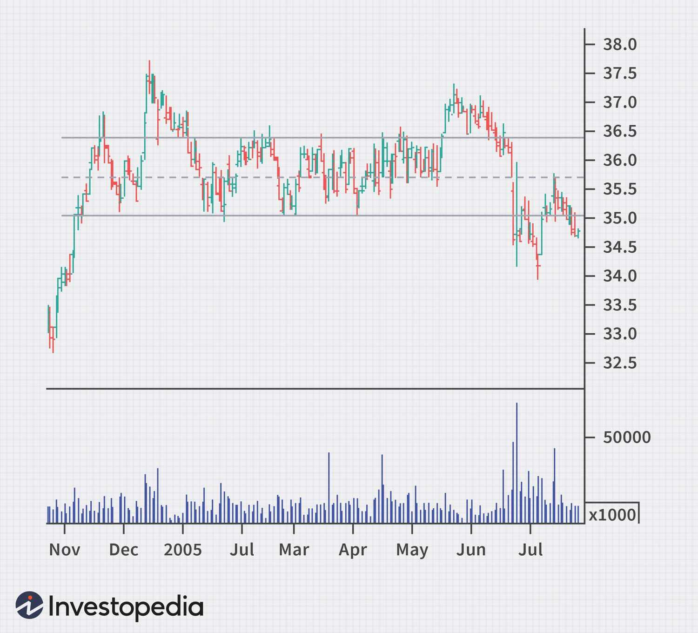

## Table of Contents

## What are Tirone levels?

Tirone levels are a tool used in technical analysis to help traders predict where the price of a stock or other financial asset might go next. They were created by a trader named John Tirone. The levels are drawn on a chart and are based on the highest and lowest prices of the asset over a certain period. Traders use these levels to find possible support and resistance points, which are prices where the asset might stop falling or rising.

There are three main Tirone levels: the top, middle, and bottom levels. The top level is at 2/3 of the distance from the lowest price to the highest price. The middle level is at the halfway point between the highest and lowest prices. The bottom level is at 1/3 of the distance from the lowest price to the highest price. Traders watch these levels closely because they believe the price of the asset is likely to react when it reaches one of these levels. This can help them decide when to buy or sell.

## How are Tirone levels calculated?

Tirone levels are calculated using the highest and lowest prices of a stock or asset over a certain time. To find these levels, you first need to know the highest price, which we'll call the high, and the lowest price, which we'll call the low. The difference between the high and the low is important because it helps us figure out where the Tirone levels should be.

There are three Tirone levels: the top, middle, and bottom. The top level is found by taking two-thirds of the difference between the high and the low and adding it to the low price. So, if the high is 100 and the low is 50, the top level would be 50 + (2/3 * (100 - 50)) = 83.33. The middle level is simply the average of the high and the low, which is (100 + 50) / 2 = 75. The bottom level is found by taking one-third of the difference between the high and the low and adding it to the low price, so it would be 50 + (1/3 * (100 - 50)) = 66.67. These levels help traders see where the price might stop or change direction.

## What is the purpose of using Tirone levels in trading?

Tirone levels help traders guess where the price of a stock or asset might go next. They do this by drawing lines on a chart that show where the price might stop or change direction. These lines are based on the highest and lowest prices of the stock over a certain time. Traders use these lines, called Tirone levels, to find good times to buy or sell the stock. They believe that when the price gets close to one of these levels, it is more likely to stop or turn around.

Traders watch the top, middle, and bottom Tirone levels closely. The top level is where the price might stop going up, the middle level is the halfway point, and the bottom level is where the price might stop going down. By knowing these levels, traders can make better decisions. For example, if the price is getting close to the bottom level, a trader might think it's a good time to buy because the price is likely to start going up again. This can help traders make more money and avoid big losses.

## Can Tirone levels be applied to any financial market?

Yes, Tirone levels can be used in many different financial markets, not just stocks. They work well in markets like [forex](/wiki/forex-system), commodities, and cryptocurrencies too. The idea is the same everywhere: you look at the highest and lowest prices over a time and find three levels where the price might stop or turn around. This helps traders in any market guess where prices might go next.

The reason Tirone levels can be used in different markets is because they are based on simple math and the way prices move. No matter if you're trading gold, the euro, or Bitcoin, prices go up and down, and finding the top, middle, and bottom levels helps traders see where these moves might pause. This makes Tirone levels a useful tool for anyone trying to make smart trading choices, no matter what they are trading.

## How do Tirone levels differ from other technical indicators?

Tirone levels are different from other technical indicators because they focus on just three key price points: the top, middle, and bottom levels. These levels are calculated using the highest and lowest prices over a certain time, and they help traders guess where the price might stop or change direction. Other indicators, like moving averages or the Relative Strength Index (RSI), use more complex math and look at things like price trends over time or how fast prices are changing. Tirone levels are simpler and easier to understand, which makes them good for traders who like to keep things straightforward.

Another way Tirone levels differ is that they are used to find specific price levels where traders think the market might react. This is different from indicators like the MACD (Moving Average Convergence Divergence), which show whether the market is overbought or oversold but don't point to exact price levels. Tirone levels give clear lines on a chart that traders can watch closely. This makes it easier for them to decide when to buy or sell, based on where the price is compared to these levels.

## What are the key components that make up Tirone levels?

Tirone levels are made up of three main parts: the top level, the middle level, and the bottom level. These levels are found by looking at the highest and lowest prices of a stock or asset over a certain time. The top level is two-thirds of the way up from the lowest price to the highest price. The middle level is right in the middle of the highest and lowest prices. The bottom level is one-third of the way up from the lowest price to the highest price.

These three levels help traders guess where the price might stop or turn around. Traders watch these levels closely because they think the price is more likely to react when it gets close to one of them. For example, if the price is close to the bottom level, traders might think it's a good time to buy because the price might start going up again. This makes Tirone levels a useful tool for traders to make better decisions about when to buy or sell.

## How can Tirone levels help in identifying support and resistance?

Tirone levels help traders find where the price of a stock or asset might stop going down or up. These levels are like lines on a chart that show where the price might find support or resistance. Support is when the price stops falling and starts to go up again. Resistance is when the price stops rising and starts to go down again. Traders use the top, middle, and bottom Tirone levels to guess where these support and resistance points might be.

The top Tirone level is where the price might stop going up, so it acts as resistance. The bottom Tirone level is where the price might stop going down, so it acts as support. The middle level is right in between and can act as both support and resistance, depending on where the price is coming from. By watching these levels, traders can see where the price might change direction and make better decisions about when to buy or sell.

## What are some common mistakes traders make when using Tirone levels?

One common mistake traders make when using Tirone levels is relying on them too much. They might think that just because the price hits a Tirone level, it will always bounce back or change direction. But Tirone levels are just a tool to help guess where the price might go, not a sure thing. The price can still go past these levels, so it's important for traders to use other tools and information too, not just Tirone levels.

Another mistake is not adjusting the time period they use to find the high and low prices. If traders always use the same time period, like one month, they might miss important changes in the market. It's better to look at different time periods and see how the Tirone levels change. This can give a better picture of where the price might find support or resistance.

## How can Tirone levels be integrated with other trading strategies?

Tirone levels can be used with other trading strategies to help traders make better choices. For example, a trader might use Tirone levels along with moving averages. Moving averages show the average price of a stock over time, and they can help traders see the overall trend. If the price is close to a Tirone level and also near a moving average, it might be a good time to buy or sell. This way, traders can use both tools to get a clearer picture of where the price might go next.

Another way to use Tirone levels with other strategies is by looking at the Relative Strength Index (RSI). The RSI tells traders if a stock is overbought or oversold. If the RSI shows that a stock is overbought and the price is close to the top Tirone level, it might be a good time to sell. On the other hand, if the RSI shows that a stock is oversold and the price is near the bottom Tirone level, it might be a good time to buy. By combining Tirone levels with the RSI, traders can make more informed decisions and improve their chances of making money.

## What advanced techniques can be used to enhance the effectiveness of Tirone levels?

To make Tirone levels work better, traders can use them with other tools like trend lines. Trend lines are lines drawn on a chart to show the direction of the price. If a Tirone level lines up with a trend line, it can be a strong sign that the price might stop or change direction at that point. Traders can also use [volume](/wiki/volume-trading-strategy), which is how many shares of a stock are being bought and sold. If the price hits a Tirone level and the volume is high, it means a lot of people are trading at that price, so the level might be more important.

Another way to make Tirone levels more useful is by looking at different time periods. Traders can draw Tirone levels using prices from different lengths of time, like a week, a month, or even a year. By comparing these levels, traders can see which ones are the most important. For example, if the same Tirone level shows up on charts from different time periods, it might be a very strong support or resistance point. This can help traders make better decisions about when to buy or sell.

## How do Tirone levels adapt to different time frames in trading?

Tirone levels can be used with different time frames in trading. This means traders can look at the highest and lowest prices over a short time, like a day, or a longer time, like a month or a year. When traders use different time frames, they can see different Tirone levels on the chart. This helps them understand where the price might stop or change direction in both the short term and the long term. For example, if a trader is looking at a daily chart, they might see a Tirone level that is different from the one they see on a weekly chart. By comparing these levels, traders can get a better idea of where the price might go next.

Using Tirone levels with different time frames can make trading decisions clearer. If the same Tirone level shows up on charts from different time periods, it might be a very strong support or resistance point. This means that the price is more likely to react at that level, no matter if you are looking at a short-term or long-term chart. Traders can use this information to plan their trades better. For example, if a short-term Tirone level matches a long-term one, it might be a good time to buy or sell because the price is likely to change direction at that point.

## What are the limitations and criticisms of using Tirone levels in market analysis?

Tirone levels have some problems that traders need to know about. One big problem is that they are not always right. Just because the price hits a Tirone level does not mean it will always stop or turn around. Sometimes the price can go right through these levels, which can make traders lose money if they only use Tirone levels to make decisions. Another problem is that Tirone levels are based on past prices, but the market can change a lot. What worked in the past might not work in the future, so relying too much on Tirone levels can be risky.

Some traders also say that Tirone levels are too simple. They only use the highest and lowest prices over a certain time, which might not give a full picture of the market. Other tools, like moving averages or the RSI, look at more things and might be better at showing what the market is doing. Critics also think that Tirone levels can make traders miss important changes in the market. If traders only look at Tirone levels and not other things, they might not see important signs that the market is about to change.

## What are Tirone Levels and how can they be understood?

Tirone Levels are an analytical tool composed of three horizontal lines on a price chart, serving as indicators for potential support and resistance levels in financial markets. These levels are derived from historical price data, using the highest high and lowest low within a specified timeframe to construct them.

The calculation of Tirone Levels begins with determining the midpoint line, which is the arithmetic average of the highest high and lowest low recorded over the chosen period. Mathematically, this can be expressed as:

$$
\text{Midpoint} = \frac{\text{Highest High} + \text{Lowest Low}}{2}
$$

The upper and lower lines, which provide additional layers of potential support and resistance, are positioned at 1/3rd and 2/3rds of the total range, respectively. This is achieved by dividing the price range defined by the highest high and the lowest low into three equal portions. The formulas for these levels are:

$$
\text{Upper Level} = \text{Lowest Low} + \frac{\text{Range}}{3}
$$

$$
\text{Lower Level} = \text{Highest High} - \frac{\text{Range}}{3}
$$

where $\text{Range} = \text{Highest High} - \text{Lowest Low}$.

Traders employ Tirone Levels to pinpoint potential reversal areas in asset prices. These levels offer a straightforward tool for making informed trading decisions regarding entry and [exit](/wiki/exit-strategy) points. By visually demarcating significant price levels on charts, Tirone Levels aid traders in anticipating market movements.

The interpretation of Tirone Levels shares similarities with quadrant lines and Fibonacci retracements. All these tools aim to partition the price action to identify crucial price levels that could serve as turning points. While Fibonacci retracement employs specific ratios linked to the Golden Ratio, Tirone Levels provide an alternative by dividing the price range into equal parts, offering traders a distinct perspective on potential support and resistance zones.

## What are the differences between Tirone Levels and Fibonacci Retracement?

Both Tirone Levels and Fibonacci retracements are essential tools in technical analysis, designed to identify crucial support and resistance levels that suggest potential price reversals. Their primary objective is helping traders forecast future price movements and make informed trading decisions.

Fibonacci retracement is based on the Golden Ratio, with specific percentage levels such as 23.6%, 38.2%, 50%, 61.8%, and 100%. These levels are derived from the Fibonacci sequence and are widely used because they are believed to represent key turning points where price action is likely to reverse. The calculation involves taking two extreme points, typically a major peak and trough, and dividing the vertical distance by the key Fibonacci ratios to establish levels.

In contrast, Tirone Levels divide the price range into three equal sections. The construction of Tirone Levels involves three horizontal lines. The midpoint line is the average of the highest high and the lowest low over a selected period. The upper and lower lines are determined by the following calculations:

$$
\text{Upper Line} = \text{Midpoint} + \frac{\text{Range}}{3}
$$

$$
\text{Lower Line} = \text{Midpoint} - \frac{\text{Range}}{3}
$$

Where the Range is the difference between the highest high and the lowest low.

A shared characteristic between both tools is the inclusion of a 50% retracement level. This is a pivotal point often seen as a magnet for prices, despite not being an official Fibonacci ratio, due to its prominence in market psychology and potential as a significant level of support or resistance.

The distinction between the two indicators lies in their calculation methods, which affects the points they identify for price behavior anticipation. Fibonacci retracement levels are determined through a percentage-based approach linked to the Fibonacci sequence, while Tirone Levels segment the range into equidistant parts aligned to the price maximum and minimum.

Understanding these differences is crucial for technical analysts. Those utilizing these tools in their trading strategies must recognize the implications of each method's calculation and interpretation to effectively apply them in identifying and capitalizing on potential market reversals or continuations.

## References & Further Reading

[1]: ["Evidence-Based Technical Analysis: Applying the Scientific Method and Statistical Inference to Trading Signals"](https://www.amazon.com/Evidence-Based-Technical-Analysis-Scientific-Statistical/dp/0470008741) by David Aronson

[2]: ["Machine Learning for Algorithmic Trading"](https://github.com/stefan-jansen/machine-learning-for-trading) by Stefan Jansen

[3]: ["Quantitative Trading: How to Build Your Own Algorithmic Trading Business"](https://github.com/LucindaYa/quant-resources/blob/master/Quantitative%20Trading%20How%20to%20Build%20Your%20Own%20Algorithmic%20Trading%20Business.pdf) by Ernest P. Chan

[4]: ["Advances in Financial Machine Learning"](https://www.amazon.com/Advances-Financial-Machine-Learning-Marcos/dp/1119482089) by Marcos Lopez de Prado

[5]: R. Colby, "The Encyclopedia of Technical Market Indicators," 2nd Edition (2003), McGraw-Hill. 