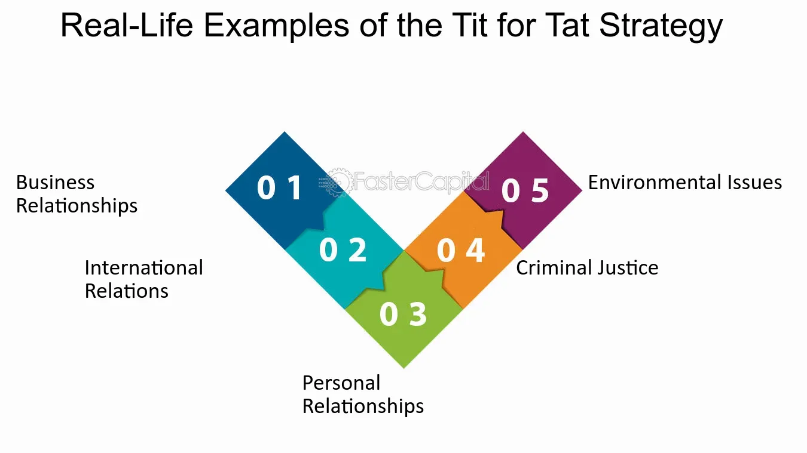

## Table of Contents

## What is the basic concept of 'Tit for Tat'?

'Tit for Tat' is a strategy often used in games and social situations where people take turns. It means if someone does something good to you, you do something good back. If someone does something bad to you, you do something bad back. It's like copying what the other person does. This idea is simple but can be very effective, especially in situations where people need to work together over time.

In games like the Prisoner's Dilemma, 'Tit for Tat' starts with a player being nice or cooperative. Then, the player keeps doing what the other player did in the last round. If the other player was nice, the 'Tit for Tat' player is nice too. If the other player was mean, the 'Tit for Tat' player is mean back. This strategy can help build trust and cooperation because it rewards good behavior and punishes bad behavior.

## How does 'Tit for Tat' apply to everyday life?

In everyday life, 'Tit for Tat' can show up in how we treat others. Imagine you're at school and a friend shares their lunch with you. The next day, you might share your lunch with them. This is like 'Tit for Tat' because you're doing something nice back. But if someone is mean and takes your toy without asking, you might not want to share your toys with them next time. This shows how 'Tit for Tat' can work with both good and bad actions.

This strategy can also help in bigger situations, like at work or in neighborhoods. If a neighbor helps you fix your fence, you might help them with their yard work later. This builds a good relationship because you're both helping each other. But if someone at work always takes credit for your ideas, you might stop sharing your ideas with them. 'Tit for Tat' can teach people to be fair and kind, but it can also show when someone isn't treating you right.

## What is the origin of the phrase 'Tit for Tat'?

The phrase 'Tit for Tat' comes from old English words. 'Tit' and 'tat' were used to mean a small amount or a little bit. So, 'Tit for Tat' means giving a little bit back for a little bit given. This phrase has been used for a long time to talk about giving back what you get, whether it's good or bad.

The exact start of the phrase is not clear, but it has been used in English since at least the 1500s. It shows up in old [books](/wiki/algo-trading-books) and stories where people talk about fairness and getting back what they give. Over time, 'Tit for Tat' became a common way to describe this back-and-forth way of treating others.

## Can you explain the mechanism of 'Tit for Tat' in game theory?

In game theory, 'Tit for Tat' is a strategy used in repeated games, like the Prisoner's Dilemma. It's simple: you start by being nice or cooperative. Then, in every round after that, you do what the other player did in the last round. If they were nice to you, you're nice back. If they were mean, you're mean back. This strategy is easy to understand and follow, which makes it powerful in games where players interact many times.

'Tit for Tat' works well because it encourages cooperation. When both players use this strategy, they quickly learn to be nice to each other because being nice gets a nice response. But if one player tries to be mean, the other player will be mean back, which can make the mean player think twice. Over time, this can lead to more cooperation and better results for everyone involved. It's like a simple rule that helps keep things fair and friendly.

## What are some historical examples where 'Tit for Tat' was used effectively?

During the Cold War, the United States and the Soviet Union used a kind of 'Tit for Tat' strategy. When the Soviet Union put missiles in Cuba, the U.S. responded by setting up a blockade. This was like saying, "If you do something dangerous, we will do something to stop you." The Soviets then took their missiles out of Cuba, and the U.S. took down the blockade. This back-and-forth helped keep things from getting worse and showed how 'Tit for Tat' can work in big, scary situations.

In sports, 'Tit for Tat' can be seen in how teams and players respond to each other. For example, in soccer, if one team starts playing rough, the other team might start playing rough back. This can lead to a game where both teams are careful not to be too mean, because they know the other team will do the same back. It's like a way to keep the game fair and fun, even when things get heated.

## How does 'Tit for Tat' strategy work in the Prisoner's Dilemma?

In the Prisoner's Dilemma, 'Tit for Tat' starts with you being nice. You choose to cooperate with the other player right from the beginning. Then, in every round after that, you do what the other player did last time. If they cooperated with you, you cooperate back. If they didn't cooperate and chose to be mean instead, you do the same thing back to them. This simple rule helps build trust because if both players use 'Tit for Tat', they will quickly learn to be nice to each other.

Over many rounds, 'Tit for Tat' can lead to more cooperation. If one player tries to be mean, the other player will be mean back, which can make the first player think twice about being mean again. This back-and-forth can help both players see that being nice is better for them in the long run. 'Tit for Tat' shows that if you treat others well, they will treat you well too, which can make everyone happier and better off.

## What are the advantages of using the 'Tit for Tat' strategy?

The 'Tit for Tat' strategy has many good points. It is easy to understand and use. You just do what the other person did last time. This makes it simple to follow, even in hard situations. It also helps build trust. When you are nice to someone, and they are nice back, it makes you want to keep being nice. This can make people work together better and be kinder to each other.

Another advantage is that 'Tit for Tat' can stop bad behavior. If someone is mean to you, and you are mean back, they might think twice about being mean again. This can lead to more peace and fairness. Over time, 'Tit for Tat' can make everyone better off because it rewards being nice and punishes being mean. It's like a simple rule that helps keep things fair and friendly.

## What are the potential drawbacks or limitations of the 'Tit for Tat' approach?

One problem with 'Tit for Tat' is that it can make things worse if people keep being mean to each other. If one person starts being mean and the other person does the same back, it can go on and on. This can make people angry and not want to work together. It's like a never-ending fight that doesn't help anyone. Also, if someone makes a mistake or has a bad day and is mean by accident, 'Tit for Tat' might make the other person be mean back without understanding why it happened.

Another issue is that 'Tit for Tat' might not work well if people don't play the game many times. If you only meet someone once or a few times, being nice back might not matter as much. Also, if someone is always mean no matter what you do, 'Tit for Tat' won't help because being mean back won't change their behavior. It's important to know when 'Tit for Tat' can work and when it might not be the best choice.

## How can 'Tit for Tat' be modified to improve its effectiveness in different scenarios?

One way to make 'Tit for Tat' better is to use something called 'Generous Tit for Tat.' This means you are nice most of the time, even if the other person is mean sometimes. This can help stop fights from getting worse. If someone is mean once, you might still be nice back. This shows you want to keep things friendly and gives the other person a chance to be nice too. It can work well when people make mistakes or have bad days, because it helps them get back to being nice.

Another way to change 'Tit for Tat' is to use 'Forgiving Tit for Tat.' With this, you might be mean back if someone is mean to you, but only for a little while. Then, you go back to being nice. This can help fix things after a fight. It shows you are willing to move on and work together again. 'Forgiving Tit for Tat' can be good when you want to keep working with someone over a long time, because it helps keep the peace and makes people want to be nice again.

## What role does 'Tit for Tat' play in international relations and diplomacy?

In international relations and diplomacy, 'Tit for Tat' can help countries work together better. If one country does something nice, like helping another country after a disaster, the other country might do something nice back, like sharing resources. This can build trust and make countries want to help each other more. It's like a way to show that being nice can lead to more good things happening between countries.

But 'Tit for Tat' can also make things worse if countries keep being mean to each other. If one country does something bad, like putting up trade barriers, the other country might do the same back. This can start a cycle of bad actions that makes it hard for countries to work together. It's important for countries to think about when 'Tit for Tat' can help and when it might make things worse, so they can choose the best way to act.

## How have computer simulations and algorithms utilized 'Tit for Tat' in studying cooperative behavior?

Computer simulations and algorithms have used 'Tit for Tat' to learn about how people can work together. Scientists make computer programs where different strategies play games like the Prisoner's Dilemma many times. They found that 'Tit for Tat' does really well in these games. It starts by being nice and then does what the other player did last time. This simple rule helps players learn to be nice to each other because being nice gets a nice response back. This can show how simple rules can make people work together better.

In these studies, 'Tit for Tat' helps scientists see how cooperation can grow over time. When many players use 'Tit for Tat', they quickly start being nice to each other. This makes the whole group work better together. But if one player tries to be mean, others will be mean back, which can make the mean player think twice. This shows that even in big groups, simple strategies like 'Tit for Tat' can help keep things fair and friendly.

## What are the latest research findings on the application of 'Tit for Tat' in evolutionary biology?

In evolutionary biology, 'Tit for Tat' helps scientists understand how animals work together and help each other. They found that animals often use a kind of 'Tit for Tat' when they live in groups. For example, if one animal shares food with another, the other animal might share food back later. This back-and-forth helps the whole group stay healthy and strong. Scientists think that 'Tit for Tat' can explain why animals help each other, even if it costs them something, because they know they will get help back.

New studies also show that 'Tit for Tat' can change over time. Animals might start with a simple 'Tit for Tat' but then learn to be more forgiving or generous. This can help them work better in groups where mistakes happen or where being too mean can cause big fights. Scientists are still learning how these changes happen and how they can make animal groups more successful. This research helps us understand how cooperation and kindness can evolve in nature.

## References & Further Reading

[1]: Axelrod, R. (1984). ["The Evolution of Cooperation."](https://ee.stanford.edu/~hellman/Breakthrough/book/pdfs/axelrod.pdf) Basic Books.

[2]: Axelrod, R., & Hamilton, W. D. (1981). ["The Evolution of Cooperation."](http://www-personal.umich.edu/~axe/research/Axelrod%20and%20Hamilton%20EC%201981.pdf) Science, 211(4489), 1390-1396.

[3]: Nowak, M. A., & Sigmund, K. (1993). ["A Strategy of Win-stay, Lose-shift that Outperforms Tit-for-tat in the Prisoner's Dilemma Game."](https://pubmed.ncbi.nlm.nih.gov/8316296/) Nature, 364(6432), 56-58.

[4]: Rapaport, A. (1965). ["Prisoner's Dilemma – Recollections and Observations."](https://link.springer.com/chapter/10.1007/978-94-010-2161-6_2) Simulation & Gaming, 26(2), 148–163.

[5]: Duffy, J., & Ochs, J. (2009). ["Cooperative Behavior and the Frequency of Social Interaction."](https://www.sciencedirect.com/science/article/pii/S0899825608001395) Games and Economic Behavior, 66(2), 785-812.