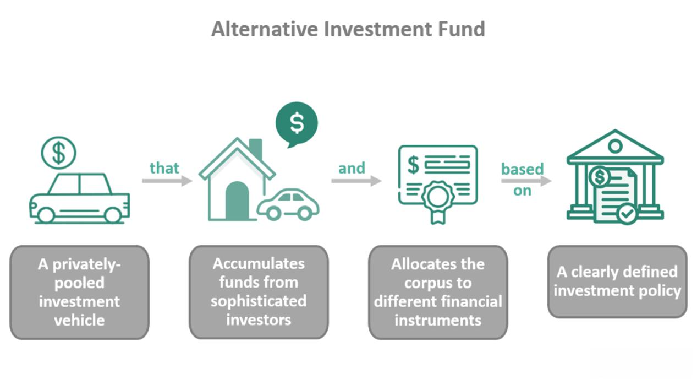

In today's fast-paced financial markets, algorithmic trading has emerged as a pivotal force, prompting an increased demand for innovative data solutions. Traditional financial data sources, though integral, are often limited due to their widespread availability and rapid integration into market prices, which can dilute their usefulness for securing a competitive edge. Consequently, traders are turning towards alternative data to enhance their strategies, with the TMT (Technology, Media, and Telecom) and Entertainment sectors being particularly promising avenues.

Alternative data refers to non-conventional datasets that offer unique insights into financial markets beyond typical market data and financial statements. This form of data is sought after for its potential to reveal hidden patterns and market trends before they become apparent to broader markets. As traditional data becomes ingrained into market prices almost immediately, alternative data sources present traders with new opportunities for gaining an information advantage.



The TMT and Entertainment sectors stand out as rich reservoirs of alternative data. The intersection of technology and consumer behavior in these sectors generates vast amounts of data, ranging from social media interactions and app usage metrics to streaming service consumption patterns. These data types can shed light on consumer preferences, predict shifts in market dynamics, and ultimately inform trading strategies. Traders equipped with insights from these sectors can potentially anticipate market movements with greater precision.

This article explores the transformative role of alternative data in algorithmic trading and examines how it is reshaping investment strategies. The focus will be on the types of alternative data available, particularly from the TMT and Entertainment sectors, and their applications within trading algorithms. By integrating such data, traders can achieve a more comprehensive understanding of market variables, strengthening their decision-making processes and enhancing their competitive advantage.

## Table of Contents

## Understanding Alternative Data

Alternative data refers to distinctive datasets that offer insights into financial markets beyond the scope of conventional data sources such as financial statements, earnings reports, and stock prices. This category of data encompasses diverse sources: social media sentiment, satellite imagery, and credit card transactions, among others.

Social media sentiment analysis involves parsing and interpreting large volumes of social content to gauge public mood and perceptions regarding a company, product, or market trend. This type of data can be instrumental in predicting stock price movements based on public sentiment shifts.

Satellite imagery offers a unique vantage point for evaluating economic activity by monitoring infrastructure developments, agricultural yields, and industrial output. For instance, analytics derived from satellite data can illuminate supply chain disruptions or pinpoint resource consumption levels, offering investors early indicators of market dynamics.

Credit card transaction data provides insights into consumer spending patterns and economic health. By analyzing spending habits, traders can anticipate revenue trends for retail companies or gauge sector health, thus informing investment decisions.

The rise of [alternative data](/wiki/best-alternative-data) is primarily driven by advancements in big data analytics and [machine learning](/wiki/machine-learning). These technologies enable the processing and analysis of vast datasets to uncover patterns, correlations, and trends that might not be immediately visible through traditional data analysis methods. Machine learning algorithms, for example, can sift through complex and voluminous datasets to identify predictive signals, leading to more informed trading strategies.

Investors leverage alternative data to detect emerging trends and gain forward-looking insights that can enhance trading algorithms. By integrating these unique datasets, market participants can refine their strategies, improve accuracy, and achieve a competitive edge. The Technology, Media, and Telecom (TMT) & Entertainment sectors offer rich veins of alternative data, which can significantly influence trading strategies. For instance, data from streaming platforms can reveal shifts in audience preferences, while information from telecom companies may provide insights into consumer behavior and technological adoption rates.

The integration of such diverse data sources enriches traditional datasets, providing a multifaceted view of market conditions that empowers investors to make more informed and strategic trading decisions.

## TMT & Entertainment Sectors: A Treasure Trove of Data

The TMT (Technology, Media, and Telecom) & Entertainment sectors offer a wealth of consumer data crucial for [algorithmic trading](/wiki/algorithmic-trading) strategies. This data is derived from various sources, including streaming service usage and social media interactions, providing traders with real-time insights into consumer behaviors and preferences. Companies such as SimilarWeb and AnthemData are key players in this space, offering in-depth analyses on app usage and consumer trends.

This information is highly valuable for identifying emerging patterns in media consumption and shifting consumer interests. For instance, a noticeable increase in the usage of a particular streaming platform or app can signal its growing popularity, which may have a direct impact on its parent company's stock price. Understanding these trends enables traders to anticipate market movements that are not immediately apparent through traditional data sources.

For algorithmic traders, the integration of alternative data from the TMT & Entertainment sectors allows for a more refined approach to predicting stock market behavior and dynamics. The large volumes of data available can enhance trading algorithms by providing additional variables and insights, leading to more accurate predictive models. By incorporating these non-traditional data streams, traders can refine their models to forecast market trends more effectively, using advanced statistical techniques and machine learning algorithms.

Ultimately, the application of alternative data from the TMT & Entertainment sectors expands the analytical capabilities of traders. It shifts the focus from not only what consumers purchase but also how they interact with technology and media, which can significantly influence market activities. This enriched data landscape provides a competitive edge, enabling traders to develop more sophisticated strategies and achieve better trading outcomes.

## Applications in Algorithmic Trading

Algorithmic trading leverages computer algorithms to execute trades based on predetermined rules, automating decision-making and trade execution processes. The incorporation of alternative data into these algorithms has become increasingly vital in providing more profound insights and generating actionable signals, thereby enhancing trading precision and outcomes.

Geo-location data constitutes a valuable alternative data source, offering insights into physical world consumer activities. For instance, data from companies like Huq Industries provides real-time information on foot traffic at retail locations. By analyzing patterns in consumer visits, traders can derive predictive indicators related to sales performance and stock valuation of retail companies. This data-driven insight enables traders to anticipate market movements more accurately and adjust their strategies accordingly.

Social sentiment analysis represents another cutting-edge application, where platforms like EntSight evaluate public opinion and social media discourse relative to specific stocks or sectors. Quantifying sentiment derived from Twitter, Reddit, and other social networks involves sentiment scoring methodologies that transform qualitative opinions into quantitative metrics. For example, a Python algorithm can be employed to parse text data from Twitter API, using natural language processing (NLP) libraries like TextBlob or VADER to calculate a sentiment score, which can then be integrated into market prediction models:

```python
from textblob import TextBlob

def calculate_sentiment(tweet):
    analysis = TextBlob(tweet)
    return analysis.sentiment.polarity

# Example usage
tweet = "Company X's new product is amazing! #innovation"
sentiment_score = calculate_sentiment(tweet)
```

By integrating these diverse data sources, algorithmic traders can enrich their models, aligning trades with emerging market trends and variables not immediately evident in traditional datasets. This approach lends itself to the creation of trading systems that are adaptable and responsive to nuanced shifts in consumer behavior, market sentiment, and external events, thereby fostering a competitive edge in financial markets.

## Challenges and Considerations

Alternative data holds substantial promise for enhancing algorithmic trading strategies, yet its integration is not without challenges. One significant concern is the matter of data quality and consistency. Alternative datasets often originate from unconventional sources, such as social media and satellite imagery, which may lack the standardized formats typical of traditional financial data. This variability can lead to inconsistencies, making it crucial for traders to implement rigorous data cleaning and validation processes to ensure reliability. Ensuring data privacy and compliance is equally essential. As datasets frequently contain sensitive information, traders must navigate complex legal landscapes to adhere to regulations like GDPR in Europe or CCPA in California. This compliance landscape necessitates robust data governance frameworks to manage the ethical implications of data usage responsibly.

The computational costs associated with processing large datasets also pose a significant challenge. Alternative data can be voluminous, requiring substantial computing resources for storage and analysis. This can necessitate advanced infrastructure and sophisticated algorithms capable of efficiently handling big data. Algorithm optimization and scalable cloud-based solutions can help mitigate these costs, allowing traders to harness the full potential of alternative data without prohibitive expenses.

Another challenge is the ever-evolving nature of alternative data sources. As technology progresses, new data types emerge, and existing sources evolve in their scope and granularity. Traders must stay abreast of these changes to maintain competitively viable models. Continuous learning systems and adaptive algorithms can support this need, enabling models to evolve alongside data sources and market dynamics. 

Despite these challenges, the potential advantages of incorporating alternative data into trading strategies are significant. Enhanced predictive capabilities and deeper market insights can lead to superior trading performance. As such, for traders willing to invest in overcoming these hurdles, alternative data represents a valuable resource for gaining a competitive edge in financial markets.

## Conclusion

As financial markets continue to evolve, the demand for cutting-edge data solutions is more critical than ever. In this landscape, alternative data from the Technology, Media, and Telecom (TMT) & Entertainment sectors stands out as a valuable resource, enhancing algorithmic trading strategies through fresh and innovative insights. 

The integration of alternative data provides traders with unique opportunities to achieve significant trading advantages. For instance, the real-time analysis of social media activity and streaming service usage can unveil consumer trends and shifts in market sentiment. Such insights can lead to more informed decision-making and, consequently, better trading outcomes. By incorporating these diverse data streams, traders gain access to a broader array of signals that can complement traditional data sources, potentially improving the accuracy and robustness of their trading algorithms.

For those in the trading industry, embracing alternative data is becoming increasingly crucial to achieving superior market performance. As the competition intensifies, the ability to leverage unconventional data sources can distinguish leading firms from the laggards. It enables traders to anticipate market movements more precisely, optimize their execution strategies, and manage risk more effectively.

In summary, alternative data is not just a trend but a transformative tool reshaping the landscape of algorithmic trading. By continuously adapting to and integrating these novel data sources, traders can stay ahead of market trends and capture opportunities that might otherwise remain hidden. This approach represents a profound shift in trading strategies, emphasizing the dynamic integration of data, technology, and analytics to enhance market competitiveness.

## References & Further Reading

[1]: ["Advances in Financial Machine Learning"](https://www.amazon.com/Advances-Financial-Machine-Learning-Marcos/dp/1119482089) by Marcos Lopez de Prado

[2]: ["Machine Learning for Algorithmic Trading"](https://github.com/PacktPublishing/Machine-Learning-for-Algorithmic-Trading-Second-Edition) by Stefan Jansen

[3]: ["Quantitative Trading: How to Build Your Own Algorithmic Trading Business"](https://books.google.com/books/about/Quantitative_Trading.html?id=j70yEAAAQBAJ) by Ernest P. Chan

[4]: Cembalest, J. (2017). ["The Untapped Potential of Alternative Data"](https://www.researchgate.net/publication/321980195_The_Untapped_Potential_of_Preferential_Trade_Agreements_for_Climate_Governance) J.P. Morgan Insights.

[5]: Maier, M., & Murawski, C. (2021). ["Alternative Data in the Financial Industry: Benefits and Challenges."](https://pubmed.ncbi.nlm.nih.gov/34968677/) Finanzen.net.