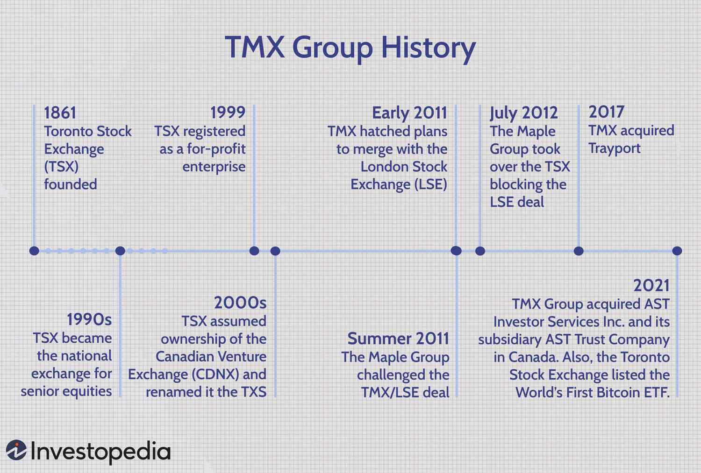

## Table of Contents

## What is TMX Group?

TMX Group is a company that owns and operates the Toronto Stock Exchange (TSX) and the TSX Venture Exchange. These are places where people and companies can buy and sell stocks, which are shares in businesses. The TSX is the biggest stock exchange in Canada and one of the top exchanges in the world. The TSX Venture Exchange is for smaller companies that want to grow.

TMX Group also does other things besides running stock exchanges. They have a company called TMX Datalinx that gives people information about markets and helps them make smart choices about buying and selling. They also have a company called TMX Trayport that helps people trade energy and other things. TMX Group helps make the financial markets in Canada work well and helps businesses grow.

## When was TMX Group founded?

TMX Group was founded in 2008. Before that, the Toronto Stock Exchange and the TSX Venture Exchange were run by different companies. In 2008, these companies joined together to make TMX Group.

Since then, TMX Group has grown and now does more than just run stock exchanges. They help people get information about markets and help with trading energy and other things. TMX Group is important for the financial markets in Canada and helps businesses grow.

## What are the main stock exchanges operated by TMX Group?

TMX Group runs two main stock exchanges in Canada. The first one is the Toronto Stock Exchange, which is often called the TSX. It's the biggest stock exchange in Canada and one of the top exchanges in the world. People and companies can buy and sell stocks on the TSX. Stocks are like pieces of a company that you can own.

The second stock exchange that TMX Group operates is the TSX Venture Exchange. This exchange is for smaller companies that want to grow. It helps these companies get money by selling stocks to people who want to invest in them. Both the TSX and the TSX Venture Exchange are important for the Canadian economy because they help businesses get the money they need to grow.

## What types of financial services does TMX Group provide?

TMX Group runs the Toronto Stock Exchange (TSX) and the TSX Venture Exchange. These are places where people and companies can buy and sell stocks. Stocks are like pieces of a company that you can own. The TSX is the biggest stock exchange in Canada and one of the top exchanges in the world. The TSX Venture Exchange is for smaller companies that want to grow. These exchanges help businesses get the money they need to grow by selling stocks to people who want to invest in them.

TMX Group also provides other financial services. They have a company called TMX Datalinx that gives people information about markets. This helps them make smart choices about buying and selling. They also have a company called TMX Trayport that helps people trade energy and other things. These services help make the financial markets in Canada work well and help businesses grow.

Overall, TMX Group is important for the Canadian economy. They help businesses get the money they need to grow and they help people make smart choices about investing. By running stock exchanges and providing other financial services, TMX Group helps make the financial markets in Canada work well.

## How has TMX Group evolved historically?

TMX Group started in 2008 when the Toronto Stock Exchange and the TSX Venture Exchange joined together. Before that, these exchanges were run by different companies. The Toronto Stock Exchange, or TSX, is the biggest stock exchange in Canada and one of the top exchanges in the world. It's a place where people and companies can buy and sell stocks, which are like pieces of a company that you can own. The TSX Venture Exchange is for smaller companies that want to grow. It helps these companies get money by selling stocks to people who want to invest in them.

Since 2008, TMX Group has grown and now does more than just run stock exchanges. They have a company called TMX Datalinx that gives people information about markets. This helps them make smart choices about buying and selling. They also have a company called TMX Trayport that helps people trade energy and other things. These services help make the financial markets in Canada work well and help businesses grow.

Overall, TMX Group has become very important for the Canadian economy. They help businesses get the money they need to grow by running stock exchanges and providing other financial services. By doing this, TMX Group helps make the financial markets in Canada work well and helps people make smart choices about investing.

## What are the major subsidiaries of TMX Group?

TMX Group has a few important companies that it owns. One of these is TMX Datalinx. This company gives people information about markets. It helps them make smart choices about buying and selling. Another important company is TMX Trayport. This company helps people trade energy and other things. These services help make the financial markets in Canada work well and help businesses grow.

TMX Group also owns the Toronto Stock Exchange, which is often called the TSX. The TSX is the biggest stock exchange in Canada and one of the top exchanges in the world. It's a place where people and companies can buy and sell stocks, which are like pieces of a company that you can own. The TSX helps businesses get the money they need to grow by selling stocks to people who want to invest in them.

Another subsidiary is the TSX Venture Exchange. This exchange is for smaller companies that want to grow. It helps these companies get money by selling stocks to people who want to invest in them. Both the TSX and the TSX Venture Exchange are important for the Canadian economy because they help businesses get the money they need to grow.

## What role does TMX Group play in the global financial market?

TMX Group plays an important role in the global financial market by running the Toronto Stock Exchange (TSX) and the TSX Venture Exchange. The TSX is one of the biggest stock exchanges in the world. It's a place where people and companies from all over the world can buy and sell stocks. Stocks are like pieces of a company that you can own. The TSX helps businesses get the money they need to grow by selling stocks to people who want to invest in them. This makes the TSX important not just for Canada, but for the whole world.

TMX Group also helps the global financial market by providing other services. They have a company called TMX Datalinx that gives people information about markets. This helps them make smart choices about buying and selling, no matter where they are in the world. They also have a company called TMX Trayport that helps people trade energy and other things. These services help make the financial markets work well and help businesses grow, which is important for the global economy.

## How does TMX Group contribute to the Canadian economy?

TMX Group helps the Canadian economy by running the Toronto Stock Exchange (TSX) and the TSX Venture Exchange. These are places where people and companies can buy and sell stocks. Stocks are like pieces of a company that you can own. The TSX is the biggest stock exchange in Canada and one of the top exchanges in the world. It helps businesses get the money they need to grow by selling stocks to people who want to invest in them. This is important because when businesses grow, they create jobs and help the economy get stronger.

TMX Group also helps the Canadian economy by providing other services. They have a company called TMX Datalinx that gives people information about markets. This helps them make smart choices about buying and selling. They also have a company called TMX Trayport that helps people trade energy and other things. These services help make the financial markets in Canada work well and help businesses grow. By doing all these things, TMX Group plays a big role in making the Canadian economy strong and helping it grow.

## What are some of the key acquisitions made by TMX Group?

TMX Group has grown by buying other companies. One important acquisition was Trayport in 2017. Trayport helps people trade energy and other things. By buying Trayport, TMX Group could offer more services to help businesses and make the financial markets work better.

Another key acquisition was the purchase of the Natural Gas Exchange (NGX) in 2004. NGX is a place where people can buy and sell natural gas and electricity. This helped TMX Group expand into the energy market and offer more ways for people to trade. These acquisitions have helped TMX Group become a bigger and more important part of the financial markets in Canada and around the world.

## What technological innovations has TMX Group implemented in its operations?

TMX Group has made many technological improvements to help its stock exchanges and other services work better. One big change was moving to electronic trading. This means people can buy and sell stocks using computers instead of going to a physical place. This makes trading faster and easier. TMX Group also created a system called TMX Quantum XA. This system helps process trades very quickly and can handle a lot of trades at the same time. This is important because it helps keep the stock market running smoothly, even when there are a lot of trades happening.

Another important technology that TMX Group uses is called TMX Atrium. This is a platform that helps people trade different things like agricultural products and metals. It connects buyers and sellers from all over the world, making it easier for them to do business. TMX Group also uses a lot of data and analytics to help people make smart choices about buying and selling. They have a company called TMX Datalinx that gives people detailed information about markets. This helps traders and investors understand what is happening in the market and make better decisions.

## How does TMX Group ensure the security and integrity of its trading platforms?

TMX Group works hard to make sure its trading platforms are safe and fair. They use strong security measures to protect the systems where people buy and sell stocks. This includes using encryption, which is like a secret code that keeps information safe. They also have firewalls and other ways to stop people from breaking into the system. TMX Group checks their systems all the time to find and fix any problems that could let someone cheat or steal information.

To keep trading fair, TMX Group follows strict rules and watches the market closely. They have special teams that look for any strange trading that might be cheating. If they find anything wrong, they can stop it and punish the people who did it. TMX Group also works with other groups and governments to make sure everyone is following the rules. By doing all these things, TMX Group helps make sure that people can trust the stock market and feel safe when they buy and sell stocks.

## What are the future strategic plans of TMX Group?

TMX Group is always looking for ways to grow and improve. One of their main goals is to keep making their technology better. They want to use new technology to make trading faster and easier for everyone. They also want to find new ways to help people trade different things, like energy and other products. By doing this, they hope to attract more people to use their services and help more businesses grow.

Another important plan for TMX Group is to expand into new markets. They want to work with more countries and help people from all over the world trade on their platforms. This will make TMX Group a bigger part of the global financial market. They also want to keep providing good information and tools to help people make smart choices about buying and selling. By focusing on these things, TMX Group hopes to keep helping the Canadian economy and become even more important in the world of finance.

## References & Further Reading

[1]: ["TMX Group Overview."](https://en.wikipedia.org/wiki/TMX_Group) TMX Group Limited.

[2]: Cartea, Á., Jaimungal, S., & Penalva, J. (2015). ["Algorithmic and High-Frequency Trading."](https://assets.cambridge.org/97811070/91146/frontmatter/9781107091146_frontmatter.pdf) Cambridge University Press.

[3]: Aldridge, I. (2013). ["High-Frequency Trading: A Practical Guide to Algorithmic Strategies and Trading Systems."](https://www.wiley.com/en-us/High+Frequency+Trading%3A+A+Practical+Guide+to+Algorithmic+Strategies+and+Trading+Systems%2C+2nd+Edition-p-9781118343500) Wiley.

[4]: López de Prado, M. (2018). ["Advances in Financial Machine Learning."](https://www.amazon.com/Advances-Financial-Machine-Learning-Marcos/dp/1119482089) Wiley.

[5]: ["TSX Trading Flash Guide."](https://www.tsx.com/) Toronto Stock Exchange.

[6]: Hasbrouck, J. (2007). ["Empirical Market Microstructure: The Institutions, Economics, and Econometrics of Securities Trading."](https://academic.oup.com/book/52241) Oxford University Press.

[7]: Chan, E. (2008). ["Quantitative Trading: How to Build Your Own Algorithmic Trading Business."](https://github.com/ftvision/quant_trading_echan_book) Wiley.