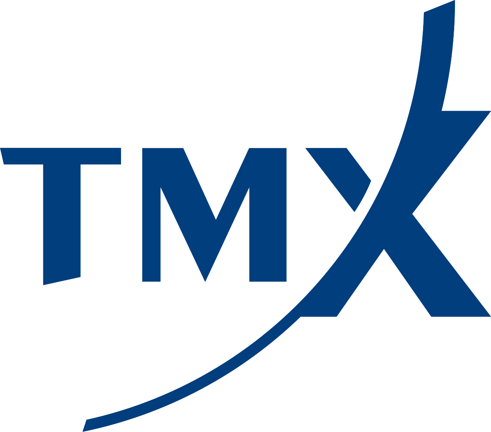

## Table of Contents

## What is TMX Group Incorporated?

TMX Group Incorporated is a company that runs stock markets in Canada. It is like a big store where people and companies can buy and sell shares of other companies. The main stock market it runs is called the Toronto Stock Exchange, which is the biggest in Canada. People all over the world use it to trade stocks.

TMX Group also runs other markets, like the TSX Venture Exchange, which helps smaller companies grow by letting them sell shares to the public. Besides stock markets, TMX Group provides other services, like data about the markets and technology to help trading happen smoothly. It helps make sure that buying and selling stocks is fair and safe for everyone involved.

## When was TMX Group Incorporated founded?

TMX Group Incorporated was founded in 2008. Before that, it was just the Toronto Stock Exchange, which started way back in 1852. In 2008, the Toronto Stock Exchange joined with the Montreal Exchange, which is another stock market in Canada. This joining together made the TMX Group.

When the TMX Group was created, it became a bigger company that could offer more services. It now runs several markets, not just the Toronto Stock Exchange. This includes the TSX Venture Exchange, which helps smaller companies. The TMX Group also provides data and technology to help with trading.

## What are the main services provided by TMX Group?

TMX Group runs several stock markets in Canada, with the biggest one being the Toronto Stock Exchange. This is where people and companies can buy and sell shares of other companies. It's like a big store for stocks. The TSX Venture Exchange is another market they run, which helps smaller companies grow by letting them sell shares to the public. This way, smaller companies can get the money they need to expand.

Besides running these markets, TMX Group also provides other important services. They offer data about the markets, which helps people make smart decisions about buying and selling stocks. They also provide technology that makes trading easier and safer. This technology helps make sure that everything in the markets runs smoothly and fairly for everyone involved.

## How does TMX Group generate its revenue?

TMX Group makes money by charging fees for the services it provides. When people and companies buy or sell stocks on the Toronto Stock Exchange or the TSX Venture Exchange, TMX Group takes a small fee for each trade. This is their main way of [earning](/wiki/earning-announcement) money. They also make money from listing fees, which are the fees companies pay to have their stocks listed on the exchange.

Another way TMX Group earns money is by selling data and technology services. They provide important information about the markets that people use to make decisions about buying and selling stocks. Companies and traders pay for this data. TMX Group also sells technology that helps make trading easier and safer. This technology is used by other exchanges and financial companies around the world, and they pay TMX Group for using it.

## What are the key subsidiaries of TMX Group?

TMX Group has several important companies that work under it, called subsidiaries. One of the main ones is the Toronto Stock Exchange (TSX), which is the biggest stock market in Canada. It's where people and companies buy and sell shares of other companies. Another key subsidiary is the TSX Venture Exchange, which helps smaller companies grow by letting them sell their shares to the public. This way, these smaller companies can get the money they need to expand.

Another important subsidiary is the Montreal Exchange (MX), which is Canada's financial derivatives market. This market deals with special types of investments that can help people manage risk. TMX Group also owns the Canadian Depository for Securities Limited (CDS), which is like a safe place where securities, like stocks and bonds, are kept and moved around safely. These subsidiaries all work together to help TMX Group offer a wide range of services to its customers.

## Who are the major shareholders of TMX Group?

The biggest shareholder of TMX Group is the Caisse de dépôt et placement du Québec (CDPQ), which is a big investment group from Quebec, Canada. They own a large part of TMX Group, which means they have a lot of say in how the company is run. Another important shareholder is the Ontario Teachers' Pension Plan (OTPP), which is a pension fund for teachers in Ontario. They also own a big piece of TMX Group and help make decisions about the company.

Other shareholders include big investment companies and funds from around the world. These include names like BlackRock, Vanguard, and RBC Global Asset Management. They all own smaller pieces of TMX Group but together, they help shape the company's future. The rest of the shares are owned by many smaller investors, including people who buy stocks on the stock market.

## How has TMX Group's stock performed over the past five years?

Over the past five years, TMX Group's stock has had its ups and downs but has generally gone up. In 2019, the stock started at around $100 per share. By the end of 2023, it was trading at about $130 per share. This means that if you had bought the stock at the beginning of 2019 and held onto it, you would have seen a good increase in its value. The stock did face some challenges, especially during the early part of the COVID-19 pandemic in 2020, when it dropped to around $90 per share. However, it bounced back strongly after that and continued to grow.

The performance of TMX Group's stock can be influenced by many things, like how well the company is doing, what's happening in the economy, and even world events. For example, when the economy is doing well, more people might want to buy and sell stocks, which can help TMX Group's business and push its stock price up. On the other hand, if there's a lot of uncertainty or bad news, people might be less likely to trade, which can affect the stock price negatively. Overall, TMX Group's stock has shown resilience and growth over the past five years, making it a solid performer in the market.

## What are the major acquisitions made by TMX Group in recent years?

In recent years, TMX Group has made some big purchases to grow its business. One of the biggest was buying Trayport, a company that helps with trading in energy markets. This happened in 2017. Trayport's technology makes it easier for people to buy and sell energy, like electricity and natural gas. By buying Trayport, TMX Group could offer more services and reach more customers in the energy trading world.

Another important acquisition was the purchase of the Canadian Depository for Securities Limited (CDS) in 2016. CDS is like a safe place where stocks and bonds are kept and moved around safely. Before TMX Group bought it, CDS was owned by several big banks. By owning CDS, TMX Group could make sure that trading and keeping securities safe was done smoothly and securely. These acquisitions have helped TMX Group become a bigger and more important player in the world of finance.

## How does TMX Group contribute to the Canadian economy?

TMX Group helps the Canadian economy by running the Toronto Stock Exchange, which is the biggest stock market in Canada. This market lets companies sell their stocks to the public, which gives them money to grow their businesses. When companies grow, they can create more jobs and help the economy get stronger. The TSX Venture Exchange, another market run by TMX Group, helps smaller companies do the same thing. By giving these smaller companies a place to sell their stocks, TMX Group helps them get the money they need to expand and create more jobs.

TMX Group also helps the economy by providing important data and technology services. The data they offer helps people make smart decisions about buying and selling stocks. This makes the markets work better and helps the economy run smoothly. The technology they provide makes trading easier and safer, which encourages more people to trade. When more people trade, it can help the economy grow. Overall, TMX Group plays a big role in making the Canadian economy stronger by helping companies grow and making the markets work well.

## What are the regulatory challenges faced by TMX Group?

TMX Group faces several regulatory challenges that can make running their business more difficult. One big challenge is following the rules set by the Canadian Securities Administrators (CSA). These rules are meant to make sure that the stock markets are fair and safe for everyone. TMX Group has to make sure they follow all these rules, which can be hard because the rules can change and there are a lot of them. They also have to report a lot of information to the regulators, which takes time and effort.

Another challenge comes from international regulations. Since TMX Group works with people and companies from all over the world, they have to follow rules from different countries too. This can be tricky because each country might have its own set of rules. For example, when TMX Group bought Trayport, they had to deal with rules from the European Union. Keeping up with all these different rules can be a big job and can sometimes slow down their business or make it more expensive to operate.

## How does TMX Group ensure the security and integrity of its trading platforms?

TMX Group works hard to make sure that its trading platforms are safe and fair for everyone. They use strong technology to keep the platforms secure. This includes things like firewalls and encryption, which help keep out hackers and protect the information that is shared on the platforms. They also have strict rules and checks to make sure that trading is done in a fair way. For example, they watch for any strange trading activity and can stop it if they think something is wrong.

TMX Group also has a team of experts who work all the time to keep the platforms safe. These people watch the platforms closely and can quickly fix any problems that come up. They also test the platforms regularly to make sure they are working well and are safe. By doing all these things, TMX Group helps make sure that people can trust the platforms and feel safe when they are buying and selling stocks.

## What are the future growth strategies of TMX Group?

TMX Group is looking to grow by expanding its services and reaching more customers around the world. One way they plan to do this is by improving their technology. They want to make their trading platforms even better and easier to use. This can attract more people to trade on their markets. They are also looking to offer more types of trading, like in new areas such as cryptocurrencies and other digital assets. By doing this, they can bring in new customers who are interested in these new kinds of investments.

Another part of their growth strategy is to make more partnerships and maybe even buy other companies. By working with other businesses, TMX Group can offer more services and reach more people. For example, they might partner with companies in other countries to help them trade on the Toronto Stock Exchange. They could also buy companies that have technology or services that TMX Group doesn't have yet. This can help them grow faster and offer more to their customers. Overall, TMX Group wants to keep growing by using technology, offering new types of trading, and working with other companies.

## References & Further Reading

[1]: Bergstra, J., Bardenet, R., Bengio, Y., & Kégl, B. (2011). ["Algorithms for Hyper-Parameter Optimization."](https://proceedings.neurips.cc/paper/2011/file/86e8f7ab32cfd12577bc2619bc635690-Paper.pdf) Advances in Neural Information Processing Systems 24.

[2]: ["Advances in Financial Machine Learning"](https://www.amazon.com/Advances-Financial-Machine-Learning-Marcos/dp/1119482089) by Marcos Lopez de Prado

[3]: ["Evidence-Based Technical Analysis: Applying the Scientific Method and Statistical Inference to Trading Signals"](https://www.amazon.com/Evidence-Based-Technical-Analysis-Scientific-Statistical/dp/0470008741) by David Aronson

[4]: ["Machine Learning for Algorithmic Trading"](https://github.com/stefan-jansen/machine-learning-for-trading) by Stefan Jansen

[5]: ["Quantitative Trading: How to Build Your Own Algorithmic Trading Business"](https://www.amazon.com/Quantitative-Trading-Build-Algorithmic-Business/dp/1119800064) by Ernest P. Chan