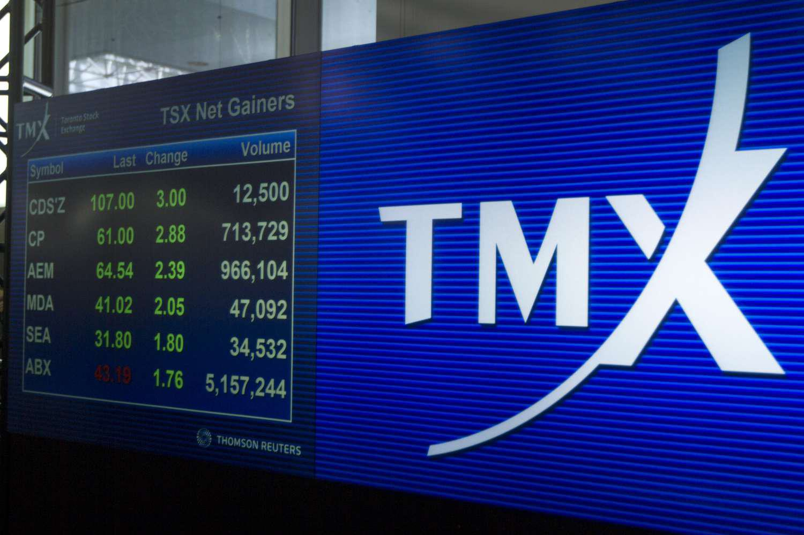

The TMX Group Limited, based in Toronto, stands as a leading player in the financial services sphere, managing some of the world's largest stock exchanges, most notably the Toronto Stock Exchange (TSX) and TSX Venture Exchange. As a pivotal force in the global financial markets, the TMX Group has embraced technological advancements, with a particular emphasis on algorithmic trading, reshaping how financial transactions are conducted. This article aims to elucidate the TMX Group's significant influence, exploring its storied history, distinctive market structure, and pioneering technological innovations within trading platforms.

Algorithmic trading, which relies heavily on sophisticated algorithms for the execution of trades, has marked a paradigm shift from traditional manual trading processes to automated, efficient, and precise operations. The TMX Group has been proactive in integrating such advanced trading techniques, ensuring it remains at the forefront of market innovation. Alongside these innovations, the article will outline the challenges TMX encounters, including regulatory hurdles and technological disruptions, and the opportunities it seizes to maintain its leadership role within the industry. 



Through this exploration, we aim to provide a comprehensive understanding of how TMX Group continues to shape and adapt to the evolving landscape of financial markets, leveraging cutting-edge technology to enhance the efficiency and reliability of its exchanges.

## Table of Contents

## History of TMX Group

TMX Group's origins trace back to the mid-19th century with the establishment of the Toronto Stock Exchange (TSX) in 1852. Initially formed as an unincorporated entity, TSX was officially incorporated in 1861, marking the advent of a formalized securities exchange in Canada. This early establishment laid the groundwork for what would eventually become one of the world's most significant financial markets.

Over the years, TSX evolved in response to the increasing demands of the market. A notable transformation occurred in 2008 when TMX Group was formed following a strategic merger with the Montreal Exchange. This partnership was instrumental in enhancing TMX's derivatives trading capabilities, reflecting a strategic move to broaden its market services and improve competitive advantage. The Montreal Exchange, known for its expertise in derivatives, contributed significantly to TMX's portfolio, enabling it to offer a wider range of financial instruments.

In addition to mergers, TMX Group has strategically acquired several key entities to extend its influence and operational scope. One of the significant acquisitions was the Boston Options Exchange, which expanded TMX's reach into the American markets, providing a platform for options trading in the United States. Further extending its market influence, TMX acquired the Trayport energy trading platform. This acquisition strengthened TMX's position in the energy sector, allowing for efficient trading and management within this critical market segment.

The ongoing transformation of TMX Group underscores its commitment to innovation and adaptation. By continuously embracing technological advancements, the Group has managed to maintain its relevance in the ever-evolving financial landscape. This adaptability is illustrated through its investments in state-of-the-art trading systems and platforms, ensuring that it meets the growing demands for speed and efficiency in trade execution.

As a testament to its robust growth strategy, TMX Group continues to explore opportunities that align with its strategic vision, focusing on expanding its services and capabilities in response to global market trends. Through these efforts, TMX remains a pivotal player in financial services, characterized by its historical legacy and forward-thinking approach.

## TMX Group's Stock Exchanges

TMX Group manages two prominent stock exchanges within Canada: the Toronto Stock Exchange (TSX) and the TSX Venture Exchange. These exchanges are pivotal in serving diverse market portfolios and addressing the various needs of market participants.

The Toronto Stock Exchange (TSX) is recognized for its extensive array of listed assets, including equities, exchange-traded funds (ETFs), and derivative instruments. This exchange primarily caters to large-cap corporations, providing a platform for well-established entities to raise capital and enhance their public profile. The TSX's robust infrastructure supports a wide range of financial instruments, offering investors and companies alike a reliable market environment.

Conversely, the TSX Venture Exchange plays a crucial role in supporting burgeoning companies that are seeking capital for growth and development. It serves as an incubator for smaller enterprises, allowing them to access public funds at an earlier stage than might be feasible on the larger TSX. The TSX Venture often serves as a stepping stone for companies that eventually graduate to a TSX listing as they achieve significant growth and maturity.

The technological infrastructure underlying these exchanges is paramount in ensuring the efficient and secure execution of trades. High-performance systems are employed to manage a vast number of transactions seamlessly, providing both [liquidity](/wiki/liquidity-risk-premium) and transparency to market participants. These systems are designed to handle the intricacies of modern trading demands, offering features that minimize latency and enhance the reliability of trading operations.

Incorporating advanced technologies is a continuous endeavor for TMX Group, as it strives to enhance the trading experience and ensure the highest standards of market operation. This commitment to technological excellence is critical in maintaining TMX's competitive edge and accommodating the dynamic needs of the financial markets.

## The Rise of Algorithmic Trading

Algorithmic trading refers to the use of computer algorithms to automate the process of trading financial instruments at high speeds and with great efficiency. By leveraging sophisticated mathematical models and real-time data, these algorithms can analyze market conditions, identify trading opportunities, and execute trades faster than any human trader. This automation has not only streamlined the trading process but also significantly reduced transaction costs and minimized market impact.

TMX Group has embraced [algorithmic trading](/wiki/algorithmic-trading) by integrating advanced platforms that facilitate the execution of such strategies. These platforms are designed to provide seamless transaction execution by offering high-performance infrastructure that ensures quick order processing and enhanced reliability. The implementation of algorithmic trading tools on TMX’s platforms enables participants to optimize their trading strategies by determining the best times to enter or [exit](/wiki/exit-strategy) the market, ultimately improving trading outcomes.

One of the key components of algorithmic trading is the use of [artificial intelligence](/wiki/ai-artificial-intelligence) (AI) to enhance performance and decision-making. AI and [machine learning](/wiki/machine-learning) algorithms process vast amounts of historical and real-time market data to uncover patterns and trends that are not readily apparent to human traders. These insights enable algorithms to make informed trading decisions quickly and accurately.

To illustrate how such algorithms might be implemented, consider a simplified Python script utilizing a moving average crossover strategy, a common technique in algorithmic trading:

```python
import numpy as np
import pandas as pd

# Sample market data
data = {'Close': [120, 130, 128, 135, 140, 150, 155]}
market_data = pd.DataFrame(data)

# Calculate Moving Averages
market_data['Short_MA'] = market_data['Close'].rolling(window=3).mean()
market_data['Long_MA'] = market_data['Close'].rolling(window=5).mean()

# Define Buy/Sell Signals
market_data['Signal'] = 0
market_data.loc[market_data['Short_MA'] > market_data['Long_MA'], 'Signal'] = 1
market_data.loc[market_data['Short_MA'] < market_data['Long_MA'], 'Signal'] = -1

print(market_data)
```

This script calculates short-term and long-term moving averages of closing prices to generate buy and sell signals. In a real-world scenario, such strategies can be further refined using AI-driven models to adapt to changing market dynamics automatically.

The advancements in algorithmic trading, supported by TMX Group’s robust infrastructure, offer substantial benefits to traders and institutions by providing tools that enhance precision, execution speed, and cost-effectiveness in trading operations. This technology-driven approach to trading signifies an essential step towards a more efficient and responsive financial market landscape.

## Financial Services by TMX Group

TMX Group Limited provides a wide array of financial services beyond its well-known trading platforms. One of its critical functions is clearing and settlement, primarily executed through the Canadian Derivatives Clearing Corporation (CDCC). The CDCC plays a pivotal role in mitigating counterparty risk by ensuring that trades are settled accurately and efficiently, thus maintaining systemic stability in financial markets. This clearing service is essential to manage and reconcile trades once they are executed, guaranteeing that both buyers and sellers fulfill their contractual obligations.

Moreover, TMX is heavily invested in market intelligence services, supplying participants with data and analytics that are crucial for making informed trading decisions. Access to robust market data assists traders, analysts, and investors in understanding market trends, assessing risks, and optimizing their trading strategies. TMX's dedication to providing comprehensive market information underscores its commitment to transparency and informed participation in the financial markets.

TMX Group is also at the forefront of financial technology advancements, integrating cutting-edge technologies like blockchain and artificial intelligence into its service offerings. Blockchain technology offers potential efficiencies in transactional processes, particularly in record-keeping and settlement, reducing the time and potential errors in traditional methods. By embracing blockchain, TMX aims to enhance the security and efficiency of its operations, thus appealing to a broader range of market participants.

Artificial Intelligence (AI) is another area where TMX is innovating. AI applications in trading can include predictive analytics for price movements, sentiment analysis, and automation of complex trading strategies. TMX's integration of AI technologies enables it to offer more sophisticated tools and platforms that enhance decision-making accuracy for traders and investors.

Through these advancements, TMX Group not only ensures compliance with evolving regulatory frameworks but also strengthens its competitive edge in the rapidly changing financial landscape. By continuously enhancing its service portfolio with state-of-the-art technologies, TMX positions itself as a forward-looking leader poised to capitalize on emerging trends and opportunities in financial services.

## Challenges and Opportunities

TMX Group, a key operator in the financial markets, encounters a dynamic landscape of regulatory and technological challenges, along with opportunities for significant growth. As regulatory environments shift worldwide, TMX must consistently adapt to maintain compliance and operational efficiency. Global financial rules are continuously evolving, requiring TMX to remain agile. Regulatory bodies often revise policies in response to market developments, necessitating TMX's proactive engagement with regulators to align their operations and technologies within the legal frameworks.

On the technological front, the rise of decentralized finance (DeFi) and blockchain technology introduces both potential risks and opportunities for TMX. Blockchain, characterized by its ability to provide secure, transparent, and immutable transaction records, can enhance trading processes and settlement efficiencies. However, the rapid pace of technological advancement poses a challenge for TMX as it must integrate these innovations without disrupting its existing infrastructure. Furthermore, cybersecurity concerns remain prevalent as more financial services adopt digital solutions, underscoring the importance of robust security measures to protect data integrity and investor trust.

TMX can capitalize on several growth opportunities as it expands its international presence and leverages fintech advancements. By forming strategic partnerships with other global exchanges, TMX can broaden its market reach and offer diversified investment products. Fintech innovations, particularly in artificial intelligence and machine learning, present avenues for TMX to enhance its service capabilities. These technologies can optimize trading algorithms, improve risk management, and provide more insightful analytics to market participants.

Further, the incorporation of innovative fintech solutions enables TMX to cater to a broader audience of retail and institutional investors. By adopting agile technologies that permit real-time analytics and personalized trading services, TMX can meet the growing demand for sophisticated financial instruments. Expanding its capabilities through technological advancements positions TMX to remain competitive in a rapidly changing financial landscape and reinforces its strategy to be at the forefront of exchange management and financial services.

## Conclusion

TMX Group has solidified its position as a vital constituent of both Canadian and global financial markets. Its success is founded on a robust technology-driven infrastructure that supports a sophisticated trading ecosystem. As a leading entity in stock exchange management, TMX Group has continually capitalized on innovations in algorithmic trading, which has revolutionized market operations by enabling high-speed, cost-effective, and precision-focused trading activities. By augmenting its trading platforms with cutting-edge algorithmic capabilities, TMX demonstrates a commitment to adopting technologies that promote market efficiency and competitiveness.

Moreover, TMX's forward-thinking approach is evident in its integration of emerging financial technologies, such as blockchain and artificial intelligence, into its service offerings. These advancements are not merely enhancements but strategic imperatives that allow TMX to navigate the complexities of contemporary financial markets. They ensure compliance with ever-evolving regulations and bolster the resilience and adaptability of its systems to technological shifts and disruptions.

In the face of regulatory changes and the rise of decentralized finance, TMX continues to adapt by exploring new growth avenues and expanding its global partnerships. These strategic moves reflect TMX's ongoing quest to harness fintech innovations to enhance service delivery and broaden its market reach. Through these efforts, TMX Group reaffirms its leadership status in financial services innovation, maintaining a critical role in shaping the future of stock exchange operations globally.

## References & Further Reading

[1]: Bergstra, J., Bardenet, R., Bengio, Y., & Kégl, B. (2011). ["Algorithms for Hyper-Parameter Optimization."](https://proceedings.neurips.cc/paper/2011/file/86e8f7ab32cfd12577bc2619bc635690-Paper.pdf) Advances in Neural Information Processing Systems 24.

[2]: ["Advances in Financial Machine Learning"](https://www.amazon.com/Advances-Financial-Machine-Learning-Marcos/dp/1119482089) by Marcos Lopez de Prado

[3]: ["Evidence-Based Technical Analysis: Applying the Scientific Method and Statistical Inference to Trading Signals"](https://www.amazon.com/Evidence-Based-Technical-Analysis-Scientific-Statistical/dp/0470008741) by David Aronson

[4]: ["Machine Learning for Algorithmic Trading"](https://github.com/stefan-jansen/machine-learning-for-trading) by Stefan Jansen

[5]: ["Quantitative Trading: How to Build Your Own Algorithmic Trading Business"](https://www.amazon.com/Quantitative-Trading-Build-Algorithmic-Business/dp/1119800064) by Ernest P. Chan