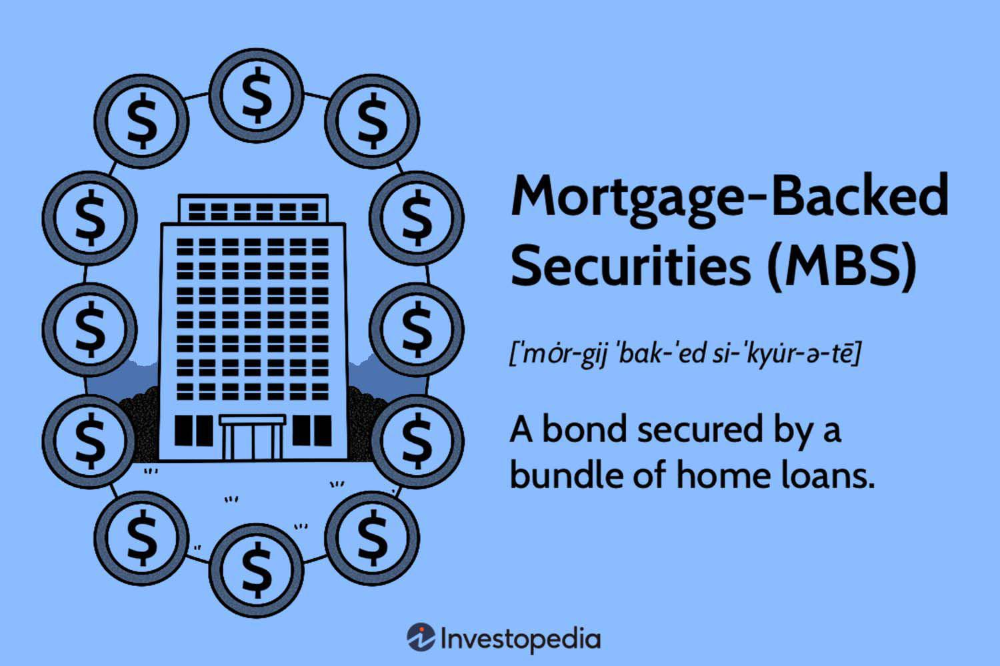

In the rapidly evolving landscape of financial trading, TBA mortgage-backed securities (MBS) have emerged as a popular asset class among investors and financial institutions. These instruments play a crucial role in providing liquidity and standardization in the housing finance market. As the market becomes increasingly complex, the need for advanced trading methodologies, such as algorithmic trading, becomes apparent.

Algorithmic trading has revolutionized various financial markets by employing sophisticated algorithms to automate trading decisions. This technology offers speed and efficiency that are unparalleled compared to traditional methods. For TBA MBS, algorithmic trading mechanisms can significantly optimize order execution processes, manage large-scale transactions, and improve trading precision. By reducing human error, these algorithms enhance the accuracy and reliability of trades in a market subject to volatility.



Understanding the complexities of TBA MBS algorithmic trading can offer significant advantages in navigating these volatile markets. Traders and investors must grasp the critical aspects and innovations that drive this segment to leverage strategic implications effectively. This article examines the essence of TBA MBS, their importance in the financial market, and how algorithmic trading reshapes these dynamics. By the end of this discussion, readers will have a comprehensive understanding of the benefits and future prospects of TBA MBS algo trading and the technological advancements contributing to this evolution.

## Table of Contents

## What are TBA Mortgage-Backed Securities?

TBA Mortgage-Backed Securities are a distinct category within the broader mortgage-backed securities market. The acronym "TBA" stands for "To Be Announced," signifying a unique trading mechanism where the specific details of the mortgage-backed securities are determined prior to the formal settlement date. This forward contract framework involves the agreement to purchase or sell a mortgage-backed security at a predetermined price and future date, allowing for flexibility and efficiency in market operations.

TBA MBS fill a fundamental role in the housing finance sector by ensuring ample liquidity and standardization. Because these securities can be traded before the actual underlying securities are fully specified, they enable market participants to react swiftly to interest rate changes and other economic variables. This aspect is particularly valuable for hedging strategies, where investors aim to shield their portfolios from the volatility associated with interest rate fluctuations. By providing a standardized contract, TBA MBS facilitate easier matching between buyers and sellers, fostering a more liquid marketplace.

Investors and institutions leverage TBA MBS as a critical tool for managing and mitigating portfolio risk. Given the essential nature of these securities in offering a buffer against the unpredictability of interest rates, they are widely traded across diverse financial markets. The capacity to hedge effectively against rate changes makes TBA MBS an attractive option for a range of investors, from individual asset managers to larger institutional bodies. Through this mechanism, they can maintain desired risk profiles and navigate the inherently volatile financial environment more effectively.

## The Rise of Algorithmic Trading in TBA MBS

Technology has played a pivotal role in transforming the trading landscape of financial instruments, including To Be Announced (TBA) mortgage-backed securities (MBS). One of the most significant advancements in this domain is [algorithmic trading](/wiki/algorithmic-trading) or algo trading. This sophisticated trading method relies on complex algorithms to automate trading decisions, offering significant improvements in speed and efficiency compared to traditional manual methods.

Algorithmic trading automates the decision-making process in trading using mathematical models and statistical analyses. It facilitates rapid execution of trades, ensuring that participants can respond to market trends and movements within fractions of a second. This speed advantage is crucial in the TBA MBS market, where timing can influence profitability amid fluctuation in market conditions.

In the TBA MBS space, algorithmic trading optimizes order execution and efficiently manages large-scale transactions. This is particularly important because TBA MBS involves forward contracts where the specific details of the MBS are yet to be announced at the time of trading. Algorithms can assess vast amounts of market data, evaluate trends, and execute trades automatically, ensuring optimal pricing and execution times.

For instance, a typical algorithm might assess market conditions such as [interest rate](/wiki/interest-rate-trading-strategies) changes, analyze historical data to predict future movements, and execute buy or sell orders when predefined criteria are met. A simple example in Python might involve using historical MBS pricing data to predict future prices with a moving average, executing trades when current prices deviate beyond a certain threshold:

```python
import numpy as np

def moving_average(data, window_size):
    return np.convolve(data, np.ones(window_size) / window_size, 'valid')

def simple_algo_trade(prices):
    window_size = 5
    moving_averages = moving_average(prices, window_size)
    buy_signals = []
    sell_signals = []

    for i in range(len(moving_averages)):
        if prices[i + window_size - 1] > moving_averages[i] * 1.05:
            sell_signals.append(i + window_size - 1)
        elif prices[i + window_size - 1] < moving_averages[i] * 0.95:
            buy_signals.append(i + window_size - 1)

    return buy_signals, sell_signals

historical_prices = [100, 102, 101, 104, 102, 107, 105, 110]
buy, sell = simple_algo_trade(historical_prices)
print("Buy Signals:", buy)
print("Sell Signals:", sell)
```

In addition to optimizing transaction execution, algo trading reduces human errors and greatly enhances the precision with which trades are conducted. Automation precludes the influence of human emotion, such as fear or greed, allowing trading decisions to remain strictly data-driven and objective. This precision is essential in maintaining the [liquidity](/wiki/liquidity-risk-premium) and stability of the TBA MBS market.

Overall, the rise of algorithmic trading in TBA MBS marks a significant development in the harmonization of technology and finance. By utilizing algorithms that can execute trades with remarkable precision and speed, market participants gain unprecedented efficiencies, allowing them to capitalize on emerging opportunities and manage risks more effectively.

## Mechanisms of TBA MBS Algo Trading

The mechanisms of TBA Mortgage-Backed Securities (MBS) algorithmic trading are founded on intricate mathematical models and sophisticated algorithms. These algorithms are designed to analyze market trends, assess risks, and execute trades based on predetermined criteria, allowing traders to respond rapidly and effectively to market changes.

1. **Market Trend Analysis and Risk Assessment**: Algorithms employed in TBA MBS trading continually process large datasets to identify market patterns and trends. They apply statistical methods and machine learning techniques to predict future price movements and volatility. This predictive capability allows algorithms to assess risks accurately and make informed trading decisions. For instance, a logistic regression model might be used to determine the probability of price movement in a particular direction, based on historical data.

    ```python
    from sklearn.linear_model import LogisticRegression
    import numpy as np

    # Example data: features derived from market data
    X = np.array([[5, 2], [3, 4], [1, 6]])
    # Example target: price movement direction (1 for up, 0 for down)
    y = np.array([1, 0, 1])

    model = LogisticRegression()
    model.fit(X, y)

    # Predict the probability of price increase
    new_data = np.array([[4, 3]])
    probability = model.predict_proba(new_data)
    ```

2. **Arbitrage, Scalping, and Momentum Trading**: These are some of the advanced strategies deployed within TBA MBS algorithmic trading. Arbitrage exploits price discrepancies between different markets or instruments, ensuring a risk-free profit. Scalping focuses on executing numerous trades with small price changes, demanding algorithms to operate swiftly with minimal latency. Momentum trading algorithms aim at capitalizing on market inertia by buying securities that show upward price trends or selling those with downward trends. Each of these strategies relies heavily on high-frequency data analysis and rapid decision-making processes.

3. **Integration of AI and Machine Learning Technologies**: The use of artificial intelligence (AI) and machine learning (ML) in TBA MBS trading algorithms significantly enhances predictive accuracy and decision-making capabilities. AI systems can process and learn from vast datasets, improving their predictions over time. For example, reinforcement learning models can be used to optimize trading strategies, learning from both successful and unsuccessful trades to refine their approach.

Machine learning algorithms like neural networks are particularly effective in recognizing complex, non-linear patterns in market data that traditional algorithms might miss. These capabilities make AI and ML indispensable to modern algorithmic trading, leading to more precise market predictions and better-informed trading actions.

In conclusion, the mechanisms underlying TBA MBS algorithmic trading leverage a combination of traditional financial theories and modern computational methods, offering traders a powerful toolset to navigate the complexities of financial markets. Integrating advanced analytics and [machine learning](/wiki/machine-learning) helps maintain a competitive edge, driving the evolution of trading strategies in this dynamic sector.

## Benefits of Algo Trading in TBA MBS

Algorithmic trading in TBA (To Be Announced) mortgage-backed securities offers several substantial benefits that enhance efficiency and effectiveness in trading these financial instruments. One of the most significant advantages of algorithmic trading is the remarkable reduction in latency and consequent faster transaction times. This speed enables traders to exploit market opportunities more swiftly than traditional manual trading methods, translating into potentially higher returns and more proactive portfolio management.

Cost efficiency stands as another critical benefit of algorithmic trading. By automating trading processes, it reduces the overall transaction costs traditionally associated with manual trading. These cost savings arise from minimizing human intervention and error, optimizing resource allocation, and leveraging technology to ensure precise order execution.

Algorithmic trading also empowers traders to execute complex strategies that involve massive data volumes and intricate models. Sophisticated algorithms can analyze multiple data streams simultaneously, identifying trends and patterns that might be imperceptible through manual methods. This capacity for swift data processing and analysis allows traders to employ advanced strategies like [arbitrage](/wiki/arbitrage), statistical modeling, and machine learning-driven predictions.

Enhanced risk management represents another pivotal advantage of algorithmic trading in TBA MBS markets. Automated systems follow stringent pre-defined parameters and risk tolerance levels, which facilitate more robust adherence to risk management protocols. This systematic approach reduces the likelihood of significant losses and helps traders mitigate exposure to adverse market fluctuations.

Furthermore, algorithmic trading contributes to improved market liquidity. By ensuring faster and more efficient execution of trades, algorithms increase the frequency and [volume](/wiki/volume-trading-strategy) of transactions, which in turn enhances market depth and liquidity. This fluidity is crucial for maintaining healthy market conditions, as it allows smoother buying and selling activities, reducing price [volatility](/wiki/volatility-trading-strategies) and facilitating accurate price discovery.

In conclusion, the adoption of algorithmic trading in TBA mortgage-backed securities provides notable improvements in transaction speed, cost efficiency, strategy execution, risk management, and market liquidity. These benefits are instrumental in driving the growing trend of algorithmic solutions in the trading of TBA MBS, offering traders a competitive edge in a highly dynamic financial environment.

## Challenges and Risks Associated with TBA MBS Algo Trading

Despite the numerous benefits of algorithmic trading in TBA mortgage-backed securities (MBS), significant challenges and risks are associated with its application. One of the primary challenges stems from the sophistication and complexity of the algorithms used in trading. These algorithms, driven by intricate mathematical models, can, at times, result in unforeseen consequences such as market disruption. For instance, an algorithmic trading strategy might inadvertently trigger a cascade of sell orders, causing rapid price decline and volatility spikes. Such incidents highlight the potential for destabilizing market dynamics, as evidenced by several notable "flash crashes" in financial markets.

Ensuring compliance with financial regulations while retaining algorithmic efficiency adds another layer of complexity. Regulatory bodies have instituted various rules to ensure fair and transparent trading practices, such as the MiFID II in Europe and the Dodd-Frank Act in the United States. These regulations necessitate that algorithmic trading systems are audited and documented to maintain compliance, potentially stifling the innovation and flexibility of these systems. Furthermore, adhering to multiple regulatory requirements across jurisdictions can be a burdensome task for traders relying on algorithm-inclusive systems.

Overreliance on these sophisticated systems poses additional vulnerabilities, particularly concerning technical failures and cyber-attacks. Algorithmic trading systems are predominantly dependent on advanced technological infrastructures, and any failure, whether due to software bugs, network disruptions, or hardware malfunctions, can lead to significant losses. Moreover, the technological dependency opens avenues for cyber threats, where malicious actors might exploit system vulnerabilities. These risks necessitate robust cybersecurity measures and continuous system monitoring to ensure resilient trading environments. 

Given these challenges and risks, it becomes pertinent for traders and firms to implement comprehensive risk management strategies to safeguard against potential losses and ensure stable trading operations.

## Future Prospects of TBA MBS Algo Trading

The future of TBA Mortgage-Backed Securities (MBS) algorithmic trading holds great potential as technological advancements continue to propel the industry forward. The integration of innovative techniques such as [artificial intelligence](/wiki/ai-artificial-intelligence) (AI) and big data analytics is poised to enhance the precision of trading decisions significantly. These technologies enable more accurate predictions of market trends and behaviors, which are crucial for optimizing trading strategies. AI algorithms, for example, can process vast amounts of data at unprecedented speeds, identifying patterns and insights that might be missed by human traders or traditional analysis methods.

As the technology underpinning algo trading becomes more sophisticated, the regulatory frameworks governing these practices are expected to evolve concurrently. There is an increasing recognition among regulatory bodies of the need to accommodate and guide the growth of algorithmic trading practices. This evolution is aimed at ensuring that while the trading processes become more streamlined and efficient, they also remain compliant with financial regulations, thereby maintaining the stability and integrity of the financial markets. Regulators may introduce standards that ensure algorithms do not exploit market inefficiencies or contribute to systemic risks.

Stakeholders in the financial market expect that the proliferation of algo trading will lead to enhanced transparency and market integrity. As more transactions are conducted through algorithmic platforms, there is a greater necessity for robust data handling and reporting mechanisms, which can offer real-time insights into market activities. Transparent operations and thorough auditing capabilities are likely to become standard expectations from algo trading systems, allowing for better oversight and trust among market participants.

Overall, while TBA MBS algo trading is anticipated to transform the trading landscape, it is crucial for market participants to stay informed about technological developments and emerging regulatory standards. This vigilance will help ensure that as the promise of these advancements is realized, they contribute positively to the broader financial ecosystem.

## Conclusion

TBA MBS algo trading is a critical development in the convergence of finance and technology, marking a paradigm shift in trading methodologies. This complex and innovative method equips traders with distinct competitive advantages in today's financial markets. By reducing latency, enhancing precision, and accommodating complex trading strategies, algorithmic trading reshapes the traditional approaches to TBA MBS transactions.

The dynamic nature of algorithmic trading requires market participants to remain vigilant and informed about the latest technological trends and methodologies. Continuous advancements in technology, particularly in AI and machine learning, offer remarkable opportunities to refine algorithms and improve decision-making processes. Such advancements ensure that algorithmic systems remain robust, efficient, and adaptive to market fluctuations and regulatory changes.

Regulatory bodies are expected to play a significant role in shaping the future of algo trading. An evolving framework that embraces innovation while safeguarding market integrity will be essential in harnessing the full potential of algorithmic trading in the TBA MBS market.

Future developments in algorithmic trading will likely continue to transform the landscape of TBA MBS trading. By leveraging big data analytics, real-time data processing, and improved computational capabilities, stakeholders will witness enhanced transparency and liquidity in the marketplace. As these technologies mature, the integration of sophisticated algorithms in trading platforms will drive efficiency and strategic advantages, paving the way for a more resilient and innovative financial market environment.

## References & Further Reading

[1]: Bergstra, J., Bardenet, R., Bengio, Y., & Kégl, B. (2011). ["Algorithms for Hyper-Parameter Optimization."](https://dl.acm.org/doi/10.5555/2986459.2986743) Advances in Neural Information Processing Systems 24.

[2]: ["Advances in Financial Machine Learning"](https://www.amazon.com/Advances-Financial-Machine-Learning-Marcos/dp/1119482089) by Marcos Lopez de Prado

[3]: ["Evidence-Based Technical Analysis: Applying the Scientific Method and Statistical Inference to Trading Signals"](https://www.amazon.com/Evidence-Based-Technical-Analysis-Scientific-Statistical/dp/0470008741) by David Aronson

[4]: ["Machine Learning for Algorithmic Trading"](https://github.com/stefan-jansen/machine-learning-for-trading) by Stefan Jansen

[5]: ["Quantitative Trading: How to Build Your Own Algorithmic Trading Business"](https://www.amazon.com/Quantitative-Trading-Build-Algorithmic-Business/dp/1119800064) by Ernest P. Chan