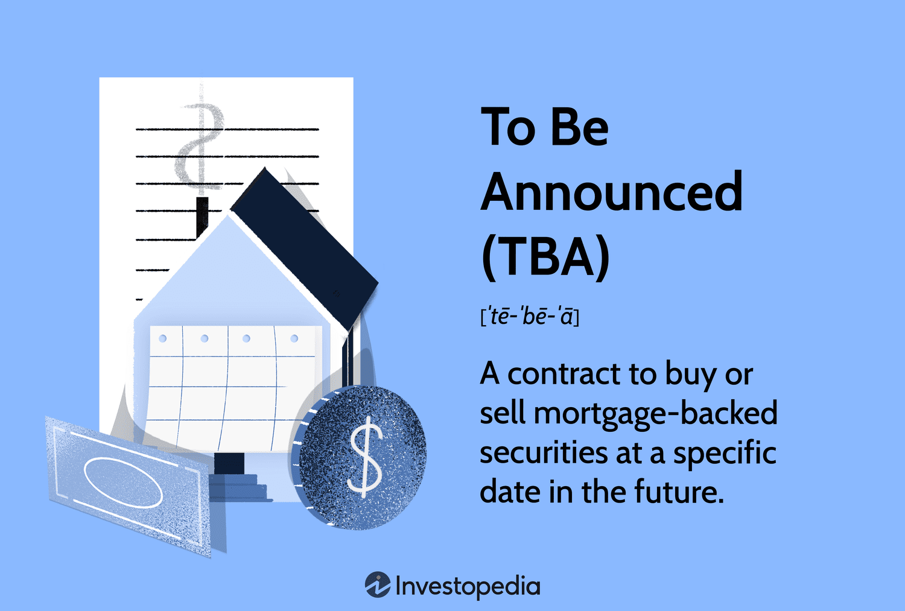

## Table of Contents

## What does 'To Be Announced' (TBA) mean in the context of mortgage-backed securities?

In the world of mortgage-backed securities, 'To Be Announced' or TBA refers to a type of trading where the specific mortgage-backed securities are not identified at the time the trade is made. Instead, the details like the issuer, the pool number, and other specifics are announced later, usually a few days before the settlement date. This allows buyers and sellers to agree on the trade without knowing all the details upfront, which can be helpful because it makes trading more flexible and efficient.

TBA trading is common in the mortgage-backed securities market because it helps investors and dealers manage their portfolios more easily. For example, if an investor wants to buy mortgage-backed securities, they can enter into a TBA trade and later choose the specific securities that meet their needs. This system works well because it provides liquidity and allows for large volumes of trades to happen smoothly, even though the exact details of the securities are not known at the start.

## How does the TBA market function, and what is its significance in the mortgage industry?

The TBA market works by letting people buy and sell mortgage-backed securities without knowing all the details right away. When someone wants to trade, they agree on things like the price, the type of mortgage, and when the trade will happen. But they don't know the exact securities until a few days before the trade is settled. This is helpful because it makes trading easier and faster. People can make deals without waiting to find the perfect securities, which saves time and makes the market more flexible.

The TBA market is very important in the mortgage industry because it helps keep the market running smoothly. It makes it easier for banks and other lenders to sell their mortgages to investors, which gives them more money to lend to new home buyers. This keeps the flow of money going in the housing market. Without the TBA market, it would be harder for lenders to manage their money and for investors to buy mortgage-backed securities, which could slow down the whole housing market.

## What are the typical characteristics of a TBA mortgage-backed security?

A TBA mortgage-backed security usually involves mortgages that are backed by government agencies like Fannie Mae, Freddie Mac, or Ginnie Mae. These securities are standardized, which means they have common features like a specific coupon rate, maturity, and type of mortgage. When people trade TBAs, they agree on these general characteristics but don't know the exact details of the mortgages in the security until a few days before the trade settles.

The TBA market is important because it helps keep the mortgage market running smoothly. It lets lenders sell their mortgages to investors quickly and easily, which gives them more money to lend to new home buyers. This keeps the flow of money going in the housing market. Without the TBA market, it would be harder for lenders to manage their money and for investors to buy mortgage-backed securities, which could slow down the whole housing market.

## What are the benefits of trading in TBA securities for investors?

Trading in TBA securities offers several benefits for investors. One big advantage is that it makes trading easier and more flexible. Investors can buy and sell these securities without knowing all the details right away. This means they can quickly agree on a trade and then choose the specific securities that fit their needs later. This flexibility helps investors manage their portfolios more easily and respond to market changes faster.

Another benefit is that the TBA market is very liquid, which means there are a lot of buyers and sellers. This makes it easier for investors to find someone to trade with, and it helps keep prices stable. Because the market is so active, investors can buy and sell large amounts of securities without worrying about big price swings. This [liquidity](/wiki/liquidity-risk-premium) is important because it helps investors feel more confident when they're making trades.

## How do TBA trades affect the liquidity and pricing of mortgage-backed securities?

TBA trades make the market for mortgage-backed securities more liquid. This means there are a lot of buyers and sellers, so it's easier for investors to trade these securities. When there's a lot of trading happening, it's easier to find someone to buy or sell to. This helps keep the market moving smoothly and makes it easier for investors to manage their money. Because of this, investors feel more confident when they're making trades, knowing they can easily buy or sell what they need.

TBA trades also help keep the prices of mortgage-backed securities stable. When there's a lot of trading, the prices don't change as much because there are always people buying and selling. This stability is good for investors because it makes it easier to predict what their investments will be worth. It also helps lenders because they can sell their mortgages more easily, which gives them more money to lend to new home buyers. This keeps the flow of money going in the housing market.

## What are the risks associated with investing in TBA mortgage-backed securities?

Investing in TBA mortgage-backed securities comes with some risks. One big risk is that the value of these securities can go up and down because of changes in interest rates. If interest rates go up, the value of the securities might go down. This can be a problem for investors who need to sell their securities before they mature. Another risk is that the people who took out the mortgages might not be able to pay them back. If a lot of people stop paying their mortgages, the value of the securities could drop a lot.

Another risk is that the details of the securities are not known until a few days before the trade settles. This means investors have to trust that the securities they get will be what they expected. If the securities turn out to be different from what they wanted, it could affect their investment strategy. Also, because TBA securities are traded in large amounts, there's a risk that big trades could move the market and affect prices. This can make it harder for investors to predict what their investments will be worth.

## How is the settlement process handled for TBA securities, and what are the standard delivery options?

The settlement process for TBA securities happens a few days after the trade is made. Usually, the exact details of the securities are announced about four days before the settlement date. This gives investors time to check the securities and make sure they are what they expected. The settlement date is usually set for the last day of the month, but it can be different depending on the trade agreement. On the settlement date, the securities are transferred to the buyer, and the buyer pays the seller.

There are two standard delivery options for TBA securities: specified pool and weighted average coupon (WAC). With a specified pool, the buyer gets a specific group of mortgages. This can be good if the buyer wants certain types of mortgages. With a WAC delivery, the buyer gets a mix of different mortgage pools that all have the same average [interest rate](/wiki/interest-rate-trading-strategies). This can be good if the buyer wants flexibility and doesn't need specific mortgages. Both options help make the TBA market flexible and meet different investor needs.

## Can you explain the role of the forward settlement in TBA transactions?

Forward settlement in TBA transactions means that the trade is agreed upon now, but the actual exchange of the securities and money happens later. This is important because it gives both the buyer and the seller time to get ready for the trade. The details of the securities, like which mortgages are included, are not known right away. Instead, they are announced a few days before the settlement date. This system helps make trading easier and more flexible because people can agree on a trade without knowing all the details upfront.

The forward settlement also helps keep the mortgage market running smoothly. It lets lenders sell their mortgages to investors quickly and easily, which gives them more money to lend to new home buyers. This keeps the flow of money going in the housing market. Without forward settlement, it would be harder for lenders to manage their money and for investors to buy mortgage-backed securities, which could slow down the whole housing market.

## What impact do macroeconomic factors have on the TBA market?

Macroeconomic factors like interest rates, inflation, and the overall health of the economy can have a big impact on the TBA market. When interest rates go up, the value of mortgage-backed securities usually goes down. This is because new mortgages will have higher interest rates, making older securities with lower rates less attractive to investors. Also, if inflation goes up, it can make people worry about the future value of their money, which can affect how much they want to invest in mortgage-backed securities.

The overall health of the economy also matters. If the economy is doing well, more people might want to buy homes, which can increase the demand for mortgages and make mortgage-backed securities more valuable. But if the economy is struggling, fewer people might want to buy homes, which can lower the demand for mortgages and make these securities less valuable. These macroeconomic factors can make the TBA market go up and down, which is something investors need to think about when they're making their investment choices.

## How do TBA securities contribute to the overall mortgage financing system?

TBA securities help keep the mortgage financing system running smoothly. They let banks and other lenders sell their mortgages to investors quickly and easily. This gives lenders more money to lend to new home buyers. Without TBA securities, it would be harder for lenders to manage their money and for investors to buy mortgage-backed securities. This could slow down the whole housing market because there wouldn't be as much money flowing around.

TBA securities also make the mortgage market more flexible and efficient. When people trade these securities, they don't need to know all the details right away. They can agree on a trade now and figure out the specifics later. This makes it easier for investors to manage their portfolios and respond to changes in the market. It also helps keep prices stable because there are a lot of buyers and sellers, which makes the market more liquid.

## What are the regulatory considerations and compliance requirements for trading TBA securities?

Trading TBA securities involves following rules set by different government groups like the Securities and Exchange Commission (SEC) and the Federal Reserve. These rules help make sure that trading is fair and that investors are protected. For example, traders need to report their trades to make sure everything is open and honest. They also need to follow rules about how much money they can borrow to trade, which helps keep the market stable.

Another important part of trading TBA securities is following rules about knowing your customer and preventing money laundering. This means that firms need to check who their customers are and make sure they're not using the market to do anything illegal. There are also rules about how firms handle their customers' money and securities, which helps protect investors. All these rules work together to make sure that the TBA market is safe and fair for everyone involved.

## How do advanced trading strategies, such as TBA roll and dollar roll, work in the context of mortgage-backed securities?

In the world of mortgage-backed securities, a TBA roll is a strategy where an investor agrees to buy securities at one date and then sells them before they get them, agreeing to buy similar securities at a later date. This is like passing the responsibility of buying the securities to someone else. The investor does this to take advantage of changes in interest rates or to keep their money working without having to hold onto the securities. It's a way to keep trading without actually taking delivery of the securities, which can be helpful if the investor wants to keep their money moving in the market.

A dollar roll is another strategy that's a bit like a TBA roll but with a twist. In a dollar roll, an investor sells their current mortgage-backed securities and agrees to buy similar ones back at a later date. This is often done to get some cash now while still planning to invest in the same type of securities later. It's like borrowing money against the securities they plan to buy back. This can be useful if the investor needs cash right away but still wants to stay invested in the mortgage market. Both strategies help investors manage their money and take advantage of market conditions.

## References & Further Reading

[1]: Bergstra, J., Bardenet, R., Bengio, Y., & Kégl, B. (2011). ["Algorithms for Hyper-Parameter Optimization."](https://dl.acm.org/doi/10.5555/2986459.2986743) Advances in Neural Information Processing Systems 24.

[2]: ["Advances in Financial Machine Learning"](https://www.amazon.com/Advances-Financial-Machine-Learning-Marcos/dp/1119482089) by Marcos Lopez de Prado

[3]: ["Evidence-Based Technical Analysis: Applying the Scientific Method and Statistical Inference to Trading Signals"](https://www.amazon.com/Evidence-Based-Technical-Analysis-Scientific-Statistical/dp/0470008741) by David Aronson

[4]: ["Machine Learning for Algorithmic Trading"](https://github.com/stefan-jansen/machine-learning-for-trading) by Stefan Jansen

[5]: ["Quantitative Trading: How to Build Your Own Algorithmic Trading Business"](https://www.amazon.com/Quantitative-Trading-Build-Algorithmic-Business/dp/1119800064) by Ernest P. Chan