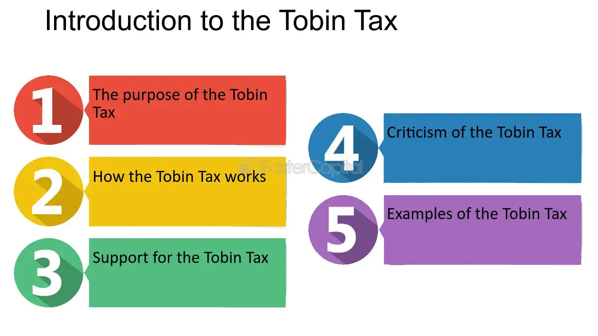

## Table of Contents

## What is the Tobin Tax?

The Tobin Tax is a small tax that some people want to put on buying and selling money between different countries. It's named after James Tobin, an economist who thought of the idea. The main reason for this tax is to make the money markets more stable. When people trade money a lot, it can make the value of money go up and down quickly. The Tobin Tax would make people think twice before trading too much, which could help keep money values more steady.

Some people like the idea of the Tobin Tax because it could also raise money for good causes, like helping poor countries or fighting climate change. But not everyone agrees with it. Some say it might be hard to put into practice because it would need many countries to agree to it. Others worry that it could make it harder for businesses to trade across borders, which could slow down the economy. So, while the Tobin Tax has some good points, it also has challenges that need to be thought about carefully.

## Who proposed the Tobin Tax and when?

The Tobin Tax was proposed by James Tobin, an economist from the United States. He came up with the idea in 1972. James Tobin was a smart person who won a Nobel Prize for his work in economics.

The Tobin Tax is a small tax on buying and selling money between different countries. James Tobin thought it could help make the money markets more stable. He wanted to stop the value of money from going up and down too quickly.

## What is the main purpose of the Tobin Tax?

The main purpose of the Tobin Tax is to make the money markets more stable. When people trade money a lot, it can make the value of money go up and down very quickly. This can be bad for the economy. The Tobin Tax would put a small tax on buying and selling money between different countries. This would make people think twice before trading too much, which could help keep money values more steady.

Another reason for the Tobin Tax is that it could raise money for good causes. The money collected from the tax could be used to help poor countries or to fight climate change. This makes the Tobin Tax attractive to people who want to help others and protect the environment.

## How does the Tobin Tax work?

The Tobin Tax works by putting a small tax on buying and selling money between different countries. When someone wants to trade money, like changing dollars to euros, they would have to pay a tiny tax on that trade. This tax is usually very small, maybe just a few cents for every hundred dollars traded. The idea is to make people think twice before trading money too often. If trading money costs a little more, people might not do it as much, which can help keep the value of money more stable.

The money collected from the Tobin Tax could be used for good things. For example, it could help poor countries or be used to fight climate change. This makes the Tobin Tax attractive to people who want to help others and protect the environment. But, the Tobin Tax can be hard to put into practice. It would need many countries to agree to it, and some people worry it might make it harder for businesses to trade across borders. So, while the Tobin Tax has some good points, it also has challenges that need to be thought about carefully.

## What types of financial transactions are typically targeted by the Tobin Tax?

The Tobin Tax mainly targets the buying and selling of money between different countries. This means if someone wants to change dollars to euros or any other currency, they would have to pay a small tax on that trade. The tax is very small, often just a few cents for every hundred dollars traded. The idea is to make people think twice before trading money too often, which can help keep the value of money more stable.

The Tobin Tax focuses on these kinds of currency trades because they can make the value of money go up and down quickly. When people trade money a lot, it can cause big changes in the money markets. By putting a small tax on these trades, the Tobin Tax aims to slow down this kind of trading and make the money markets more stable. This can help prevent big swings in the value of money, which can be good for the economy.

## Can you provide examples of countries or regions that have implemented or considered a Tobin Tax?

Some countries and regions have thought about or tried to use a Tobin Tax. In Europe, the European Union (EU) talked about a Tobin Tax. They wanted to put a small tax on buying and selling money between different countries in the EU. The idea was to raise money to help poor countries and to make the money markets more stable. But not all countries in the EU agreed, so it didn't happen everywhere. Some countries in the EU, like France and Italy, went ahead and put a small tax on certain financial trades, but it's not exactly the same as the Tobin Tax.

In other parts of the world, countries like Brazil have tried something similar. Brazil put a small tax on money coming into the country to stop too much money from flowing in and out quickly. This was not called a Tobin Tax, but it worked in a similar way. Other places, like some countries in Africa and Asia, have thought about using a Tobin Tax to help their economies and to raise money for good causes. But it's hard to get many countries to agree on something like this, so it hasn't been used very much around the world.

## What are the potential benefits of implementing a Tobin Tax?

One big benefit of the Tobin Tax is that it can make the money markets more stable. When people trade money a lot, it can make the value of money go up and down quickly. This can be bad for the economy. The Tobin Tax puts a small tax on buying and selling money between different countries. This makes people think twice before trading too much, which can help keep money values more steady. When money values are stable, it's easier for businesses and people to plan and make decisions, which is good for the economy.

Another benefit is that the Tobin Tax can raise money for good causes. The money collected from the tax could be used to help poor countries or to fight climate change. This makes the Tobin Tax attractive to people who want to help others and protect the environment. If many countries agree to use the Tobin Tax, it could bring in a lot of money that could be used to make the world a better place.

## What are the criticisms and challenges associated with the Tobin Tax?

One big challenge with the Tobin Tax is getting many countries to agree on it. Money markets work all around the world, so for the Tobin Tax to work well, lots of countries need to use it. But not all countries want to do this. Some countries might think the tax is a bad idea, or they might want to keep their money markets free from taxes. If only a few countries use the Tobin Tax, people might just trade their money in countries that don't have the tax, which wouldn't help make the money markets more stable.

Another criticism is that the Tobin Tax might make it harder for businesses to trade across borders. When businesses buy and sell things in different countries, they often need to change money from one currency to another. If there's a tax on these trades, it might cost businesses more money to do their work. This could slow down the economy, especially if businesses decide to do less trading because of the tax. Some people worry that the benefits of the Tobin Tax might not be worth the problems it could cause for businesses.

Lastly, there are practical challenges in putting the Tobin Tax into practice. It's hard to keep track of all the money trades happening around the world. There could be a lot of work and cost involved in setting up the systems needed to collect the tax. Also, some people might try to find ways to avoid paying the tax, which could make it less effective. These practical issues mean that even if countries agree on the Tobin Tax, it might be hard to make it work well in the real world.

## How might the Tobin Tax affect global financial markets?

The Tobin Tax could make global financial markets more stable. When people trade money a lot, it can make the value of money go up and down quickly. This can be bad for the economy. The Tobin Tax puts a small tax on buying and selling money between different countries. This makes people think twice before trading too much, which can help keep money values more steady. When money values are stable, it's easier for businesses and people to plan and make decisions, which is good for the economy.

However, the Tobin Tax could also make it harder for businesses to trade across borders. When businesses buy and sell things in different countries, they often need to change money from one currency to another. If there's a tax on these trades, it might cost businesses more money to do their work. This could slow down the economy, especially if businesses decide to do less trading because of the tax. Some people worry that the benefits of the Tobin Tax might not be worth the problems it could cause for businesses.

Getting many countries to agree on the Tobin Tax is a big challenge. Money markets work all around the world, so for the Tobin Tax to work well, lots of countries need to use it. But not all countries want to do this. Some countries might think the tax is a bad idea, or they might want to keep their money markets free from taxes. If only a few countries use the Tobin Tax, people might just trade their money in countries that don't have the tax, which wouldn't help make the money markets more stable.

## What is the difference between a Tobin Tax and other financial transaction taxes?

The Tobin Tax is a specific kind of financial transaction tax that focuses on trading money between different countries. It's named after James Tobin, who thought of it to make money markets more stable. The idea is to put a very small tax on buying and selling currencies to stop people from trading too much, which can make money values go up and down quickly. This is different from other financial transaction taxes, which might be used for different reasons, like raising money for the government or slowing down trading in certain types of financial products.

Other financial transaction taxes can cover a wider range of trades, not just currency exchanges. For example, some countries have taxes on buying and selling stocks, bonds, or other financial products. These taxes might be used to raise money for the government or to slow down trading that can make markets too wild. The main difference is that the Tobin Tax is all about making currency markets more stable, while other financial transaction taxes might have different goals and cover different kinds of financial trades.

## How can the revenue generated from a Tobin Tax be used?

The money collected from a Tobin Tax can be used for many good things. One big idea is to help poor countries. The money could be used to build schools, hospitals, or roads in places that really need them. This can make life better for people in poor countries and help them grow their economies. Another idea is to use the money to fight climate change. The money could be used to help countries switch to clean energy, plant more trees, or protect the environment in other ways. This can help make the world a better place for everyone.

Another way to use the money from a Tobin Tax is to help people who are in trouble because of problems in the economy. For example, if there's a big financial crisis, the money could be used to help people who lose their jobs or can't pay their bills. This can make a big difference for people who are struggling. The money could also be used to help pay for things that everyone needs, like better schools or healthcare. This can make life better for everyone in the country.

## What are the latest developments and discussions around the Tobin Tax on an international level?

The idea of the Tobin Tax is still talked about a lot around the world. In Europe, some countries like France and Italy have put small taxes on certain financial trades, but these are not exactly the same as the Tobin Tax. The European Union (EU) has been trying to get more countries to agree on a Tobin Tax, but it's hard because not all countries want to do it. Some people think it could help make money markets more stable and raise money for good causes, but others worry it might make it harder for businesses to trade across borders.

On a global level, the Tobin Tax is still seen as a way to help poor countries and fight climate change. The United Nations and other big groups have talked about using a Tobin Tax to raise money for these things. But it's still a big challenge to get many countries to agree on it. Some countries are worried about the problems it might cause for their economies, and others think it might be hard to put into practice. So, while the Tobin Tax is still a popular idea, there's a lot of work to do before it can be used around the world.

## References & Further Reading

1. Umlauf, S.R. (1993). "Transaction Taxes and the Behavior of the Swedish Stock Market." Journal of Financial Economics, 33(2), 227-240.

2. Becchetti, L., & Ricci, V. (2013). "The French Tobin Tax: Who Pays the Bill?" BE Journal of Economic Analysis & Policy, 13(1), 489-512.

3. Campbell, J. Y., & Froot, K. A. (1994). "International Experiences with Securities Transaction Taxes." In The Internationalization of Equity Markets (pp. 277-308). University of Chicago Press.

4. Hemmelgarn, T., & Nicodème, G. (2010). "The 2008 Financial Crisis and Taxation Policy." Taxation Papers, European Commission.

5. ["The Tobin Tax and Global Markets: Should We Support It?" – The Guardian](https://www.tobintax.org/)

6. ["Global Financial Stability Report: Market Developments and Issues" – IMF](https://www.imf.org/en/publications/gfsr)

7. Schulmeister, S. (2011). "A General Financial Transaction Tax: Motives, Revenues, Feasibility and Effects." Research Report. Austrian Institute of Economic Research (WIFO).

8. Palley, T. I. (2000). "Stabilizing Finance: The Case for Asset Based Reserve Requirements." Journal of Post Keynesian Economics, 22(3), 525-542.