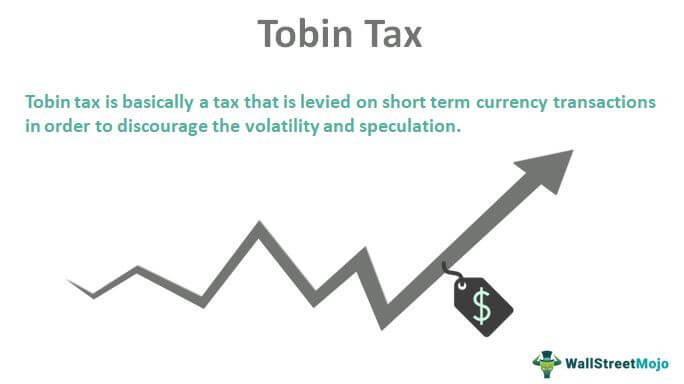

The Financial Transactions Tax (FTT) is a policy instrument that has sparked extensive discussion among various stakeholders, including economists, policymakers, and actors in financial markets. At its core, an FTT is designed to impose a levy on specific types of financial transactions, potentially acting as a mechanism to curb excessive speculation, stabilize markets, and generate public revenue. Within this domain, the Tobin Tax stands as a prominent variant, conceptualized by Nobel Laureate James Tobin in the aftermath of the Bretton Woods system's collapse in the early 1970s. Tobin envisioned this tax specifically targeting short-term currency trades with the primary aim of reducing speculative activity that could destabilize currency markets.

The Tobin Tax has been subject to rigorous debates concerning its efficacy, practicality, and ethical dimensions. Proponents argue that such a tax could serve as a safeguard against the volatile swings induced by speculative trading, encourage longer-term investment horizons, and provide governments with additional resources. Conversely, critics warn of possible negative repercussions, including reduced market liquidity, increased trading costs, and potential capital flight to untaxed jurisdictions.

This article seeks to examine the Tobin Tax comprehensively, covering its theoretical foundations, implementation mechanisms, and the effects observed in various contexts. Given the historical experiments with FTTs, such as those in Sweden and France, the discussion will also focus on the valuable lessons learned, the technological and administrative challenges involved, and the evolving nature of financial markets in response to such regulatory measures. Through exploring these dimensions, the article aims to shed light on the Tobin Tax's potential role and relevance in contemporary financial regulation.

## Table of Contents

## The Origin of the Tobin Tax Concept

The Tobin Tax concept emerged in the early 1970s, largely influenced by the economic turbulence following the dissolution of the Bretton Woods system, which had underpinned global fixed exchange rates since the end of World War II. Nobel Laureate James Tobin introduced the idea as a novel approach to address the increasing volatility and speculative trading in currency markets. He advocated for imposing a small tax on all spot currency conversions, which would serve as a financial deterrent to short-term speculative trading activities. 

By proposing a Tobin Tax, Tobin aimed to mitigate the rapid currency fluctuations caused by speculative trades, which often have destabilizing effects on national economies and global financial markets. The underlying premise was that a modest levy on such transactions would dissuade speculators by diminishing their potential profits, thereby promoting more stable economic conditions. As a result, currencies would primarily be traded to meet real economic needs—such as for trade or investment purposes—rather than speculative gains.

Besides its economic rationale, the Tobin Tax also carried a moral dimension, reflecting Tobin's belief that unchecked financial speculation could have detrimental consequences on global economic stability. He argued that speculation should bear certain costs, in turn generating revenue that governments could potentially deploy for public goods and economic development.

Despite its theoretical appeal, the Tobin Tax has generated substantial debate and criticism. Proponents view it as a tool for fostering global financial stability, particularly in curbing disruptive speculative capital flows. Critics, however, warn of possible unintended consequences, such as reduced market [liquidity](/wiki/liquidity-risk-premium) and the risk of capital flight to jurisdictions without such taxes, potentially undermining its effectiveness.

In summary, the Tobin Tax was conceived as a response to the [volatility](/wiki/volatility-trading-strategies) and speculation in global currency markets following the collapse of the Bretton Woods system. It combines economic policy with a normative stance against speculative excesses, advocating for increased financial market stability while raising significant debate on its potential impacts and implementation challenges.

## Mechanics of Implementing a Financial Transaction Tax

Implementing the Tobin Tax, a specific form of Financial Transaction Tax (FTT), necessitates a structured approach encompassing several key steps. First, policymakers must define the scope of the tax, which includes identifying the specific financial transactions subject to taxation. This may involve targeting spot currency conversions as originally proposed by James Tobin. Clearly defining the taxable transactions is vital to prevent misinterpretation and ensure compliance.

Setting an appropriate tax rate is another critical aspect. The Tobin Tax is typically suggested at a low rate, often between 0.1% to 0.25%, to minimize the impact on legitimate financial activities while still discouraging excessively speculative trading. The rate must balance between revenue generation and market efficiency without inducing adverse economic consequences.

Enforcing an FTT presents notable challenges, including the risk of market participants relocating to jurisdictions with minimal or no transaction taxes. Such capital flight can negate the intended benefits of the tax. Additionally, managing the administrative burden of collecting and enforcing the tax can be resource-intensive. To address these challenges, technological solutions are being explored.

Automated transaction tracking systems facilitate compliance by monitoring taxable activities and ensuring accurate tax collection. Emerging technologies like blockchain provide a promising avenue due to their transparency and immutability, which help prevent tax evasion. Blockchain can maintain a verifiable record of financial transactions that is accessible to regulatory authorities, thereby enhancing enforcement capabilities.

Moreover, international cooperation is essential for a harmonized FTT framework. Without global consensus, efforts to implement the Tobin Tax might lead to uneven adoption and the potential for regulatory [arbitrage](/wiki/arbitrage), where transactions are channeled through nations without such taxes. Collaborative international agreements can help create a level playing field, minimizing the relocation of trading activities to tax-free jurisdictions and promoting global financial stability.

## Evaluating the Impact on Market Volatility

The Tobin Tax, designed to mitigate market volatility by discouraging short-term trading, has generated considerable debate over its effectiveness. Advocates of the tax assert that by taxing financial transactions, particularly those of a speculative nature, it incentivizes investors to adopt a more long-term perspective. This, they argue, could lead to a more stable financial market, as it might deter the kind of rapid "in-and-out" trading that can lead to significant price fluctuations.

Proponents contend that introducing such a tax would encourage a shift in market behaviors towards investments that yield returns over extended periods, contributing to a more predictable and less erratic financial environment. By reducing the [volume](/wiki/volume-trading-strategy) of speculative trades, the Tobin Tax aims to decrease the amplitude of market swings, promoting an environment where asset prices reflect fundamental values more accurately.

Conversely, critics of the Tobin Tax raise concerns regarding its potential to inadvertently increase market volatility. One significant argument against the tax is the possible reduction in liquidity — the ease with which assets can be bought and sold without significantly affecting their prices. Critics suggest that when liquidity is constrained, markets may become more volatile as large trades have a more pronounced impact on prices, potentially leading to increased market inefficiencies.

Research into past implementations of financial transaction taxes (FTTs) provides mixed evidence about their impact on volatility. For instance, Sweden's experiment with an FTT in the 1980s is often cited. The tax led to a noticeable decline in trading volumes, particularly in fixed-income markets, as traders migrated to foreign exchanges to avoid the tax, exacerbating liquidity issues rather than alleviating volatility concerns [1]. This outcome prompted a re-evaluation of the tax's structure and its eventual repeal.

In contrast, France's recent implementation of a financial transaction tax on equities offers a different perspective. Introduced in 2012, the French FTT imposed a tax on company shares with a market capitalization above a certain threshold. Studies following its implementation indicate that, while there was a reduction in turnover rates, the impact on market volatility was less pronounced than critics anticipated [2]. However, these findings suggest that while an FTT can affect trading volume, its influence on overall market stability remains inconclusive and context-dependent.

These case studies underscore the complexity of predicting how financial markets will respond to transaction taxes. They highlight the necessity of considering market-specific characteristics when designing such taxes to avoid unintended consequences. Balancing the tax rate to achieve desired stability without imposing excessive constraints on market fluidity remains a critical challenge.

In conclusion, while the Tobin Tax holds theoretical appeal as a tool to reduce market volatility, empirical evidence from various implementations presents an intricate picture. The overall effectiveness of such a tax depends significantly on its design and the broader market environment in which it is implemented.

References:
1. Umlauf, S.R. (1993). Transaction Taxes and the Behavior of the Swedish Stock Market. Journal of Financial Economics, 33(2), 227-240.
2. Becchetti, L., & Ricci, V. (2013). The French Tobin Tax: Who Pays the Bill? BE Journal of Economic Analysis & Policy, 13(1), 489-512.

## A Tool for Economic Stability

The Tobin Tax is often viewed as a potential tool for bolstering economic stability by mitigating the deleterious effects of speculative trading on exchange rate volatility. At its core, the tax aims to deter short-term speculative financial activities that can lead to erratic fluctuations in currency values, thereby fostering a more predictable and stable economic environment. By imposing a small levy on currency transactions, particularly those deemed speculative, the Tobin Tax encourages market participants to focus on longer-term investments, promoting economic resilience.

One of the promising aspects of the Tobin Tax lies in its capacity to generate substantial revenue, which could be allocated towards funding social programs and development projects. This dual benefit of reducing speculative volatility while providing additional public funding underscores the tax's potential as a multifaceted policy tool. For instance, the revenue can be channelized into sectors such as healthcare, education, and infrastructure, contributing to broader socioeconomic stability and growth.

However, the application of the Tobin Tax is not without challenges and intricacies. While the theoretical benefits are compelling, practical implementation may generate unintended economic consequences. For example, if not carefully calibrated, the tax could lead to decreased trading volumes and reduced market liquidity. This could inadvertently amplify the very volatility it seeks to suppress, as reduced liquidity can hamper the efficient functioning of financial markets. Moreover, defining what constitutes speculative trading versus genuine transactional needs remains a contentious issue, potentially complicating enforcement and leading to legal or administrative burdens.

The balance between leveraging the Tobin Tax for economic stability and minimizing its adverse effects requires a nuanced approach, combining well-designed policy frameworks with robust international cooperation. The ultimate success of such a tax hinges on achieving a pragmatic equilibrium that aligns with global financial dynamics while securing tangible economic and social benefits.

## Case Studies and Lessons Learned

Sweden's experiment with the Financial Transactions Tax (FTT) in the 1980s serves as a compelling case study illustrating some of the potential pitfalls associated with such taxes. Implemented in 1984, the Swedish FTT initially imposed a 0.5% tax on the purchase and sale of equity securities, which was later increased. The result was a sharp decline in trading volumes, with estimates suggesting that up to 60% of trading in Swedish shares moved to London [1]. This migration was driven by the increased transaction costs, as market participants sought to avoid the tax by executing trades in jurisdictions with lower taxation. Consequently, the expected tax revenues fell significantly short of predictions, highlighting the importance of carefully considering tax rates and their impact on market behavior.

The experience in Sweden contrasts with more recent implementations in Italy and France, where FTTs have been designed with lessons from past experiences in mind. Both countries have adopted a more measured approach, targeting specific segments of the financial market and setting lower tax rates. For instance, the French FTT, introduced in 2012, includes a 0.2% levy on the acquisition of publicly traded shares of companies with a market value exceeding €1 billion. This targeted approach aims to minimize disruptions to market liquidity while still generating revenue. As a result, although trading volumes did experience some decline, the impact was not as pronounced as in Sweden [2].

The UK's Stamp Duty presents a different story. It has been a fixture of the UK financial landscape since 1694, applied to the purchase of shares at a rate of 0.5%. Despite its longevity, the tax has seemingly coexisted with a thriving financial market in London. This success is partly attributable to the mature and stable market environment in the UK, which can absorb such taxes without considerable adverse effects on trading volumes or liquidity.

These various implementations suggest that the design and structure of an FTT are crucial to its success. A poorly designed tax can lead to significant adverse effects, like market migration, reduced liquidity, and lower-than-expected revenue generation. Conversely, a well-conceived and carefully targeted tax can generate revenue without markedly disrupting market operations. The key lesson is the necessity of striking a balance between revenue objectives and the potential impact on market liquidity and stability. An adaptive approach that responds to market conditions and incorporates international coordination could enhance the efficacy and acceptance of FTTs in global markets.

[1] Campbell, J. Y., & Froot, K. A. (1994). International Experiences with Securities Transaction Taxes. *In The Internationalization of Equity Markets* (pp. 277-308). University of Chicago Press.

[2] Hemmelgarn, T., & Nicodème, G. (2010). The 2008 Financial Crisis and Taxation Policy. *Taxation Papers*, European Commission.

## Challenges and Criticisms of the Financial Transaction Tax

Financial Transaction Taxes (FTTs), including the Tobin Tax, have been sources of significant debate due to several practical challenges and criticisms. One primary concern is the potential decrease in market liquidity. An FTT increases transaction costs, thereby discouraging trading activities. When trading volumes drop, market liquidity declines, potentially leading to wider bid-ask spreads and increased volatility. This effect can create a less efficient market environment, where the cost of buying and selling assets is higher for all participants.

Another major criticism involves the possibility of market distortion and capital flight. Imposing an FTT might incentivize investors and firms to shift their trading operations to jurisdictions without such taxes, leading to diminished trading volumes in regions that implement FTTs. This phenomenon, known as regulatory arbitrage, undermines the tax's effectiveness and can result in unintended economic shifts. If trading moves to tax-free regions, countries could face challenges in maintaining their financial centers' competitiveness and attractiveness.

The administrative burden of implementing an FTT further complicates its potential adoption. Governments need to establish comprehensive frameworks to track and enforce tax compliance, requiring significant resources and technological investment. The complexity of financial markets and the rapid pace of transactions add layers of difficulty to monitoring and ensuring adherence to tax regulations. Moreover, varying international tax policies necessitate harmonization to prevent tax evasion tactics, complicating enforcement efforts.

Critics argue that these challenges necessitate robust international coordination. Without harmonized approaches, countries may face difficulties addressing market distortions and regulatory arbitrage effectively. International cooperation is necessary to establish consistent tax rates and compliance measures, minimizing gaps that could be exploited by market participants. By working together, nations can create a cohesive financial environment where FTTs serve their intended purpose of stabilizing markets without adverse economic consequences.

## The Role of Technology in Enforcing the Tobin Tax

Technological advancements significantly enhance the enforcement and operational efficiency of the Tobin Tax. Innovations in digital systems, particularly blockchain and [artificial intelligence](/wiki/ai-artificial-intelligence) (AI), offer transformative solutions to various challenges associated with implementing a Financial Transaction Tax (FTT).

Automated systems serve as the cornerstone of effective tax enforcement, allowing for the seamless tracking of financial transactions. By employing AI algorithms, these systems can monitor large volumes of data in real-time, identifying taxable transactions and ensuring compliance with tax regulations. Machine learning models further enhance this capability by adapting to evolving market behaviors and detecting anomalies that might indicate tax evasion attempts. This not only reduces administrative burdens but also minimizes the risk of human error in the transaction monitoring process.

Blockchain technology provides a robust framework for ensuring transparency and immutability in financial transactions. Each transaction recorded on a blockchain is timestamped and cannot be altered, creating a permanent and verifiable ledger. This characteristic of blockchain is crucial for the Tobin Tax, as it mitigates the risk of cross-border evasion and ensures that transactions are accurately reported and taxed. The decentralized nature of blockchain networks also facilitates international cooperation, enabling tax authorities from different jurisdictions to access and verify transaction data securely.

Technology fosters a delicate balance between efficient tax collection and maintaining market operation continuity. Algorithms can be tailored to assess the tax impact on liquidity dynamically, adjusting parameters to avoid excessive disruption to market activities. By leveraging real-time data analytics, authorities can calibrate the tax rate and coverage to optimize both revenue generation and market stability.

In conclusion, the integration of advanced technologies such as blockchain and AI into the framework of the Tobin Tax promises to enhance transparency, ensure compliance, and reduce administrative burdens. These innovations underscore the potential for a more efficient and equitable financial system where speculative trading is monitored and regulated effectively.

## The Future of Financial Transaction Taxes in Market Regulation

The future of Financial Transaction Taxes (FTTs) in market regulation is intrinsically linked to the ability to balance revenue generation with maintaining market liquidity and efficiency. Successfully navigating this challenge requires coordinated international efforts and the integration of cutting-edge technology. 

Global coordination stands paramount as financial markets are inherently interconnected. Without a globally harmonized approach, discrepancies between jurisdictions might lead to regulatory arbitrage, where financial actors relocate activities to regions with more favorable tax regimes. Establishing common standards is crucial to prevent the circumvention of FTTs, ensuring consistent application across borders and minimizing potential losses in market liquidity.

As financial markets evolve, particularly with the advent of digital currencies and fintech innovations, adapting FTT frameworks to these developments is imperative. Digital currencies, such as cryptocurrencies, introduce new dimensions and complexities in transactions that traditional FTT mechanisms must account for. The transparent and decentralized nature of blockchain technology could serve both as a challenge and an opportunity in enforcing FTTs effectively on these platforms. A possible approach could involve leveraging smart contracts to automate tax collection in decentralized finance (DeFi) ecosystems.

Furthermore, the rise of fintech innovations presents opportunities to employ advanced technological solutions in the implementation and enforcement of FTTs. Artificial Intelligence (AI) and Machine Learning (ML) can be harnessed to monitor transactions and detect patterns indicative of tax evasion, thereby enhancing compliance rates. By processing vast amounts of data, AI systems can provide real-time analysis that aids regulatory bodies in identifying anomalies and addressing them promptly.

A refined Tobin Tax could serve as an effective tool in global market regulation by addressing both economic stability and growth. In this context, the Tobin Tax would need to be intricately designed to not only mitigate short-term speculative trading but also to encourage long-term investment practices that contribute to stable economic growth. The potential of such a tax, if carefully crafted and implemented, extends beyond mere revenue generation, offering countries a mechanism to contribute to broader financial stability objectives.

In conclusion, the future of FTTs, particularly within the sphere of a Tobin Tax, hinges on a well-coordinated multi-jurisdictional approach backed by technological innovation. As digital landscapes alter the paradigm of financial markets, FTTs must evolve correspondingly to remain effective and relevant in promoting equitable and stable economic environments worldwide.

## References & Further Reading

1. Umlauf, S.R. (1993). "Transaction Taxes and the Behavior of the Swedish Stock Market." Journal of Financial Economics, 33(2), 227-240.

2. Becchetti, L., & Ricci, V. (2013). "The French Tobin Tax: Who Pays the Bill?" BE Journal of Economic Analysis & Policy, 13(1), 489-512.

3. Campbell, J. Y., & Froot, K. A. (1994). "International Experiences with Securities Transaction Taxes." In The Internationalization of Equity Markets (pp. 277-308). University of Chicago Press.

4. Hemmelgarn, T., & Nicodème, G. (2010). "The 2008 Financial Crisis and Taxation Policy." Taxation Papers, European Commission.

5. ["The Tobin Tax and Global Markets: Should We Support It?" – The Guardian](https://www.tobintax.org/)

6. ["Global Financial Stability Report: Market Developments and Issues" – IMF](https://www.imf.org/en/publications/gfsr)

7. Schulmeister, S. (2011). "A General Financial Transaction Tax: Motives, Revenues, Feasibility and Effects." Research Report. Austrian Institute of Economic Research (WIFO).

8. Palley, T. I. (2000). "Stabilizing Finance: The Case for Asset Based Reserve Requirements." Journal of Post Keynesian Economics, 22(3), 525-542.