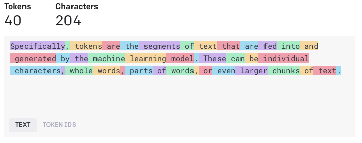

## Table of Contents

## What is a token in the context of machine learning?

In the context of machine learning, a token is a basic unit of text or data that a model can process. When you feed text into a machine learning model, the model doesn't see words or sentences as humans do. Instead, it sees tokens. These tokens can be words, parts of words, or even individual characters, depending on how the model is set up. For example, the sentence "I love machine learning" might be broken down into tokens like "I", "love", "machine", and "learning".

Tokens are important because they help the model understand and process language. By breaking down text into smaller, manageable pieces, the model can analyze and learn from the data more effectively. This process of breaking down text into tokens is called tokenization. Different models might tokenize text in different ways, but the goal is always the same: to turn human language into a format that the machine can work with.

## How are tokens used in natural language processing?

In natural language processing (NLP), tokens are the building blocks that help computers understand and work with human language. When you give a computer a piece of text, it breaks it down into tokens. These tokens could be whole words, parts of words, or even single characters. For example, the sentence "I enjoy sunny days" might be turned into tokens like "I", "enjoy", "sunny", and "days". By doing this, the computer can process and analyze the text more easily.

Tokens are used in many different ways in NLP. They help with tasks like translating languages, understanding what people are saying, and even creating new text. For instance, when a computer translates a sentence from English to French, it first turns the English sentence into tokens, then changes those tokens into French tokens, and finally puts the French tokens back together into a sentence. This process makes it possible for computers to handle and understand human language in a way that's similar to how people do.

## What is the process of tokenization?

Tokenization is the process of breaking down text into smaller pieces called tokens. These tokens can be words, parts of words, or even single characters, depending on what the computer program is designed to do. For example, if you have the sentence "The cat is sleeping," tokenization might break it into the tokens "The", "cat", "is", and "sleeping". This process helps computers understand and work with human language by turning it into a format that's easier to analyze.

Different methods can be used for tokenization. Some programs might split text based on spaces and punctuation, while others might use more complex rules to handle things like contractions or hyphenated words. For instance, the word "don't" might be split into "do" and "n't", and "well-known" might be split into "well" and "known". By choosing the right method, tokenization can make it easier for computers to process and understand language in a way that's similar to how people do.

## What are the different types of tokenization techniques?

Tokenization techniques can be divided into several types, each with its own way of breaking down text. One common type is word tokenization, where the text is split into individual words based on spaces and punctuation. For example, the sentence "Hello, world!" would be tokenized into "Hello" and "world". Another type is character tokenization, where each character in the text is treated as a separate token. This can be useful for languages without clear word boundaries or for tasks like text generation.

Subword tokenization is another technique that splits words into smaller parts. This can be helpful for handling rare words or words that are not in the model's vocabulary. For example, the word "unhappiness" might be split into "un", "happy", and "ness". Byte Pair Encoding (BPE) is a popular subword tokenization method that starts with individual characters and then merges the most frequent pairs until a desired vocabulary size is reached. This helps balance between having too many tokens and too few.

Lastly, there's sentence tokenization, which splits text into sentences. This is useful for tasks that need to understand the structure of a text, like summarization or translation. For example, "Hello world. How are you?" would be split into "Hello world." and "How are you?". Each of these techniques has its own strengths and is chosen based on the specific needs of the task at hand.

## How does tokenization impact the performance of machine learning models?

Tokenization can really affect how well a [machine learning](/wiki/machine-learning) model works. When text is broken down into tokens, it helps the model understand and process language better. If the tokens are chosen well, the model can learn faster and make better predictions. For example, using subword tokenization can help the model handle new or rare words by breaking them into parts it already knows. This can make the model more accurate and useful for tasks like translating languages or answering questions.

But, if tokenization is not done right, it can make the model perform worse. If the tokens are too big or too small, the model might have a hard time understanding the text. For example, if a model only sees whole words and never sees parts of words, it might struggle with words it hasn't seen before. Also, if the tokenization method is too complex, it might slow down the model's training and make it harder to use. So, choosing the right tokenization method is important for making sure the model works well and quickly.

## What are the challenges faced during tokenization?

Tokenization can be tricky because different languages and texts need different ways of being broken down. For example, in English, words are often separated by spaces, but in languages like Chinese, there are no spaces between words. This makes it hard to figure out where one word ends and another begins. Also, some words have special meanings when they are together, like "New York" or "ice cream". If the computer splits these into separate tokens, it might miss the meaning.

Another challenge is dealing with things like punctuation, numbers, and special characters. Should "don't" be one token or two? Should "123" be one token or three? These choices can affect how well the model understands the text. Plus, tokenization can be slow if the rules are too complicated, which can make training a model take longer. So, finding the right balance between making the tokens useful and keeping the process simple is important for making tokenization work well.

## How can tokenization be optimized for better model performance?

Tokenization can be optimized for better model performance by choosing the right method for the language and task. For example, using subword tokenization like Byte Pair Encoding (BPE) can help the model handle new or rare words by breaking them into parts it already knows. This can make the model more accurate and useful for tasks like translating languages or answering questions. Also, keeping the tokenization simple can speed up the process, which is important for training large models quickly.

Another way to optimize tokenization is by carefully handling special cases like punctuation, numbers, and special characters. For example, deciding whether to keep contractions like "don't" together or split them into "do" and "n't" can affect how well the model understands the text. Testing different tokenization methods and choosing the one that works best for the specific task can help improve the model's performance. By finding the right balance between making the tokens useful and keeping the process simple, tokenization can be optimized to make the model work better and faster.

## What role do tokens play in deep learning models like transformers?

In [deep learning](/wiki/deep-learning) models like transformers, tokens are really important. They are the pieces of text that the model looks at and learns from. When you give a transformer a sentence, it breaks it into tokens first. These tokens could be words, parts of words, or even single characters. For example, the sentence "I like to eat apples" might be broken into tokens like "I", "like", "to", "eat", and "apples". The transformer then uses these tokens to understand the meaning of the sentence and do things like translate it into another language or answer questions about it.

Tokens help transformers work well because they make it easier for the model to see patterns in the text. Transformers use something called attention to figure out how different tokens relate to each other. This helps the model understand the context and meaning of the whole sentence. For example, when translating "I like to eat apples" into Spanish, the transformer uses the tokens to figure out that "apples" should be translated as "manzanas" and not just as a random word. By breaking down the text into tokens, transformers can process and understand language in a way that's similar to how people do.

## How do subword tokenization models like BPE and WordPiece work?

Subword tokenization models like Byte Pair Encoding (BPE) and WordPiece work by breaking down words into smaller parts. BPE starts with individual characters and then looks for the most common pairs of characters. It keeps merging these pairs until it reaches a set number of tokens. For example, if the word "lowest" is in the text, BPE might first see it as "l o w e s t". Then, it might merge "e" and "s" into "es" because it sees this pair a lot. After a few more steps, "lowest" could become "low est". This way, BPE can handle new words by using parts it already knows.

WordPiece is similar but a bit different. It also starts with individual characters and then looks for the best way to split words into smaller parts. WordPiece tries to find splits that make the most sense for the language. For example, it might split "playing" into "play" and "ing" because these parts are common in English. Both BPE and WordPiece help models understand and work with language better by breaking words into useful pieces.

## What are the advantages of using subword tokenization over word-level tokenization?

Subword tokenization, like BPE and WordPiece, has some big advantages over just using whole words. One main advantage is that it can handle new or rare words better. If a model only knows whole words, it might get confused when it sees a word it hasn't seen before. But with subword tokenization, the model can break that new word into parts it already knows. For example, if a model knows "play" and "ing", it can guess that "playing" means something related to playing, even if it hasn't seen "playing" before.

Another advantage is that subword tokenization can make the model's vocabulary smaller and more efficient. With whole words, the vocabulary can get very big because there are so many different words in a language. But with subword tokenization, the model can use a smaller set of tokens to represent a lot of different words. This can make the model faster and easier to train. Plus, it can help the model understand the meaning of words better by looking at their parts.

## How can tokenization strategies be adapted for multilingual models?

Tokenization strategies for multilingual models need to handle different languages well. One way to do this is by using subword tokenization, like BPE or WordPiece. These methods can break down words into smaller parts that work across different languages. For example, if a model sees the word "international" in English and "internacional" in Spanish, it can use the same subword tokens for both words, like "inter" and "national". This helps the model understand and work with different languages better.

Another way to adapt tokenization for multilingual models is by using a shared vocabulary. This means the model uses the same set of tokens for all the languages it works with. By training the model on a mix of different languages, it can learn how to use these tokens to understand and translate between them. This can make the model more flexible and able to handle new languages it hasn't seen before. By choosing the right tokenization method and using a shared vocabulary, multilingual models can work well with many different languages.

## What are the latest advancements in tokenization techniques for machine learning?

The latest advancements in tokenization techniques for machine learning have focused on making models more efficient and better at handling different languages. One big step forward is the use of more advanced subword tokenization methods, like SentencePiece. SentencePiece is a type of tokenization that doesn't need to know the language it's working with. It can break down text into subwords in a way that works for many different languages. This makes it easier for models to handle new or rare words and to work well with lots of different languages at the same time.

Another advancement is the use of [neural network](/wiki/neural-network)-based tokenization. These methods use machine learning to figure out the best way to break down text into tokens. They can learn from the data and find patterns that traditional methods might miss. For example, a neural network might learn that certain words often go together and should be treated as one token, like "New York". This can help the model understand the text better and make more accurate predictions. By using these new techniques, tokenization can be more flexible and effective, leading to better performance in machine learning models.

## References & Further Reading

[1]: Sennrich, R., Haddow, B., & Birch, A. (2015). ["Neural Machine Translation of Rare Words with Subword Units."](https://aclanthology.org/P16-1162/) Proceedings of the 54th Annual Meeting of the Association for Computational Linguistics (Volume 1: Long Papers).

[2]: Kudo, T. (2018). ["Subword Regularization: Improving Neural Network Translation Models with Multiple Subword Candidates."](https://aclanthology.org/P18-1007/) Conference on Empirical Methods in Natural Language Processing.

[3]: Schuster, M., & Nakajima, K. (2012). ["Japanese and Korean Voice Search."](https://ieeexplore.ieee.org/document/6289079) Interspeech Conference.

[4]: Wu, Y., Schuster, M., Chen, Z., Le, Q. V., Norouzi, M., Macherey, W., ... & Dean, J. (2016). ["Google's Neural Machine Translation System: Bridging the Gap between Human and Machine Translation."](https://arxiv.org/abs/1609.08144) arXiv preprint arXiv:1609.08144.

[5]: Devlin, J., Chang, M. W., Lee, K., & Toutanova, K. (2018). ["BERT: Pre-training of Deep Bidirectional Transformers for Language Understanding."](https://arxiv.org/abs/1810.04805) arXiv preprint arXiv:1810.04805.