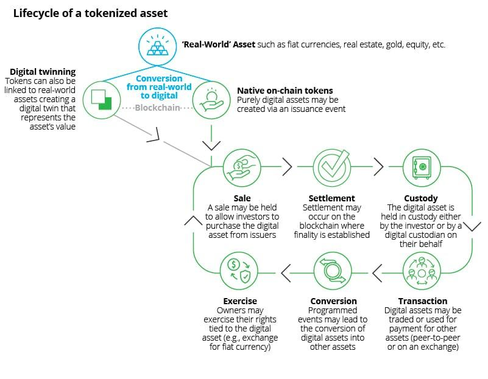

## Table of Contents

## What is tokenization in finance?

Tokenization in finance means turning real-world assets, like property or art, into digital tokens on a blockchain. These tokens represent ownership of the asset and can be bought, sold, or traded easily online. It's like having a digital certificate that proves you own a piece of something valuable.

This process makes it easier for more people to invest in things that used to be hard to buy into. For example, instead of buying an entire building, you can buy a small part of it through a token. This can make investing more accessible and can also make transactions faster and more secure because they happen on a blockchain.

## How does tokenization differ from traditional financial assets?

Tokenization is different from traditional financial assets because it uses blockchain technology to create digital tokens that represent ownership in real-world assets. Traditional assets, like stocks or bonds, are usually managed through centralized systems like banks or stock exchanges. With tokenization, the ownership and transfer of assets happen on a decentralized blockchain, which means there's no need for a middleman like a bank or broker. This can make buying and selling assets quicker, cheaper, and more accessible to people all over the world.

Another big difference is how easy it is to divide and share ownership with tokenization. Traditional assets often require large investments because you can't easily split them into smaller parts. For example, buying a piece of real estate usually means buying the whole thing. But with tokenized assets, you can own just a small fraction of an asset, like a piece of a building or a work of art. This makes investing in high-value assets more possible for regular people who might not have a lot of money to spend at once.

Lastly, tokenization can increase transparency and security. Because all transactions are recorded on the blockchain, it's easier to track and verify ownership and transfers. This can reduce fraud and make it easier to trust that the assets you're dealing with are real and legitimate. Traditional financial assets, on the other hand, can sometimes be harder to verify and track, especially if they're managed by multiple intermediaries.

## What are the benefits of tokenizing financial assets?

Tokenizing financial assets makes investing easier and more accessible. With tokenization, you can buy a small piece of something big, like a building or a piece of art, without having to buy the whole thing. This means more people can invest in things they couldn't afford before. It's also easier to buy and sell these tokens because they're on a blockchain, which is like a big online ledger that anyone can see. This means you don't need a bank or a broker to help you, which can save time and money.

Another big benefit is that tokenization can make things more transparent and secure. Since everything is recorded on the blockchain, it's easy to check who owns what and see all the transactions that have happened. This can help stop fraud because it's harder to fake or hide things on a blockchain. Plus, because the blockchain is decentralized, it's not controlled by one company or government, which can make people feel more secure about their investments.

Overall, tokenizing financial assets can open up new opportunities for investors, make transactions quicker and cheaper, and increase trust and security in the financial world. It's like turning big, hard-to-handle assets into smaller, easier-to-deal-with pieces that anyone can invest in.

## What types of assets can be tokenized?

Tokenization can be used for many different types of assets. Real estate is a big one. Instead of buying a whole building, you can buy a small part of it through a token. Art is another example. You can own a piece of a famous painting without having to buy the whole thing. Even things like stocks, bonds, and commodities like gold or oil can be turned into tokens. This makes it easier for more people to invest in these assets.

Another type of asset that can be tokenized is intellectual property. This means things like music, movies, or patents can be turned into tokens. For example, if you're a musician, you can tokenize your songs so fans can buy a piece of them. Companies can also tokenize their future earnings or revenue streams. This way, investors can buy tokens that represent a share in the company's future profits. Tokenization opens up a lot of possibilities for different kinds of assets to be shared and traded more easily.

## How does the process of tokenization work?

Tokenization turns real things like houses or art into digital pieces on a computer system called a blockchain. First, someone decides they want to turn an asset into tokens. They work with a company that knows how to do this, and together they figure out how many tokens to make and what each token represents. For example, if you have a building worth $1 million, you might make 1 million tokens, so each token is worth $1 of the building. Then, they use special computer code to create these tokens on the blockchain. This code makes sure the tokens are real and can't be copied or changed.

Once the tokens are made, they can be sold to people who want to invest. These people can buy the tokens using digital money, like Bitcoin or Ethereum, or sometimes regular money. When someone buys a token, the blockchain keeps a record of who owns it. This makes it easy to see who owns what part of the asset. If someone wants to sell their token later, they can do it quickly and easily on the blockchain without needing a bank or a broker. This way, tokenization makes it easier for more people to own and trade parts of big, expensive things.

## What are the legal and regulatory considerations for tokenized assets?

When you turn real things into digital tokens, there are a lot of rules you have to follow. Different countries have different laws about what you can and can't do with tokenized assets. For example, some places might see these tokens as a type of investment, like stocks or bonds, and they have strict rules about how you can sell them and who can buy them. You might need to register the tokens with a government agency, like the SEC in the United States, and follow rules about telling people what they're buying and the risks involved. If you don't follow these rules, you could get in big trouble.

Another thing to think about is how these tokens fit into existing laws about owning things and moving money around. Since tokenized assets can be bought and sold all over the world, you have to make sure you're following the laws in every country where the tokens are being traded. This can be really tricky because laws about money and investments change a lot and can be different from one place to another. Also, because tokenization is new, the laws are still catching up, so you might run into situations where it's not clear what the rules are. It's important to work with lawyers and experts who know about these things to make sure you're doing everything right.

## What are the risks associated with tokenization in finance?

Tokenization in finance can be risky because it's new and not everyone understands it yet. One big risk is that the value of the tokens can go up and down a lot. If you invest in a token and its value drops, you could lose money. Another risk is that the rules about tokenization are still being figured out. This means you might do something that's against the law without knowing it, and that could get you in trouble. Also, because tokenization often uses digital money like Bitcoin, if the value of that digital money changes a lot, it can affect the value of your tokens too.

Another risk is that the technology behind tokenization, like blockchain, can have problems. For example, if there's a mistake in the computer code that makes the tokens, someone could find a way to steal them or mess with them. This is called a security risk. Also, because tokenization is all online, if the internet goes down or if there's a big computer hack, you could lose access to your tokens or they could be stolen. It's important to be careful and do a lot of research before you decide to invest in tokenized assets.

## How does blockchain technology facilitate tokenization?

Blockchain technology makes tokenization possible by creating a secure and transparent way to turn real things into digital tokens. It's like a big online notebook that everyone can see and add to, but no one can change what's already written. When you tokenize an asset, you use special computer code to create tokens on the blockchain. Each token represents a piece of the asset, like a digital certificate of ownership. Because the blockchain keeps track of everything, it's easy to see who owns what and when tokens are bought or sold. This makes it hard for anyone to cheat or steal because all the information is out in the open and can't be changed.

Blockchain also helps by making it easier and cheaper to buy and sell these tokens. Without blockchain, you might need a bank or a broker to help you trade assets, which can be slow and expensive. But with blockchain, you can do it all online without needing a middleman. This means you can trade tokens with people all over the world quickly and at a lower cost. Plus, because the blockchain is decentralized, it's not controlled by one company or government, which can make people feel more secure about their investments. This opens up new ways for people to invest in things they couldn't before, like owning a small piece of a big building or a famous piece of art.

## What are some real-world examples of tokenized assets?

One real-world example of tokenized assets is real estate. A company called RealT has tokenized properties in the United States, allowing people to buy small parts of houses or apartments. Instead of buying a whole building, you can buy tokens that represent a share of the property. This makes it easier for more people to invest in real estate without needing a lot of money. Another example is art. Maecenas is a platform that lets people buy tokens representing shares in famous artworks. For instance, you could own a piece of a painting by Andy Warhol without having to buy the whole thing.

Another example is commodities like gold. Companies like Paxos have created tokens like PAX Gold, where each token represents one ounce of gold stored in a vault. This makes it easy to buy and sell gold without physically handling it. In the world of finance, companies can tokenize their stocks or bonds. For instance, the Overstock company issued its own cryptocurrency called tZERO, which represents shares in the company. This allows investors to buy and trade these tokens on a blockchain, making the process faster and more accessible.

## How can tokenization impact liquidity in financial markets?

Tokenization can make it easier to buy and sell things in financial markets, which is called increasing liquidity. When you turn big things like buildings or art into small digital pieces, more people can afford to buy them. This means there are more buyers and sellers, so it's easier to find someone to trade with. For example, if you want to sell a token that represents a piece of a building, you can do it quickly online without waiting for someone to buy the whole building. This can make the market move faster and help people get their money in and out more easily.

Another way tokenization helps with liquidity is by making it cheaper and faster to trade. Without tokenization, you might need a bank or a broker to help you buy or sell something, and that can take time and cost money. But with tokens on a blockchain, you can trade directly with other people online, which cuts out the middleman. This means you can buy and sell things more often and at a lower cost, which can make the market more active and liquid. Overall, tokenization can make financial markets work better by letting more people join in and making it easier for everyone to trade.

## What are the future trends and potential developments in financial tokenization?

In the future, tokenization could become even more popular as more people understand how it works and see the benefits. One big trend might be that more types of things get turned into tokens. Right now, we see real estate, art, and gold being tokenized, but soon we could see things like cars, music rights, or even future earnings from a business turned into tokens. This would let more people invest in all sorts of things they couldn't before. Another trend could be that governments and big companies start using tokenization more. For example, a city might tokenize its public projects to let citizens invest in them, or a company might tokenize its stock to make it easier for people to buy and sell.

As technology gets better, tokenization could also become safer and easier to use. Right now, there are some risks like hackers stealing tokens or mistakes in the computer code. But as we learn more, we can make the systems stronger and more secure. This would make people feel more confident about using tokenized assets. Also, as more countries figure out the rules for tokenization, it could become easier to trade tokens all over the world. This would make the market bigger and more active, letting people from different places invest in each other's assets. Overall, tokenization could change the way we think about owning and trading things, making it easier and more open for everyone.

## How can investors and financial institutions get started with tokenization?

To get started with tokenization, investors and financial institutions first need to understand what it is and how it works. They should learn about blockchain technology, which is the system that makes tokenization possible. It's a good idea to do some research or take a class to get familiar with the basics. Once they understand the concept, they can start looking for platforms or companies that offer tokenized assets. These could be real estate, art, or even stocks and bonds. It's important to choose a reputable platform that follows the rules and has a good track record.

After choosing a platform, investors and financial institutions need to set up an account and start exploring the available tokenized assets. They should read up on each asset to understand its value and the risks involved. It's also a good idea to talk to experts or financial advisors who know about tokenization. Once they're ready, they can buy tokens using digital money like Bitcoin or Ethereum, or sometimes regular money. As they get more comfortable, they can start trading these tokens, buying and selling them as they see opportunities in the market. Tokenization can open up new ways to invest, but it's important to start slowly and keep learning as the technology and rules keep changing.

## References & Further Reading

[1]: Mougayar, W. (2016). ["The Business Blockchain: Promise, Practice, and Application of the Next Internet Technology"](https://books.google.com/books/about/The_Business_Blockchain.html?id=CEsPDAAAQBAJ) John Wiley & Sons.

[2]: Narayanan, A., Bonneau, J., Felten, E., Miller, A., & Goldfeder, S. (2016). ["Bitcoin and Cryptocurrency Technologies: A Comprehensive Introduction"](https://press.princeton.edu/books/hardcover/9780691171692/bitcoin-and-cryptocurrency-technologies) Princeton University Press.

[3]: Tapscott, D., & Tapscott, A. (2016). ["Blockchain Revolution: How the Technology Behind Bitcoin is Changing Money, Business, and the World"](https://archive.org/details/blockchainrevolu0000taps) Penguin.

[4]: Catalini, C., & Gans, J. S. (2016). ["Some Simple Economics of the Blockchain"](https://papers.ssrn.com/sol3/papers.cfm?abstract_id=2874598) National Bureau of Economic Research.

[5]: Lopez de Prado, M. (2018). ["Advances in Financial Machine Learning"](https://www.amazon.com/Advances-Financial-Machine-Learning-Marcos/dp/1119482089) Wiley.

[6]: Ukonsaari, M., & Mollick, E. (2019). ["Tokenization and the future of financial markets"](https://www.rolandberger.com/en/Insights/Publications/Tokenization-The-future-of-financial-markets.html) World Economic Forum.

[7]: Buterin, V. (2013). [“Ethereum White Paper: A Next-Generation Smart Contract and Decentralized Application Platform.”](https://ethereum.org/content/whitepaper/whitepaper-pdf/Ethereum_Whitepaper_-_Buterin_2014.pdf) Ethereum.org.