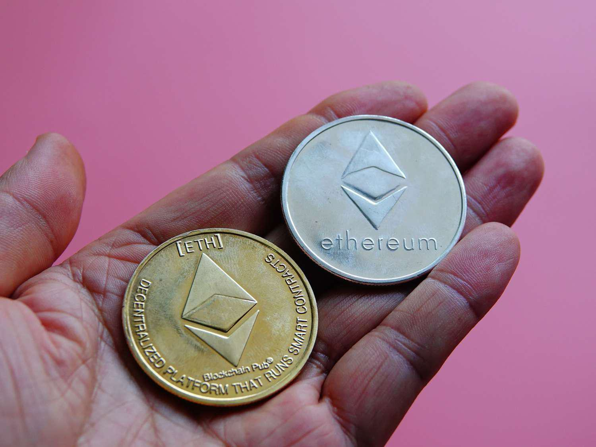

Blockchain technology is increasingly capturing the attention of the financial sector, transforming how financial instruments are created, managed, and traded. At its core, blockchain is a decentralized digital ledger that records transactions in a secure and transparent manner, offering an immutable record of operations. This innovation is prompting significant shifts in the financial landscape by enhancing the efficiency, security, and accessibility of financial services.

Blockchains' immutability and decentralized nature present a fertile ground for the development of tokenized financial instruments. Tokenized equity refers to the digital representation of equity shares of a company, recorded on a blockchain. These tokenized shares offer fractional ownership, enabling investors to purchase small portions of equity, which increases accessibility and broadens the investor base. Similarly, tokenized stock is the representation of stock in a digital format, allowing for seamless, borderless transactions that traditional stocks cannot easily accommodate.



Blockchain investment encompasses a broad variety of financial activities and opportunities made possible through the use of blockchain technology. These include not only tokenized equity and stocks but also other digital assets and cryptocurrencies, which offer new methods of diversifying investment portfolios and managing risk.

Algorithmic trading, or algo trading, is a method of executing trades using pre-programmed strategies determined by a set of rules for factors such as timing, price, and quantity. In the context of blockchain, algorithmic trading is propelled into a new dimension by leveraging the speed and accuracy of blockchain transactions.

The integration of blockchain with traditional financial instruments is significant because it provides increased transparency and efficiency while minimizing the risk of fraud and errors. This integration is crucial for fostering trust and reliability in a sector where these aspects are paramount.

Tokenization is revolutionizing investment opportunities by lowering entry barriers, improving liquidity, and facilitating global access to a wider range of assets. As a result, investors can make more informed, agile, and diversified portfolio decisions.

The purpose of this article is to explore the synergy between tokenized equity and algorithmic trading. By examining this combination, we aim to illuminate new investment paradigms that are emerging and assess the potential for substantial improvements in how financial assets are created and traded in the modern economic landscape.

## Table of Contents

## Understanding Tokenized Equity

Tokenized equity represents a modernization of traditional equity shares, utilizing blockchain technology to provide digitized ownership of company stock. Unlike traditional equity, where ownership is recorded on paper or centralized electronic systems, tokenized equity leverages distributed ledger technology to offer a decentralized, secure method of share registration and transfer.

**Technical Process of Creating Tokenized Shares**

The creation of tokenized shares involves the generation of digital tokens on a blockchain platform that represent equity in a company. These tokens are often built using smart contract-enabled blockchains such as Ethereum, which allow for programmable logic. The process typically involves:

1. **Asset Selection**: Identifying the asset that will be tokenized, in this case, equity.
2. **Token Issuance**: Utilizing a smart contract to issue tokens that represent shares of the equity. This smart contract contains information including the number of shares, distribution terms, and shareholder rights.
3. **Regulatory Compliance**: Ensuring that the issuance of tokens complies with regulatory requirements which may involve KYC (Know Your Customer) and AML (Anti-Money Laundering) processes.
4. **Token Distribution**: Distributing the tokens to investors, often through a digital platform or marketplace.

**Benefits for Investors**

Tokenized equity offers several advantages over traditional equity:

- **Fractional Ownership**: Investors can purchase fractions of a share, democratizing access to investment opportunities by lowering the minimum investment requirement.
- **Liquidity**: Digital tokens can be traded on blockchain-based exchanges, providing higher liquidity compared to traditional stocks, which may be subject to limited trading windows and market constraints.
- **Global Access**: The use of blockchain technology allows investors from different geographical locations to participate in the equity market, overcoming barriers associated with cross-border trading.

**Challenges and Regulatory Considerations**

Despite these benefits, tokenized equity presents several challenges:

- **Regulatory Uncertainty**: The regulatory landscape for tokenized assets is still evolving, and companies must navigate varying laws across jurisdictions, which may affect token issuance and trading.
- **Technological Risks**: Blockchain technology, while secure, is not immune to hacking and technical glitches. Security vulnerabilities can undermine investor confidence.
- **Market Volatility**: The nascent nature of tokenized equity markets may lead to volatility, potentially impacting investment stability.

**Real-world Examples**

Several companies have embraced tokenized equity, demonstrating its practical application:

- **tZERO**: A blockchain-based platform that facilitates the trading of tokenized equity, providing a marketplace for digital securities.
- **Blockchain Capital**: A venture capital firm that issued its fund BCAP using tokens, allowing investors to gain exposure to its portfolio through tokenized equity.
- **SPiCE VC**: A tokenized venture capital fund that gives investors access to its holdings through digital securities, providing liquidity and transparency compared to traditional VC funds.

Tokenized equity continues to redefine investment paradigms by integrating blockchain technology with traditional financial instruments, offering innovative solutions while presenting new challenges that stakeholders must address.

## Blockchain Investment Opportunities

Blockchain technology has paved the way for innovative investment opportunities beyond traditional financial instruments like stocks and bonds. It introduces several new avenues that leverage its decentralized and transparent nature. At the forefront is the concept of tokenization, which enables the creation of digital tokens on a blockchain, representing real-world assets such as equity, real estate, and even art. This democratizes investment by allowing fractional ownership and enhancing [liquidity](/wiki/liquidity-risk-premium) compared to conventional markets.

Several platforms have emerged to facilitate blockchain-based investments. These include:

1. **Decentralized Finance (DeFi) Platforms**: Platforms like Uniswap and Aave enable users to engage in lending, borrowing, and trading of tokenized assets without intermediaries. They operate on smart contracts — self-executing contracts with the terms directly written into code, ensuring transparency and security.

2. **Security Token Offerings (STOs)**: Platforms such as Polymath and tZERO offer regulated means for issuing and trading tokenized securities. STOs provide a compliant way for companies to raise capital via blockchain, offering investors tokens that represent rights in the issuing entity.

3. **Asset Tokenization Services**: Services like RealT and BrickBlock allow real estate properties to be tokenized, giving investors the ability to own digital shares of physical assets, thereby increasing diversification and accessibility.

Central to these platforms are smart contracts. They automate and secure investment processes by executing predefined conditions without human intervention, reducing potential errors and counterparty risks. For example, a smart contract in a DeFi lending platform automatically disburses funds when collateral requirements are met, ensuring trust and efficiency.

However, blockchain investments are not devoid of risks. Key risks include:

- **Volatility**: The cryptocurrency market is highly volatile, which can significantly impact the valuation of blockchain-based investments.

- **Regulatory Uncertainty**: The regulatory landscape for blockchain investments continues to evolve, posing risks related to compliance and legal standing.

- **Security Concerns**: The risk of hacking and smart contract vulnerabilities remains a concern. Ensuring robust security practices and regular audits is crucial to mitigate these risks.

Looking ahead, several trends seem poised to shape the future of blockchain investments:

- **Integration with Traditional Finance**: Increased collaboration between blockchain platforms and traditional financial institutions can enhance legitimacy and adoption, offering hybrid investment products.

- **Development of Central Bank Digital Currencies (CBDCs)**: The rise of CBDCs may further legitimize blockchain-based financial systems and increase their integration into global financial markets.

- **Expansion of Tokenized Asset Classes**: Beyond equity and real estate, we may see tokenization applied to a broader range of assets such as infrastructure projects and exotic collectibles.

Embracing these opportunities requires rigorous risk assessment and an understanding of the technology's evolving landscape, ensuring informed and strategic investment decisions.

## Exploring Tokenized Stock

Tokenized stocks represent a novel approach to equity trading, offering digital representations of traditional stock shares on a blockchain. These digital tokens are backed by actual shares held in custodial accounts, ensuring that each token corresponds directly to a specific number of shares of stock. This allows investors to engage in stock trading without the conventional limitations imposed by traditional brokerage accounts.

At their core, tokenized stocks operate by utilizing blockchain technology to facilitate ownership transfer and verify transactions. The process begins with the creation of tokens on a blockchain, such as Ethereum, where these tokens are pegged to an underlying asset, like a company's stock. This tokenization involves creating a smart contract that outlines the terms and rights associated with the token, linking it to the equivalent number of actual shares. The blockchain's decentralized ledger ensures transparent, secure, and immutable records, enhancing trust among stakeholders.

Comparing tokenized stocks to traditional stocks reveals several key differences. Tokenized stocks offer the advantage of fractional ownership, allowing investors to purchase portions of a share, which lowers the entry barrier for investments in high-value stocks. This increased accessibility can lead to greater market liquidity and more dynamic trading activities. Additionally, tokenized stocks facilitate 24/7 trading due to the global nature of blockchain, whereas conventional stock exchanges have specific operating hours. On the downside, tokenized stocks are subject to different regulatory environments, potentially exposing investors to legal uncertainties and limited recourse in the event of disputes.

Several platforms are currently offering tokenized stock trading, each providing unique features to attract investors. For instance, FTX Exchange and Binance have allowed users to trade tokenized stocks alongside cryptocurrencies, offering a seamless trading experience across different asset classes. These platforms typically employ rigorous Know Your Customer (KYC) protocols and adhere to regulatory standards in their respective jurisdictions to mitigate compliance risks.

There have been notable case studies underscoring the potential success of tokenized stock investments. One such instance involves Tesla Inc. (TSLA) tokens, which experienced a surge in popularity among retail investors during periods of high [volatility](/wiki/volatility-trading-strategies) in Tesla's stock price. This engagement allowed investors to trade Tesla tokens round-the-clock, capturing price movements that occurred outside of standard stock market hours. Despite their promise, tokenized stocks' success is contingent upon factors such as regulatory acceptance, technological advancements, and market adoption, which will determine their long-term viability in the financial ecosystem.

## Algorithmic Trading in the Blockchain Era

Algorithmic trading has revolutionized financial markets by enabling automated transactions based on predefined criteria. With the advent of blockchain technology, this field has undergone significant evolution, bringing new capabilities and challenges. Blockchain introduces a decentralized ledger that can enhance transparency and security in [algorithmic trading](/wiki/algorithmic-trading), particularly in tokenized stock and equity markets.

**Advantages of Algo Trading in Tokenized Markets**

Algorithmic trading offers several advantages in the context of tokenized stocks and equity. The primary benefit is improved liquidity. Tokenized assets, facilitated through blockchain, often have higher liquidity compared to traditional markets due to the global access and fractional ownership they provide. This liquidity enables algorithmic systems to execute trades more efficiently and potentially at better prices.

Another advantage is enhanced transaction speed. Blockchain's distributed ledger reduces the need for intermediaries, thus accelerating the trade settlement process. This speed benefits high-frequency trading strategies that rely on executing a large number of orders in a short period.

**Technology Stack for Blockchain-Based Algo Trading**

A typical technology stack for blockchain-based algorithmic trading involves several components. At the foundational level, the blockchain network itself, such as Ethereum or Binance Smart Chain, provides the decentralized infrastructure. Smart contracts are then deployed on these networks to facilitate automated trading rules and conditions.

Front-end applications, often web-based dashboards, interact with users and provide interfaces for setting up trading strategies. Middleware components process data, including market feeds and price signals, which are crucial for decision-making algorithms. Back-end systems handle data storage and transaction history, potentially using decentralized storage solutions like IPFS.

Python is frequently used in developing these systems due to its rich libraries and frameworks for data analysis and automation, such as NumPy, pandas, and the web3.py library for blockchain interactions.

**Challenges and Solutions in Blockchain Algo Trading**

Traders in this evolving domain face several challenges. The volatile nature of [cryptocurrency](/wiki/cryptocurrency) markets, regulatory uncertainties, and the scalability limits of blockchain networks are significant concerns. These challenges require adaptive strategies and robust risk management frameworks.

Scalability issues, for instance, can be mitigated by using layer 2 solutions or sidechains to handle high volumes of transactions without clogging the main network. Similarly, risk management tools integrated within the trading algorithms can be employed to dynamically adjust positions based on volatility measures.

**Examples of Algo Trading Strategies in Blockchain**

Various algorithmic trading strategies have been adapted for blockchain environments. One common approach is statistical [arbitrage](/wiki/arbitrage), which leverages price discrepancies between tokenized assets on different exchanges. Due to blockchain's transparency, traders can access real-time data across multiple platforms, enhancing arbitrage opportunities.

Momentum trading strategies are also popular. These algorithms analyze trends in asset prices to make trade decisions, often utilizing [machine learning](/wiki/machine-learning) techniques to refine predictive models.

In conclusion, blockchain technology is reshaping algorithmic trading by improving liquidity, speed, and transparency. Despite challenges, the integration of blockchain creates new opportunities for sophisticated strategies that can operate in decentralized marketplaces, setting the stage for future developments in the financial sector.

## Synergies Between Tokenized Assets and Algo Trading

Algorithmic trading, commonly known as algo trading, has become a cornerstone of modern financial markets, providing traders with the speed and efficiency to capitalize on rapid market changes. The introduction of tokenized assets, which are digital representations of traditional assets like stocks and equity on a blockchain, offers enhanced liquidity that algo trading systems can leverage.

**Liquidity and Tokenized Assets**

Tokenized assets inherently provide increased liquidity compared to traditional assets. Liquidity refers to the ease with which an asset can be bought or sold in the market without affecting its price. Tokenization divides ownership of assets into smaller parts, enabling fractional ownership and trading. This fractionalization means a larger number of buyers and sellers can participate in the market, decreasing bid-ask spreads and improving market depth. For algo traders, this enhanced liquidity presents opportunities to execute trades more efficiently and at lower costs.

**Arbitrage and High-Frequency Trading Opportunities**

The structure of tokenized stocks allows for arbitrage—profiting from price discrepancies between different markets or exchanges. Arbitrage opportunities arise due to the decentralized nature of blockchain-based trading, where various platforms or exchanges might have differing levels of supply and demand for a given tokenized asset. High-frequency trading ([HFT](/wiki/high-frequency-trading-strategies)), which involves executing a high number of trades in milli- or microseconds, can exploit these discrepancies almost instantaneously. 

Mathematically, the profitability of arbitrage can be represented as:

$$
P = \sum (S_p - B_p) - C
$$

where $P$ is the profit, $S_p$ and $B_p$ are the selling and buying prices on different exchanges, and $C$ represents transaction costs.

**Algorithms Designed for Tokenized Equity**

Algorithms tailored for trading tokenized equity benefit from the high transparency and automation that blockchain technology provides. Python and other programming languages are frequently used to develop these algorithms, which can be fine-tuned to identify patterns or execute trades based on pre-defined criteria. For instance, consider a Python pseudocode snippet for a basic trading algorithm:

```python
def trade_tokenized_equity(token, threshold):
    current_price = get_current_price(token)
    historical_prices = get_historical_prices(token)

    if is_buy_condition_met(historical_prices, current_price, threshold):
        execute_buy_order(token)
    elif is_sell_condition_met(historical_prices, current_price, threshold):
        execute_sell_order(token)

def is_buy_condition_met(prices, current_price, threshold):
    return current_price < (sum(prices) / len(prices) - threshold)

def is_sell_condition_met(prices, current_price, threshold):
    return current_price > (sum(prices) / len(prices) + threshold)
```

This algorithm considers the current price against historical prices and a threshold to make buying or selling decisions.

**Key Players and Platforms**

Numerous platforms and players are now facilitating tokenized algo trading. Companies like Tokensoft and Polymath provide infrastructure to issue tokenized securities, while exchanges like Binance and FTX allow trading of tokenized stocks. These platforms use blockchain technology to streamline transactions, enhance security, and ensure compliance with regulations.

**The Future of Tokenization and Algorithmic Strategies**

The future of investments that combine tokenization and algorithmic strategies appears promising. As regulatory frameworks evolve and blockchain technology matures, it is likely that more traditional financial institutions will adopt these technologies. New algorithms will emerge, fine-tuned to leverage the unique characteristics of tokenized assets—particularly their liquidity and decentralized nature.

Investments will continue to become more democratized due to tokenization, while algo trading will provide the speed and decision-making capabilities necessary to navigate this new landscape. As these areas converge, investors and traders will need to remain adaptable and informed about technological advancements to fully capitalize on the increasing opportunities.

## Conclusion

The integration of blockchain, tokenization, and algorithmic trading signifies a profound shift in the financial marketplace, offering a fusion of cutting-edge technology and traditional investment mechanisms. By utilizing blockchain, which ensures transparency and security, tokenized assets redefine ownership by allowing fractional purchases and global transactions, enhancing liquidity and democratizing access to investment opportunities. Algorithmic trading complements this by enabling rapid, data-driven transactions that can capitalize on the unique liquidity and trading patterns of tokenized markets. This synergy creates an environment where traditional barriers to entry are lowered, allowing a more diverse pool of investors to participate.

Investors must remain vigilant and informed about these rapidly evolving technologies. Staying updated through resources such as academic journals, industry reports, and technology seminars will ensure they can identify and leverage opportunities effectively. Furthermore, as these sectors develop, one can anticipate enhancements in areas such as regulatory frameworks, interoperability across platforms, and the sophisticated use of AI within algorithmic trading strategies.

Continuous learning and adapting to shifting market conditions is crucial. Embracing educational resources, whether they are courses or industry forums, will provide current insights and foster a deeper understanding of these innovations. 

These advancements significantly impact global financial markets by offering new ways to manage and grow wealth, thus contributing to the evolution of financial systems. As blockchain and tokenization blur geographical boundaries and algorithmic trading enhances market operations, the potential for growth and increased efficiency in financial markets appears boundless. Investors and stakeholders should remain engaged in this transformative journey, seizing opportunities presented by these novel financial technologies.

## Call to Action

To stay at the forefront of financial innovation, we encourage readers to explore platforms offering tokenized equity and stock. These platforms provide the opportunity to participate in a rapidly evolving market, allowing investors to experience firsthand the benefits of blockchain technology. Numerous online resources and courses delve into blockchain and algorithmic trading, offering comprehensive insights for both beginners and seasoned investors. Platforms like Coursera, edX, and Udacity offer extensive courses on these subjects, laying a solid foundation for deeper understanding.

Engaging with community forums or discussion groups can also be highly beneficial. Platforms such as Reddit, Telegram, and Discord host active blockchain and algo trading communities where members share insights, updates, and experiences. These are invaluable for networking and staying informed about the latest trends and developments.

Offering a newsletter subscription can serve as a reliable source of ongoing updates in blockchain investments. Through regular newsletters, you can receive curated content, including articles, expert opinions, and market analyses, directly in your inbox. Consider newsletters from industry leaders and technology-focused financial news outlets to ensure you receive high-quality information.

Lastly, we invite readers to actively participate by sharing their experiences or posing questions in the comments section. Engaging with a diverse audience can lead to fruitful discussions, offering multiple perspectives on complex financial technologies. Community interactions not only expand personal knowledge but also contribute to the collective understanding of blockchain's impact on modern finance.

## References & Further Reading

[1]: Tapscott, D., & Tapscott, A. (2016). ["Blockchain Revolution: How the Technology Behind Bitcoin and Other Cryptocurrencies is Changing the World."](https://archive.org/details/blockchainrevolu0000taps) Penguin.

[2]: Mougayar, W. (2016). ["The Business Blockchain: Promise, Practice, and Application of the Next Internet Technology."](https://books.google.com/books/about/The_Business_Blockchain.html?id=CEsPDAAAQBAJ) Wiley.

[3]: Narayanan, A., Bonneau, J., Felten, E., Miller, A., & Goldfeder, S. (2016). ["Bitcoin and Cryptocurrency Technologies: A Comprehensive Introduction."](https://press.princeton.edu/books/hardcover/9780691171692/bitcoin-and-cryptocurrency-technologies) Princeton University Press.

[4]: Zohar, A. (2015). ["Bitcoin: under the hood."](https://dl.acm.org/doi/10.1145/2701411) Communications of the ACM, 58(9), 104-113.

[5]: Peters, G. W., & Panayi, E. (2015). ["Understanding Modern Banking Ledgers through Blockchain Technologies: Future of Transaction Processing and Smart Contracts on the Internet of Money"](https://papers.ssrn.com/sol3/papers.cfm?abstract_id=2692487) in Bank and Banking: Digitization and Mobility.