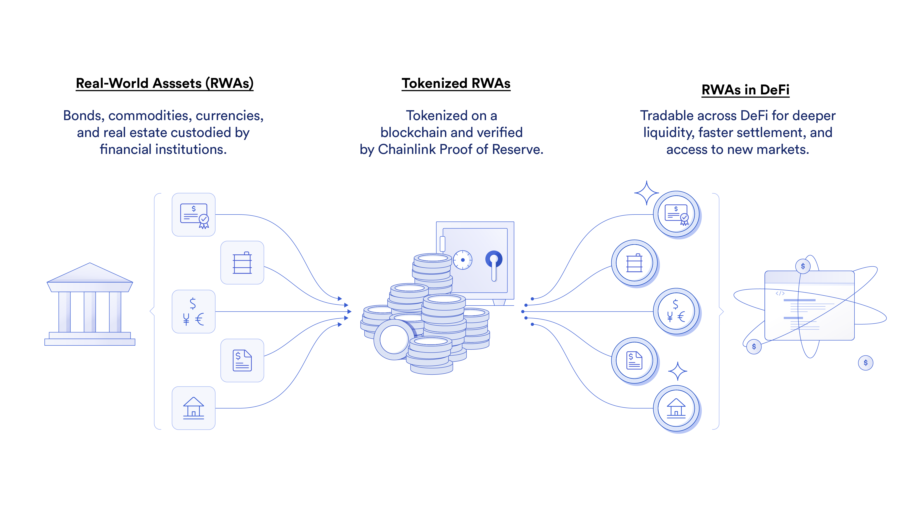

## Table of Contents

## What is tokenized equity?

Tokenized equity is when a company turns its shares into digital tokens on a blockchain. This means that instead of having traditional paper stock certificates, the ownership of the company is represented by digital tokens. These tokens can be bought, sold, and traded just like regular stocks, but they use blockchain technology to make the process more secure and transparent.

People like tokenized equity because it can make investing easier and more accessible. With tokenized equity, you can buy and sell shares more quickly and from anywhere in the world. It also makes it easier for smaller companies to raise money because they can reach more investors through the internet. However, it's important to understand the risks, as the rules and regulations around tokenized equity are still developing.

## How does tokenization of stocks work?

Tokenization of stocks means turning regular shares of a company into digital tokens on a blockchain. A blockchain is like a digital ledger that keeps track of transactions in a secure way. When a company wants to tokenize its stocks, it creates these digital tokens, and each token represents a share of the company. These tokens are then stored on the blockchain, which makes them easy to track and hard to fake.

Once the stocks are tokenized, people can buy and sell these tokens just like they would with regular stocks. But because they're on a blockchain, the process can be faster and more transparent. Investors can trade these tokens anytime and from anywhere in the world, as long as they have an internet connection. This can make investing easier and more accessible, especially for people who might not have been able to invest in traditional stocks.

## What are the benefits of tokenized equity for investors?

Tokenized equity makes it easier for investors to buy and sell shares. Because the shares are on a blockchain, you can trade them anytime and from anywhere in the world. You don't have to wait for a stock market to open or close. This means you can be more flexible with your investments and react quickly to changes in the market.

Another benefit is that tokenized equity can be more accessible. It's easier for smaller companies to offer their shares to a wider audience through the internet. This means investors have more choices and can invest in companies they believe in, even if those companies are not big or well-known. Plus, the blockchain makes everything more transparent and secure, so investors can feel more confident about where their money is going.

## What are the risks associated with tokenized stocks?

One risk with tokenized stocks is that the rules and regulations are still new and changing. This can make it hard to know if you're doing everything right when you buy or sell them. Since the laws are still being figured out, there could be problems or fines if you make a mistake. It's important to keep up with the latest news and rules to stay safe.

Another risk is that because tokenized stocks are digital, they can be a target for hackers. If someone hacks into the blockchain where the tokens are stored, they could steal your tokens or mess up the records. Even though blockchains are usually secure, no system is perfect, and there's always a chance something could go wrong. It's a good idea to use strong security measures to protect your investments.

Lastly, the value of tokenized stocks can go up and down a lot. Since they're often from smaller or newer companies, they can be more risky than regular stocks. If the company doesn't do well, the value of your tokens could drop a lot. It's important to understand this risk and only invest money you can afford to lose.

## How does the process of issuing tokenized equity differ from traditional stock issuance?

Issuing tokenized equity is different from traditional stock issuance because it uses blockchain technology. When a company wants to issue traditional stocks, they usually go through a stock exchange and have to follow a lot of rules and paperwork. They create stock certificates and list their shares on a stock market where investors can buy and sell them. But with tokenized equity, the company creates digital tokens on a blockchain instead of paper certificates. These tokens represent shares in the company and can be traded online. This means the company doesn't need to go through as much paperwork and can reach investors all over the world more easily.

The process of issuing tokenized equity can also be faster and cheaper. Traditional stock issuance can take a long time and cost a lot of money because of all the regulations and paperwork involved. With tokenized equity, a company can create and issue tokens much quicker because they don't have to wait for approval from a stock exchange. They can use smart contracts on the blockchain to automate a lot of the process, which saves time and money. However, the rules for tokenized equity are still new and changing, so companies need to be careful to follow the latest laws and regulations.

## What regulatory considerations must be taken into account with tokenized equity?

When a company wants to issue tokenized equity, they need to think about the rules and laws that apply. These rules can be different in each country and can change over time. In many places, tokenized equity is treated like regular stocks, so companies have to follow the same rules for selling and trading them. This means they need to register with the right government agencies and make sure they're following all the rules about how they can sell their tokens to investors. If they don't follow these rules, they could get in trouble and face fines or other penalties.

Another thing to consider is that some countries have special rules just for digital assets like tokenized equity. These rules can be about how the tokens are created, how they're sold, and how they're traded. Companies need to make sure they understand these rules and follow them carefully. They might also need to work with lawyers and other experts to make sure they're doing everything right. Keeping up with these rules can be hard because they're still new and changing, but it's important for companies to stay on top of them to avoid problems.

## Can you provide examples of companies that have issued tokenized stocks?

One example of a company that has issued tokenized stocks is tZERO. They created digital tokens that represent shares in their company. This lets people buy and sell these tokens easily on a blockchain. tZERO wants to make investing simpler and more open to everyone, so they used tokenized stocks to reach more investors around the world.

Another example is Overstock.com. They turned some of their shares into digital tokens through their subsidiary, tZERO. This move helped them to explore new ways of raising money and making their stock more accessible to investors. By using tokenized equity, Overstock.com aimed to make their shares easier to trade and more appealing to people who like using new technology for investing.

## How does blockchain technology facilitate the tokenization of equity?

Blockchain technology makes it easier for companies to turn their shares into digital tokens. A blockchain is like a digital notebook where all the transactions are recorded and kept safe. When a company wants to create tokenized equity, they use the blockchain to make these tokens. Each token is like a digital version of a share in the company. Because everything is on the blockchain, it's easy to keep track of who owns what and make sure no one can fake or change the records.

Once the tokens are created, they can be bought and sold just like regular stocks. But because they're on a blockchain, the trading can happen faster and from anywhere in the world. The blockchain keeps everything clear and open, so everyone can see the transactions. This makes it easier for investors to trust the system and feel confident about their investments. Plus, using smart contracts on the blockchain can help automate a lot of the work, making the whole process smoother and cheaper.

## What are the potential impacts of tokenized equity on traditional stock markets?

Tokenized equity could change the way traditional stock markets work. Because tokenized stocks are on a blockchain, they can be bought and sold more quickly and from anywhere in the world. This means people don't have to wait for the stock market to open or close to trade. It could make investing easier and more open to everyone, even people who don't live near a big stock exchange. This might make traditional stock markets less important because more people could choose to trade tokenized stocks instead.

Another way tokenized equity might impact traditional stock markets is by making it easier for smaller companies to raise money. With tokenized stocks, these companies can reach more investors online without going through a big stock exchange. This could lead to more competition for traditional stock markets. But it's also important to remember that the rules for tokenized equity are still new and changing. This means traditional stock markets might still be safer and more trusted by some investors until the rules around tokenized equity are more clear.

## How can tokenized equity improve liquidity and accessibility in the stock market?

Tokenized equity can make it easier for people to buy and sell shares. Because these shares are on a blockchain, you can trade them anytime and from anywhere in the world. You don't have to wait for a stock market to open or close. This means you can be more flexible with your investments and react quickly to changes in the market. It also makes it easier for smaller companies to offer their shares to a wider audience through the internet. This means more people can invest in these companies, which can help them raise money more easily.

Another way tokenized equity improves accessibility is by making investing simpler for everyone. With traditional stocks, you might need to go through a lot of paperwork and follow strict rules. But with tokenized stocks, the process can be faster and cheaper because it's all done online. This can help more people get involved in the stock market, even if they don't have a lot of money or live near a big stock exchange. By making investing more open and easier to do, tokenized equity can help more people take part in the economy and grow their wealth.

## What advanced technologies are being explored to enhance the security of tokenized stocks?

One advanced technology being explored to make tokenized stocks more secure is called zero-knowledge proofs. This technology helps keep information private while still proving that a transaction is valid. Imagine you want to prove you own a token without showing the whole world your wallet. Zero-knowledge proofs let you do that, making it harder for hackers to steal your tokens because they can't see all the details of your transactions.

Another technology is multi-party computation (MPC). This is like having a secret that's split into pieces, and no one person has all the pieces. When people want to trade tokens, they use these pieces together to make sure the trade is safe without revealing their full secrets. This makes it really hard for someone to hack into the system because they would need to get all the pieces at the same time. By using these technologies, tokenized stocks can be even safer and more trusted by investors.

## What are the future trends and predictions for tokenized equity in the financial industry?

The future of tokenized equity looks bright because it can make investing easier and more open to everyone. More and more companies might start using tokenized stocks because they can reach investors all over the world quickly and easily. This could lead to more competition for traditional stock markets, as people might prefer the flexibility and speed of trading tokenized stocks. As technology keeps getting better, we might see even more people using their phones or computers to buy and sell these digital shares, making investing simpler and more accessible.

Another trend could be that the rules and laws around tokenized equity will become clearer and more stable. Right now, the rules are still new and changing, which can make people nervous about investing in tokenized stocks. But as governments and financial regulators learn more about this technology, they might create better rules that make tokenized equity safer and more trusted. This could help more people feel comfortable investing in tokenized stocks, leading to more growth in this part of the financial industry.

## What are the synergies between tokenized assets and algo trading?

Algorithmic trading, commonly known as algo trading, has become a cornerstone of modern financial markets, providing traders with the speed and efficiency to capitalize on rapid market changes. The introduction of tokenized assets, which are digital representations of traditional assets like stocks and equity on a blockchain, offers enhanced liquidity that algo trading systems can leverage.

**Liquidity and Tokenized Assets**

Tokenized assets inherently provide increased liquidity compared to traditional assets. Liquidity refers to the ease with which an asset can be bought or sold in the market without affecting its price. Tokenization divides ownership of assets into smaller parts, enabling fractional ownership and trading. This fractionalization means a larger number of buyers and sellers can participate in the market, decreasing bid-ask spreads and improving market depth. For algo traders, this enhanced liquidity presents opportunities to execute trades more efficiently and at lower costs.

**Arbitrage and High-Frequency Trading Opportunities**

The structure of tokenized stocks allows for arbitrage—profiting from price discrepancies between different markets or exchanges. Arbitrage opportunities arise due to the decentralized nature of blockchain-based trading, where various platforms or exchanges might have differing levels of supply and demand for a given tokenized asset. High-frequency trading ([HFT](/wiki/high-frequency-trading-strategies)), which involves executing a high number of trades in milli- or microseconds, can exploit these discrepancies almost instantaneously. 

Mathematically, the profitability of arbitrage can be represented as:

$$
P = \sum (S_p - B_p) - C
$$

where $P$ is the profit, $S_p$ and $B_p$ are the selling and buying prices on different exchanges, and $C$ represents transaction costs.

**Algorithms Designed for Tokenized Equity**

Algorithms tailored for trading tokenized equity benefit from the high transparency and automation that blockchain technology provides. Python and other programming languages are frequently used to develop these algorithms, which can be fine-tuned to identify patterns or execute trades based on pre-defined criteria. For instance, consider a Python pseudocode snippet for a basic trading algorithm:

```python
def trade_tokenized_equity(token, threshold):
    current_price = get_current_price(token)
    historical_prices = get_historical_prices(token)

    if is_buy_condition_met(historical_prices, current_price, threshold):
        execute_buy_order(token)
    elif is_sell_condition_met(historical_prices, current_price, threshold):
        execute_sell_order(token)

def is_buy_condition_met(prices, current_price, threshold):
    return current_price < (sum(prices) / len(prices) - threshold)

def is_sell_condition_met(prices, current_price, threshold):
    return current_price > (sum(prices) / len(prices) + threshold)
```

This algorithm considers the current price against historical prices and a threshold to make buying or selling decisions.

**Key Players and Platforms**

Numerous platforms and players are now facilitating tokenized algo trading. Companies like Tokensoft and Polymath provide infrastructure to issue tokenized securities, while exchanges like Binance and FTX allow trading of tokenized stocks. These platforms use blockchain technology to streamline transactions, enhance security, and ensure compliance with regulations.

**The Future of Tokenization and Algorithmic Strategies**

The future of investments that combine tokenization and algorithmic strategies appears promising. As regulatory frameworks evolve and blockchain technology matures, it is likely that more traditional financial institutions will adopt these technologies. New algorithms will emerge, fine-tuned to leverage the unique characteristics of tokenized assets—particularly their liquidity and decentralized nature.

Investments will continue to become more democratized due to tokenization, while algo trading will provide the speed and decision-making capabilities necessary to navigate this new landscape. As these areas converge, investors and traders will need to remain adaptable and informed about technological advancements to fully capitalize on the increasing opportunities.

## References & Further Reading

[1]: Tapscott, D., & Tapscott, A. (2016). ["Blockchain Revolution: How the Technology Behind Bitcoin and Other Cryptocurrencies is Changing the World."](https://archive.org/details/blockchainrevolu0000taps) Penguin.

[2]: Mougayar, W. (2016). ["The Business Blockchain: Promise, Practice, and Application of the Next Internet Technology."](https://books.google.com/books/about/The_Business_Blockchain.html?id=CEsPDAAAQBAJ) Wiley.

[3]: Narayanan, A., Bonneau, J., Felten, E., Miller, A., & Goldfeder, S. (2016). ["Bitcoin and Cryptocurrency Technologies: A Comprehensive Introduction."](https://press.princeton.edu/books/hardcover/9780691171692/bitcoin-and-cryptocurrency-technologies) Princeton University Press.

[4]: Zohar, A. (2015). ["Bitcoin: under the hood."](https://dl.acm.org/doi/10.1145/2701411) Communications of the ACM, 58(9), 104-113.

[5]: Peters, G. W., & Panayi, E. (2015). ["Understanding Modern Banking Ledgers through Blockchain Technologies: Future of Transaction Processing and Smart Contracts on the Internet of Money"](https://papers.ssrn.com/sol3/papers.cfm?abstract_id=2692487) in Bank and Banking: Digitization and Mobility.