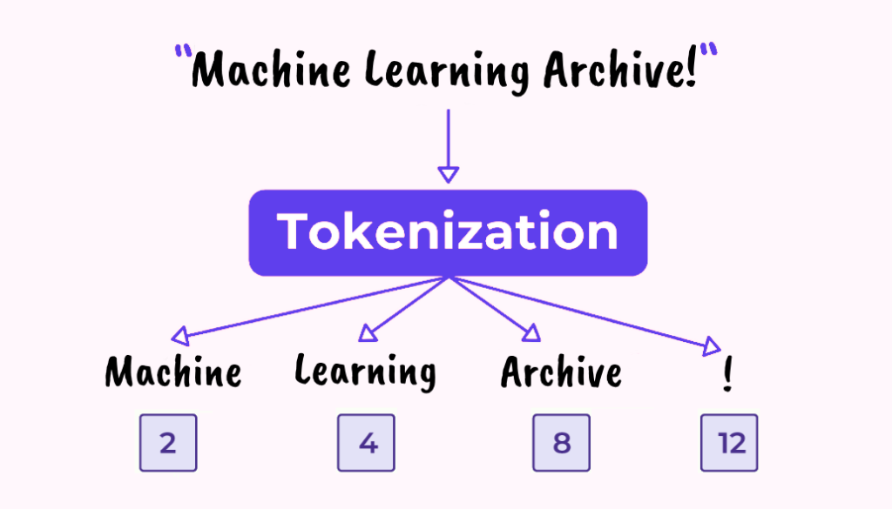

## Table of Contents

## What is a tokenizer in the context of machine learning?

A tokenizer in machine learning is a tool that breaks down text into smaller pieces, called tokens. These tokens can be words, phrases, or even individual characters, depending on what the machine learning model needs. For example, if you have a sentence like "I love machine learning," a tokenizer might split it into the tokens "I," "love," "machine," and "learning." This process is important because it helps the computer understand and process the text more easily.

Tokenizers are used in many areas of machine learning, especially in natural language processing (NLP). In NLP, tokenization is often the first step in preparing text data for analysis. Once the text is broken down into tokens, these tokens can be used as input for various models, like those used in sentiment analysis or language translation. By turning text into tokens, machine learning models can better understand the structure and meaning of the text, which leads to more accurate results.

## Why are tokenizers important for natural language processing?

Tokenizers are important for natural language processing because they help computers understand and work with text. When you have a sentence or a paragraph, a tokenizer breaks it down into smaller parts called tokens. These tokens can be words, numbers, or even punctuation marks. By doing this, the computer can process the text more easily. For example, if you want to analyze a book, the computer needs to understand each word separately before it can understand the whole book.

In natural language processing, tokenization is often the first step in preparing text for [machine learning](/wiki/machine-learning) models. Once the text is broken into tokens, these tokens can be used as input for different kinds of models. For instance, in sentiment analysis, a model might look at the tokens to figure out if a review is positive or negative. Without tokenization, it would be much harder for the computer to understand the text and make accurate predictions. This is why tokenizers are a key part of making natural language processing work well.

## What is the difference between word-based and character-based tokenization?

Word-based tokenization breaks down text into words. For example, if you have the sentence "I love machine learning," a word-based tokenizer would split it into the tokens "I," "love," "machine," and "learning." This method is good for understanding the meaning of sentences because it works with whole words. It is often used in tasks like sentiment analysis or language translation where understanding the meaning of words is important.

Character-based tokenization, on the other hand, breaks down text into individual characters. Using the same sentence "I love machine learning," a character-based tokenizer would split it into the tokens "I," " ", "l," "o," "v," "e," " ", "m," "a," "c," "h," "i," "n," "e," " ", "l," "e," "a," "r," "n," "i," "n," "g." This method is useful for languages that don't use spaces between words or for tasks like text generation where understanding the structure of text at a character level can be helpful. Character-based tokenization can handle out-of-vocabulary words better because it doesn't rely on a predefined set of words.

## How does the WordPiece tokenizer work?

The WordPiece tokenizer is a type of word-based tokenization that is used a lot in machine learning, especially for natural language processing. It tries to break down text into the smallest possible parts, but these parts are not just single characters. Instead, it looks for common parts of words, called subwords. For example, if you have the word "playing," the WordPiece tokenizer might split it into "play" and "##ing." The "##" shows that "ing" is attached to another word. This helps the tokenizer handle words it hasn't seen before by breaking them down into smaller, more common pieces.

WordPiece starts with a large set of text and counts how often each word appears. Then, it tries to find the best way to split words into subwords. It does this by looking at all possible splits and choosing the one that makes the text shorter overall. If a word is very common, it might not be split at all. But if a word is rare, it might be broken down into smaller parts that are more common. This way, the tokenizer can handle new words it hasn't seen before by using the subwords it already knows.

## What are the advantages of using the SentencePiece tokenizer?

The SentencePiece tokenizer is a tool that helps computers understand text better. One big advantage of using SentencePiece is that it does not need any pre-tokenization, which means it can handle text in any language without needing to know where the words start and end. This makes it very useful for languages that do not use spaces between words, like Chinese or Japanese. Also, because it does not need to know about word boundaries, it can be used in the same way for all languages, making it easier to build models that work across different languages.

Another advantage is that SentencePiece uses a method called subword tokenization, similar to WordPiece. It breaks down words into smaller pieces, which helps the computer deal with words it has never seen before. This is especially helpful for tasks like machine translation or text generation, where new words or names can appear. By using subwords, SentencePiece can handle these new words better and make the text processing more accurate and efficient.

## Can you explain the process of subword tokenization?

Subword tokenization is a way to break down text into smaller pieces, called subwords. It's different from just breaking text into whole words or single characters. The main idea is to find common parts of words. For example, if you have the word "playing," a subword tokenizer might split it into "play" and "##ing." The "##" shows that "ing" is attached to another word. This helps the computer handle words it has never seen before by using these smaller, common pieces.

The process starts with a big set of text. The tokenizer looks at all the words and counts how often they appear. Then, it tries to find the best way to split words into subwords. It does this by looking at all possible splits and choosing the one that makes the text shorter overall. If a word is very common, it might not be split at all. But if a word is rare, it might be broken down into smaller parts that are more common. This way, the tokenizer can handle new words it hasn't seen before by using the subwords it already knows.

## How do tokenizers handle out-of-vocabulary words?

Tokenizers handle out-of-vocabulary words by breaking them down into smaller, more common pieces. When a tokenizer sees a word it doesn't know, it tries to split it into parts that it has seen before. For example, if the word is "unhappiness," and the tokenizer knows "un," "happy," and "ness," it might split "unhappiness" into these three parts. This way, even if the tokenizer doesn't know the whole word, it can still understand it by using the parts it knows.

Subword tokenization, like WordPiece or SentencePiece, is especially good at handling out-of-vocabulary words. These tokenizers look for common parts of words and use them to break down new words. If a new word comes up, the tokenizer can split it into subwords that it has seen before. This makes it easier for the computer to understand and process new words without having to learn every single word in the language.

## What are some common challenges faced when implementing tokenizers?

One common challenge when implementing tokenizers is dealing with different languages. Each language has its own rules for how words are put together. For example, some languages like Chinese do not use spaces between words, which can make it hard for tokenizers to know where one word ends and another begins. Tokenizers need to be smart enough to handle these differences. They might need to use special methods or be trained on a lot of text from that language to work well.

Another challenge is handling out-of-vocabulary words. When a tokenizer sees a word it does not know, it needs to decide how to break it down into smaller pieces that it does know. This can be tricky because the tokenizer has to guess the best way to split the word. If it guesses wrong, it might make the text harder for the computer to understand. Subword tokenization, like WordPiece or SentencePiece, can help with this, but it still needs to be carefully set up to work well.

A third challenge is balancing the size of the vocabulary with the performance of the model. A larger vocabulary can help the tokenizer understand more words, but it also makes the model bigger and slower. On the other hand, a smaller vocabulary can make the model faster, but it might not understand as many words. Finding the right balance is important and can take a lot of testing and tuning to get right.

## How can tokenizers affect the performance of machine learning models?

Tokenizers can affect the performance of machine learning models by how well they break down text into tokens. If a tokenizer splits text into the right pieces, it helps the model understand the text better. This means the model can make more accurate predictions. For example, if a tokenizer can handle new words well, the model will be better at understanding sentences with those words. But if the tokenizer does not split the text well, it can make the model's job harder. The model might get confused by the tokens and make worse predictions.

Another way tokenizers affect performance is by the size of their vocabulary. A larger vocabulary can help the tokenizer understand more words, which can make the model more accurate. But a larger vocabulary also makes the model bigger and slower. This means it takes more time and computer power to use the model. On the other hand, a smaller vocabulary can make the model faster, but it might not understand as many words. So, finding the right balance between the size of the vocabulary and the performance of the model is important. This balance can affect how well the model works in real life.

## What are the best practices for choosing a tokenizer for a specific NLP task?

When choosing a tokenizer for a specific NLP task, it's important to consider the language or languages you are working with. Some tokenizers work better with languages that use spaces between words, like English, while others are better for languages without spaces, like Chinese or Japanese. For example, if you are working with multiple languages, a tokenizer like SentencePiece, which does not need pre-tokenization, might be a good choice because it can handle different languages in the same way. Also, think about how the tokenizer handles new words. If your task often sees new words, like in machine translation or text generation, a subword tokenizer like WordPiece or SentencePiece can be very helpful because they break down new words into smaller, common pieces.

Another thing to think about is the balance between the size of the vocabulary and the performance of your model. A larger vocabulary can help the tokenizer understand more words, which can make your model more accurate. But a larger vocabulary also makes the model bigger and slower. This means it takes more time and computer power to use the model. On the other hand, a smaller vocabulary can make the model faster, but it might not understand as many words. So, you need to find the right balance for your specific task. This might take some testing and tuning to get right, but it's important for making sure your model works well in real life.

## How do you evaluate the effectiveness of a tokenizer?

To evaluate the effectiveness of a tokenizer, you need to look at how well it breaks down text into tokens. A good tokenizer should be able to handle different languages and new words it has never seen before. For example, if you are working with a language like Chinese, the tokenizer should be able to split the text into words even though there are no spaces. Also, if the tokenizer can break down new words into smaller, common pieces, like "unhappiness" into "un," "happy," and "ness," it will help the computer understand the text better. You can check this by using the tokenizer on a set of text and seeing if it splits the words in a way that makes sense.

Another way to evaluate a tokenizer is by looking at how it affects the performance of your machine learning model. If the tokenizer splits the text well, the model should be able to understand the text better and make more accurate predictions. For example, if you are doing sentiment analysis, a good tokenizer should help the model understand if a review is positive or negative. You can test this by using the tokenizer with your model and seeing how well the model performs. If the model's accuracy goes up when you use the tokenizer, it's a sign that the tokenizer is effective. But if the model's performance does not improve or even gets worse, you might need to try a different tokenizer or adjust the one you are using.

## What recent advancements have been made in tokenizer technology?

Recent advancements in tokenizer technology have focused on improving how tokenizers handle different languages and new words. One big advancement is the development of multilingual tokenizers like SentencePiece. These tokenizers can work with many languages without needing to know where words start and end. This makes them very useful for tasks like machine translation, where you need to understand text in different languages. Another important advancement is the use of subword tokenization, which breaks down words into smaller pieces. This helps tokenizers deal with new words better because they can use the smaller pieces they already know.

Another advancement is the use of more advanced algorithms to find the best way to split words into tokens. These algorithms can look at a large amount of text and decide the best way to break it down. This helps make the tokenization process more accurate and efficient. For example, some tokenizers now use machine learning to learn how to split words based on patterns they see in the text. This can make the tokenizer better at handling complex or rare words. Overall, these advancements help make tokenizers more flexible and effective for a wide range of NLP tasks.

## References & Further Reading

[1]: Wu, Y., Schuster, M., Chen, Z., Le, Q. V., Norouzi, M., Macherey, W., ... & Dean, J. (2016). ["Google's Neural Machine Translation System: Bridging the Gap between Human and Machine Translation."](https://arxiv.org/abs/1609.08144) arXiv preprint arXiv:1609.08144.

[2]: Kudo, T. & Richardson, J. (2018). ["SentencePiece: A simple and language independent subword tokenizer and detokenizer for Neural Text Processing."](https://arxiv.org/abs/1808.06226) arXiv preprint arXiv:1808.06226.

[3]: Vaswani, A., Shazeer, N., Parmar, N., Uszkoreit, J., Jones, L., Gomez, A. N., ... & Polosukhin, I. (2017). ["Attention is all you need."](https://arxiv.org/abs/1706.03762) Advances in neural information processing systems.

[4]: Devlin, J., Chang, M. W., Lee, K., & Toutanova, K. (2018). ["BERT: Pre-training of Deep Bidirectional Transformers for Language Understanding."](https://arxiv.org/abs/1810.04805) arXiv preprint arXiv:1810.04805.

[5]: Sennrich, R., Haddow, B., & Birch, A. (2015). ["Neural Machine Translation of Rare Words with Subword Units."](https://aclanthology.org/P16-1162/) arXiv preprint arXiv:1508.07909.