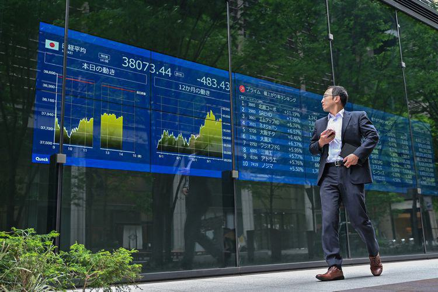

## Table of Contents

## What is the Tokyo Commodity Exchange (TOCOM)?

The Tokyo Commodity Exchange, often called TOCOM, is a place in Japan where people buy and sell things like gold, silver, and oil. It started in 1984 and helps people who want to trade these items in a safe and organized way. Traders come to TOCOM to agree on prices and make deals, which can help them make money or protect against price changes.

TOCOM is important because it helps set prices for commodities in Japan and around the world. It's like a big market where everyone can see what things are worth. This helps businesses plan better and know what to expect when buying or selling these items. By having a place like TOCOM, it makes trading easier and more reliable for everyone involved.

## When was the Tokyo Commodity Exchange established?

The Tokyo Commodity Exchange, or TOCOM, was established in 1984. It's a place in Japan where people trade things like gold, silver, and oil. Before TOCOM, trading these items was not as organized.

TOCOM helps people agree on prices and make deals safely. It's important because it helps set prices for these items in Japan and around the world. This makes trading easier and more reliable for everyone.

## What types of commodities are traded on TOCOM?

The Tokyo Commodity Exchange, or TOCOM, is a place where people trade many different things. Some of the main things they trade are gold, silver, and oil. These are called commodities, which are basic goods that people use every day. Trading these items helps people make money or protect against price changes.

TOCOM also trades other things like rubber, gasoline, and kerosene. These are important for industries and everyday life. By trading these commodities, TOCOM helps set prices that people and businesses can use to plan their buying and selling.

Overall, TOCOM is important because it brings together buyers and sellers from all over the world. This helps make trading fair and organized. It's like a big market where everyone can see what things are worth and make deals safely.

## How does trading on TOCOM work?

Trading on the Tokyo Commodity Exchange, or TOCOM, is like going to a big market where people buy and sell things like gold, silver, and oil. When someone wants to trade, they use something called a futures contract. This is an agreement to buy or sell a certain amount of a commodity at a set price on a future date. Traders can use these contracts to guess if the price of a commodity will go up or down. If they think the price will go up, they buy the contract. If they think it will go down, they sell it.

Once traders have their contracts, they can keep them until the date they agreed on, or they can trade them with other people before that date. This is called trading in the futures market. The price of the contracts can change every day based on what people think the commodity will be worth in the future. If the price goes up, people who bought the contracts can make money. If it goes down, people who sold the contracts can make money. TOCOM makes sure all these trades happen fairly and safely, so everyone can trust the prices and the deals they make.

## What are the main functions of TOCOM?

The Tokyo Commodity Exchange, or TOCOM, has a few main jobs. One big job is to help people buy and sell things like gold, silver, and oil. This is done through something called futures contracts, which are agreements to trade a certain amount of a commodity at a set price on a future date. TOCOM makes sure these trades happen in a fair and safe way. It's like a big market where everyone can see the prices and make deals.

Another important job of TOCOM is to help set prices for commodities. By bringing together buyers and sellers from all over the world, TOCOM can figure out what these items are worth. This helps businesses and people know what to expect when buying or selling these things. It makes trading easier and more reliable for everyone involved.

## How has TOCOM evolved historically?

The Tokyo Commodity Exchange, or TOCOM, started in 1984. Before that, trading commodities like gold and oil in Japan was not as organized. When TOCOM began, it brought together buyers and sellers in one place, making it easier and safer to trade. At first, TOCOM focused on a few key commodities like gold and rubber. Over time, it grew to include more items like oil and silver, helping to set prices for these goods in Japan and around the world.

As years went by, TOCOM kept changing to meet the needs of traders. In 2009, it merged with the Tokyo Grain Exchange, which made it even bigger and more important. This merger helped TOCOM offer more types of commodities and reach more people. Today, TOCOM uses modern technology to make trading faster and easier. It's a big market where people from all over the world can see prices and make deals safely. This helps businesses plan better and know what to expect when buying or selling commodities.

## What are the key milestones in the history of TOCOM?

The Tokyo Commodity Exchange, or TOCOM, started in 1984. Before that, trading things like gold and oil in Japan was not as organized. When TOCOM began, it brought buyers and sellers together in one place, making it easier and safer to trade. At first, TOCOM focused on a few key items like gold and rubber. This helped set prices for these goods in Japan and around the world.

Over the years, TOCOM grew and changed to meet the needs of traders. In 2009, it merged with the Tokyo Grain Exchange, which made it even bigger and more important. This merger allowed TOCOM to offer more types of commodities and reach more people. Today, TOCOM uses modern technology to make trading faster and easier. It's a big market where people from all over the world can see prices and make deals safely. This helps businesses plan better and know what to expect when buying or selling commodities.

## How does TOCOM impact the global commodity market?

The Tokyo Commodity Exchange, or TOCOM, has a big impact on the global commodity market. It helps set prices for things like gold, silver, and oil, which people and businesses around the world use every day. When traders come to TOCOM to buy and sell these items, the prices they agree on can affect what people pay for these commodities everywhere. This is because TOCOM is a big and trusted place where people from all over the world can see what these items are worth.

TOCOM also makes trading easier and safer for everyone. By using futures contracts, traders can guess if the price of a commodity will go up or down. This helps them plan better and protect against big price changes. Because TOCOM is so important, it can influence how people and businesses around the world think about and trade commodities. This makes TOCOM a key part of the global market, helping to keep things fair and organized.

## What are the trading hours and holidays observed by TOCOM?

The Tokyo Commodity Exchange, or TOCOM, has specific times when people can trade. Trading usually happens from 8:45 AM to 3:00 PM, from Monday to Friday. These hours help people from different time zones join in and make deals. It's important for traders to know these times so they can plan when to buy or sell things like gold, silver, and oil.

TOCOM also takes breaks on certain days, which are called holidays. These holidays follow the Japanese calendar and include days like New Year's Day, Golden Week, and the Emperor's Birthday. On these days, no trading happens, so traders need to plan around them. Knowing the trading hours and holidays helps everyone trade smoothly and fairly.

## What are the major challenges faced by TOCOM?

One of the big challenges for TOCOM is keeping up with new technology. As trading becomes faster and more digital, TOCOM needs to make sure its systems are up to date. This means spending money on new computers and software to make trading quick and safe. If TOCOM doesn't keep up, traders might go to other places to buy and sell commodities. Another challenge is competition from other exchanges around the world. Places like the New York Mercantile Exchange and the London Metal Exchange also trade the same things as TOCOM. To stay important, TOCOM needs to offer good prices and services to keep traders coming back.

Another challenge is making sure trading is fair and safe. TOCOM has to watch out for people trying to cheat or make prices go up and down unfairly. This is called market manipulation, and it can hurt everyone who trades on TOCOM. To stop this, TOCOM needs strong rules and people to check that everyone follows them. Also, changes in the world, like big events or new laws, can affect what people trade and how much they pay for it. TOCOM has to be ready to handle these changes and keep the market running smoothly.

## How does TOCOM regulate and ensure fair trading practices?

TOCOM works hard to make sure trading is fair and safe for everyone. They do this by having strict rules that everyone must follow. These rules stop people from cheating or making prices go up and down in unfair ways. TOCOM also has special people called market surveillance officers who watch the trading all the time. If they see something that looks wrong, they can step in and stop it. This helps keep the market honest and protects everyone who trades there.

Another way TOCOM makes trading fair is by using technology to check trades quickly. They use computers to look for any strange patterns or big changes in prices that might be signs of cheating. If the computers find something, they alert the surveillance officers right away. This fast checking helps catch problems before they get too big. By having these rules and using technology, TOCOM makes sure that everyone can trust the prices and the deals they make.

## What future developments are anticipated for TOCOM?

TOCOM is always looking to improve and stay important in the world of trading. One big thing they might do is use even better technology. This could make trading faster and safer. They might also start trading new kinds of commodities that people want to buy and sell. By doing this, TOCOM can attract more traders and stay ahead of other exchanges around the world.

Another thing TOCOM might do is work more with other exchanges. This could help them reach more people and make trading easier across different countries. They might also make their rules even stronger to stop cheating and keep trading fair. As the world changes, TOCOM will need to keep up with new laws and big events that can affect what people trade. By doing all these things, TOCOM can keep helping people buy and sell commodities in a way that's fair and trustworthy.

## References & Further Reading

[1]: Saunders, C., & Turner, J. (Eds.). (2016). ["The Tokyo Commodity Exchange: Its History, Development and Role in the Economy."](https://www.researchgate.net/publication/272123861_A_social_mind_The_context_of_John_Turner's_work_and_its_Influence) University of Cambridge.

[2]: Lopez de Prado, M. (2018). ["Advances in Financial Machine Learning"](https://www.amazon.com/Advances-Financial-Machine-Learning-Marcos/dp/1119482089). Wiley.

[3]: Jansen, S. (2020). ["Machine Learning for Algorithmic Trading"](https://github.com/stefan-jansen/machine-learning-for-trading). Packt Publishing.

[4]: Aronson, D. (2007). ["Evidence-Based Technical Analysis: Applying the Scientific Method and Statistical Inference to Trading Signals"](https://www.amazon.com/Evidence-Based-Technical-Analysis-Scientific-Statistical/dp/0470008741). Wiley.

[5]: Chan, E. P. (2008). ["Quantitative Trading: How to Build Your Own Algorithmic Trading Business"](https://github.com/ftvision/quant_trading_echan_book). Wiley.