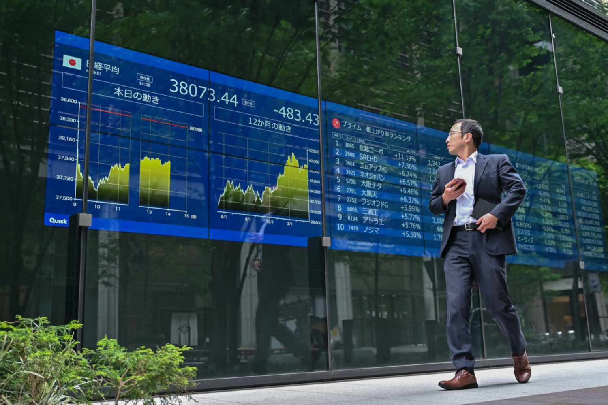

## Table of Contents

## What is the Tokyo Commodity Exchange (TOCOM)?

The Tokyo Commodity Exchange, or TOCOM, is a marketplace in Tokyo, Japan, where people buy and sell different kinds of goods. These goods are called commodities, and they include things like gold, silver, oil, and rubber. People trade these commodities because they want to make money or because they need these goods for their businesses. The exchange helps make these trades happen smoothly and fairly.

TOCOM is important because it helps set prices for commodities in Japan and can affect prices around the world. Traders from all over the world use TOCOM to buy and sell commodities. The exchange also offers something called futures contracts, which are agreements to buy or sell a commodity at a future date. This helps businesses plan ahead and manage risks. By providing a place for these trades, TOCOM plays a big role in the global market for commodities.

## When was the Tokyo Commodity Exchange established?

The Tokyo Commodity Exchange, or TOCOM, was established on November 1, 1984. Before that, there were two separate exchanges in Tokyo: the Tokyo Textile Exchange and the Tokyo Rubber Exchange. They decided to come together to create TOCOM, making it easier for people to trade different commodities in one place.

Since it started, TOCOM has grown a lot. It now trades many different commodities like gold, silver, oil, and rubber. This helps set prices not just in Japan, but around the world. People from all over use TOCOM to buy and sell these goods, making it an important part of the global market.

## What types of commodities are traded on TOCOM?

The Tokyo Commodity Exchange, or TOCOM, trades many different kinds of commodities. These include precious metals like gold and silver, which people often buy and sell because they want to make money or keep their savings safe. TOCOM also trades energy products like [crude oil](/wiki/crude-oil) and gasoline. These are important because they are used to power cars, heat homes, and run factories.

Another group of commodities traded on TOCOM are industrial materials. This includes things like rubber, which is used to make tires and other products, and aluminum, which is used in many industries. These materials are important for businesses that need them to make their products. By trading these commodities, TOCOM helps set prices and makes it easier for businesses to plan and manage their needs.

## How does trading on TOCOM benefit participants?

Trading on TOCOM helps participants in many ways. For one, it gives them a place to buy and sell commodities like gold, silver, oil, and rubber. This is important because it lets people from all over the world trade these goods in one spot. This makes it easier for them to find buyers or sellers and get the best prices. It also helps set prices for these commodities in Japan and can affect prices around the world.

Another benefit is that TOCOM offers futures contracts. These are agreements to buy or sell a commodity at a future date. This helps businesses plan ahead and manage risks. For example, a company that needs oil can buy a futures contract to make sure they get the oil they need at a price they can afford, even if prices go up later. This way, they can keep their costs steady and avoid surprises. By providing these tools, TOCOM helps participants make smarter decisions and protect their businesses.

## What are the trading hours of TOCOM?

The Tokyo Commodity Exchange, or TOCOM, has specific times when people can trade commodities. The main trading hours are from 8:45 AM to 3:00 PM, Japan Standard Time (JST). This is when most of the trading happens, and it's a good time for people in Japan and other parts of the world to buy and sell commodities like gold, silver, oil, and rubber.

There is also a night session for some commodities. This session runs from 4:00 PM to 6:00 AM the next day, JST. The night session is helpful for traders in different time zones who can't trade during the day session. By having these different trading times, TOCOM makes it easier for more people to participate in the market.

## What is the process for becoming a member of TOCOM?

To become a member of TOCOM, a person or company needs to follow a few steps. First, they need to get an application form from TOCOM's website or their office. They fill out the form with information about themselves or their company, like their name, address, and what kind of business they do. They also need to pay a membership fee, which can be different depending on the type of membership they want. After filling out the form and paying the fee, they send it back to TOCOM.

Once TOCOM gets the application, they check it to make sure everything is correct and that the applicant meets their rules. This might take some time. If everything is okay, TOCOM will approve the application and the new member can start trading. Being a member of TOCOM gives people the chance to trade commodities like gold, silver, oil, and rubber, and use tools like futures contracts to help their businesses.

## How does TOCOM ensure the integrity and transparency of its markets?

TOCOM works hard to make sure its markets are fair and open. They do this by setting strict rules that everyone has to follow. For example, they have rules about how trades are made and how information is shared. This helps make sure that no one can cheat or take advantage of others. TOCOM also watches the market closely to catch any problems early. If they see something wrong, they can step in and fix it quickly.

Another way TOCOM keeps things clear and honest is by sharing a lot of information with everyone. They publish data about prices, trading volumes, and other important details every day. This way, everyone can see what's happening in the market and make good decisions. By being open and watching the market carefully, TOCOM helps make sure that trading is fair and that people can trust the prices they see.

## What role does TOCOM play in the global commodity market?

TOCOM, or the Tokyo Commodity Exchange, is a big part of the global commodity market. It's a place where people from all over the world can buy and sell things like gold, silver, oil, and rubber. Because TOCOM is in Tokyo, it helps set prices for these commodities in Japan. But it's not just about Japan; the prices set on TOCOM can affect prices in other countries too. This makes TOCOM important for the whole world, not just for people in Japan.

TOCOM also helps businesses plan ahead and manage risks. They do this by offering futures contracts, which are agreements to buy or sell a commodity at a future date. This is helpful for companies that need these commodities for their work. For example, a company that makes tires might use a futures contract to make sure they can get the rubber they need at a good price, even if prices go up later. By providing these tools and a place to trade, TOCOM plays a big role in helping the global commodity market run smoothly.

## Can you explain the different types of contracts available on TOCOM?

TOCOM offers different types of contracts that help people trade commodities. The main type of contract is called a futures contract. This is an agreement to buy or sell a commodity like gold, silver, oil, or rubber at a future date. People use futures contracts to plan ahead and manage risks. For example, if someone thinks the price of oil will go up, they can buy a futures contract now to get oil later at today's price. This helps them avoid paying more if prices do go up.

Another type of contract on TOCOM is called an options contract. This gives someone the right, but not the obligation, to buy or sell a commodity at a set price before a certain date. Options can be useful because they give people more flexibility. If someone buys an option to buy gold, they can choose to do it if the price is good for them, or they can let the option expire if it's not. This way, they can make decisions based on what happens in the market.

TOCOM also offers spot contracts, which are for immediate delivery of a commodity. These are simpler than futures or options because they don't involve waiting until a future date. If someone needs a commodity right away, they can use a spot contract to get it quickly. Each type of contract on TOCOM serves a different purpose, helping traders and businesses in different ways.

## How have recent technological advancements impacted trading on TOCOM?

Recent technological advancements have made trading on TOCOM easier and faster. One big change is the use of electronic trading platforms. Before, people had to be at the exchange to trade, but now they can do it from anywhere with a computer or smartphone. This makes it easier for more people to trade, even if they are not in Tokyo. The electronic systems also help make trades happen quickly and accurately, which is important for keeping the market fair and efficient.

Another important advancement is the use of data and analytics tools. These tools help traders understand what is happening in the market better. They can look at lots of information about prices, trading volumes, and other things to make smarter decisions. This can help them make more money and manage risks better. By using technology, TOCOM has become more accessible and helpful for traders around the world.

## What are some of the major challenges faced by TOCOM in recent years?

In recent years, TOCOM has faced a few big challenges. One of them is competition from other exchanges around the world. There are many places where people can trade commodities, and some of these places are bigger and more popular than TOCOM. This makes it hard for TOCOM to attract traders and keep its market strong. Another challenge is keeping up with technology. As trading systems get more advanced, TOCOM needs to spend money and time to make sure its systems are fast and reliable. If they don't, traders might choose to go to other exchanges that have better technology.

Another challenge is dealing with changes in the global economy. Sometimes, things like wars, natural disasters, or big changes in laws can affect commodity prices and trading. TOCOM has to be ready to handle these changes and make sure its market stays stable. This can be hard because it's not always easy to predict what will happen. But by working hard and making smart choices, TOCOM tries to overcome these challenges and keep helping traders buy and sell commodities.

## How does TOCOM contribute to the development of commodity markets in Asia?

TOCOM helps grow commodity markets in Asia by being a big place where people can trade things like gold, silver, oil, and rubber. It's in Tokyo, so it's easy for people in Asia to use. When people from different countries in Asia trade on TOCOM, it helps set prices for these commodities in the region. This makes it easier for businesses in Asia to buy and sell what they need. By being a busy and important exchange, TOCOM brings more people into the market and makes it bigger and stronger.

Another way TOCOM helps is by offering tools like futures and options contracts. These tools help businesses plan ahead and manage risks. For example, a company in Asia that needs oil can use a futures contract to make sure they get oil at a good price, even if prices change later. This is really helpful for businesses in Asia because it lets them be more sure about their costs and plans. By providing these tools and a place to trade, TOCOM plays a big part in making commodity markets in Asia better and more useful for everyone.

## References & Further Reading

[1]: Menkveld, A. J. (2016). ["The Economics of High-Frequency Trading: Taking Stock."](https://www.annualreviews.org/content/journals/10.1146/annurev-financial-121415-033010) The Review of Financial Studies, 29(11), 3479-3525. 

[2]: Hasbrouck, J., & Saar, G. (2013). ["Low-latency trading."](https://www.sciencedirect.com/science/article/abs/pii/S1386418113000165) The Review of Financial Studies, 26(9), 2887-2934.

[3]: Easley, D., López de Prado, M. M., & O'Hara, M. (2012). ["Flow Toxicity and Liquidity in a High-frequency World."](https://www.semanticscholar.org/paper/Flow-Toxicity-and-Liquidity-in-a-High-Frequency-Easley-Prado/9369430bd005d194f9332ae7cbd5a57ace5e9ab3) The Review of Financial Studies, 25(5), 1457-1493.

[4]: Aldridge, I. (2013). ["High-Frequency Trading: A Practical Guide to Algorithmic Strategies and Trading Systems."](https://www.wiley.com/en-us/High+Frequency+Trading%3A+A+Practical+Guide+to+Algorithmic+Strategies+and+Trading+Systems%2C+2nd+Edition-p-9781118343500) 

[5]: Duhigg, C. (2009). ["Stock Traders Find Speed Pays, in Milliseconds."](https://www.nytimes.com/2009/07/24/business/24trading.html) The New York Times. 

[6]: Harris, L. (2003). ["Trading and Exchanges: Market Microstructure for Practitioners."](https://academic.oup.com/book/52292) Oxford University Press.