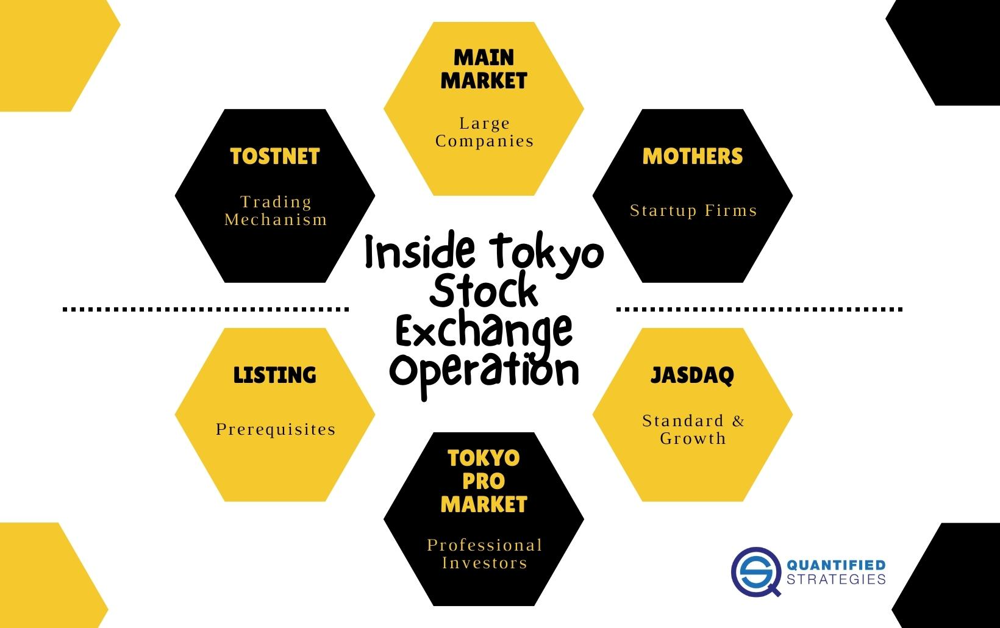

The Tokyo Stock Exchange (TSE), Japan's largest and most prominent stock exchange, is a pivotal institution nestled in Tokyo. Established in 1878, the TSE has emerged as a cornerstone of the global financial landscape, significantly impacting Japan's economic development. The exchange has continually evolved, consistently adapting to the dynamic needs of contemporary trading environments. Throughout its extensive history, the TSE has experienced substantial developments, transitioning from a simple venue for bond trading to a modern, technologically advanced marketplace. This article provides a comprehensive examination of the TSE's rich history, operational structure, and its technological advancements. The focus will also include the rise of algorithmic trading, which has markedly transformed the way trading is executed on the exchange, enhancing both speed and efficiency in market operations.

## Table of Contents

## Historical Overview of the Tokyo Stock Exchange

The Tokyo Stock Exchange (TSE) was established in 1878, originating as a venue primarily for trading government bonds issued to ex-samurais. This development was part of Japan's broader efforts to modernize its economy during the Meiji era. The introduction of these bonds was intended to stabilize the country’s financial systems after the Meiji Restoration, marking the TSE's initial role in Japan's economic framework.

In the early 20th century, the TSE began transitioning from its initial focus on bonds to becoming a significant hub for stock trading. This shift mirrored Japan's industrial expansion and the increasing importance of corporations in the nation's economic activities. By the 1920s, the TSE had become one of Asia's leading stock exchanges, facilitating capital flow to support industrial growth.

After World War II, the TSE's operations were temporarily halted due to the economic disruptions caused by the war. It reopened in 1949, restructured under the Securities Exchange Act, which introduced a framework for establishing securities markets in Japan. This post-war period saw the TSE adapt to a rapidly transforming global economy and align itself with international standards. By the late 1980s, the TSE had surged to become one of the biggest stock exchanges in the world, bolstered by Japan's rapid economic growth and technological advancements.

Throughout its history, the TSE has navigated numerous economic cycles, including the dramatic asset price bubble of the 1980s, which peaked in the early 1990s. This bubble saw inflated property and stock prices, leading to an eventual downturn. The burst of the bubble in the early 1990s triggered a long period of economic stagnation known colloquially as the "Lost Decade." This malaise significantly impacted the TSE, which saw decreased trading volumes and market capitalization during this period.

The TSE's adaptation through these historical cycles highlights its resilience and ability to reform in response to economic challenges, maintaining its critical role in both the domestic and global financial landscapes.

## Operational Structure and Sections of the TSE

The Tokyo Stock Exchange (TSE) is structured to accommodate a wide range of companies by organizing its market into different sections, each designed to fit specific company sizes and growth stages. This organization enables the TSE to cater to various corporate needs and investor types, maintaining market integrity and investor confidence through tailored listing requirements.

The primary segment of the TSE is known as the 'Main Market,' which is divided further into categories for large-cap and medium-cap companies. These are typically well-established firms with substantial market capitalization, stable financial histories, and consistent performance. Companies listed in the Main Market are expected to meet rigorous financial and governance standards, ensuring transparency and reliability for investors.

For high-growth and emerging companies, the TSE offers sections like 'Mothers' (Market of the High-growth and Emerging Stocks) and 'Jasdaq.' These sections provide startup companies with an opportunity to access capital markets early in their growth stages. Mothers targets innovative companies with significant growth potential, whereas Jasdaq serves as a venue for small to medium-sized enterprises seeking to showcase their business models to potential investors. Both sections have listing criteria focused on growth potential rather than just financial history, making them attractive options for newer enterprises.

An exclusive segment, known as the 'Tokyo Pro Market,' caters specifically to professional investors. This market operates under alternative regulations and listing requirements that are less stringent than those of the Main Market, reflecting the enhanced risk profiles typically understood by professional investors. The Tokyo Pro Market facilitates a more liberal trading environment while ensuring that participants possess the requisite expertise and risk tolerance.

Each market section within the TSE has distinct listing requirements designed to bolster market integrity and protect investors. These requirements may involve minimum levels of profitability, asset base, and corporate governance practices. By maintaining these standards, the TSE provides a robust and efficient trading environment that supports both companies and investors, contributing to the overall stability and growth of Japan's financial markets.

## Technological Evolution and Implementation of Algorithmic Trading

The Tokyo Stock Exchange (TSE) has undergone significant technological transformations to enhance trading efficiency and maintain its competitive edge in the global financial markets. Historically, the TSE operated via traditional floor trading methods, where human brokers manually managed buy and sell orders. However, the growing demand for speed and efficiency in trading led to the adoption of electronic trading systems.

A pivotal development in this technological evolution was the introduction of the 'arrowhead' platform in 2010. This advanced system is designed to accommodate high-speed trading and real-time data processing, significantly reducing trade execution time. The 'arrowhead' platform supports low-latency trading, addressing the need for precision and speed required by modern trading activities. This platform enables the TSE to execute trades within milliseconds, a crucial feature for traders who engage in high-frequency trading ([HFT](/wiki/high-frequency-trading-strategies)).

As technology progressed, [algorithmic trading](/wiki/algorithmic-trading) became increasingly integral to TSE operations. Algorithms are used to automate trading processes, executing transactions based on pre-defined conditions. These algorithms can process large volumes of data swiftly and execute complex trading strategies that would be impossible to perform manually. Algorithmic trading minimizes human intervention, thereby reducing errors and enhancing trading accuracy.

Furthermore, the Tokyo Stock Exchange Trading NeTwork (ToSTNeT) is another significant technological advancement that has streamlined trading operations. ToSTNeT provides off-auction trading services, allowing transactions to be conducted outside regular trading hours. This network facilitates block trading, enabling large transactions to occur without affecting the market price significantly. It ensures [liquidity](/wiki/liquidity-risk-premium) while providing a platform for executing customized and negotiated trades, thus offering greater flexibility to institutional investors.

The implementation of these technologies has not only increased the TSE's operational efficiency but has also brought substantial changes to the trading landscape. Algorithmic trading, backed by robust systems like 'arrowhead' and ToSTNeT, has lowered transaction costs and improved market liquidity. With enhanced trading capabilities, the TSE continues to adapt to the evolving demands of the global financial market, ensuring its status as a leader in innovation within the stock exchange industry.

## Algorithmic Trading's Impact on TSE Operations

Algorithmic trading has fundamentally transformed the execution of trades on the Tokyo Stock Exchange (TSE) by significantly enhancing the speed and precision of transactions. This transformation is primarily achieved through the use of complex algorithms that analyze market data and execute trades in fractions of a second, a substantial improvement over manual trading methods.

The capabilities of algorithmic trading systems allow traders to handle a large [volume](/wiki/volume-trading-strategy) of transactions across various asset classes simultaneously. Such efficiency is critical in high-frequency trading (HFT), where algorithms are designed to exploit minute price discrepancies that may not be visible or accessible through traditional trading methods. The ability to rapidly execute trades reduces the market impact of large orders and minimizes slippage, ensuring better execution quality. 

One of the primary advantages brought about by the shift toward algorithmic trading on the TSE is a reduction in transaction costs. Algorithms optimize the timing, price, and execution of trades, leading to reduced market fees and costs associated with bid-ask spreads. As a result, both institutional and retail investors benefit from more cost-effective trading solutions.

Moreover, algorithmic trading has contributed to improved market liquidity. By automatically generating buy and sell orders, these trading systems ensure that there is a constant flow of transactions, leading to tighter spreads and more seamless price adjustments. This liquidity enhancement supports a healthier and more stable market environment.

To maintain a fair and orderly trading system, regulatory oversight of algorithmic trading practices is crucial. Authorities enforce regulations that aim to prevent market abuses and systemic risks associated with automated trading. For instance, mechanisms are in place to monitor and scrutinize algorithmic trading activities, ensuring that they do not lead to unfair market practices such as spoofing or layering. Regular audits and standardized testing of trading algorithms are conducted to preserve market integrity and transparency.

The implementation of algorithmic trading on the TSE underscores a balance between innovation and regulation, aiming to provide market participants with efficient trading avenues while safeguarding against potential disruptions to the financial system.

## Conclusion

The Tokyo Stock Exchange (TSE) maintains its position as a critical entity in the global financial markets, supported by its long-standing history and dynamic operations. Its continued importance is largely due to its adept integration of technological advancements, notably algorithmic trading. As the financial environment evolves, the TSE's embracement of cutting-edge technologies ensures that it remains competitive and relevant on the world stage. Algorithmic trading, in particular, has revolutionized the efficiency and effectiveness with which trades are executed, allowing the TSE to set standards in speed and accuracy that accommodate the needs of modern market participants.

The TSE's strategy in embracing such innovations underscores a strong commitment to creating and sustaining a robust and efficient trading environment. By constantly updating its infrastructure, like the adoption of electronic trading systems and high-speed platforms, the TSE enhances liquidity and reduces transaction costs for its traders. Such initiatives not only attract a diverse range of global investors but also strengthen the market's integrity and transparency.

Moreover, the TSE's adaptability to rapid changes in financial technology positions it as a model stock exchange in the context of global finance. Its proactive approach to regulatory frameworks ensures that while it pursues technological advancements, it upholds the highest standards of market stability and transparency. Consequently, the TSE secures its reputation as a resilient, forward-thinking institution fully aligned with the demands of an ever-changing global economic landscape.

## References & Further Reading

[1]: Fujimoto, A. (2004). ["The Tokyo Stock Exchange: A Guide for Overseas Investors."](https://www.researchgate.net/profile/Takahiro-Fujimoto-4) Japan Information Access Project.

[2]: Kuroda, A. (2013). ["The History of Japanese Online Trading from Its Beginnings to Completion."](https://www.msn.com/en-us/money/markets/analysis-boj-bids-final-farewell-to-kurodas-radical-policy-experiment/ar-AA1wcwUM) Cambridge Scholars Publishing.

[3]: Preve, L., & Saito, T. (2011). ["Algorithmic Trading and DMA: An Introduction to Direct Access Trading Strategies."](https://www.semanticscholar.org/paper/Algorithmic-trading-%26-DMA-%3A-an-introduction-to-Johnson/aa5de1ab883d5e23b6651faa7c1807586d688e4b) 4Myeloma Press.

[4]: Lo, A. W. (2011). ["Adaptive Markets: Financial Evolution at the Speed of Thought."](https://books.google.com/books/about/Adaptive_Markets.html?id=Q4d7DwAAQBAJ) Princeton University Press.

[5]: Tokyo Stock Exchange, Inc. (2019). ["Responsibility Report 2019"](https://www.jpx.co.jp/english/news/1020/b5b4pj000002xyda-att/b5b4pj000002xyfw.pdf), Japan Exchange Group, Inc.