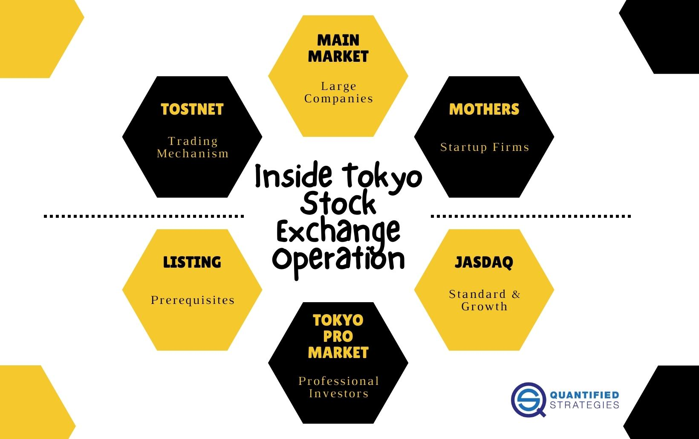

The Tokyo Stock Exchange (TSE) stands among the world’s most influential financial markets, serving as a cornerstone for Japan’s economy and significantly impacting the global financial ecosystem. Since its establishment in 1878, the TSE has undergone substantial transformation, mirroring Japan's economic surge and its adaptability to the evolving technological and economic milieu.

Initially launched as a venue for trading government bonds in Japan's Meiji era, the TSE was instrumental in driving the country's modernization efforts. Over the years, it expanded its scope to include stock trading, aligning with the industrial growth that marked Japan's emergence as a global economic power. The exchange's historical evolution is reflective of Japan's broader economic trajectory, characterized by resilience and innovation.

In recent decades, technological advancements have played a pivotal role in redefining the TSE’s operational mechanisms. The introduction of algorithmic trading has revolutionized the way transactions are conducted, minimizing human intervention and enhancing both the speed and efficiency of market operations. This modernization has also positioned the TSE as a crucial entity in the global high-frequency trading landscape, where milliseconds can determine competitive advantage.

This article provides an in-depth exploration of the Tokyo Stock Exchange, examining its rich history and the structural organization that accommodates companies of varying sizes and growth stages. Additionally, the piece investigates into the technological frameworks that have been implemented, highlighting the substantial impact of algorithmic trading on the TSE’s function and integrity within the financial markets.

## Table of Contents

## Historical Overview of the Tokyo Stock Exchange

The Tokyo Stock Exchange (TSE) was established in 1878, initially serving as a platform primarily for the trading of government bonds. This foundation was crucial to Japan's economic development during the Meiji era, a period marked by rapid modernization and industrialization. The creation of such a financial institution aligned with the broader governmental initiatives to build a robust economic framework capable of supporting the country's modernization goals.

As Japan's economy transitioned and industrialized throughout the 20th century, the TSE expanded its remit, encapsulating a broader range of financial instruments, particularly stocks. This evolution mirrored Japan's own industrial growth, as more companies sought capital through public listings on the exchange. The TSE's development was synchronous with the country's emergence as a major industrial power, reflecting the increasing complexity and global integration of Japan's economic activities.

The aftermath of World War II posed significant challenges, as Japan faced economic reconstruction and reintegration into the global economy. During this period, the Tokyo Stock Exchange played a critical role in facilitating the economic miracle of post-war Japan, which included rapid industrialization and economic growth. By the late 1980s, the TSE had emerged as one of the world's leading stock exchanges in both size and influence, reflecting Japan's status as a global economic powerhouse.

A significant historical challenge for the TSE occurred during the 1980s asset price bubble, a period characterized by soaring Japanese real estate and stock market prices. The subsequent bust presented substantial difficulties. However, the TSE exhibited resilience through a series of reforms aimed at stabilizing and modernizing its operations. These reforms were essential in maintaining its pivotal role in both domestic and international financial markets, thus ensuring the exchange could continue to support Japan's economic activities and contribute to the global financial system.

## Operational Structure and Sections of the TSE

The Tokyo Stock Exchange (TSE) is structured into several distinct sections to accommodate companies at various stages of their growth and development, while meeting the diverse needs of investors. This organization enhances market efficiency and provides tailored opportunities for both issuers and investors.

The Main Market serves as the primary section of the TSE, primarily catering to established firms. Companies listed on the Main Market are required to meet stringent financial and governance criteria, ensuring rigorous standards in corporate practices and financial reporting. These requirements are designed to maintain investor confidence by ensuring the transparency and reliability of the information provided by listed entities. The Main Market attracts a broad spectrum of investors due to its perceived stability and low risk associated with established companies.

For emerging and high-growth companies, the TSE provides alternative platforms such as Mothers and Jasdaq. "Mothers," short for Market of the High-growth and Emerging Stocks, focuses specifically on supporting companies with high growth potential. This section facilitates access to capital for innovative startups and dynamic companies that may not meet the Main Market's stringent criteria but demonstrate significant future growth prospects. Jasdaq, similar in focus, is geared towards companies in various growth stages but places particular emphasis on innovation and the potential for substantial financial growth.

Additionally, the Tokyo Pro Market caters to professional investors, operating under a slightly different regulatory framework. This market provides a more flexible trading environment, allowing certain companies to list with alternative compliance requirements tailored to the needs of seasoned investors. The Tokyo Pro Market is particularly attractive for foreign companies seeking access to Japanese investors but preferring to comply with domestic or international standards rather than those mandated by the Main Market.

The TSE's differentiated structure allows companies of various sizes and industries to find a listing that best aligns with their strategic goals and investor expectations. This multi-tiered approach not only supports corporate growth but also ensures a diverse and dynamic marketplace within Japan's economic landscape.

## Technological Evolution and Implementation of Algorithmic Trading

The Tokyo Stock Exchange's technological evolution reflects its commitment to enhancing trading efficiency and maintaining a competitive edge in global finance. Traditionally reliant on physical floor trading, the TSE transitioned to electronic systems, a significant shift marked by the 2010 implementation of the 'arrowhead' platform. This platform is designed to facilitate high-speed trading by offering low-latency performance, crucial for high-frequency trading ([HFT](/wiki/high-frequency-trading-strategies)) strategies. The architecture of 'arrowhead' drastically reduces the time required to process trades, allowing traders to execute complex strategies within microseconds.

The incorporation of [algorithmic trading](/wiki/algorithmic-trading) has transformed how transactions occur on the TSE. Algorithmic trading utilizes pre-programmed instructions to execute trades automatically, significantly minimizing human intervention. This approach enhances operational efficiency, enabling rapid decision-making and reducing the likelihood of errors associated with manual trading processes. Algorithms are capable of processing massive volumes of data swiftly, identifying patterns, and executing trades with precision that outpaces human capabilities.

Additionally, TSE supports diverse trading mechanisms via the Tokyo Stock Exchange Trading NeTwork (ToSTNeT). ToSTNeT allows for off-auction trading, including block trading, thereby enhancing market [liquidity](/wiki/liquidity-risk-premium). This network facilitates transactions outside of the central auction, enabling participants to negotiate trades directly, which is particularly beneficial for handling large volumes that might otherwise impact market prices unfavorably. Off-auction trading via ToSTNeT provides a versatile trading environment that complements the speed and efficiency brought by innovations like 'arrowhead' and algorithmic trading. These technological advancements collectively ensure that the TSE remains a robust platform capable of meeting the demands of modern financial markets.

## Algorithmic Trading's Impact on TSE Operations

Algorithmic trading has considerably transformed the dynamics of the Tokyo Stock Exchange (TSE) by enhancing transaction speed and precision. These advancements are particularly crucial for high-frequency trading (HFT) strategies, which rely on executing a large number of orders quickly and efficiently. By automating trade executions, algorithmic trading minimizes human error and allows traders to capitalize on minute market fluctuations, thus improving overall market efficiency.

One of the primary benefits of algorithmic trading is the reduction in transaction costs. This is achieved through efficient order execution, whereby algorithms optimize trade timing and minimize the bid-ask spread. The enhanced precision in executing trades also contributes to improved market liquidity. As more trades are executed seamlessly, the availability of assets for trading increases, leading to tighter spreads and more stable prices. This liquidity is crucial for attracting both domestic and international investors, reinforcing the TSE's significance in the global financial arena.

However, the rise of algorithmic trading necessitates robust regulatory frameworks to prevent market abuses, such as spoofing, which could undermine market integrity. Spoofing involves placing large orders with the intention of canceling them before execution to manipulate stock prices. To combat such practices, the TSE, in conjunction with regulatory authorities, has established stringent rules and monitoring systems designed to detect and deter manipulative trading activities. These regulations aim to ensure fair trading conditions while maintaining investor confidence in the market.

Overall, the TSE maintains a delicate balance between embracing technological innovation and enforcing regulations. By doing so, it continues to facilitate efficient trading operations while safeguarding against potential financial disruptions. This approach not only enhances the operational resilience of the exchange but also solidifies its reputation as a progressive and secure trading environment.

## Conclusion

The Tokyo Stock Exchange (TSE) remains a cornerstone of global finance, distinguished by its ability to adapt and thrive amid evolving market dynamics. Its historical resilience is reflected in its capacity to withstand economic upheavals and asset bubbles while continuing to play a crucial role in Japan's economic development. Over the years, the TSE has successfully integrated technological advancements, particularly algorithmic trading, which has transformed trading operations by enhancing transaction speed and execution precision.

Algorithmic trading, characterized by the use of automated and complex algorithms to execute trades at high speeds, has significantly improved transaction efficiency at the TSE. This advancement enables the exchange to handle modern market demands by minimizing human errors and optimizing order execution. Enhanced efficiency translates into lower transaction costs and improved market liquidity, making the exchange more attractive to investors and traders globally.

The TSE's commitment to innovation is paralleled by its proactive regulatory measures designed to maintain market integrity. By implementing robust frameworks to prevent manipulative practices such as spoofing and ensuring fair trading environments, the TSE balances technological strides with a vigilant regulatory stance. This adaptability and emphasis on regulation safeguard against potential financial disruptions, preserving stability.

In summary, the TSE's blend of technological innovation and regulatory vigilance not only enhances its operational efficiency but also solidifies its status as a forward-thinking and resilient institution within the international financial landscape.

## References & Further Reading

- Fujimoto, A. (2004). *The Tokyo Stock Exchange: A Guide for Overseas Investors*. Japan Information Access Project. This book provides a comprehensive guide for international investors interested in the Tokyo Stock Exchange, offering insights into its operations, regulatory framework, and the broader Japanese financial environment.

- Kuroda, A. (2013). *The History of Japanese Online Trading from Its Beginnings to Completion*. Cambridge Scholars Publishing. This work covers the evolution of online trading in Japan, focusing on technological advancements and their impact on market accessibility and efficiency.

- Preve, L., & Saito, T. (2011). *Algorithmic Trading and DMA: An Introduction to Direct Access Trading Strategies*. 4Myeloma Press. This publication explains the principles and practices of algorithmic trading and Direct Market Access (DMA), highlighting strategies used within modern electronic trading environments.

- Lo, A. W. (2011). *Adaptive Markets: Financial Evolution at the Speed of Thought*. Princeton University Press. Lo's book explores the concept of adaptive markets, integrating insights from traditional finance theories with the dynamic nature of market behaviors influenced by technological innovation.

- Tokyo Stock Exchange, Inc. (2019). *Responsibility Report 2019*. Japan Exchange Group, Inc. The report details the Tokyo Stock Exchange's strategies for maintaining market integrity, with a focus on governance, risk management, and leveraging technology to enhance trading processes and stakeholder trust.

