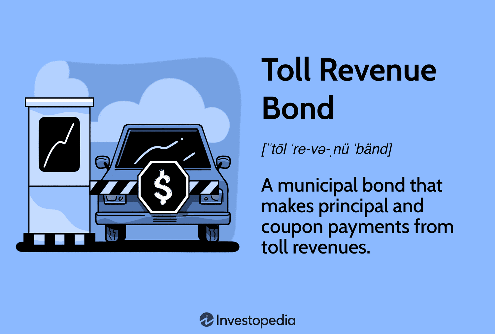

## Table of Contents

## What are toll revenue bonds?

Toll revenue bonds are a type of bond that is paid back using the money collected from tolls on roads, bridges, or tunnels. When a government or a special authority wants to build or improve these kinds of infrastructure, they can issue these bonds to get the money they need. People and organizations buy these bonds, and in return, they get their money back plus interest, but only from the tolls collected.

These bonds are different from general obligation bonds, which are backed by the full faith and credit of the issuing government. With toll revenue bonds, if not enough toll money comes in, the bondholders might not get all their money back. This makes toll revenue bonds riskier, but they can still be a good way to fund important projects without raising taxes or using other government funds.

## How do toll revenue bonds differ from general obligation bonds?

Toll revenue bonds and general obligation bonds are two ways governments can borrow money, but they work differently. Toll revenue bonds are paid back using money collected from tolls on roads, bridges, or tunnels. This means the money to pay back these bonds comes only from the people using that specific infrastructure. If not enough people use it and pay tolls, there might not be enough money to pay back the bonds fully.

On the other hand, general obligation bonds are backed by the full faith and credit of the government that issues them. This means the government promises to use its general funds, like taxes, to pay back these bonds. They are considered safer because the government is more likely to have enough money from various sources to make the payments, no matter what.

So, toll revenue bonds are riskier because they depend on how much money comes in from tolls, while general obligation bonds are safer because they are backed by the government's overall financial resources.

## What is the primary source of revenue for toll revenue bonds?

The main way toll revenue bonds get paid back is from the money people pay to use roads, bridges, or tunnels. When someone drives on a toll road or crosses a toll bridge, they have to pay a fee. All these fees add up and are used to pay back the people who bought the bonds.

If not enough people use the road or bridge, there might not be enough money from tolls to pay back the bonds fully. This makes toll revenue bonds a bit risky. But, they are a good way to build or fix important roads and bridges without using other government money or raising taxes.

## Can you explain the process of issuing toll revenue bonds?

When a government or special authority wants to build or fix a road, bridge, or tunnel, they can issue toll revenue bonds to get the money they need. First, they decide how much money they need for the project. Then, they work with financial experts to create the bond. They set the interest rate that people who buy the bonds will get and how long it will take to pay back the money. They also make a plan for how they will use the toll money to pay back the bondholders.

Once the bond is ready, the government or authority will sell it to people and organizations who want to invest their money. They might advertise the bond to attract buyers or work with banks and other financial companies to help sell it. When people buy the bonds, they give money to the government or authority, which is then used to build or fix the road, bridge, or tunnel. Over time, the money collected from tolls is used to pay back the bondholders with interest, until the bond is fully paid off.

## What are the typical terms and conditions associated with toll revenue bonds?

When a government or special authority issues toll revenue bonds, they set some rules about how the bonds work. These rules include how much interest the bondholders will get and how long it will take to pay back the money. The interest rate can be fixed, meaning it stays the same over time, or it can change based on certain conditions. The length of time to pay back the bond, called the maturity period, can be anywhere from a few years to several decades, depending on the project.

Another important rule is how the toll money will be used to pay back the bondholders. The government or authority makes a plan to collect tolls from people using the road, bridge, or tunnel. This money goes into a special account that is used only to pay back the bondholders. If there isn't enough toll money, the bondholders might not get all their money back. This makes toll revenue bonds a bit risky, but it's a way to build or fix important infrastructure without using other government money or raising taxes.

## How is the creditworthiness of toll revenue bonds assessed?

The creditworthiness of toll revenue bonds is checked by looking at how much money the tolls are expected to bring in. Experts study how many people are likely to use the road, bridge, or tunnel and how much money they will pay in tolls. They also look at how much it will cost to build or fix the project and how much money is needed to keep it running. If the toll money is expected to be enough to pay back the bonds and cover all costs, the bonds are seen as more creditworthy.

Another thing experts look at is the history of similar projects. If other toll roads or bridges in the area have done well and brought in a lot of toll money, it makes the new bonds look better. They also think about things like the economy and how it might change how many people use the road. If the economy is good and more people are likely to use the road, the bonds are seen as safer. But if the economy is not doing well, it might make the bonds riskier.

## What are the risks associated with investing in toll revenue bonds?

Investing in toll revenue bonds can be risky because the money to pay back the bonds comes only from the tolls people pay to use the road, bridge, or tunnel. If not enough people use it, there might not be enough toll money to pay back the bondholders. This means you might not get all your money back, or it might take longer than expected. Also, if something goes wrong with the project, like it costs more to build or fix than planned, it can make it even harder to pay back the bonds.

Another risk is that the economy can change how many people use the road. If the economy is not doing well, fewer people might be driving, which means less toll money. This can make it harder to pay back the bonds. Also, if there are other roads or ways to get around that don't have tolls, people might choose those instead, which can also lower the toll money coming in. So, while toll revenue bonds can be a good way to invest in important projects, they come with risks that you need to think about.

## Can you provide examples of successful toll revenue bond projects?

One good example of a successful toll revenue bond project is the E-470 highway in Colorado. This highway was built to help people get around the busy Denver area more easily. The money to build it came from toll revenue bonds. People who drive on the E-470 pay tolls, and that money is used to pay back the bonds. The project has been successful because a lot of people use the highway, so there is enough toll money to pay back the bonds and keep the road in good shape.

Another example is the Dulles Greenway in Virginia. This toll road was built to connect the Washington Dulles International Airport to the town of Leesburg. The money to build it also came from toll revenue bonds. Even though it had some problems at first, the Dulles Greenway has become a successful project because it is a fast and easy way for people to get to the airport and other places. The toll money has been enough to pay back the bonds and keep the road running well.

## How do toll revenue bonds impact the local economy?

Toll revenue bonds can help the local economy by making it easier for people to get around. When a new road, bridge, or tunnel is built with toll revenue bonds, it can help people get to work faster, move goods more easily, and attract new businesses to the area. This can lead to more jobs and more money being spent in local stores and restaurants. For example, the E-470 highway in Colorado has helped people get around the busy Denver area more easily, which has helped the local economy grow.

On the other hand, toll revenue bonds can also have some negative effects on the local economy. If people have to pay tolls to use the road, bridge, or tunnel, they might have less money to spend on other things. Also, if the toll road is not used as much as expected, it might not bring in enough money to pay back the bonds. This can make it harder for the local government to pay for other important things, like schools and hospitals. So, while toll revenue bonds can help the local economy in some ways, they can also create some challenges.

## What are the legal and regulatory considerations for toll revenue bonds?

When a government or special authority wants to issue toll revenue bonds, they have to follow certain laws and rules. These laws and rules can be different depending on where the project is happening. Usually, they have to get permission from a state or local government before they can start collecting tolls. They also have to make sure they are following rules about how they can use the toll money and how they have to report on it. If they don't follow these rules, they might get in trouble or not be able to use the toll money to pay back the bonds.

Another important thing is that the bonds have to be set up in a way that is fair to the people who buy them. This means the government or authority has to be clear about how the toll money will be used and what will happen if there isn't enough money to pay back the bonds. They also have to follow rules about how they can change the toll rates and what they have to do if they want to stop collecting tolls. All these rules are there to make sure that the toll revenue bonds are used in a way that helps the community and is fair to everyone involved.

## How have toll revenue bonds evolved in response to technological advancements?

Toll revenue bonds have changed a lot because of new technology. One big change is how tolls are collected. Before, people had to stop at a toll booth and pay with cash or a card. Now, many toll roads use electronic toll collection systems. These systems let people drive through without stopping, and the toll is charged to their account. This makes it easier for people to use the road and can help bring in more toll money to pay back the bonds.

Another way technology has helped is by making it easier to keep track of how many people are using the road and how much money is coming in. With computers and special software, the people in charge of the toll road can see how much toll money they are getting every day. This helps them plan better and make sure they have enough money to pay back the bonds. It also helps them decide if they need to change the toll rates or do other things to make sure the project stays successful.

## What future trends might influence the use and effectiveness of toll revenue bonds?

In the future, toll revenue bonds might be affected by new technology like self-driving cars. These cars could make it easier for more people to use toll roads because they can drive themselves and pay the tolls automatically. This could mean more toll money coming in, which would help pay back the bonds faster. But, if self-driving cars start using other roads that don't have tolls, it could mean less money for the toll roads. So, it's hard to say exactly how self-driving cars will change things, but they could make a big difference.

Another trend that might affect toll revenue bonds is how people think about the environment. More and more people want to use public transportation or bikes instead of driving cars. If fewer people drive on toll roads, there might be less toll money to pay back the bonds. On the other hand, if toll roads are made to be more eco-friendly, like using electric toll booths or making the roads better for the environment, more people might choose to use them. This could help keep the toll money coming in and make the bonds more successful.

## References & Further Reading

[1]: Fabozzi, F. J. (2000). ["Bond Markets, Analysis and Strategies."](https://books.google.com/books/about/Bond_Markets_Analysis_and_Strategies_ten.html?id=bQpNEAAAQBAJ) Prentice Hall.

[2]: ["Algorithmic Trading: Winning Strategies and Their Rationale"](https://books.google.com/books/about/Algorithmic_Trading.html?id=WAlFDwAAQBAJ) by Ernest P. Chan

[3]: Li, Y., & Zhao, Y. (2016). ["A Review of Bonds and the Term Structure of Interest Rates."](https://www.sciencedirect.com/science/article/pii/S0360319924052996) Annual Review of Financial Economics.

[4]: ["Infrastructure as an Asset Class: Investment Strategy, Sustainability, Project Finance and PPP"](https://onlinelibrary.wiley.com/doi/pdf/10.1002/9781119226574.fmatter) by Barbara Weber, Hans Wilhelm Alfen

[5]: Chincarini, L. B., & Kim, D. (2006). ["Quantitative Equity Portfolio Management: An Active Approach to Portfolio Construction and Management."](https://www.mhebooklibrary.com/doi/book/10.1036/9781264268931) McGraw-Hill.