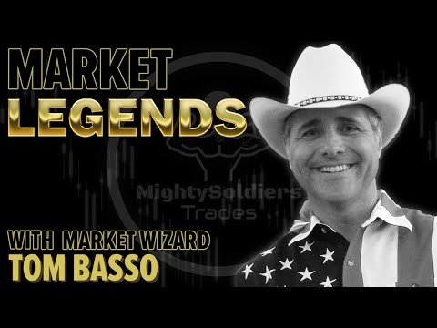

## Table of Contents


**Tom Basso** (born 1953) is an American trader, investor, and former hedge fund manager known for his calm demeanor and systematic trading style. He was the president and founder of Trendstat Capital Management, where he pioneered mechanical **trend-following** strategies, and he gained fame as one of the traders featured in Jack D. Schwager’s *The New Market Wizards* (1992), which nicknamed him “*Mr. Serenity*” for his unflappable approach. Basso’s trading philosophy emphasizes risk management, disciplined **algorithmic trading** systems, and the primacy of trading psychology over trade selection. In retirement, he remains active as an educator and author, sharing his insights on systematic investing and trading psychology.

## Early Life and Education

Tom Basso showed an early interest in investing and markets. At the age of 12, he bought his first mutual fund using money earned from his paper route. Throughout his youth he developed a fascination with finance, later trading stocks, bonds, options, commodities, and currencies on his own account. Basso attended Clarkson University in Potsdam, New York, graduating in 1974 with a degree in chemical engineering. He initially worked as an engineer for Monsanto Company, where his strong math and computer background helped hone the analytical skills he would later apply to trading. This quantitative, problem-solving mindset laid the groundwork for Basso’s systematic approach to the markets.

## Trading Career and Highlights

Basso transitioned from engineering to finance in the late 1970s. He became a registered investment advisor in 1980 and a registered commodities trading advisor in 1984. In 1984, he founded **Trendstat Capital Management**, an investment firm through which he managed client money across multiple asset classes. Basso served as Trendstat’s president and CEO, developing automated long-term trend-following strategies that were unusual for their time. Under his leadership, Trendstat grew to manage approximately \$600 million in assets at its peak, trading a diversified portfolio of stocks, bonds, futures, and currencies on a systematic basis. Jack Schwager’s interview with Basso in *The New Market Wizards* highlighted his steady performance and serene mindset amid market [volatility](/wiki/volatility-trading-strategies), cementing his reputation in the trading community.

Trendstat Capital’s systematic approach and consistent returns made it one of the notable trading firms of its era. However, by the early 2000s, assets under management had declined (falling to about \$65 million), and Basso decided to close Trendstat in 2003 when he retired from managing outside capital. During his career, he was elected to the board of the National Futures Association (NFA) in 1998, contributing to industry oversight and best practices. After retiring from active fund management, Basso focused on managing his own portfolio and mentoring others. He remained engaged with the investment world as an advisor and educator: he currently serves as the Chairman of the Board of **Standpoint Funds** (a fund management company in Scottsdale, Arizona specializing in “All-Weather” multi-asset strategies). He also runs an educational website and community for traders, **enjoytheride.world**, where he shares trading lessons and insights from decades of experience.

### Publications and Writings

Throughout his career, Tom Basso has authored several [books](/wiki/algo-trading-books) and articles sharing his trading wisdom. His first book, *The Frustrated Investor*, was self-published and addressed common pitfalls and emotional challenges faced by individual investors. In 1996, he published *Panic-Proof Investing: Lessons in Profitable Investing from a Market Wizard*, which provides practical advice on how to **“center yourself”** and make calm, balanced investment decisions by overcoming internal emotional roadblocks. In this book, Basso—drawing on his nickname “Mr. Serenity”—outlines techniques for controlling panic and staying disciplined during market swings. Decades later, in 2023, Basso released *The All-Weather Trader: Mr. Serenity’s Thoughts on Trading Come Rain or Shine*, a book that encapsulates his philosophy of embracing risk and achieving **“all-weather”** portfolio diversification. *The All-Weather Trader* discusses concepts such as extreme diversification, futures trading, and adaptive portfolio structuring, teaching investors how to leverage risk for long-term success in any market climate. Basso has also written on specialized topics like position sizing – for example, his booklet “Successful Traders Size Their Positions – Why and How?” focuses on risk-based position sizing techniques. In addition to books, Basso frequently shares his insights via interviews, podcasts, and his Substack newsletter, reinforcing his legacy as both a trader and a teacher of trading principles.

## Trading Philosophy and Principles

&#x20;*Basso is a trend follower who believes in **“riding the wave”** of market momentum instead of trying to predict every market turn. He emphasizes capturing sustained price trends across various markets as a key to profitable trading.* Trend-following appealed to Basso because of its logical, quantitative nature – he once noted that it suits his long-term outlook and has a sound mathematical basis. Rather than forecast exact price targets, Basso’s approach is to identify a trend in motion and then **follow it** until it conclusively ends. This philosophy aligns with the classic trend-following maxim: “Cut your losses short and let your winners run.” Basso’s systems typically enter markets once a trend is established and exit only when the trend reverses, thereby riding the bulk of major price moves.

A core tenet of Basso’s philosophy is rigorous **risk management** and capital preservation. He famously said *“the key to successful trading is not to make a lot of money, but to make sure you don’t lose a lot of money,”* underscoring that avoiding large losses is more important than achieving spectacular gains. In practice, this means Basso pays close attention to position sizing, volatility, and drawdowns. He adjusts trade sizes based on market volatility – for instance, trading smaller positions in highly volatile conditions and larger positions in calm periods – so that risk stays proportionate. This **volatility-adjusted position sizing** ensures that no single trade can threaten the portfolio, keeping drawdowns at a tolerable level. Basso’s trading systems often use a predetermined stop-loss for every position and trailing stops to lock in profits as trends progress. He has demonstrated that even a random entry strategy can be profitable if coupled with sound risk management: in a study he conducted, Basso used a random number generator to trigger buy or sell entries in a portfolio of futures, always applied a trailing stop, and found that across many simulations the random system had a slight positive expectancy. This experiment highlighted his view that **trade management** (position sizing and [exit](/wiki/exit-strategy) rules) can matter more than the specific entry logic.

Another pillar of Basso’s philosophy is the **psychological aspect** of trading. He argues that *“investing is a mental game more than it is having the perfect indicator or…even the perfect position sizing”*. In other words, even with a robust system, a trader’s mindset and discipline ultimately determine success. Basso places trading psychology as the top priority, above system rules or analytic techniques. He stresses the importance of emotional control, patience, and consistency. For example, he encourages traders to stay **emotionally detached** – he advises viewing one’s trading performance like a movie or a long-term game, rather than reacting impulsively to each day’s outcome. This detachment helps traders remain calm during inevitable losing streaks or market turbulence. Basso’s own calm persona earned him the moniker “Mr. Serenity,” and he exemplified this by never panicking during market crashes (such as the 1987 crash or 2008 crisis); instead he methodically followed his trading plan. In interviews, Basso has explained that having multiple systems and **diversification** further aids psychological comfort – by trading uncorrelated markets and strategies, a drawdown in one area is often offset by gains in another, which helps one “enjoy the ride” without undue stress.

In summary, Tom Basso’s trading principles can be distilled into a few key points: **(1)** Follow the trends across diverse markets rather than forecasting, **(2)** Control risk on every trade (through proper sizing and stops) to survive over the long run, and **(3)** Maintain psychological equilibrium and discipline, sticking to the system through ups and downs. He often reminds traders that system development, risk management, and psychology together are far more important than finding any single “hot” indicator or trade. This holistic philosophy of systematic trading has influenced many modern traders and fund managers.

## Influence and Legacy in Systematic Trading

Tom Basso’s success and methods have left a significant mark on the trading world, particularly in the realm of mechanical and systematic trading. He is widely regarded as one of the pioneers of rules-based **systematic investing**, proving that automated trend-following strategies could be profitable and scalable in real markets. During the 1980s and 1990s, when many traders still relied on discretionary decisions, Basso’s Trendstat was *“unique for its time”* in fully automating long-term strategies. His ability to deliver consistent returns with low volatility earned him respect among peers and inspired other traders to adopt algorithmic approaches to markets.

Basso’s prominence grew after being featured in *The New Market Wizards*, and he became an exemplar of the calm, systems-driven trader. His nickname “Mr. Serenity” and the story of his composed trading during volatile periods have become trading lore. Many have cited Basso as an influence – for example, author Michael Covel devoted an entire book to distilling Basso’s wisdom. In *Trend Following Mindset: The Genius of Legendary Trader Tom Basso* (2021), Covel presents conversations and research papers from Basso, highlighting his status as a **“trading legend”** in trend-following circles. In the book’s foreword, Covel notes that Basso is *“one of the most experienced and knowledgeable trend-following traders in the world today”*. Through such works, Basso’s insights on system design, position sizing, and mindset have been disseminated to a new generation of quantitative traders.

As an educator, Tom Basso continues to shape trading philosophy. His website and Substack community (Enjoy the Ride World) provide guidance on developing trading systems, managing risk, and even maintaining a healthy life balance as a trader. Basso emphasizes that trading should fit one’s lifestyle – an idea that has resonated with many independent traders looking for sustainability. He often shares personal anecdotes (such as his hobbies in winemaking, golf, and music) to illustrate the importance of having interests outside trading to avoid emotional burnout. This approach to balanced trading and living has become part of his legacy, reminding traders that long-term success comes from **consistency and well-being**, not just monetary gains.

In the professional sphere, Basso’s influence is also seen in the practices of many commodity trading advisors (CTAs) and hedge funds that employ **trend-following and systematic strategies**. Techniques like volatility-based position sizing and multi-market diversification – once relatively novel – are now standard in [quantitative trading](/wiki/quantitative-trading), thanks in part to evangelists like Basso. He has advised and collaborated with other notable figures in the trading community and has been a regular speaker at trading conferences, where he advocates for evidence-based strategy development (through [backtesting](/wiki/backtesting) and simulation) and robust risk controls.

Tom Basso’s enduring legacy is that of a *“Market Wizard”* who demystified trading by treating it as a disciplined engineering problem. He showed that by combining technical methods with psychological fortitude, it’s possible to achieve strong returns **without hype or prediction**, but simply by following a well-crafted plan. Many traders today cite Basso’s interviews and writings as foundational to their understanding of [trend following](/wiki/trend-following) and systematic trading. His contributions have not only earned him personal success but have also advanced the broader field of [algorithmic trading](/wiki/algorithmic-trading) and **trading psychology** as critical components of investment success.

## Algorithmic Trading Strategy Example

To illustrate Tom Basso’s systematic approach, consider a simplified **trend-following trading strategy** that incorporates his principles of mechanical rules and risk management. One classic strategy is a **moving average crossover** system combined with volatility-based position sizing. In this example, we use the Python **Backtrader** framework to implement a strategy that buys into an asset when a short-term moving average crosses above a long-term moving average (signaling an upward trend), and sells when the opposite crossover occurs. The strategy also calculates position size based on a fixed percentage of capital at risk, adjusting for the asset’s recent volatility (using the Average True Range, ATR).

Before diving into code, let’s outline the position sizing formula that echoes Basso’s risk-control approach. We will risk 1% of the account equity on each trade and use an ATR-based stop loss. If `ATR` is the Average True Range of the asset (a measure of recent volatility), we might set a stop loss at 2×ATR from the entry price. The number of shares (or contracts) to trade, i.e., the **position size**, can be computed as:

$\text{PositionSize} \;=\; \frac{\text{Risk Fraction} \times \text{Account Equity}}{\text{Stop Distance}}$

For example, if the account equity is \$100{,}000 and we risk 1% (`Risk Fraction = 0.01`) per trade, that means we risk \$1,000 on the trade. If the stop distance (approximately 2 × ATR for the asset) is, say, \$5 per share, then the position size would be \$1{,}000 / 5 = 200\$ shares. This formula ensures that even if the stop loss is hit, the loss is about 1% of equity, keeping risk **“panic-proof”** and under control. Basso has long advocated such **fixed-fractional position sizing** to manage drawdowns.

Using Backtrader and the **PWB (Papers With Backtest) Toolbox** for data, we can implement the strategy as follows:

```python
import backtrader as bt
import pwb_toolbox.datasets as pwb_ds

# Define a simple moving average crossover strategy with risk management
class TrendFollowStrategy(bt.Strategy):
    params = (('fast', 50), ('slow', 200), ('risk_per_trade', 0.01),)
    
    def __init__(self):
        self.fast_ma = bt.ind.SMA(period=self.p.fast)   # 50-day SMA
        self.slow_ma = bt.ind.SMA(period=self.p.slow)   # 200-day SMA
        self.atr = bt.ind.ATR(period=14)                # 14-day ATR for volatility
        self.order = None
        
    def next(self):
        # If an order is pending, skip new signals
        if self.order:
            return
        # If no position and fast MA crosses above slow MA, enter long
        if not self.position:
            if self.fast_ma[0] > self.slow_ma[0] and self.fast_ma[-1] <= self.slow_ma[-1]:
                # Calculate position size based on 1% risk of current cash
                cash = self.broker.getcash()
                risk_amount = cash * self.p.risk_per_trade  # amount to risk in dollars
                stop_distance = 2 * self.atr[0]             # e.g. stop loss 2 ATR below entry
                size = risk_amount / stop_distance          # number of shares to buy
                self.order = self.buy(size=size)
        # If currently in a position and fast MA crosses below slow MA, exit (sell)
        elif self.position:
            if self.fast_ma[0] < self.slow_ma[0] and self.fast_ma[-1] >= self.slow_ma[-1]:
                self.order = self.sell(size=self.position.size)

# Load historical daily price data (e.g., S&P 500 index) from the PWB Toolbox
data_df = pwb_ds.load_dataset("Stocks-Daily-Price", ["sp500"])
# Prepare Backtrader data feed from the pandas DataFrame
data = bt.feeds.PandasData(dataname=data_df["sp500"])
# Set up the backtesting engine
cerebro = bt.Cerebro()
cerebro.addstrategy(TrendFollowStrategy)
cerebro.adddata(data)
cerebro.broker.setcash(100000.0)  # starting capital $100,000
# Run the backtest
cerebro.run()
```

In this code, the strategy uses a 50-day vs. 200-day simple moving average crossover to signal entries and exits. When a golden cross occurs (50-day SMA crossing above 200-day), the strategy goes long. The **position size** is determined by the risk per trade (1% of cash) divided by the stop distance (2×ATR). This means if the market is very volatile (ATR is high), the position size will be smaller, and if volatility is low, the strategy can take a larger position – reflecting Basso’s rule of *“if risk is high, trade small; if risk is low, trade bigger”*. When a death cross occurs (50-day drops below 200-day), the strategy exits the position to protect against a potential trend reversal. The use of fixed indicators and formulas makes the strategy **fully mechanical** – it doesn’t rely on any discretion or prediction, consistent with Basso’s systematic ethos.

This example demonstrates how one can implement Basso-inspired concepts: a **systematic trend entry/exit rule**, combined with prudent position sizing and risk limits. Using the PWB Toolbox’s historical data (for instance, daily prices of the S\&P 500 index labeled `"sp500"`), a backtest of this strategy would show periods of being in the market during sustained uptrends and moving to cash during downtrends. Such a strategy will never catch tops or bottoms exactly, but it will avoid large losses by exiting when major trends end – echoing Basso’s belief that *when markets turn, you must have a plan to get out and “never let a big loss happen”*. The performance of a moving average trend-following strategy can vary, but over long periods it tends to perform well in strongly trending markets and preserves capital during bear markets, albeit at the cost of whipsaw losses in choppy, trendless periods.

Many **algorithmic traders** have expanded on these basic ideas, using multiple indicators or adding filters (for example, requiring a volatility [breakout](/wiki/breakout-trading) or a confirmation from another time frame). Basso himself traded more complex models and often ran **multiple strategies in parallel**, believing that a combination of uncorrelated systems (trend-following, mean-reversion, [global macro](/wiki/global-macro-strategy), etc.) could smooth out the equity curve. However, the fundamental principles evident in this simple example – follow the trend, define your exit, control your risk per trade – are at the heart of what Tom Basso and like-minded systematic traders practice. By systematically coding and backtesting such strategies, traders can remove emotional bias and gain confidence that their approach has positive expectancy under various market conditions, which is exactly the kind of **“stress-free”**, *panic-proof* trading Basso advocates.


## References & Further Reading

[1]: Tharp, V. (2006). ["Trade Your Way to Financial Freedom."](https://books.google.com/books/about/Trade_Your_Way_to_Financial_Freedom.html?id=_hLzpVIg2sMC) McGraw-Hill Education.

[2]: Basso, T. (1994). ["Panic-Proof Investing: Lessons in Profitable Investing from a Market Wizard."](https://www.amazon.com/Panic-Proof-Investing-Lessons-Profitable-Market/dp/0471030244) Wiley.

[3]: Schwager, J. D. (2006). ["Market Wizards: Interviews with Top Traders."](https://www.amazon.com/Market-Wizards-Updated-Interviews-Traders/dp/1118273052) Wiley.

[4]: Elder, A. (2002). ["Come Into My Trading Room: A Complete Guide to Trading."](https://www.amazon.com/Come-Into-My-Trading-Room/dp/0471225347) Wiley.

[5]: Bassetti, M. L. (2002). ["Trend Following: Learn to Make Millions in Up or Down Markets."](https://ptgmedia.pearsoncmg.com/images/9780137020188/samplepages/9780137020188.pdf) Wiley.