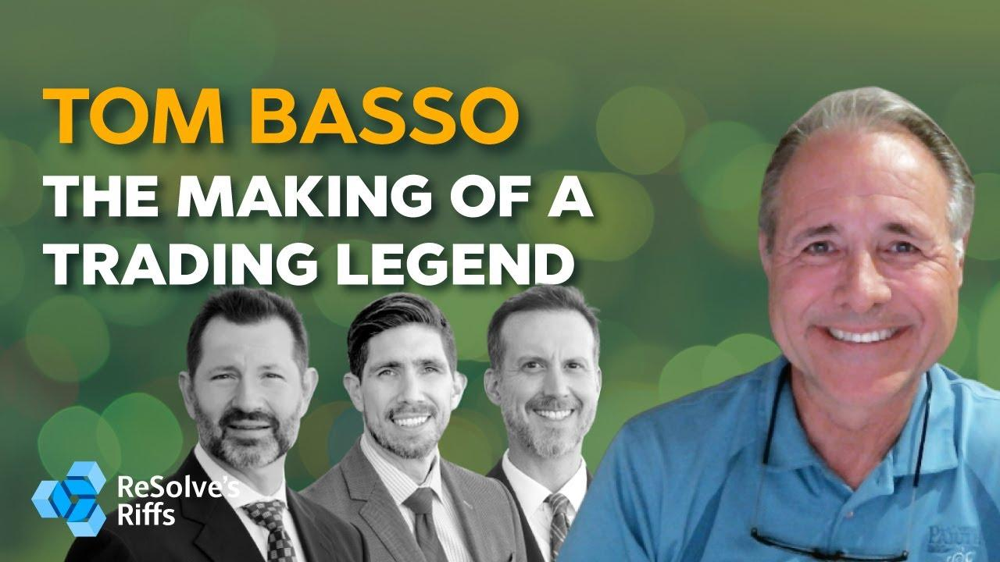

## Table of Contents

## Who is Tom Basso?

Tom Basso is a well-known figure in the world of finance and investing. He started his career in the 1970s and became famous for managing money for other people. He created a company called Trendstat Capital Management, where he used special methods to decide when to buy and sell investments. These methods helped him make good choices and earn money for his clients.

After many years of success, Tom retired in 2003. But he didn't stop sharing his knowledge. He wrote books and gave talks to help others learn about investing. He also started a website called Enjoytheride.world to share his ideas about life and money. Tom is respected by many people in the finance world because of his smart strategies and his willingness to help others.

## What is Tom Basso's background in trading?

Tom Basso started his trading career in the 1970s. He worked at a company called Kidd & Company, where he learned a lot about the stock market. After gaining experience, he decided to start his own company called Trendstat Capital Management in 1980. At Trendstat, Tom used special methods to decide when to buy and sell investments. These methods were based on looking at trends in the market. His approach helped him make good choices and earn money for his clients.

Tom's success in trading came from his smart strategies and his ability to understand the market. He used computers to help him make decisions, which was new at the time. His methods were so good that he managed to grow his clients' money well. Tom retired in 2003, but he kept sharing his knowledge. He wrote books and gave talks to help others learn about investing. His background in trading is respected by many people in the finance world.

## How did Tom Basso start his career in the financial markets?

Tom Basso began his career in the financial markets in the 1970s. He started working at a company called Kidd & Company. At Kidd & Company, Tom learned a lot about the stock market and how to trade. He worked hard and gained a lot of experience, which helped him understand how to make good investment decisions.

After working at Kidd & Company, Tom decided to start his own company. In 1980, he founded Trendstat Capital Management. At Trendstat, he used special methods to decide when to buy and sell investments. These methods were based on looking at trends in the market. His approach helped him make smart choices and earn money for his clients.

## What are some of the key strategies Tom Basso used in his trading?

Tom Basso used special methods to decide when to buy and sell investments. He looked at trends in the market to make his decisions. He believed that if he could see a pattern or a trend, he could make good choices about when to trade. He used computers to help him find these trends, which was new at the time. This helped him manage his clients' money well and make profits.

Another important part of Tom's strategy was managing risk. He knew that the market could be unpredictable, so he made sure to protect his clients' money. He used something called "stop-loss orders" to limit how much money he could lose on a trade. This meant that if a trade started to go badly, he could stop it before losing too much money. By balancing the chance to make money with the need to be safe, Tom was able to keep his clients happy and successful.

## Can you explain Tom Basso's approach to risk management?

Tom Basso knew that the market could be unpredictable, so he focused a lot on managing risk. He used something called "stop-loss orders" to help with this. A stop-loss order is like a safety net. It tells the computer to sell a stock if it starts to lose too much money. This way, Tom could limit how much he could lose on any one trade. By using stop-loss orders, Tom made sure he didn't lose too much money even if a trade went badly.

Another part of Tom's risk management was balancing the chance to make money with the need to be safe. He didn't want to take too many big risks, but he also wanted to make good profits for his clients. So, he would spread his investments across different kinds of assets. This is called diversification. By having a mix of investments, if one went down, the others might still do well. This helped him keep his clients' money safe while still trying to make it grow.

## What is the Trend Stat investment program and how did Tom Basso develop it?

The Trend Stat investment program was a special way of trading that Tom Basso created at his company, Trendstat Capital Management. Tom looked at patterns and trends in the market to decide when to buy and sell investments. He used computers to help him find these trends, which was new and smart at the time. By understanding how the market was moving, Tom could make good choices about when to trade. This helped him make money for his clients.

Tom developed the Trend Stat program by combining his knowledge of the market with new technology. He believed that if he could see a pattern or a trend, he could make better trading decisions. He also used stop-loss orders to manage risk, which meant he could limit how much money he could lose on a trade. By balancing the chance to make money with the need to be safe, Tom's Trend Stat program helped him grow his clients' money well.

## How did Tom Basso's management style influence his success at Trendstat Capital Management?

Tom Basso's management style was key to his success at Trendstat Capital Management. He used a special way of trading called the Trend Stat program. This program looked at patterns and trends in the market to decide when to buy and sell investments. Tom used computers to help him find these trends, which was new and smart at the time. By understanding how the market was moving, he could make good choices about when to trade. This helped him make money for his clients and grow his business.

Another important part of Tom's management style was how he managed risk. He knew the market could be unpredictable, so he used stop-loss orders to limit how much money he could lose on a trade. This meant that if a trade started to go badly, he could stop it before losing too much money. Tom also spread his investments across different kinds of assets, which is called diversification. By having a mix of investments, if one went down, the others might still do well. This helped him keep his clients' money safe while still trying to make it grow.

## What are some of the books or publications Tom Basso has contributed to?

Tom Basso has written and contributed to several books and publications to share his knowledge about investing and trading. One of his well-known books is called "Panic-Proof Investing: Lessons in Volatility from the Volatility Gods." In this book, Tom explains how to stay calm and make smart choices even when the market is going up and down a lot. He shares stories from his own experience and gives tips on how to manage risk and make good investments.

In addition to his books, Tom has also written articles and given talks to help others learn about the stock market. He has been featured in many financial magazines and websites, where he talks about his strategies and how he made money for his clients. Tom believes in sharing what he knows, so he often writes about how to use trends and computers to make better trading decisions. His work has helped many people understand the market better and make smarter choices with their money.

## How has Tom Basso's philosophy on trading evolved over the years?

Tom Basso's philosophy on trading has changed a bit over the years, but some things have stayed the same. When he started, Tom believed in looking at trends in the market to make good choices about when to buy and sell. He used computers to help him find these trends, which was new at the time. This helped him make money for his clients and grow his business. Even as he got older, Tom kept believing in using trends and managing risk to make smart trades.

As Tom got more experience, he started to focus more on risk management. He learned that the market could be unpredictable, so he used stop-loss orders to limit how much money he could lose on a trade. This meant that if a trade started to go badly, he could stop it before losing too much money. Tom also started to spread his investments across different kinds of assets, which is called diversification. By having a mix of investments, if one went down, the others might still do well. This helped him keep his clients' money safe while still trying to make it grow.

## What are some of the major achievements or milestones in Tom Basso's trading career?

Tom Basso started his trading career in the 1970s at Kidd & Company, where he learned a lot about the stock market. In 1980, he founded his own company, Trendstat Capital Management. At Trendstat, Tom used special methods to decide when to buy and sell investments. He looked at trends in the market and used computers to help him make good choices. This helped him make money for his clients and grow his business.

One of Tom's major achievements was creating the Trend Stat investment program. This program helped him understand how the market was moving and make smart trades. Another big milestone was his focus on risk management. Tom used stop-loss orders to limit how much money he could lose on a trade. He also spread his investments across different kinds of assets, which kept his clients' money safe while still trying to make it grow. Tom retired in 2003, but he kept sharing his knowledge through books and talks.

## How does Tom Basso view the role of psychology in trading?

Tom Basso believes that psychology plays a big role in trading. He thinks that staying calm and not letting emotions take over is very important. When the market goes up and down, it can be easy to get scared or too excited. But Tom says that good traders need to keep their feelings in check. They should follow their plan and not make quick decisions based on fear or greed.

Tom also talks about the importance of confidence and discipline. He believes that traders need to trust their methods and stick to them, even when things get tough. This means not changing your plan just because the market is moving in a way you didn't expect. By staying disciplined and confident, traders can make better choices and avoid big mistakes. Tom's focus on psychology helps traders stay focused and make smart decisions.

## What advice does Tom Basso give to new traders looking to succeed in the markets?

Tom Basso tells new traders to start by learning a lot about the market. He says it's important to understand how the market works and to find a trading method that makes sense to you. Tom believes that using trends to make decisions can be a good way to go. He also thinks that using computers to help find these trends can be very useful. But he warns that it's not enough to just have a good method. You also need to practice and get better at using it.

Another big piece of advice from Tom is to manage risk carefully. He tells new traders to use stop-loss orders to limit how much money they can lose on a trade. This means if a trade starts to go badly, you can stop it before losing too much. Tom also says to spread your investments across different kinds of assets. This is called diversification, and it helps keep your money safe even if one investment goes down. By balancing the chance to make money with the need to be safe, new traders can do well in the markets.

## What are the key strategies implemented by Tom Basso?

Tom Basso has implemented several sophisticated trading strategies that have attracted attention in the trading community. His 'Basso Reversal Strategy' exemplifies his approach, primarily utilizing technical indicators to predict market reversals. This strategy involves analyzing various indicators, such as moving averages and the Relative Strength Index (RSI), to detect potential turning points in market trends. The 'Basso Reversal Strategy' is designed to identify these reversals early, providing traders with an opportunity to capitalize on shifts in market direction.

In addition to market reversals, Basso developed the 'Basso Timing Strategy', which focuses on entering trades based on anticipated market movements due to scheduled economic or financial events. This strategy is rooted in the belief that significant scheduled events can lead to predictable market behavior patterns. By analyzing historical data associated with similar events, Basso's timing strategy aims to determine the most opportune moments to enter trades, thus maximizing potential profits and minimizing risks.

Risk management remains a central component of Basso's trading philosophy. His strategies often incorporate techniques like volatility targeting and careful position sizing to manage trading risks effectively. Volatility targeting involves adjusting the size of a position based on the expected volatility of an asset. For example, if volatility increases, a trader would decrease the position size to maintain a consistent level of risk. This concept can be expressed through the formula:

$$
\text{Position Size} = \frac{\text{Risk Capital} \times \text{Target Volatility}}{\text{Current Volatility}}
$$

Careful position sizing is another critical aspect of Basso's approach. By calculating the optimal position size, traders can protect their capital against unforeseen market fluctuations while still capitalizing on profitable opportunities. Basso's work emphasizes the necessity of understanding and implementing these risk management techniques to ensure long-term success in trading. His pragmatic approach combines strategic entry and exit strategies, event-driven timing, and rigorous risk management to create a holistic trading framework that traders can customize to fit their own needs and risk appetites.

## References & Further Reading

[1]: Tharp, V. (2006). ["Trade Your Way to Financial Freedom."](https://books.google.com/books/about/Trade_Your_Way_to_Financial_Freedom.html?id=_hLzpVIg2sMC) McGraw-Hill Education.

[2]: Basso, T. (1994). ["Panic-Proof Investing: Lessons in Profitable Investing from a Market Wizard."](https://www.amazon.com/Panic-Proof-Investing-Lessons-Profitable-Market/dp/0471030244) Wiley.

[3]: Schwager, J. D. (2006). ["Market Wizards: Interviews with Top Traders."](https://www.amazon.com/Market-Wizards-Updated-Interviews-Traders/dp/1118273052) Wiley.

[4]: Elder, A. (2002). ["Come Into My Trading Room: A Complete Guide to Trading."](https://www.amazon.com/Come-Into-My-Trading-Room/dp/0471225347) Wiley.

[5]: Bassetti, M. L. (2002). ["Trend Following: Learn to Make Millions in Up or Down Markets."](https://ptgmedia.pearsoncmg.com/images/9780137020188/samplepages/9780137020188.pdf) Wiley.