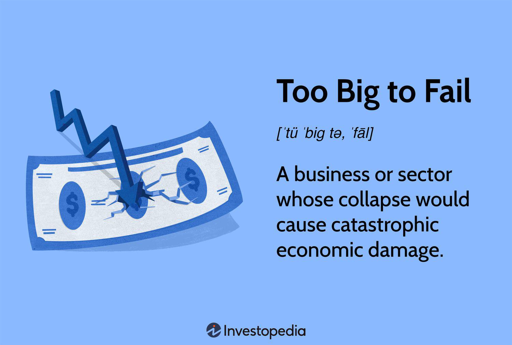

The concept of 'Too Big to Fail' (TBTF) gained significant attention during the global financial crisis of 2007-2008, underscoring the profound impact that large financial institutions can have on the global economy. The TBTF theory posits that certain businesses are so integral to the economic framework that their failure would instigate a catastrophic collapse, necessitating government intervention to prevent economic disruption. During the 2007-2008 financial collapse, the failure of major institutions such as Lehman Brothers illuminated these vulnerabilities, leading to a reevaluation of financial systems worldwide.

This article comprehensively explores the history and impact of financial institutions deemed 'too big to fail' and discusses the significant reforms implemented in the aftermath of the crisis. In response to the events of 2007-2008, regulatory reforms such as the Dodd-Frank Act were introduced, aiming to mitigate future risks and enhance the stability of the financial sector.

In recent years, the advent of algorithmic trading has transformed financial markets, marking a significant shift in economic dynamics. Algorithmic trading employs sophisticated software and complex mathematical models to execute trades at unprecedented speeds, enhancing market efficiency. However, this innovation also introduces new challenges, including increased market volatility and concerns over fairness.

The intersection of technology and financial reform remains a critical factor in shaping the stability and efficiency of global economies. As financial systems evolve, maintaining a balance between fostering innovation and ensuring robust regulatory oversight is essential for mitigating systemic risks. By examining these components, we gain insight into modern economic shifts and the ongoing quest for financial stability in an increasingly complex and interconnected world.

## Table of Contents

## The Economic History and Definitions of 'Too Big to Fail'

'Too big to fail' (TBTF) is a term used to describe enterprises, particularly financial institutions, whose scale and interconnectedness within the economy are so substantial that their failure could trigger widespread economic turmoil. This concept implies that the collapse of such entities would result in systemic disruption, necessitating governmental or central bank intervention to prevent broader economic fallout.

The phrase gained prominence during the financial crisis of 2007–2008, a period that saw the collapse of Lehman Brothers, a major global financial services firm. This event marked a pivotal moment, as it highlighted the potential for large, interconnected financial institutions to become the epicenter of economic instability. Lehman Brothers' bankruptcy in September 2008 resulted in a liquidity crisis, leading to a dramatic loss of market confidence and a subsequent cascade of financial distress. The firm's downfall underscored the kinetic effect a single TBTF institution could exert across global markets.

Historically, the TBTF notion had surfaced long before the 2008 crisis. Throughout various financial upheavals, governments have been compelled to intervene to prevent the collapse of such vital institutions due to their integral role in ensuring the smooth functioning of the economy. For instance, during the 1984 Continental Illinois National Bank and Trust Company bailout, the U.S. government stepped in to avoid the bank's failure because its collapse could have jeopardized the entire financial system. Such precedents highlight the historical pattern of governmental interventions designed to uphold financial stability.

The recognition of TBTF as a critical concept within the financial industry has prompted ongoing discussions on risk management and regulatory oversight. It raises the issue of moral hazard, wherein financial entities might undertake riskier ventures under the assumption of receiving government bailouts in dire situations. Moreover, TBTF implications extend beyond financial firms, affecting multinational corporations whose operational failures could disrupt global supply chains and economic stability. 

The repeated need for intervention has fueled global dialogues on constructing a robust regulatory framework to mitigate the systemic risks posed by TBTF entities. Such frameworks aim to ensure these institutions can endure significant economic pressures without necessitating government bailouts, thereby preserving market integrity and economic stability.

## The 2007-2008 Financial Crisis: Catalyst for Reform

The global financial crisis of 2007-2008 exposed significant weaknesses within the international banking system, leading to severe economic instability. The crisis was precipitated by a combination of factors, prominently featuring the collapse of major financial institutions and a subsequent loss of confidence in global markets.

A pivotal event was the bankruptcy of Lehman Brothers in September 2008, a moment often viewed as the crystallization of the financial turmoil. Lehman’s collapse underscored the interconnectedness of global financial systems and served as a stark indicator of the systemic risks posed by large, interconnected banks. Prior to its demise, Lehman Brothers was heavily involved in mortgage-backed securities, a sector that saw tremendous growth during the housing boom in the United States. As housing prices began to fall and mortgage defaults increased, Lehman's significant exposure to these high-risk assets led to devastating losses.

The resultant panic triggered a [liquidity](/wiki/liquidity-risk-premium) crisis, with financial institutions worldwide struggling to meet their short-term liabilities due to tightening credit markets. The freezing of interbank lending further exacerbated the financial distress, leading to a significant decline in global market confidence. As trust eroded, stock markets around the world witnessed sharp downturns, and the ensuing economic downturn affected countless businesses and individuals.

In response to the escalating crisis, governments and central banks undertook unprecedented interventions aimed at stabilizing the financial sector. A notable legislative response in the United States was the Emergency Economic Stabilization Act, enacted in October 2008. This act authorized the Troubled Asset Relief Program (TARP), which allocated up to $700 billion to purchase distressed assets and inject capital into banks to restore their stability. The primary goal was to shore up financial institutions, restore liquidity, and ultimately revive investor confidence in the market.

The crisis also prompted central banks to implement aggressive monetary policies, including significant [interest rate](/wiki/interest-rate-trading-strategies) cuts and unconventional measures such as quantitative easing. These policies aimed to lower borrowing costs and stimulate economic activity as a means of counteracting the severe recessionary pressures that ensued.

Despite these far-reaching interventions, the crisis led to a protracted period of economic recovery. The events of the 2007-2008 financial crisis served as a critical impetus for comprehensive financial reforms aimed at mitigating systemic risk and ensuring the stability of global financial systems in the future.

## Financial Reforms: The Dodd-Frank Act and Beyond

Enacted in 2010, the Dodd-Frank Wall Street Reform and Consumer Protection Act represented a comprehensive effort to address the shortcomings revealed by the 2007-2008 financial crisis. Its primary objective was to reduce the systemic risk posed by financial institutions deemed 'too big to fail' and to prevent the recurrence of a similar crisis. The act introduced a wide array of regulatory measures aimed at increasing transparency and accountability within the financial system.

One of the cornerstone features of the Dodd-Frank Act was the establishment of the Consumer Financial Protection Bureau (CFPB). This independent agency was tasked with overseeing financial products and services offered to consumers, ensuring fair practices and preventing deceptive business tactics. It serves as a regulatory authority to protect consumer interests in the financial sector and enforces federal consumer financial laws.

The Dodd-Frank Act also increased the capital requirements for banks, particularly for large financial institutions. By mandating higher capital reserves, the act aimed to enhance the resilience of banks in absorbing financial shocks, thereby reducing the likelihood of bank failures that could destabilize the economy. These changes necessitated banks to hold a larger buffer of equity capital against their risk-weighted assets, ensuring they are better prepared for economic downturns.

On a global scale, the Basel III regulations complemented the efforts of the Dodd-Frank Act by further strengthening the capital framework of banks. Introduced by the Basel Committee on Banking Supervision, Basel III sought to improve the regulation, supervision, and risk management within the banking sector internationally. It introduced more stringent capital requirements, a leverage ratio to curb excessive borrowing, and liquidity requirements to ensure banks have sufficient cash during periods of financial stress.

The implementation of both the Dodd-Frank Act and Basel III marked a significant shift towards bolstering financial stability and reducing systemic risks. However, the effectiveness of these reforms continues to be a subject of debate, as financial institutions adapt to the changing regulatory landscape. As technology evolves and new financial products emerge, regulators face the ongoing challenge of ensuring these frameworks remain robust and relevant in safeguarding the global economy from future crises.

## Algorithmic Trading: A Modern Financial Frontier

Algorithmic trading refers to using advanced computer algorithms to execute trades in financial markets with minimal human intervention. By deploying mathematical models and sophisticated software, traders can place simultaneous buy and sell orders at speeds and frequencies unimaginable to human traders. This practice has significantly reshaped the financial markets by increasing the efficiency of trade execution, enhancing liquidity, and reducing transaction costs.

The advent of [algorithmic trading](/wiki/algorithmic-trading) has ushered in a new era of market dynamics characterized by rapid information processing and execution capabilities. This transformation has been facilitated by high-frequency trading ([HFT](/wiki/high-frequency-trading-strategies)), a subset of algorithmic trading that capitalizes on minute price discrepancies in the market. HFT firms leverage cutting-edge technology to execute a large number of orders in fractions of a second, thereby profiting from short-term market movements.

Despite the efficiency gains, algorithmic trading introduces several risks and challenges. One key concern is market [volatility](/wiki/volatility-trading-strategies); the rapid execution of trades can lead to massive fluctuations in asset prices. The 2010 Flash Crash, where the Dow Jones Industrial Average plummeted nearly 1,000 points within minutes before rebounding, serves as a stark example of how algorithmic trading can exacerbate market instability.

Another issue lies in fairness and market integrity. The advantage enjoyed by algorithmic traders, particularly HFTs, due to their technological prowess raises questions about the equitable treatment of market participants. Smaller or less technologically adept traders may find themselves at a disadvantage, leading to concerns about market concentration and the potential erosion of investor confidence.

Regulatory bodies around the globe are tasked with ensuring that the benefits of algorithmic trading are harnessed while mitigating its risks. Efforts are underway to develop measures that address the full spectrum of challenges posed by algorithmic trading. These include real-time monitoring of trading activities, enhancing circuit breaker systems to curb sudden market swings, and implementing regulations to ensure fair and transparent trading practices.

In conclusion, algorithmic trading stands at the forefront of modern financial markets, offering both opportunities and complexities. The ability to harness technological advancements to enhance market efficiency is invaluable. However, it is imperative that regulators maintain a vigilant stance to safeguard the stability and integrity of financial markets in an era increasingly dominated by algorithms and automation.

## Critiques and Challenges of 'Too Big to Fail'

Critics of the 'Too Big to Fail' (TBTF) doctrine assert that it fosters moral hazard, which occurs when entities take on excessive risk because they believe they will be bailed out due to their size and importance to the economy. This sense of security can lead to reckless corporate behavior, as large financial institutions may prioritize short-term profits over long-term stability, assuming that government intervention will mitigate any adverse outcomes. The expectation of bailouts diminishes the incentive for robust risk management practices, potentially paving the way for financial crises similar to the 2007-2008 debacle.

Regulatory frameworks intended to address TBTF issues frequently impose stringent requirements on large institutions but can inadvertently place a disproportionate burden on smaller ones. These institutions, which typically pose less systemic risk, often find themselves facing the same regulations as their larger counterparts, despite having played little to no role in precipitating the financial crisis. The compliance costs associated with these regulations can be burdensome for smaller banks, potentially stifling their ability to compete and innovate. This regulatory imbalance raises concerns about market fairness and the sustainability of small and mid-sized banks, which are crucial for local economies and financial diversity.

Furthermore, the TBTF debate encompasses ongoing discussions about achieving equitable regulatory measures that neither stifle growth nor compromise financial stability. Policymakers and economists are challenged to devise strategies that curtail the risk-taking behavior of large institutions while fostering an environment conducive to economic expansion. The balance between stringent oversight and maintaining a dynamic, competitive market remains elusive. Effective solutions must mitigate systemic risks without dampening the entrepreneurial spirit that fuels economic development. This balancing act is central to the evolution of a secure yet vibrant global financial system.

## Conclusion: The Road Ahead for Financial Stability

The concept of "Too Big to Fail" (TBTF) remains a pressing concern in the financial sector, despite substantial regulatory reforms over the past decade. Large financial institutions continue to wield significant influence in global markets, underscoring the persistent nature of the TBTF dilemma. The intricate relationship between size, market power, and potential systemic risk necessitates ongoing scrutiny and proactive measures to mitigate future economic crises.

Technological advancements, particularly in algorithmic trading, are poised to play a crucial role in shaping the future of financial regulation. Algorithmic trading, characterized by the use of sophisticated software and mathematical models to execute trades at extraordinary speeds, has revolutionized the financial landscape. While these innovations contribute to improved market efficiency, they also introduce challenges related to market volatility and fairness. As regulators aim to strike a balance between encouraging technological innovation and ensuring market stability, they must address emerging risks associated with the rapid deployment of automated trading systems.

The path forward requires a multifaceted approach that encompasses both domestic and international regulatory measures. Policymakers must adapt existing frameworks to accommodate technological advancements while ensuring that large institutions are held accountable. Enhanced transparency, improved risk management practices, and effective oversight are crucial components of a resilient financial system. Moreover, global cooperation among regulatory bodies, such as the implementation of the Basel III standards, is essential in harmonizing efforts to strengthen banks' capital bases and reduce systemic vulnerabilities.

Despite these efforts, the TBTF problem persists, necessitating sustained vigilance and adaptation. Financial systems must be fortified against potential crises through continuous evaluation and refinement of regulatory practices. As the financial landscape evolves, the commitment to maintaining a robust, stable, and fair economic environment will remain paramount. Ultimately, the enduring challenge is to devise regulatory strategies that balance innovation, growth, and stability, ensuring that the global financial infrastructure remains resilient in the face of future adversities.

## References & Further Reading

[1]: Sorkin, A. R. (2010). ["Too Big to Fail: The Inside Story of How Wall Street and Washington Fought to Save the Financial System—and Themselves."](https://www.amazon.com/Too-Big-Fail-Washington-System/dp/0143118242) Penguin Books.

[2]: Blinder, A. S. (2013). ["After the Music Stopped: The Financial Crisis, the Response, and the Work Ahead."](https://www.tandfonline.com/doi/full/10.1080/14697688.2014.949836) Penguin Books.

[3]: Financial Crisis Inquiry Commission. (2011). ["The Financial Crisis Inquiry Report: Final Report of the National Commission on the Causes of the Financial and Economic Crisis in the United States."](https://www.govinfo.gov/app/details/GPO-FCIC/) Government Printing Office.

[4]: Lewis, M. (2011). ["The Big Short: Inside the Doomsday Machine."](https://www.amazon.com/Big-Short-Inside-Doomsday-Machine/dp/0393338827) W.W. Norton & Company.

[5]: Stiglitz, J. E. (2010). ["Freefall: America, Free Markets, and the Sinking of the World Economy."](https://www.jstor.org/stable/24884136) W.W. Norton & Company.

[6]: MacKenzie, D. (2018). ["Material Markets: How Economic Agents are Constructed."](https://academic.oup.com/book/52341) Oxford University Press.

[7]: Haldane, A. G. (2010). ["The Contribution of the Financial Sector: Miracle or Mirage?"](https://www.bis.org/review/r100716g.pdf) Speech at the Future of Finance Conference, London.

[8]: Kay, J. (2015). ["Other People's Money: The Real Business of Finance."](https://books.google.com/books/about/Other_People_s_Money.html?id=3wIrCgAAQBAJ) PublicAffairs.