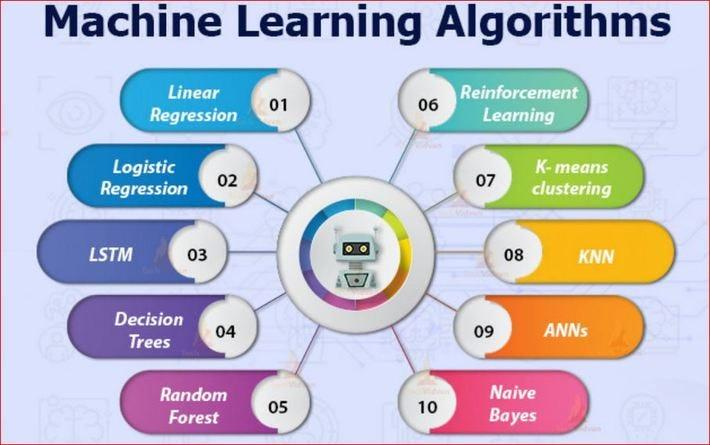

## Table of Contents

## What is machine learning and why is it important for beginners to learn?

Machine learning is a type of artificial intelligence where computers learn from data to make decisions or predictions. It's like teaching a computer to recognize patterns or solve problems by showing it examples, instead of telling it exactly what to do. For example, you can show a computer many pictures of cats and dogs, and it will learn to tell them apart.

It's important for beginners to learn about machine learning because it's becoming a big part of many industries, like healthcare, finance, and technology. Understanding the basics can help you see how these systems work and how they can be used to solve real-world problems. Plus, learning about machine learning can open up many job opportunities and help you stay up-to-date with new technology.

## What are the basic concepts a beginner should know before diving into machine learning algorithms?

Before diving into machine learning algorithms, it's important for beginners to understand a few basic concepts. The first is data: machine learning relies on data to learn and make predictions. You need to know how to collect, clean, and prepare data because messy or incorrect data can lead to poor results. Another key concept is the difference between supervised and unsupervised learning. Supervised learning uses labeled data to train a model to make predictions, like predicting house prices based on features like size and location. Unsupervised learning, on the other hand, finds patterns in data without any labels, such as grouping customers with similar buying habits.

Another important concept is the idea of a model, which is a mathematical representation of a real-world process. In machine learning, you create a model by training it on data, and then you use that model to make predictions or decisions. Understanding how to evaluate a model's performance is also crucial. This means knowing how to measure how well your model is doing, using metrics like accuracy or error rate. Finally, it's helpful to have a basic grasp of programming, especially in languages like Python, which is widely used in machine learning. With these concepts in mind, beginners can start exploring machine learning algorithms more effectively.

## How do supervised and unsupervised learning differ, and which algorithms fall into each category?

Supervised learning and unsupervised learning are two main types of machine learning. Supervised learning is like having a teacher who shows you examples and tells you the answers. You use this labeled data to train a model, which then learns to make predictions or classify new data. For example, if you want to predict whether an email is spam or not, you would show the model many emails labeled as spam or not spam, and it would learn to tell the difference. Common supervised learning algorithms include linear regression, which is used for predicting a number, and decision trees, which can be used for classifying things into categories.

Unsupervised learning, on the other hand, is like learning without a teacher. You give the computer data without labels, and it tries to find patterns or group similar items together on its own. This type of learning is useful for discovering hidden structures in data, like finding groups of customers with similar buying habits. Some common unsupervised learning algorithms are clustering methods like K-means, which groups data into clusters, and principal component analysis (PCA), which is used to reduce the number of variables in a dataset while keeping important information.

Both types of learning are important and used for different purposes. Supervised learning is great when you have labeled data and want to make predictions or classify new data. Unsupervised learning is useful when you want to explore data and find patterns without knowing what you're looking for in advance.

## What is linear regression and how can beginners use it for predictive modeling?

Linear regression is a simple but powerful tool in machine learning that helps predict a number based on other numbers. Imagine you want to guess how much a house will cost based on its size. Linear regression finds a straight line that best fits the data points of house sizes and their prices. This line can then be used to predict the price of a new house just by knowing its size. The idea is to find the best line that minimizes the difference between the actual prices and the prices predicted by the line.

Beginners can use linear regression for predictive modeling by following a few simple steps. First, they need to collect data where one variable (like house size) is used to predict another variable (like house price). Then, they can use software like Python with libraries such as scikit-learn to fit a linear regression model to their data. Once the model is trained, beginners can input new data points to get predictions. For example, if they enter the size of a new house, the model will predict its price. This makes linear regression a great starting point for anyone new to machine learning because it's easy to understand and apply.

## Can you explain logistic regression and its applications for beginners?

Logistic regression is a type of machine learning that helps predict whether something will happen or not. It's different from linear regression because it doesn't predict a number, but instead gives a probability, like the chance of it raining today. Imagine you want to know if an email is spam or not. Logistic regression can look at things like the words in the email and then tell you the probability that it's spam. If that probability is high enough, you can decide it's spam.

Beginners can use logistic regression in many everyday situations. For example, if you're a student trying to predict if you'll pass an exam based on how many hours you study, logistic regression can help. It looks at past data where you know how many hours students studied and whether they passed or failed, and then it predicts your chances of passing. This makes it useful for things like medical diagnoses, where doctors might want to predict if a patient has a certain disease based on test results, or in marketing, where companies want to know if a customer will buy a product based on their past behavior.

## What is k-nearest neighbors (KNN) and how does it work in simple terms?

K-nearest neighbors, or KNN for short, is a simple way to classify things based on their neighbors. Imagine you're trying to guess what kind of fruit something is. You look at the fruits around it and see if most of them are apples or oranges. If most of the nearby fruits are apples, you might guess that the fruit you're looking at is also an apple. In KNN, the 'K' stands for the number of neighbors you look at to make your guess. If K is 5, you look at the 5 closest neighbors.

KNN works by measuring how similar things are to each other. It uses something called distance to figure out which items are closest to the one you're trying to classify. For example, if you're classifying animals based on their size and weight, KNN would look at how close other animals are in terms of size and weight. Once it finds the K nearest neighbors, it counts how many of them belong to each group and then decides based on the majority. If most of the K nearest neighbors are dogs, KNN will classify the new animal as a dog. It's a straightforward method that's easy to understand and use.

## How does decision tree algorithm work and why is it suitable for beginners?

A decision tree is like a flowchart that helps make decisions by asking questions at each step. Imagine you're trying to decide if you should go outside. The decision tree might first ask if it's raining. If the answer is yes, it might suggest staying inside. If it's no, it might ask another question, like if it's too hot. Based on your answers, the tree guides you to a final decision. In machine learning, decision trees work the same way. They split the data into smaller groups by asking questions about the features of the data, like the size of a house or the age of a person, until they reach a final prediction or classification.

Decision trees are great for beginners because they're easy to understand and visualize. You can actually see how the tree makes decisions, which makes it less like a mysterious black box and more like a clear set of rules. This transparency helps beginners learn how machine learning works and how to make their own models. Plus, decision trees can be used for both classification problems, like deciding if an email is spam, and regression problems, like predicting house prices. This versatility makes them a good starting point for anyone new to machine learning.

## What is the Naive Bayes classifier and how can beginners apply it to real-world problems?

The Naive Bayes classifier is a simple but powerful machine learning method that helps predict categories based on past data. It's like guessing if an email is spam by looking at the words in it. The "Naive" part means it makes a simple assumption: it thinks that each feature, like a word in the email, is independent of the others. Even though this assumption isn't always true, it often works well enough to make good predictions. For example, if certain words like "free" and "money" often appear in spam emails, Naive Bayes will use this information to decide if a new email is likely to be spam.

Beginners can apply the Naive Bayes classifier to many real-world problems. One common use is in text classification, like sorting news articles into categories such as sports, politics, or entertainment based on the words they contain. Another example is in medical diagnosis, where doctors might use it to predict if a patient has a disease based on symptoms and test results. Because Naive Bayes is easy to understand and implement, it's a great tool for beginners to start with. They can use software like Python with libraries such as scikit-learn to build their own Naive Bayes models and start making predictions right away.

## Can you describe the k-means clustering algorithm and its use cases for beginners?

K-means clustering is like sorting things into groups based on how similar they are. Imagine you have a bunch of different colored candies and you want to sort them into piles. You decide to make three piles: one for red candies, one for blue candies, and one for green candies. K-means does something similar, but with numbers. It starts by [picking](/wiki/asset-class-picking) a few random points, called centroids, and then it looks at all the other points and assigns them to the closest centroid. It keeps moving the centroids and reassigning points until the groups stop changing much. The 'K' in K-means is the number of groups you want to make.

Beginners can use K-means clustering for many everyday tasks. For example, if you run a small store and want to understand your customers better, you can use K-means to group them based on what they buy. This can help you see patterns, like which customers buy a lot of snacks versus those who buy more healthy foods. Another use is in organizing photos. If you have a big collection of pictures, K-means can help sort them into groups based on colors or themes, making it easier to find what you're looking for. It's a simple yet powerful tool that's great for beginners to start exploring data and finding interesting patterns.

## What is the support vector machine (SVM) and how does it differ from other algorithms?

A support vector machine, or SVM, is a type of machine learning that helps separate things into different groups. Imagine you have a bunch of red and blue balls mixed together, and you want to draw a line to separate them. SVM finds the best line, or in more complex cases, the best curve, that separates the red balls from the blue balls as clearly as possible. It does this by finding the widest gap between the two groups and drawing the line right in the middle of that gap. This line is called a hyperplane, and the balls closest to it are called support vectors because they help decide where the line goes.

SVM is different from other algorithms like decision trees or k-nearest neighbors in a few ways. First, it's really good at working with data that's hard to separate cleanly. If your red and blue balls are all mixed up and there's no straight line that can separate them, SVM can still find a good way to do it by using a trick called the kernel trick. This lets it bend the line into a curve to fit the data better. Also, SVM focuses on the most important points, the support vectors, rather than looking at all the data. This makes it different from algorithms that consider every point, like k-nearest neighbors, which can be slower with big datasets.

## How do neural networks work and what makes them complex for beginners?

Neural networks are like brains for computers. They're made up of many tiny parts called neurons, which are connected in layers. When you feed data into a neural network, it passes through these layers, with each neuron doing a little math to figure out what to do next. The first layer might look at raw data, like the pixels in a picture, and the last layer gives you an answer, like deciding if the picture is of a cat or a dog. In between, there are hidden layers that help the network learn more complex patterns. The network learns by adjusting the connections between neurons, making them stronger or weaker, until it gets better at making the right predictions.

Neural networks can be tricky for beginners because they're like a black box. It's hard to see exactly how they make decisions because there are so many neurons and connections. This makes it tough to understand why the network gives a certain answer, which is different from simpler algorithms like decision trees where you can see each step. Also, setting up a neural network can be complicated. You need to decide how many layers to use, how many neurons in each layer, and what kind of math each neuron should do. It takes a lot of practice and trial-and-error to get it right, which can be overwhelming for someone just starting out.

## What advanced techniques can experts use to optimize these algorithms for better performance?

Experts can use a few advanced tricks to make machine learning algorithms work better. One trick is called hyperparameter tuning. Hyperparameters are like settings you can change to make the algorithm perform differently. For example, in a decision tree, you might change how deep the tree can grow. Experts use methods like grid search or random search to try out different settings and see which ones make the algorithm more accurate. Another trick is called feature engineering, where experts create new data points from the existing ones to help the algorithm understand the data better. For example, if you're predicting house prices, you might create a new feature that's the ratio of the house size to the number of bedrooms.

Another important technique is ensemble learning, where experts combine several models to make better predictions. Imagine you're trying to guess how many jelly beans are in a jar. If you ask a bunch of people and take the average of their guesses, you'll probably be closer to the right answer than if you just asked one person. Ensemble methods like Random Forests or Gradient Boosting work the same way. They use many small models, each making a guess, and then combine those guesses to make a final prediction. This often leads to better results than using just one model. Also, experts use cross-validation to make sure their models work well on different parts of the data, not just the part they used for training. This helps avoid overfitting, where a model works great on the training data but not on new data.

## What is Understanding Machine Learning?

Machine learning is a pivotal component of [artificial intelligence](/wiki/ai-artificial-intelligence), devoted to the development of algorithms that enable systems to autonomously learn and adapt from acquired data. At its core, machine learning seeks to construct models that are able to recognize patterns and make data-driven predictions or decisions, thereby minimizing the need for explicit programming interventions.

There are four fundamental types of machine learning, each with its unique methodologies and applications:

1. **Supervised Learning**: This type utilizes labeled datasets, meaning each training example is paired with an output label. The model learns to map inputs to the correct output, enabling it to make predictions when presented with new, unlabeled data. Common algorithms in supervised learning include Linear Regression and Support Vector Machines.

2. **Semi-supervised Learning**: Situated between supervised and unsupervised learning, this type employs a small amount of labeled data and a large amount of unlabeled data. By leveraging the labeled data, the model can infer the structure of the rest. This approach is useful when labeling data is expensive or time-consuming.

3. **Unsupervised Learning**: Unlike supervised learning, unsupervised learning deals with data that has no labels. The goal is to identify hidden patterns or intrinsic structures within the input data. Clustering algorithms like K-means or hierarchical clustering are typical examples used to group data based on similarities.

4. **Reinforcement Learning**: In this type, an agent learns to make decisions by performing certain actions and receiving rewards or penalties in return. The aim is to maximize the cumulative reward over time. Reinforcement learning is particularly effective in scenarios where decision-making needs to be dynamic and adaptive.

Several foundational components constitute the architecture of [machine learning](/wiki/machine-learning):

- **Representation**: This concerns how data and hypotheses are represented in a form amenable to processing by learning algorithms. This could be as simple as mathematical functions or as complex as neural networks.

- **Evaluation**: Central to machine learning, evaluation refers to how the performance of the learning algorithms is assessed. Typical evaluation metrics include accuracy, precision, recall, and the F1 score, which help in understanding how well the model is performing.

- **Optimization**: This pertains to the methods used to adjust the model parameters to reduce prediction errors. Common optimization algorithms include Gradient Descent, which iteratively updates model parameters to minimize a cost function, often denoted as:
$$
  \theta := \theta - \alpha \nabla J(\theta)

$$

  Here, $\theta$ represents the model parameters, $\alpha$ is the learning rate, and $J(\theta)$ is the cost function being minimized.

Together, these components provide the theoretical and practical framework necessary for building robust machine learning systems, capable of tackling complex challenges across diverse fields including [algorithmic trading](/wiki/algorithmic-trading). By processing large volumes of data, machine learning models facilitate informed decision-making and predictive analytics, contributing to innovations in this rapidly evolving discipline.

## What are the types of machine learning algorithms?

Machine learning algorithms have become crucial tools in trading, enabling traders to process significant volumes of data and generate predictions or decisions based on this analysis. There are several types of machine learning algorithms, each with distinct characteristics and applications in trading. These are broadly categorized as supervised learning, unsupervised learning, and [reinforcement learning](/wiki/reinforcement-learning).

### Supervised Algorithms

Supervised learning algorithms predict outcomes based on previously labeled data. By learning from examples, these algorithms can perform classification and regression tasks, which are pivotal in trading.

1. **Classification Tasks**:
   - Classification algorithms categorize data points into predefined classes. This is useful for predicting outcomes like stock price movements (up or down) given historical data and other indicators.
   - Example: Decision Trees can classify whether a stock will end the day up or down based on a set of input features.

   **Mathematical Representation**:
   - A simple classifier might be described as:
$$
     y = f(x) 

$$
     where $y$ is the predicted class label, $x$ is the input vector, and $f$ is the learned function derived from training data.

2. **Regression Tasks**:
   - These tasks involve predicting continuous, real-valued outputs. In trading, regression can forecast future prices or volumes.
   - Example: Linear Regression predicts future stock prices based on historical price data and external variables like economic indicators.

   **Mathematical Formula Example**:
   - Linear Regression can be expressed as:
$$
     y = \beta_0 + \beta_1x_1 + \beta_2x_2 + \ldots + \beta_nx_n

$$
     where $y$ is the predicted continuous value, $x_1, x_2, \ldots, x_n$ are explanatory variables, and $\beta_0, \beta_1, \ldots, \beta_n$ are coefficients determined through training.

### Unsupervised Algorithms

Unsupervised learning algorithms identify patterns or groupings in data without pre-labeled responses. In trading, these algorithms help detect anomalies, group similar trade patterns, or discover new trading strategies.

1. **Clustering Tasks**:
   - Clustering algorithms group data into clusters based on feature similarity. This is helpful for market segmentation and identifying similar trading days or asset behaviors.
   - Example: K-Means Clustering groups stocks into clusters based on their price movement attributes, potentially identifying correlated assets.

   **Mathematical Foundation**:
   - K-Means Clustering minimizes the within-cluster variance:
$$
     \text{argmin}_S \sum_{i=1}^{k}\sum_{x \in S_i} \|x - \mu_i\|^2

$$
     where $S$ is a set of clusters, $x$ is a data point, and $\mu_i$ is the centroid of cluster $i$.

### Reinforcement Learning

Reinforcement learning (RL) involves training models to make a sequence of decisions by receiving feedback from their actions in a simulated environment. This is particularly useful in developing automated trading strategies where actions (e.g., buy, sell, hold) are taken to maximize cumulative rewards (e.g., profit).

1. **Automated Trading Strategies**:
   - RL models can determine trading strategies by learning to maximize the reward function based on market states and actions.
   - Example: Q-learning is a popular RL algorithm applied in trading to optimize decisions by learning a value function that evaluates the trade-offs between immediate and future rewards.

   **Algorithmic Approach**:
   - The Q-learning update rule:
$$
     Q(s, a) := Q(s, a) + \alpha \left( r + \gamma \max_{a'} Q(s', a') - Q(s, a) \right)

$$
     where $s$ and $s'$ are states, $a$ and $a'$ are actions, $r$ is the reward, $\alpha$ is the learning rate, and $\gamma$ is the discount factor.

These machine learning approaches form the backbone of modern algorithmic trading by automating and optimizing decision-making processes, allowing traders to efficiently extract insights from complex and dynamic market data.

## What are the top machine learning algorithms for trading beginners?

Linear regression is one of the most fundamental machine learning algorithms used to understand market trends. It is employed to identify relationships between independent variables (e.g., time, economic indicators) and a dependent variable (e.g., stock price). The linear regression model can be expressed as:

$$
y = b_0 + b_1x_1 + b_2x_2 + \ldots + b_nx_n + \varepsilon
$$

where $y$ represents the predicted output, $b_0$ is the intercept, $b_1, b_2, \ldots, b_n$ are the coefficients, $x_1, x_2, \ldots, x_n$ are the features, and $\varepsilon$ is the error term. In trading, linear regression aids in estimating the future value of a stock or index based on historical data.

Logistic regression is used to predict market movements by estimating the probability of a binary outcome, such as a stock price increase or decrease. While similar to linear regression, logistic regression applies the logistic function to constrain the output between 0 and 1. The logistic function is defined as:

$$
P(Y=1) = \frac{1}{1 + e^{-(b_0 + b_1x_1 + \ldots + b_nx_n)}}
$$

This algorithm is particularly useful in scenarios where binary classification is needed, such as determining the likelihood of a trading signal being profitable.

K-Nearest Neighbors (K-NN) classification is a straightforward algorithm used to classify trading signals. It operates by finding the $k$ closest data points in the feature space to a new data point and assigning the most common label among these neighbors to the new point. K-NN is sensitive to the choice of $k$ and requires careful validation to optimize accuracy.

Support Vector Machine (SVM) is employed to categorize different trading data by finding the optimal hyperplane that separates classes of data points in the feature space. For n-dimensional feature spaces, the SVM algorithm seeks the hyperplane that maximizes the margin between classes, making it effective in high-dimensional spaces. SVMs are suitable for both linear and non-linear classification using kernel functions.

Decision Trees and Random Forest are widely used for making sequential trading decisions due to their interpretability and ability to model complex decision rules. A decision tree splits data into branches based on feature values, enabling direct decision-making. Random Forest enhances this approach by constructing multiple decision trees, aggregating their predictions for improved accuracy and robustness against overfitting.

Neural networks, including Artificial Neural Networks (ANNs), offer powerful modeling capabilities for trading strategies. ANNs consist of interconnected layers of neurons that transform input data through activation functions to produce intricate patterns and predictions. A specific variant, the recurrent [neural network](/wiki/neural-network) (RNN), is designed to process sequential data, making it ideal for time series predictions in trading.

K-means clustering, although traditionally an unsupervised learning algorithm, can help identify underlying patterns in trading datasets by grouping similar data points into clusters. This can aid in segmenting market conditions or trading regimes.

Naive Bayes, based on Bayes' theorem, is applicable for probabilistic prediction of trading categories. Despite its simplicity, Naive Bayes performs well in certain trading scenarios where independence between features is plausible.

For trading beginners, these algorithms represent a foundational toolkit, each serving unique purposes and offering diverse capabilities in financial market analysis. Understanding when and how to apply each algorithm is crucial for developing robust algorithmic trading strategies.

## References & Further Reading

[1]: Bergstra, J., Bardenet, R., Bengio, Y., & Kégl, B. (2011). ["Algorithms for Hyper-Parameter Optimization."](https://papers.nips.cc/paper/4443-algorithms-for-hyper-parameter-optimization) Advances in Neural Information Processing Systems 24.

[2]: ["Advances in Financial Machine Learning"](https://www.amazon.com/Advances-Financial-Machine-Learning-Marcos/dp/1119482089) by Marcos Lopez de Prado

[3]: ["Evidence-Based Technical Analysis: Applying the Scientific Method and Statistical Inference to Trading Signals"](https://www.amazon.com/Evidence-Based-Technical-Analysis-Scientific-Statistical/dp/0470008741) by David Aronson

[4]: ["Machine Learning for Algorithmic Trading"](https://github.com/stefan-jansen/machine-learning-for-trading) by Stefan Jansen

[5]: ["Quantitative Trading: How to Build Your Own Algorithmic Trading Business"](https://books.google.com/books/about/Quantitative_Trading.html?id=j70yEAAAQBAJ) by Ernest P. Chan